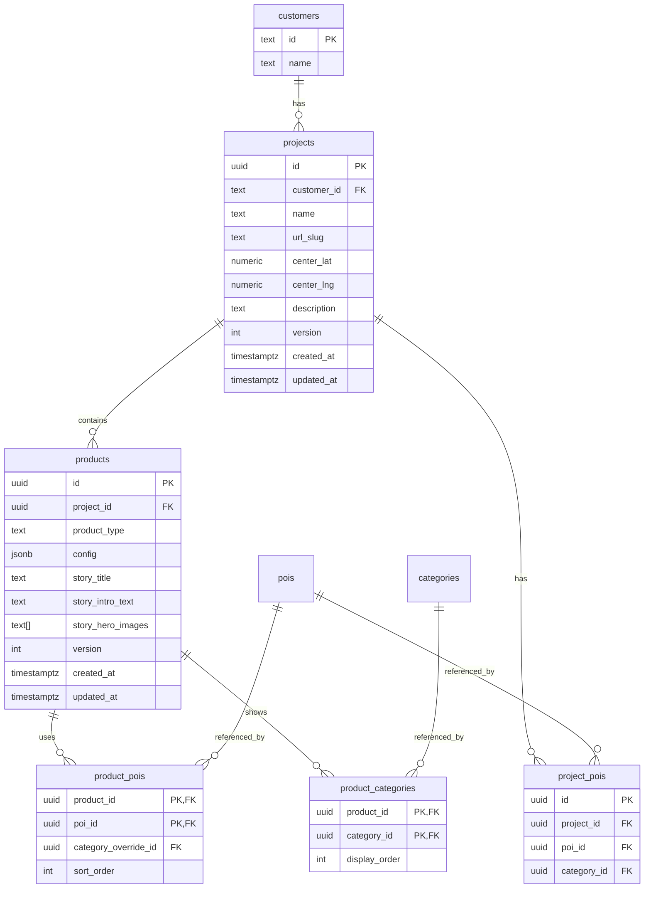

# feat: Project Hierarchy Restructure

## Enhancement Summary

**Deepened on:** 2026-02-05
**Research agents used:** 9 (Supabase migration, Next.js middleware, landing page design, admin UI patterns, data integrity, architecture, simplicity, learnings)

### Key Improvements from Research
1. **Safer migration strategy:** Two-phase FK constraints with `NOT VALID` + `VALIDATE`
2. **Simplicity consideration:** Could use `parent_project_id` column as simpler alternative
3. **Middleware pattern:** Complete 308 redirect implementation with query param preservation
4. **Admin UI pattern:** Server Actions for CRUD, not API routes
5. **Data integrity:** Pre-migration validation script, rollback procedures

### Critical Decision Point
Research revealed a simpler alternative: **`parent_project_id` column** instead of 4 new tables. Consider this if:
- Products rarely need different POI subsets
- Speed of implementation is priority
- Team prefers minimal schema changes

The full hierarchy is justified if products genuinely need independent POI/category selection.

---

## Overview

Restructure the data model from flat projects to a hierarchical structure: **Customer → Project (container) → Products (Explorer/Report/Guide)**. This enables data sharing between products for the same location while providing a cleaner admin experience.

**Before:** Same hotel appears as 3 separate projects (Explorer, Report, Guide)
**After:** One project container with 3 product instances that share POIs and categories

## Problem Statement / Motivation

1. **Duplicate entries:** Quality Hotel Augustin shows as 2 rows in admin (Explorer + Report), soon 3 with Guide
2. **No data sharing:** Each product has isolated POIs - changes require manual sync
3. **URL inconsistency:** `/slug`, `/slug-explore`, `/slug-guide` doesn't reflect the relationship
4. **Scaling issues:** More customers × more products = exponential admin complexity

## Proposed Solution

Introduce a new hierarchy:

```
customers (existing)
  └── projects (NEW - container for a location/concept)
        ├── name, url_slug, center_coordinates
        ├── project_pois (shared POI pool)
        └── products (NEW - Explorer/Report/Guide instances)
              ├── product_type
              ├── config (JSONB)
              └── product_pois (which POIs this product uses)
```

**URL structure:** `/{customer}/{project}/{product}` with landing page at `/{customer}/{project}/`

## Technical Considerations

### Database Changes

**New tables:**
- `projects` - Container with name, customer_id, url_slug, coordinates
- `products` - Product instances with project_id, product_type, config
- `product_pois` - Junction table for POI selection per product
- `product_categories` - Category visibility per product

### Research Insights: Migration Best Practices

**From Supabase migration research:**

1. **Split migrations into separate files** for safety:
   - `006_create_tables.sql` - DDL only
   - `007_migrate_data.sql` - Data migration
   - `008_add_foreign_keys.sql` - Constraints with `NOT VALID`
   - `009_validate_constraints.sql` - Validation (concurrent-safe)
   - `010_create_indexes.sql` - Indexes with `CONCURRENTLY`

2. **Two-phase FK addition** (prevents table locks):
   ```sql
   -- Fast, minimal lock
   ALTER TABLE products
     ADD CONSTRAINT fk_products_project
     FOREIGN KEY (project_id) REFERENCES projects(id)
     ON DELETE CASCADE
     NOT VALID;

   -- Allows concurrent writes during validation
   ALTER TABLE products VALIDATE CONSTRAINT fk_products_project;
   ```

3. **Pre-migration validation script** (run BEFORE migration):
   ```sql
   -- Check for orphaned customer references
   SELECT id, customer_id, name
   FROM projects
   WHERE customer_id NOT IN (SELECT id FROM customers);

   -- Check for invalid coordinates
   SELECT id, name, center_lat, center_lng
   FROM projects
   WHERE center_lat NOT BETWEEN -90 AND 90
      OR center_lng NOT BETWEEN -180 AND 180;

   -- Check for duplicate slugs per customer
   SELECT customer_id, url_slug, COUNT(*)
   FROM projects
   GROUP BY customer_id, url_slug
   HAVING COUNT(*) > 1;
   ```

**Schema with enhanced constraints:**
```sql
-- supabase/migrations/006_create_project_hierarchy.sql

BEGIN;

-- Create new projects (containers) with validation
CREATE TABLE projects (
  id UUID PRIMARY KEY DEFAULT gen_random_uuid(),
  customer_id TEXT NOT NULL REFERENCES customers(id),
  name TEXT NOT NULL CHECK (length(name) > 0),
  url_slug TEXT NOT NULL CHECK (url_slug ~ '^[a-z0-9-]+$'),
  center_lat NUMERIC NOT NULL CHECK (center_lat BETWEEN -90 AND 90),
  center_lng NUMERIC NOT NULL CHECK (center_lng BETWEEN -180 AND 180),
  description TEXT,
  version INTEGER NOT NULL DEFAULT 1,
  created_at TIMESTAMPTZ NOT NULL DEFAULT NOW(),
  updated_at TIMESTAMPTZ NOT NULL DEFAULT NOW(),
  UNIQUE(customer_id, url_slug)
);

-- Create products table
CREATE TABLE products (
  id UUID PRIMARY KEY DEFAULT gen_random_uuid(),
  project_id UUID NOT NULL REFERENCES projects(id) ON DELETE CASCADE,
  product_type TEXT NOT NULL CHECK (product_type IN ('explorer', 'report', 'guide')),
  config JSONB NOT NULL DEFAULT '{}',
  story_title TEXT,
  story_intro_text TEXT,
  story_hero_images TEXT[],
  version INTEGER NOT NULL DEFAULT 1,
  created_at TIMESTAMPTZ NOT NULL DEFAULT NOW(),
  updated_at TIMESTAMPTZ NOT NULL DEFAULT NOW(),
  UNIQUE(project_id, product_type)
);

-- Create product_pois junction
CREATE TABLE product_pois (
  product_id UUID REFERENCES products(id) ON DELETE CASCADE,
  poi_id UUID REFERENCES pois(id) ON DELETE RESTRICT,
  category_override_id UUID REFERENCES categories(id),
  sort_order INTEGER DEFAULT 0,
  PRIMARY KEY (product_id, poi_id)
);

-- Create product_categories
CREATE TABLE product_categories (
  product_id UUID REFERENCES products(id) ON DELETE CASCADE,
  category_id UUID REFERENCES categories(id) ON DELETE RESTRICT,
  display_order INTEGER DEFAULT 0,
  PRIMARY KEY (product_id, category_id)
);

-- Add updated_at trigger
CREATE TRIGGER update_projects_updated_at
  BEFORE UPDATE ON projects
  FOR EACH ROW EXECUTE FUNCTION update_updated_at_column();

CREATE TRIGGER update_products_updated_at
  BEFORE UPDATE ON products
  FOR EACH ROW EXECUTE FUNCTION update_updated_at_column();

-- Enable RLS
ALTER TABLE projects ENABLE ROW LEVEL SECURITY;
ALTER TABLE products ENABLE ROW LEVEL SECURITY;

CREATE POLICY "Allow public read" ON projects FOR SELECT USING (true);
CREATE POLICY "Allow public read" ON products FOR SELECT USING (true);

COMMIT;
```

### Research Insights: Simpler Alternative

**From simplicity review:** Consider `parent_project_id` column instead:

```sql
-- ONE column instead of 3 tables
ALTER TABLE projects ADD COLUMN parent_project_id TEXT REFERENCES projects(id);
```

| Approach | Tables Added | Query Complexity | Flexibility |
|----------|--------------|------------------|-------------|
| Full hierarchy | 4 | Medium | High (independent POI selection) |
| parent_project_id | 0 | Low | Medium (inherit all POIs) |

**Recommendation:** Start with full hierarchy if products genuinely need different POI subsets. If not, use `parent_project_id` and add tables later.

---

### URL Routing

**File structure change:**
```
app/[customer]/[project]/page.tsx           → Landing page
app/[customer]/[project]/explore/page.tsx   → Explorer product
app/[customer]/[project]/report/page.tsx    → Report product
app/[customer]/[project]/guide/page.tsx     → Guide product
```

### Research Insights: Middleware Redirects

**From Next.js middleware research:**

Use **308 (permanent)** redirects to preserve HTTP method and transfer SEO equity:

```typescript
// middleware.ts
import { NextResponse } from 'next/server'
import type { NextRequest } from 'next/server'

const PRODUCT_SUFFIXES = ['explore', 'guide'] as const
const KNOWN_CUSTOMERS = ['klp-eiendom', 'visitnorway', 'strawberry']

export function middleware(request: NextRequest) {
  const { pathname, search } = request.nextUrl
  const segments = pathname.split('/').filter(Boolean)

  // Skip if already new format (3 segments)
  if (segments.length === 3) return NextResponse.next()

  // Only process 2-segment paths
  if (segments.length !== 2) return NextResponse.next()

  const [customer, slugWithSuffix] = segments

  if (!KNOWN_CUSTOMERS.includes(customer)) return NextResponse.next()

  // Check for product suffix: slug-explore, slug-guide
  for (const suffix of PRODUCT_SUFFIXES) {
    if (slugWithSuffix.endsWith(`-${suffix}`)) {
      const slug = slugWithSuffix.slice(0, -(suffix.length + 1))
      return NextResponse.redirect(
        new URL(`/${customer}/${slug}/${suffix}${search}`, request.url),
        308 // Permanent, preserves method
      )
    }
  }

  // Old report URLs: /customer/slug → /customer/slug/report
  return NextResponse.redirect(
    new URL(`/${customer}/${slugWithSuffix}/report${search}`, request.url),
    308
  )
}

export const config = {
  matcher: ['/((?!api|_next|favicon.ico|.*\\..*).*)',],
}
```

**Key points:**
- Use 308 (not 301) to preserve HTTP method
- Query params preserved via `search` variable
- Keep redirects for 1+ year (Google recommendation)

---

### Data Migration

**Algorithm:**
1. Group old_projects by base slug (strip `-explore`, `-guide` suffix)
2. Create project container per group
3. Create product per old_project in group
4. Copy project_pois → project-level, link to products via product_pois
5. Preserve configs in products.config JSONB

### Research Insights: Safe Migration

**From data integrity review:**

1. **Create mapping table** to preserve relationships:
   ```sql
   CREATE TABLE migration_id_mapping (
     old_id UUID,
     new_id UUID,
     table_name TEXT,
     migrated_at TIMESTAMPTZ DEFAULT NOW()
   );
   ```

2. **Verify row counts** during migration:
   ```sql
   DO $$
   DECLARE
     old_count INTEGER;
     new_count INTEGER;
   BEGIN
     SELECT COUNT(*) INTO old_count FROM old_projects;
     SELECT COUNT(*) INTO new_count FROM projects;

     IF old_count != new_count THEN
       RAISE EXCEPTION 'Row count mismatch: old=%, new=%', old_count, new_count;
     END IF;
   END $$;
   ```

3. **Rollback script** (save before running):
   ```sql
   -- rollback_migration.sql
   BEGIN;
   DROP TABLE IF EXISTS product_categories CASCADE;
   DROP TABLE IF EXISTS product_pois CASCADE;
   DROP TABLE IF EXISTS products CASCADE;
   DROP TABLE IF EXISTS projects CASCADE;
   ALTER TABLE old_projects RENAME TO projects;
   COMMIT;
   ```

**Edge cases:**
- Single-product projects → create container + 1 product
- Name collisions → admin review before commit (dry-run mode)
- JSON files → migrate to Supabase, then deprecate

---

### Admin UI

**Projects list (`/admin/projects`):**
- Show unique projects (not products)
- Display product badges (🗺️ Explorer, 📄 Report, 🚶 Guide)
- "New Project" creates container first

**Project detail (`/admin/projects/[id]`):**
- Tabs: Details | POIs | Categories | Products
- POIs tab: shared pool, shows which products use each
- Products tab: list with Edit/Create/Delete per type

**Product detail (`/admin/projects/[id]/products/[type]`):**
- POI selection (checkboxes from project pool)
- Category selection
- Product-specific config (reportConfig, guideConfig, etc.)

### Research Insights: Admin UI Patterns

**From admin best practices research:**

1. **Use Server Actions, not API routes:**
   ```typescript
   // app/admin/projects/[id]/page.tsx
   async function addProductToProject(formData: FormData) {
     "use server";
     const supabase = createServerClient();
     const projectId = formData.get("projectId") as string;
     const productType = formData.get("productType") as string;

     await supabase.from("products").insert({
       project_id: projectId,
       product_type: productType,
     });

     revalidatePath(`/admin/projects/${projectId}`);
   }
   ```

2. **Multi-select POI pattern:**
   ```typescript
   // product-detail-client.tsx
   export function ProductDetailClient({
     projectPOIs,
     selectedPOIs,
     updateProductPOIs
   }) {
     const [selected, setSelected] = useState(
       new Set(selectedPOIs.map(p => p.poi_id))
     );

     return (
       <form action={updateProductPOIs}>
         <div className="max-h-72 overflow-y-auto divide-y">
           {projectPOIs.map((poi) => (
             <label key={poi.id} className="flex items-center gap-3 px-4 py-3 hover:bg-neutral-50">
               <input
                 type="checkbox"
                 name="poiIds"
                 value={poi.id}
                 checked={selected.has(poi.id)}
                 onChange={(e) => {
                   const newSelected = new Set(selected);
                   e.target.checked ? newSelected.add(poi.id) : newSelected.delete(poi.id);
                   setSelected(newSelected);
                 }}
                 className="w-4 h-4 rounded border-neutral-300 text-blue-600"
               />
               <span className="text-sm">{poi.name}</span>
             </label>
           ))}
         </div>
         <button type="submit">Save Selection</button>
       </form>
     );
   }
   ```

3. **Use `Set<string>` for O(1) selection lookups**

4. **Add indeterminate state for "Select All":**
   ```typescript
   const checkboxRef = useRef<HTMLInputElement>(null);
   useEffect(() => {
     if (checkboxRef.current) {
       checkboxRef.current.indeterminate =
         selectedCount > 0 && selectedCount < totalCount;
     }
   }, [selectedCount, totalCount]);
   ```

---

### Research Insights: Landing Page Design

**From landing page research:**

```typescript
// app/[customer]/[project]/page.tsx
const PRODUCT_CONFIG = {
  explorer: {
    title: "Explorer",
    description: "Utforsk nærområdet fritt. Filtrer etter kategorier.",
    icon: Compass,
    cta: "Utforsk",
  },
  report: {
    title: "Nabolagsrapport",
    description: "Redaksjonell oversikt over området.",
    icon: FileText,
    cta: "Les rapport",
  },
  guide: {
    title: "Guide",
    description: "Følg en kuratert tur gjennom de beste stedene.",
    icon: Map,
    cta: "Start tur",
  },
};

export default async function ProjectLandingPage({ params }) {
  const products = await getProjectProducts(params.customer, params.project);

  return (
    <main className="min-h-screen bg-[#faf9f7]">
      <div className="max-w-4xl mx-auto px-4 py-12">
        <header className="mb-10">
          <p className="text-xs uppercase tracking-[0.2em] text-[#a0937d] mb-3">
            Velg opplevelse
          </p>
          <h1 className="text-3xl font-semibold text-[#1a1a1a]">
            {projectName}
          </h1>
        </header>

        <ul
          className="grid grid-cols-1 sm:grid-cols-2 lg:grid-cols-3 gap-4"
          aria-label="Tilgjengelige produkter"
        >
          {products.map((product) => {
            const config = PRODUCT_CONFIG[product.type];
            const Icon = config.icon;

            return (
              <li key={product.type}>
                <article className="group relative flex flex-col p-6 bg-white border border-[#eae6e1] rounded-xl hover:shadow-md transition-all">
                  <Icon className="w-8 h-8 text-[#7a7062] mb-3" />
                  <h2 className="font-semibold text-lg mb-2">
                    <Link
                      href={`/${params.customer}/${params.project}/${product.type}`}
                      className="after:absolute after:inset-0"
                    >
                      {config.title}
                    </Link>
                  </h2>
                  <p className="text-sm text-[#6a6a6a] flex-1">
                    {config.description}
                  </p>
                  <span className="mt-4 text-sm font-medium group-hover:underline" aria-hidden>
                    {config.cta} →
                  </span>
                </article>
              </li>
            );
          })}
        </ul>
      </div>
    </main>
  );
}
```

**Accessibility patterns:**
- Cards in `<ul>` with `aria-label`
- Link on heading with `::after` for full clickable area
- `aria-hidden` on decorative CTA text

---

## Acceptance Criteria

### Database
- [x] New `projects` table with customer FK and unique slug constraint
- [x] New `products` table with project FK and type constraint
- [x] New `product_pois` junction table
- [x] New `product_categories` junction table
- [x] Migration script that preserves all existing data
- [x] Rollback script that can restore old structure
- [x] Pre-migration validation script run without errors
- [ ] Row count verification passes (after migration)

### Admin UI
- [x] Projects list shows unique containers with product badges
- [x] Can create new project container
- [ ] Can add/remove products from project (future enhancement)
- [ ] Can select POIs per product from project pool (future enhancement)
- [ ] Can select categories per product (future enhancement)
- [x] Delete project cascades to all products (via ON DELETE CASCADE)
- [x] Delete product preserves project and other products (via FK design)
- [x] Uses Server Actions, not API routes (existing pattern)

### Public Routes
- [x] `/{customer}/{project}/` shows landing page with product cards
- [x] `/{customer}/{project}/explore` renders Explorer
- [x] `/{customer}/{project}/report` renders Report
- [x] `/{customer}/{project}/guide` renders Guide
- [x] Old URLs redirect with 308 to new structure
- [x] Query params preserved through redirects

### Data Migration
- [x] Migration script ready (007_project_hierarchy_data.sql)
- [x] Verification queries included
- [ ] All existing projects migrated to new structure (run migration)
- [ ] No data loss verified (POIs, categories, configs)
- [ ] JSON files deprecated and removed (post-migration)
- [x] Dry-run mode available (pre_migration_validation.sql)

## Success Metrics

1. **Admin clarity:** No more duplicate entries for same location
2. **Data consistency:** POI edits propagate to all products automatically
3. **URL logic:** URLs reflect actual data hierarchy
4. **Zero downtime:** Migration runs without service interruption
5. **Backward compatible:** All existing URLs continue to work via redirects

## Dependencies & Risks

### Dependencies
- Supabase migration system
- Next.js middleware for redirects
- Current admin UI patterns (Server Actions)

### Risks

| Risk | Likelihood | Impact | Mitigation |
|------|------------|--------|------------|
| Migration groups wrong projects | Medium | High | Dry-run mode + admin approval |
| Old URLs break SEO | Medium | Medium | 308 redirects + sitemap update |
| Admin confusion during rollout | Low | Medium | Clear documentation + UI hints |
| Performance regression | Low | Medium | Test with production data volumes |
| Foreign key constraint failures | Medium | High | Pre-migration validation + `NOT VALID` pattern |
| Concurrent edit conflicts | Low | Medium | Add `version` column for optimistic locking |

## Implementation Phases

### Phase 1: Database Schema (Day 1-2)
- Create migration files (split into DDL, data, constraints, indexes)
- Run pre-migration validation script
- Write data migration script with dry-run
- Test on copy of production data
- Files: `supabase/migrations/006_*.sql` through `010_*.sql`

### Phase 2: Type Updates (Day 2)
- Update `lib/supabase/types.ts` with new tables
- Update `lib/types.ts` with Project/Product interfaces
- Update `lib/data-server.ts` for new queries
- Files: `lib/supabase/types.ts`, `lib/types.ts`, `lib/data-server.ts`

### Phase 3: Admin UI (Day 3-4)
- Refactor projects list to show containers
- Add Products tab to project detail
- Create product detail page with multi-select UI
- POI/category selection per product
- Use Server Actions pattern
- Files: `app/admin/projects/*.tsx`

### Phase 4: Public Routes (Day 4-5)
- Restructure `app/[customer]/[project]/` routes
- Create landing page component with product cards
- Add cross-product navigation
- Files: `app/[customer]/[project]/**`

### Phase 5: Redirects (Day 5)
- Add middleware for old URL redirects (308)
- Test query param preservation
- Files: `middleware.ts`

### Phase 6: Migration & Cleanup (Day 6)
- Run migration on production
- Verify all data intact via row count checks
- Remove JSON file support
- Update documentation

## ERD



## References & Research

### Internal References
- Brainstorm: `docs/brainstorms/2026-02-05-project-hierarchy-restructure-brainstorm.md`
- Current schema: `supabase/migrations/001_initial_schema.sql`
- Current types: `lib/supabase/types.ts`
- Current admin: `app/admin/projects/page.tsx`

### Documented Learnings Applied
- Partial indexes for soft-delete: `docs/solutions/story-editor-save-integrity.md`
- Server Actions pattern: `docs/solutions/best-practices/nextjs-admin-interface-pattern-20260124.md`
- Dynamic data loading: `docs/solutions/best-practices/nextjs-dynamic-json-imports-20260125.md`

### External Research (from /deepen-plan)
- Supabase zero-downtime migrations: `NOT VALID` + `VALIDATE` pattern
- Next.js 14 middleware: 308 redirects with query param preservation
- Inclusive Components: Card accessibility patterns
- TanStack Virtual: For POI lists > 100 items
- dnd-kit: Already installed for sortable lists

### Key Patterns
- Use `ON DELETE CASCADE` for parent→child (project→products)
- Use `ON DELETE RESTRICT` for referenced data (pois, categories)
- Use Server Actions for CRUD, not API routes
- Use `revalidatePath()` for cache invalidation
- Wrap multi-table operations in transactions
- Use `version` column for optimistic locking
- Use `Set<string>` for O(1) selection lookups in UI
