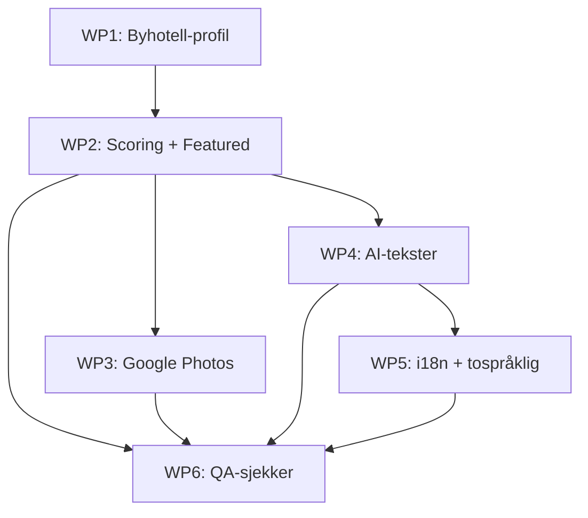

# feat: Generate-Hotel Quality Upgrade

Oppgrader `/generate-hotel` fra generisk POI-dump til polert 1.utkast med smart POI-utvelgelse, tilpassede tekster, bilder, og tospråklig støtte.

## Oversikt

Basert på brainstorm: `docs/brainstorms/2026-02-06-generate-hotel-first-draft-quality-brainstorm.md`

**Mål:** Når `/generate-hotel "Scandic Nidelven" "Havnegata 1, Trondheim"` kjøres, skal resultatet være nær ferdig — intern QA under 15 min per prosjekt.

**Scope:** 10-20 byhoteller for 2-3 kjeder (Scandic, Thon, Radisson).

## Arbeidspakker

Seks selvstendige arbeidspakker med klare avhengigheter. Hver pakke kan kjøres som en egen `/work`-syklus.

```
WP1: Byhotell-profil + Discovery       (ingen avhengigheter)
WP2: POI-scoring + Featured + Capping   (avhenger av WP1)
WP3: Google Photos for Featured         (avhenger av WP2)
WP4: AI-genererte tekster               (avhenger av WP2)
WP5: i18n-tabell + tospråklig           (avhenger av WP4)
WP6: Automatiske QA-sjekker             (avhenger av WP2-WP5)
```

---

## WP1: Byhotell-profil + Discovery-parametere

**Mål:** Erstatt hardkodede verdier i generate-hotel med en byhotell-profil.

### Oppgaver

- [x] Definer byhotell-profil som config-objekt i `.claude/commands/generate-hotel.md`
- [x] Oppdater kategoriliste: legg til `shopping_mall`, `movie_theater`, `hair_care`, `spa`
- [x] Oppdater discovery-parametere: `radiusMeters: 800`, `minRating: 3.5`, `maxResultsPerCategory: 15`
- [x] Legg til per-by radius-defaults (Trondheim 800m, Oslo 1000m, Bergen 600m, default 800m)
- [x] Oppdater import-API-et til å akseptere `minRating`-parameter
- [x] Populer `product_categories` for Explorer-produktet etter import
- [x] Skriv `reportConfig.themes` til `products.config` for Report-produktet
- [x] Fix mapping: `products.config.reportConfig` → `Project.reportConfig` i `getProductFromSupabase()`
- [x] Oppdater theme-rekkefølge for byhotell: Mat → Kultur → Hverdag → Transport → Trening

### Filer som endres

- `.claude/commands/generate-hotel.md` — profil-config og oppdatert pipeline
- `app/api/admin/import/route.ts` — `minRating`-parameter
- `lib/supabase/queries.ts` — `reportConfig`-mapping fra `products.config`
- `components/variants/report/report-themes.ts` — nye default themes (fallback)

### Akseptkriterier

- [ ] `/generate-hotel` bruker byhotell-profil (14 kategorier, 800m radius, minRating 3.5)
- [ ] `product_categories` populeres automatisk for Explorer
- [ ] Report viser themes i byhotell-rekkefølge
- [ ] Per-by radius fungerer (Trondheim vs Oslo)

---

## WP2: POI-scoring, Featured og Variabel Capping

**Mål:** Velg de beste POI-ene automatisk. Marker featured. Cap per kategori.

### Oppgaver

- [x] Lag `lib/utils/poi-score.ts` med scoring-funksjon

```typescript
// lib/utils/poi-score.ts
interface POIScoreInput {
  googleRating?: number;
  googleReviewCount?: number;
  walkMinutes?: number;
}

export function calculatePOIScore(poi: POIScoreInput): number {
  const rating = poi.googleRating ?? 0;
  const reviewWeight = Math.min((poi.googleReviewCount ?? 0) / 50, 1.0);
  const walkMin = poi.walkMinutes ?? 15;
  const proximityBonus = Math.max(0, (15 - walkMin) / 15) * 0.5;
  return (rating * reviewWeight) + proximityBonus;
}
```

- [x] Legg til `featured`-felt på `product_pois`-tabellen (migration)
- [x] Implementer featured-utvelgelse: topp-scorede POI per theme, maks 2 fra samme kategori
- [x] Implementer variabel capping per kategori-gruppe:

| Gruppe | Maks i Report |
|--------|---------------|
| Mat & Drikke | 8 |
| Kultur | 3 |
| Hverdagsbehov | 3 |
| Transport | Alle |
| Trening | 3 |

- [x] Oppdater `sort_order` på `product_pois` basert på score
- [x] Oppdater report-data.ts til å bruke `featured`-felt i stedet for `HIGHLIGHT_COUNT`

### Filer som opprettes

- `lib/utils/poi-score.ts` — scoring-funksjon
- `supabase/migrations/NNN_add_featured_to_product_pois.sql`

### Filer som endres

- `.claude/commands/generate-hotel.md` — scoring + capping steg
- `components/variants/report/report-data.ts` — bruk `featured` fra DB

### Akseptkriterier

- [ ] POI-er sorteres etter score (ikke bare rating)
- [ ] 1-2 featured POI-er per theme i Report
- [ ] Mat-theme har maks 8 POI-er, kultur/hverdag/trening maks 3
- [ ] Explorer viser alle POI-er (ingen capping)

---

## WP3: Google Photos for Featured POI-er

**Mål:** Featured POI-er i Report får bilde fra Google Places.

### Oppgaver

- [x] Etter featured-utvelgelse (WP2), hent foto for hver featured POI:
  - Bruk eksisterende `/api/places/{placeId}` (allerede implementert)
  - Lagre `photo_reference` og konstruer URL
  - Skriv `featured_image`-URL til POI via Supabase REST
- [x] Legg til bilde-visning i Report for featured POI-kort
- [x] Fallback: Vis ikon/farge-kort uten bilde (som i dag) hvis foto mangler

### Filer som endres

- `.claude/commands/generate-hotel.md` — foto-henting steg
- `components/variants/report/` — featured POI-kort med bilde

### Akseptkriterier

- [ ] Featured POI-er i Report viser Google-bilde
- [ ] POI-er uten bilde viser fallback (ikon-kort)
- [ ] `pois.featured_image` oppdateres i database

### Notater

- `pois.photo_reference` og `pois.featured_image` finnes allerede i DB (migration 001), aldri populert
- `/api/places` GET handler henter allerede `photos` fra Google (route.ts:47-50)
- Kostnad: 5-10 API-kall per prosjekt (kun featured)

---

## WP4: AI-genererte tekster med lokalt perspektiv

**Mål:** Alle gjest-synlige tekster genereres tilpasset per prosjekt med "lokalbefolkning"-vinkel.

### Redaksjonell vinkel

"Slik bruker lokalbefolkningen nabolaget." Monocle/Kinfolk-tone. Faktaforankret — aldri påstå noe som ikke kan verifiseres.

### Oppgaver

- [x] Oppdater editorial hooks i generate-hotel til å alltid kjøre (ikke lenger valgfritt)
- [x] Legg til prompt-kontekst: hotellnavn, bydel (fra geocode), bynavn, POI-liste med rating/avstand
- [x] Generer Report-intro per prosjekt (kort, stedsspesifikk, confident)
- [x] Generer bridgeText per theme (kontekstuell, lokal vinkel, nevner faktiske POI-er)
- [x] Generer editorialHook per POI (lokal kontekst, historisk/kulturell, basert på WebSearch)
- [x] Generer localInsight per POI (praktisk tips, insider-perspektiv)
- [x] Skriv intro til `products.config.reportConfig.heroIntro`
- [x] Skriv bridgeText til themes i `products.config.reportConfig.themes[].bridgeText`

### Prompt-mal (konsept)

```
Du skriver tekster for en nabolagsguide fra perspektivet til en som bor i {bydel}, {by}.
Tone: Kort, opinionated, som Monocle/Kinfolk. Anbefaling, ikke Wikipedia.
Regel: Aldri påstå noe som ikke kan verifiseres fra data eller søkeresultat.

Kontekst:
- Hotell: {hotellnavn}
- Bydel: {bydel}
- By: {by}
- POI-er i denne kategorien: {poi-liste med navn, rating, gangtid}

Generer:
1. bridgeText (maks 2 setninger, lokal vinkel)
```

### Filer som endres

- `.claude/commands/generate-hotel.md` — editorial alltid på, prompt-kontekst, intro/bridge-generering

### Akseptkriterier

- [ ] Report-intro nevner bydel og er stedsspesifikk
- [ ] BridgeText per theme nevner lokale steder og har insider-vinkel
- [ ] EditorialHook per POI er basert på WebSearch, ikke generisk
- [ ] LocalInsight gir praktisk tips
- [ ] Alle tekster er faktaforankret (ingen feil/oppspinn)

---

## WP5: i18n-tabell + tospråklig generering

**Mål:** Alle tekster finnes på norsk + engelsk. Autodetect språk + toggle.

### Database

- [x] Ny migration: `translations`-tabell

```sql
-- supabase/migrations/NNN_create_translations.sql
CREATE TABLE translations (
  id UUID PRIMARY KEY DEFAULT gen_random_uuid(),
  locale TEXT NOT NULL,           -- "no", "en", etc.
  entity_type TEXT NOT NULL,      -- "poi", "theme", "report"
  entity_id TEXT NOT NULL,        -- POI-id, theme-id, product-id
  field TEXT NOT NULL,            -- "editorial_hook", "bridge_text", etc.
  value TEXT NOT NULL,
  created_at TIMESTAMPTZ DEFAULT now(),
  updated_at TIMESTAMPTZ DEFAULT now(),
  UNIQUE (locale, entity_type, entity_id, field)
);

CREATE INDEX idx_translations_lookup
  ON translations (entity_type, entity_id, locale);
```

### Backend

- [x] Lag `lib/supabase/translations.ts` — CRUD for translations
- [x] Oppdater `getProductFromSupabase()` til å hente translations med locale-parameter
- [x] Fallback-kjede: `translations[locale]` → `translations["no"]` → `poi.editorial_hook` → null

### Frontend

- [x] Lag `lib/hooks/useLocale.ts` — detect fra `Accept-Language` + state for toggle
- [x] Legg til NO/EN toggle-komponent i Report header
- [x] Oppdater Report-komponenter til å bruke translations med locale

### Generering

- [x] Oppdater generate-hotel til å generere NO + EN i samme kjøring
- [x] Prompten ber om begge språk per tekst
- [x] Lagre som separate rader i translations-tabellen
- [x] Behold eksisterende felter (editorial_hook, local_insight) som fallback

### Filer som opprettes

- `supabase/migrations/NNN_create_translations.sql`
- `lib/supabase/translations.ts`
- `lib/hooks/useLocale.ts`
- Locale toggle-komponent

### Filer som endres

- `lib/supabase/queries.ts` — hent translations
- `.claude/commands/generate-hotel.md` — tospråklig generering
- `components/variants/report/` — bruk translations

### Akseptkriterier

- [x] Translations-tabell eksisterer med correct schema
- [x] Generate-hotel skriver NO + EN for alle tekster
- [x] Report autodetekter språk fra nettleser
- [x] NO/EN toggle fungerer i Report
- [x] Fallback til norsk hvis oversettelse mangler
- [x] Eksisterende rapporter fungerer uten translations (backward-compatible)

---

## WP6: Automatiske QA-sjekker

**Mål:** Skill-en verifiserer resultatet og rapporterer status før oppsummering.

### Oppgaver

- [x] Legg til QA-steg i generate-hotel etter alle andre steg
- [x] Sjekk 1: POI-dekning — alle themes har minst 2 POI-er
- [x] Sjekk 2: Bilde-dekning — alle featured POI-er har `featured_image`
- [x] Sjekk 3: Tekst-dekning — alle ikke-transport POI-er har `editorial_hook`
- [x] Vis rapport med status-ikoner (✅/⚠️)
- [x] Tilby auto-fix for advarsler ("Vil du at jeg genererer hooks for de 3 manglende?")

### Output-format

```
QA-sjekk:
✅ POI-dekning: 5/5 themes har POI-er (totalt 38)
✅ Bilder: 7/7 featured POI-er har bilde
⚠️  Tekst: 3 POI-er mangler editorialHook
   - park-bakklandet
   - supermarket-rema-1000-2
   - gym-sats-midtbyen

Vil du at jeg fikser advarslene?
```

### Filer som endres

- `.claude/commands/generate-hotel.md` — QA-steg og auto-fix

### Akseptkriterier

- [ ] QA-rapport vises etter generering
- [ ] Alle tre sjekk-kategorier fungerer
- [ ] Auto-fix tilbys for manglende hooks

---

## Avhengigheter



## Anbefalt rekkefølge

1. **WP1** — Fundamentet. Alle andre pakker bygger på profilen.
2. **WP2** — Kjernelogikk. Featured og capping påvirker WP3-WP6.
3. **WP3 + WP4 parallelt** — Bilder og tekst er uavhengige av hverandre.
4. **WP5** — Bygger på WP4s tekster.
5. **WP6** — Sist, verifiserer alt.

## Risiko

| Risiko | Sannsynlighet | Konsekvens | Mitigering |
|--------|---------------|------------|------------|
| Google Places Photos API endrer vilkår | Lav | Mister bilder | Fallback til ikon-kort (allerede i WP3) |
| AI-tekster har feil/oppspinn | Medium | Upålitelig rapport | Faktaforankring i prompt + QA-sjekk |
| i18n-tabellen gjør queries trege | Lav | Sakte rapport | Index på (entity_type, entity_id, locale) |
| Per-by radius passer ikke alle byer | Medium | For mange/få POI-er | Default 800m + manuell override |

## Tekniske notater

### Eksisterende infrastruktur som gjenbrukes

| Ressurs | Status | Hva den gjør |
|---------|--------|--------------|
| `pois.photo_reference` | DB-felt eksisterer, aldri populert | Google Photos referanse |
| `pois.featured_image` | DB-felt eksisterer, aldri populert | Bilde-URL for visning |
| `products.config` JSONB | DB-felt eksisterer, alltid `{}` | Kan holde `reportConfig` |
| `product_categories`-tabell | Eksisterer, aldri populert | Kategori-synlighet per produkt |
| `/api/places` GET | Fungerer | Henter Google Photos allerede |
| `category-score.ts` | Fungerer | Scorer themes (ikke POI-er) — kan gjenbruke mønster |
| Fallback i `getProductFromSupabase()` | Fungerer | Deriverer kategorier fra POI-er hvis `product_categories` er tom |

### Migrasjoner som trengs

1. WP2: `NNN_add_featured_to_product_pois.sql` — `featured BOOLEAN DEFAULT false`
2. WP5: `NNN_create_translations.sql` — ny tabell

## Referanser

- Brainstorm: `docs/brainstorms/2026-02-06-generate-hotel-first-draft-quality-brainstorm.md`
- Eksisterende kommando: `.claude/commands/generate-hotel.md`
- Import API: `app/api/admin/import/route.ts`
- Places API: `app/api/places/route.ts`
- Report themes: `components/variants/report/report-themes.ts`
- Report data: `components/variants/report/report-data.ts`
- POI queries: `lib/supabase/queries.ts`
- Category score: `lib/utils/category-score.ts`
- Slugify: `lib/utils/slugify.ts`
- Revalidate: `app/api/admin/revalidate/route.ts`
- Compound docs: `docs/solutions/logic-errors/empty-product-categories-explorer-zero-pois-20260205.md`
- Compound docs: `docs/solutions/architecture-patterns/nextjs-revalidate-endpoint-supabase-rest-20260206.md`
- Compound docs: `docs/solutions/architecture-patterns/claude-code-skill-pipeline-pattern-20260206.md`
