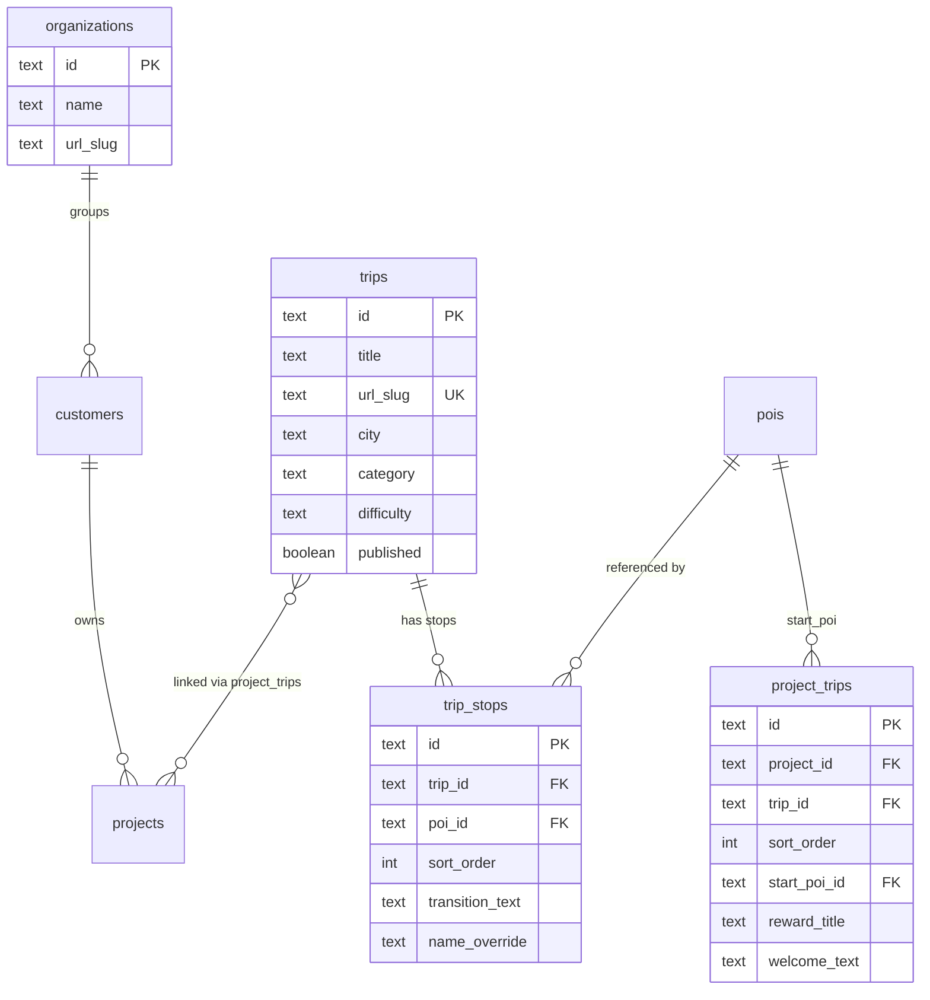

# Trip Data Model: Placy-eid Trip Library med Organization-hierarki

## Arkitekturbeslutninger (tatt 2026-02-09)

1. **Placy eier trips** — vi kuraterer et trip-bibliotek, kunder abonnerer og tilpasser
2. **Organization-lag** — trenger `organizations` over `customers` for enterprise (Scandic Norge → 280 hoteller)
3. **Trips er globale** — ikke customer-scoped, slik at krysskundebruk er mulig
4. **Bygg fremtidsrettet** — ikke begrens oss, selv om vi starter smatt

## Hierarkimodell (target state)

```
Placy Trip Library (global, eid av Placy)
  └── Trips tagget med by/region
        ├── Trondheim: [Byvandring, Smak, Panorama...]
        └── Bergen: [Bryggen, Floibanen...]

Organization (Scandic Norge)
  ├── Customer (Scandic Trondheim / region)
  │     ├── Project: Scandic Nidelven
  │     │     ├── Explorer, Report
  │     │     └── project_trips → [Byvandring, Smak, Panorama]
  │     │           med overrides: startpunkt=Nidelven, reward=15% bar
  │     │
  │     └── Project: Scandic Bakklandet
  │           └── project_trips → [Byvandring, Smak]
  │                 med overrides: startpunkt=Bakklandet, reward=gratis kaffe
  │
  └── Customer (Scandic Bergen / region)
        └── Project: Scandic Bergen City
              └── project_trips → [Bryggen, Floibanen]

Organization (Thon Hotels)
  └── Customer (Thon Trondheim)
        └── Project: Thon Prinsen
              └── project_trips → [Byvandring, Smak] ← SAMME trips som Scandic!
```

### Nøkkelprinsipp: Trips er Placy-innhold

Trips er **ikke kundedata** — de er **Placy-kuratert innhold** knyttet til geografi. Kunder betaler for tilgang og tilpasser med sine egne:
- Startpunkt (hotellet)
- Belonning/tilbud
- Branding/velkomsttekst

## Database Schema

### Tabell: `organizations` (ny)

Enterprise-lag over customers. Valgfri — smakunder trenger ikke dette.

```sql
CREATE TABLE organizations (
  id TEXT PRIMARY KEY DEFAULT generate_short_id(),
  name TEXT NOT NULL,                -- "Scandic Hotels Norge"
  url_slug TEXT NOT NULL UNIQUE,     -- "scandic-norge"
  created_at TIMESTAMPTZ DEFAULT now(),
  updated_at TIMESTAMPTZ DEFAULT now()
);

-- Legg til optional FK pa customers
ALTER TABLE customers
  ADD COLUMN organization_id TEXT REFERENCES organizations(id) ON DELETE SET NULL;
```

### Tabell: `trips` (ny)

Trips er globale (Placy-eid), tagget med by/region for filtrering.

```sql
CREATE TABLE trips (
  id TEXT PRIMARY KEY DEFAULT generate_short_id(),
  title TEXT NOT NULL,
  description TEXT,
  url_slug TEXT NOT NULL UNIQUE,     -- globalt unik: "trondheim-byvandring"
  cover_image_url TEXT,
  category TEXT CHECK (category IN ('food', 'culture', 'nature', 'family', 'active', 'hidden-gems')),
  difficulty TEXT CHECK (difficulty IN ('easy', 'moderate', 'challenging')),
  tags TEXT[] DEFAULT '{}',
  featured BOOLEAN DEFAULT false,

  -- Geografisk tilhorighet
  city TEXT,                         -- "Trondheim"
  region TEXT,                       -- "Trondelag"
  country TEXT DEFAULT 'NO',
  center_lat NUMERIC,               -- Senter av turen (for proximity-sok)
  center_lng NUMERIC,

  -- Precomputed (oppdateres nar stopp endres)
  distance_meters NUMERIC,
  duration_minutes INTEGER,
  stop_count INTEGER DEFAULT 0,

  -- Default reward (kan overstyres i project_trips)
  default_reward_title TEXT,
  default_reward_description TEXT,

  -- Metadata
  created_by TEXT,                   -- Placy-bruker som opprettet
  published BOOLEAN DEFAULT false,   -- Kun publiserte trips er synlige for kunder
  created_at TIMESTAMPTZ DEFAULT now(),
  updated_at TIMESTAMPTZ DEFAULT now()
);

CREATE INDEX idx_trips_city ON trips(city);
CREATE INDEX idx_trips_category ON trips(category);
CREATE INDEX idx_trips_published ON trips(published) WHERE published = true;
```

### Tabell: `trip_stops` (ny)

Stopp i en trip. Refererer globale POI-er via UUID.

```sql
CREATE TABLE trip_stops (
  id TEXT PRIMARY KEY DEFAULT generate_short_id(),
  trip_id TEXT NOT NULL REFERENCES trips(id) ON DELETE CASCADE,
  poi_id TEXT NOT NULL REFERENCES pois(id) ON DELETE CASCADE,
  sort_order INTEGER NOT NULL DEFAULT 0,

  -- Overrides (null = bruk POI-ens standardverdier)
  name_override TEXT,
  description_override TEXT,
  image_url_override TEXT,

  -- Narrativ
  transition_text TEXT,              -- "Ga ned til brua og nyt utsikten..."
  local_insight TEXT,                -- "Kart til Norges beste frokost flere ar pa rad"

  UNIQUE(trip_id, sort_order)
);

CREATE INDEX idx_trip_stops_trip ON trip_stops(trip_id);
```

### Tabell: `project_trips` (ny)

Kobler trips til prosjekter. Her skjer tilpasningen per hotell.

```sql
CREATE TABLE project_trips (
  id TEXT PRIMARY KEY DEFAULT generate_short_id(),
  project_id TEXT NOT NULL REFERENCES projects(id) ON DELETE CASCADE,
  trip_id TEXT NOT NULL REFERENCES trips(id) ON DELETE CASCADE,
  sort_order INTEGER DEFAULT 0,
  enabled BOOLEAN DEFAULT true,      -- Kan deaktiveres uten a fjerne koblingen

  -- Hotellspesifikke overrides
  start_poi_id TEXT REFERENCES pois(id),
  start_name TEXT,                   -- "Scandic Nidelven Hotell"
  start_description TEXT,            -- "Kart til Norges beste frokost..."
  start_transition_text TEXT,        -- "Turen starter her — rett utenfor hotellet"

  -- Hotellspesifikk belonning
  reward_title TEXT,
  reward_description TEXT,
  reward_code TEXT,

  -- Hotellspesifikk branding
  welcome_text TEXT,                 -- "Velkommen til Scandic Nidelven sin byvandring"

  UNIQUE(project_id, trip_id)
);

CREATE INDEX idx_project_trips_project ON project_trips(project_id);
```

### ERD



## Skaleringsscenarioer

### Scenario: Scandic Norge (280 hoteller)

```
organizations: 1 rad (Scandic Hotels Norge)
customers: ~20 rader (per region/by: Scandic Trondheim, Scandic Bergen...)
projects: 280 rader (ett per hotell)
trips: ~100 rader (unike turer pa tvers av alle byer)
trip_stops: ~600 rader (snitt 6 stopp per trip)
project_trips: ~1800 rader (snitt 6-7 trips per hotell)
pois: ~5000 rader (alle steder i alle byer)
```

Ingen duplisering av trips eller POI-er. "Trondheim Byvandring" eksisterer kun EN gang.

### Scenario: Kryss-kunde gjenbruk

Thon Prinsen i Trondheim vil bruke samme "Trondheim Byvandring":

```sql
INSERT INTO project_trips (project_id, trip_id, start_poi_id, reward_title)
VALUES ('thon_prinsen', 'trondheim-byvandring', 'thon-prinsen-poi', 'Gratis kaffe i lobbyen');
```

En INSERT. Ingen duplisering av trip-innhold.

### Scenario: SaaS-pakker (fremtidig)

```
Basis:    3 trips per hotell, standard kategorier
Premium:  9 trips per hotell, alle kategorier + custom reward
Enterprise: Ubegrenset + custom trips + API-tilgang
```

Implementeres med en `subscription_tier` pa customer + check i `project_trips` INSERT.

## Implementeringsfaser

### Fase 1: Database + Queries

- [ ] Migrasjon: `organizations`, `trips`, `trip_stops`, `project_trips`
- [ ] RLS-policies (read for public, write for admin)
- [ ] Query: `getTripsByProject(projectId)` — trips via project_trips med overrides
- [ ] Query: `getTripBySlug(tripSlug)` — single trip med stops + POI-data
- [ ] Query: `getTripsByCity(city)` — for admin/Placy trip library
- [ ] Oppdater `getTripsByCustomer()` med Supabase-stotte
- [ ] TypeScript-typer: `Trip`, `TripStop`, `ProjectTrip`
- [ ] `npm run db:types`

### Fase 2: Frontend

- [ ] Oppdater trips library til `getTripsByProject()`
- [ ] Oppdater trip detail til `getTripBySlug()` + merge project overrides
- [ ] Handter startpunkt-override i TripPage/TripStopList
- [ ] Handter reward-override i TripPage

### Fase 3: Admin

- [ ] Trips-fane i prosjektdetalj (se/koble/fjerne trips)
- [ ] Trip-editor (opprett/rediger trips med stopp)
- [ ] Placy Trip Library-side (se alle trips, filtrer pa by)
- [ ] Organization-visning (se alle kunder under en org)

### Fase 4: Data-migrasjon

- [ ] Script: JSON → Supabase for eksisterende trips
- [ ] POI-mapping (string-ID → Supabase UUID)
- [ ] Verifisering

## Hva vi bygger NA vs SENERE

| Na (fase 1-2) | Senere |
|---|---|
| `trips` + `trip_stops` tabeller | `organizations` tabell |
| `project_trips` med overrides | SaaS subscription tier |
| Queries + frontend | Trip-editor i admin |
| JSON-fallback | AI-genererte trips |
| Manuell trip-oppretting (SQL/script) | Drag-and-drop stopp-editor |

**Begrunnelse**: Vi trenger tabellene og queries for at frontend skal fungere. Admin-editor kan vente — vi oppretter trips manuelt eller via script i forste omgang.

## Open Questions

1. **Customer-struktur for Scandic**: Er "Scandic Trondheim" en customer, eller er hele "Scandic Norge" en customer med 280 prosjekter rett under? Organization-laget loser dette, men vi ma bestemme mappmgen.

2. **Trip URL-slug scope**: Bor trip slugs være globalt unike (`trondheim-byvandring`) eller scoped til customer (`scandic/trondheim-byvandring`)? Globalt unik er enklere og stotter kryss-kunde-bruk.

3. **Hvem kan redigere trips**: Bare Placy? Eller kan enterprise-kunder opprette egne trips? Loser forelopig med `published`-flagg (Placy publiserer, kunder ser kun publiserte).

4. **POI-er som ikke finnes i prosjektets pool**: En trip kan referere POI-er som ikke er i prosjektets `project_pois`. Bor vi automatisk legge dem til, eller la det vere uavhengig?

## References

### Interne filer

- Schema: `supabase/migrations/006_project_hierarchy_ddl.clean.sql`
- Typer: `lib/types.ts` (TripConfig, TripStopConfig, Project)
- Queries: `lib/supabase/queries.ts`
- Data loader: `lib/data-server.ts` (getTripsByCustomer)
- Trip Library: `app/[customer]/[project]/trips/page.tsx`
- Trip Detail: `app/[customer]/[project]/trips/[tripSlug]/page.tsx`
- Admin: `app/admin/projects/[id]/project-detail-client.tsx`

### Documented learnings

- `docs/solutions/feature-implementations/trip-product-supabase-integration-20260209.md`
- `docs/solutions/architecture-patterns/supabase-client-fetch-caching-nextjs-20260209.md`
- `docs/solutions/architecture-patterns/guide-library-spotify-pattern-20260204.md`
