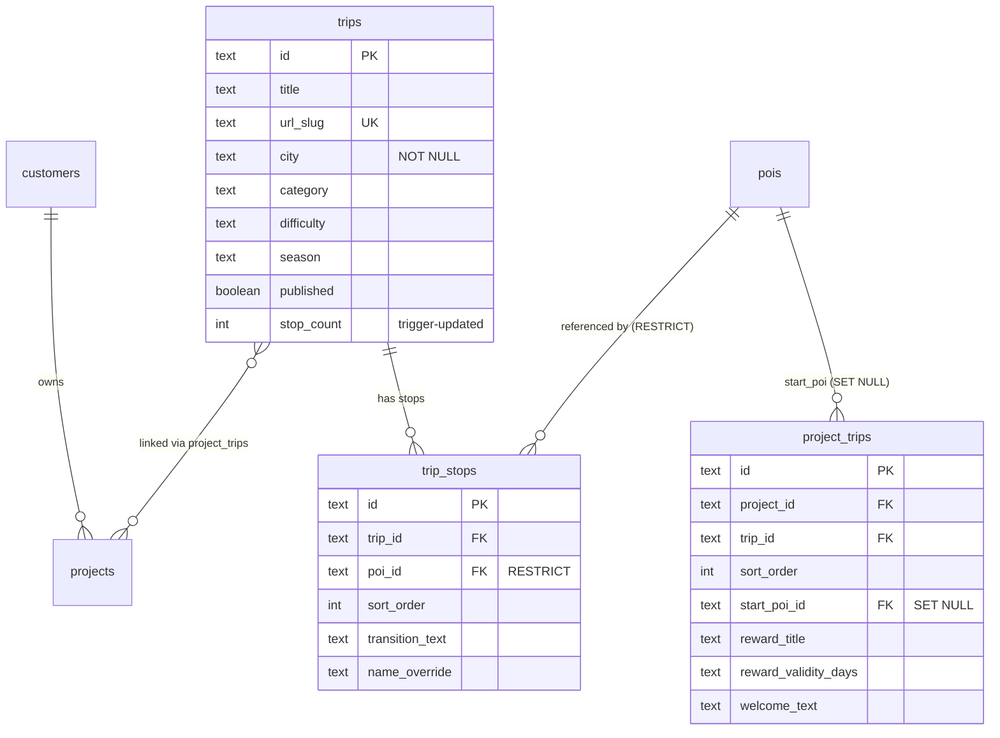

# PRD: Placy Trip Library Platform

## Visjon

Placy bygger et kuratert trip-bibliotek som eies og vedlikeholdes av Placy, og tilbys til hotellkunder via abonnement. Hver trip eksisterer én gang i systemet, men kan presenteres med hotellspesifikke tilpasninger (startpunkt, belønning, branding) gjennom en B2B-kanal — samtidig som Placy bygger sin egen SEO-synlighet gjennom en publik kanal.

---

## Status og neste steg

**Bruk denne PRD med `/workflows:brainstorm` for å diskutere åpne temaer.**

### Besluttet (Del 1)
- [x] Trip-eierskap → Placy eier trips
- [x] URL-strategi → Dobbel kanal (SEO + B2B alias)
- [x] URL-slugs → Globalt unike
- [x] POI-relasjon → Trips uavhengig av prosjektets POI-pool
- [x] Kundehierarki → Organization → Customer → Project
- [x] Admin-kobling → Trips-fane i prosjekt med geo-forslag

### Besluttet (Del 3 — brainstorm 2026-02-09)
- [x] **3.1 Innholdsproduksjon** → AI + kurering, inspirert av `generate-hotel` script
- [x] **3.2 Versjonering** → Live updates + varsling til hoteller
- [x] **3.3 Sesong** → Egen `season`-kolonne (spring/summer/autumn/winter/all-year), Placy styrer manuelt
- [x] **3.4 Brukeropplevelse** → Progress tracking + completion, LocalStorage (ingen innlogging)
- [x] **3.5 Analytics** → Placy-intern først, ingen kundevendt dashboard i MVP
- [x] **3.6 Cross-product** → POI-kobling ("Del av: Byvandring") + felles ProductNav
- [ ] **3.7 Monetisering** → Pakkestruktur ønsket, men **egen brainstorm-session**
- [x] **3.8 Rettigheter** → Placy gjør alt, enterprise-features senere

### Gjenstår
- [ ] **3.7 Monetisering** — Egen brainstorm-session for pakkestruktur og prising

### Work Packages (Del 4) — [Trello Board](https://trello.com/b/DmzVHCDU)
- [ ] **[WP1: Database + Queries + Data-migrasjon](https://trello.com/c/JNWcBsgD)** — kan startes nå
- [ ] **[WP2: Trip-opplevelsen (gjestesiden)](https://trello.com/c/MSZn121O)** — avhenger av WP1
- [ ] **[WP3: Admin + Trip Editor](https://trello.com/c/nTyrxTh1)** — avhenger av WP1, kan parallelliseres med WP2

---

## Del 1: Beslutninger (tatt 2026-02-09)

### 1.1 Trip-eierskap

**Beslutning: Placy eier trips.**

Trips er Placy-kuratert innhold knyttet til geografi, ikke kundedata. Kunder abonnerer på trips og tilpasser med sine egne:
- Startpunkt (hotellet)
- Belønning/tilbud
- Branding/velkomsttekst

**Begrunnelse:**
- Eliminerer duplisering — "Trondheim Byvandring" eksisterer kun én gang
- Krysskundebruk uten ekstra innsats (Scandic og Thon deler samme trip)
- Placy kontrollerer kvalitet og innhold
- Åpner for SaaS-forretningsmodell

### 1.2 Dobbel kanal: SEO + B2B

**Beslutning: Samme trip serveres via to URL-er.**

```
Placy SEO-kanal:
  placy.no/trips/trondheim-byvandring
  → Placy-branding, generisk startpunkt
  → CTA: "Bor du på Scandic Nidelven? Start herfra!"

Hotell B2B-kanal:
  placy.no/scandic/scandic-nidelven/trips/trondheim-byvandring
  → Scandic-branding, start=Nidelven, reward=15% bar
```

Begge bruker samme `trips`-rad. B2B-kanalen merger inn `project_trips`-overrides.

**Strategisk verdi:**
- Placy bygger egen trafikk og SEO-synlighet
- Bevis for hotellene: "tusenvis bruker allerede turene våre"
- Lead generation: gratis trip-brukere → hotellkunder
- Content moat: kuraterte lokale trips er vanskelig å kopiere

### 1.3 Globale URL-slugs

**Beslutning: Trip-slugs er globalt unike.**

`trondheim-byvandring`, ikke `scandic/trondheim-byvandring`.

- Trips tilhører Placy, ikke en kunde
- Enklere routing og krysskundebruk
- Placy kontrollerer opprettelsen, ingen kollisjonsrisiko

### 1.4 POI-uavhengighet

**Beslutning: Trips refererer POI-er direkte, uavhengig av prosjektets POI-pool.**

- `trip_stops → pois` er en direkte relasjon
- Ingen kobling til `project_pois` (som brukes av Explorer)
- En trip kan inkludere POI-er 2km unna hotellet — Explorer viser bare nærområdet
- Trips har egne overrides (`transition_text`, `local_insight`) som ikke eksisterer i Explorer

### 1.5 Organization-hierarki

**Beslutning: Organization → Customer → Project.**

```
Organization: Scandic Hotels Norge
  ├── Customer: Scandic Trondheim (region/by)
  │     ├── Project: Scandic Nidelven
  │     ├── Project: Scandic Bakklandet
  │     └── Project: Scandic Solsiden
  └── Customer: Scandic Bergen (region/by)
        ├── Project: Scandic Bergen City
        └── Project: Scandic Bryggen
```

- Organization er valgfritt (småkunder trenger det ikke)
- Region-customers gir naturlig gruppering og geo-filtrering av trips
- Admin blir oversiktlig selv med 280+ hoteller

### 1.6 Admin: Trip-kobling fra prosjekt

**Beslutning: Prosjekt-admin får en Trips-fane med "marketplace"-visning.**

- Se tilknyttede trips med overrides
- Søk/bla i Placy Trip Library for å legge til nye
- Automatiske forslag basert på prosjektets geografi
- Override-skjema per trip (startpunkt, reward, branding)

---

## Del 2: Database-arkitektur

### 2.1 Nye tabeller

> **Merk:** `organizations` tabell og `ALTER TABLE customers` er utsatt til en egen migrasjon.
> WP1 oppretter kun `trips`, `trip_stops`, og `project_trips`.

#### `trips`

Globale, Placy-eide trips. Migrering: `016_trip_library_schema.sql`.

```sql
CREATE TABLE trips (
  id TEXT PRIMARY KEY DEFAULT gen_random_uuid()::TEXT,
  title TEXT NOT NULL CHECK (length(title) > 0),
  description TEXT,
  url_slug TEXT NOT NULL UNIQUE CHECK (url_slug ~ '^[a-z0-9-]+$'),
  cover_image_url TEXT,
  category TEXT CHECK (category IN ('food', 'culture', 'nature', 'family', 'active', 'hidden-gems')),
  difficulty TEXT CHECK (difficulty IN ('easy', 'moderate', 'challenging')),
  season TEXT CHECK (season IN ('spring', 'summer', 'autumn', 'winter', 'all-year')) DEFAULT 'all-year',
  tags TEXT[] DEFAULT '{}',
  featured BOOLEAN DEFAULT false,

  -- Geografi (NOT NULL — alle trips er stedsbaserte)
  city TEXT NOT NULL,
  region TEXT,
  country TEXT DEFAULT 'NO',
  center_lat DECIMAL NOT NULL CHECK (center_lat BETWEEN -90 AND 90),
  center_lng DECIMAL NOT NULL CHECK (center_lng BETWEEN -180 AND 180),

  -- Precomputed (stop_count oppdateres via trigger)
  distance_meters DECIMAL,
  duration_minutes INTEGER,
  stop_count INTEGER DEFAULT 0,

  -- Default reward
  default_reward_title TEXT,
  default_reward_description TEXT,

  -- Metadata
  created_by TEXT,
  published BOOLEAN DEFAULT false,
  created_at TIMESTAMPTZ NOT NULL DEFAULT NOW(),
  updated_at TIMESTAMPTZ NOT NULL DEFAULT NOW()
);

-- Indexes
CREATE INDEX idx_trips_city ON trips(city);
CREATE INDEX idx_trips_category ON trips(category);
CREATE INDEX idx_trips_city_published ON trips(city) WHERE published = true;

-- Trigger: auto-update updated_at
CREATE TRIGGER update_trips_updated_at
  BEFORE UPDATE ON trips
  FOR EACH ROW EXECUTE FUNCTION update_updated_at_column();

-- RLS: published-filter for public, full access for service_role
ALTER TABLE trips ENABLE ROW LEVEL SECURITY;
CREATE POLICY "Allow public read published trips" ON trips
  FOR SELECT USING (published = true);
CREATE POLICY "Service role full access" ON trips
  FOR ALL USING (auth.role() = 'service_role');
```

#### `trip_stops`

Stopp i en trip. Refererer globale POI-er.

```sql
CREATE TABLE trip_stops (
  id TEXT PRIMARY KEY DEFAULT gen_random_uuid()::TEXT,
  trip_id TEXT NOT NULL REFERENCES trips(id) ON DELETE CASCADE,
  poi_id TEXT NOT NULL REFERENCES pois(id) ON DELETE RESTRICT,
  sort_order INTEGER NOT NULL DEFAULT 0,

  name_override TEXT,
  description_override TEXT,
  image_url_override TEXT,

  transition_text TEXT,
  local_insight TEXT
);
-- Ingen UNIQUE(trip_id, sort_order) — rekkefølge håndheves av ORDER BY i queries.
-- Dette matcher eksisterende mønster (theme_story_sections har heller ikke slik constraint).

-- Indexes
CREATE INDEX idx_trip_stops_trip ON trip_stops(trip_id);
CREATE INDEX idx_trip_stops_poi ON trip_stops(poi_id);

-- Trigger: auto-update trips.stop_count
CREATE OR REPLACE FUNCTION update_trip_stop_count()
RETURNS TRIGGER AS $$
BEGIN
  UPDATE trips SET stop_count = (
    SELECT COUNT(*) FROM trip_stops WHERE trip_id = COALESCE(NEW.trip_id, OLD.trip_id)
  ) WHERE id = COALESCE(NEW.trip_id, OLD.trip_id);
  RETURN NULL;
END;
$$ LANGUAGE plpgsql;

CREATE TRIGGER trg_update_trip_stop_count
  AFTER INSERT OR DELETE ON trip_stops
  FOR EACH ROW EXECUTE FUNCTION update_trip_stop_count();

-- RLS: cascade from parent trip's published status
ALTER TABLE trip_stops ENABLE ROW LEVEL SECURITY;
CREATE POLICY "Allow public read stops of published trips" ON trip_stops
  FOR SELECT USING (
    EXISTS (SELECT 1 FROM trips WHERE trips.id = trip_stops.trip_id AND trips.published = true)
  );
CREATE POLICY "Service role full access" ON trip_stops
  FOR ALL USING (auth.role() = 'service_role');
```

#### `project_trips`

Kobler trips til prosjekter med hotellspesifikke overrides.

```sql
CREATE TABLE project_trips (
  id TEXT PRIMARY KEY DEFAULT gen_random_uuid()::TEXT,
  project_id TEXT NOT NULL REFERENCES projects(id) ON DELETE CASCADE,
  trip_id TEXT NOT NULL REFERENCES trips(id) ON DELETE CASCADE,
  sort_order INTEGER DEFAULT 0,
  enabled BOOLEAN DEFAULT true,

  start_poi_id TEXT REFERENCES pois(id) ON DELETE SET NULL,
  start_name TEXT,
  start_description TEXT,
  start_transition_text TEXT,

  reward_title TEXT,
  reward_description TEXT,
  reward_code TEXT,              -- NB: Ikke eksponert via public RLS
  reward_validity_days INTEGER,  -- Dager reward-koden er gyldig

  welcome_text TEXT,

  UNIQUE(project_id, trip_id)
);

-- Indexes
CREATE INDEX idx_project_trips_project ON project_trips(project_id);
CREATE INDEX idx_project_trips_trip ON project_trips(trip_id);

-- RLS: cascade from trip's published status, exclude reward_code for public
ALTER TABLE project_trips ENABLE ROW LEVEL SECURITY;
CREATE POLICY "Allow public read for published trips" ON project_trips
  FOR SELECT USING (
    EXISTS (SELECT 1 FROM trips WHERE trips.id = project_trips.trip_id AND trips.published = true)
  );
CREATE POLICY "Service role full access" ON project_trips
  FOR ALL USING (auth.role() = 'service_role');
```

> **Sikkerhet:** `reward_code` er lesbar via RLS (nødvendig for completion-visning), men koden
> er kun verdifull etter trip-completion. For MVP aksepteres dette. Fremtidig forbedring:
> bruk en RPC-funksjon som validerer completion før den returnerer koden.

### 2.2 ERD



### 2.3 Skaleringsscenario: Scandic Norge (280 hoteller)

```
organizations: 1 rad
customers: ~20 rader (per region/by)
projects: 280 rader (ett per hotell)
trips: ~100 rader (unike turer på tvers av alle byer)
trip_stops: ~600 rader (snitt 6 stopp per trip)
project_trips: ~1800 rader (snitt 6-7 trips per hotell)
pois: ~5000 rader (alle steder i alle byer)
```

Ingen duplisering. "Trondheim Byvandring" eksisterer kun én gang.

### 2.4 Nøkkelquery: Trip med optional overrides

```sql
SELECT t.*, pt.start_poi_id, pt.start_name, pt.reward_title, pt.welcome_text
FROM trips t
LEFT JOIN project_trips pt ON pt.trip_id = t.id AND pt.project_id = :projectId
WHERE t.url_slug = :slug AND t.published = true;
```

Hvis `projectId` er null (Placy SEO-kanal): ren trip uten overrides.
Hvis satt (B2B-kanal): trip med hotellens tilpasning.

---

## Del 3: Åpne diskusjonstemaer

Følgende temaer må diskuteres og besluttes før implementering.

### 3.1 Innholdsproduksjon

**Beslutning: AI + manuell kurering, inspirert av `generate-hotel` scriptet.**

Placy har allerede en velfungerende autonom pipeline (`generate-hotel`) som importerer og kurerer POI-innhold. Trip-produksjon bygger på samme mønster:

1. AI genererer trip-utkast basert på geografi (POI-utvalg, `transition_text`, `local_insight`)
2. Placy-teamet kurerer og finjusterer
3. Publiseres via `published`-flagg

**Viktige premisser:**
- Eksisterende `generate-hotel` script er bevist og fungerer godt som inspirasjon
- Tilnærmingen revideres fortløpende etter hvert som trips skapes
- Kvalitetskravet er det som skiller Placy fra en Google Maps-liste: narrativ, lokalkunnskap, kuraterte stopp

### 3.2 Versjonering

**Beslutning: Live updates + varsling.**

Endringer i trips propageres umiddelbart til alle hoteller som bruker dem. Hoteller varsles om endringer.

**Konsekvenser for implementering:**
- Ingen `trip_version_id` nødvendig — forenkler schema
- Trenger varslingssystem (kan starte enkelt: e-post eller admin-notifikasjon)
- Placy bør ha en "changelog" per trip for å kommunisere endringer
- Eventuelt: `updated_at` timestamp + "Sist endret"-visning i admin

### 3.3 Sesong og tid

**Beslutning: Egen `season`-kolonne på trips. Placy styrer synlighet manuelt.**

Fire sesonger + all-year:

```sql
season TEXT CHECK (season IN ('spring', 'summer', 'autumn', 'winter', 'all-year')) DEFAULT 'all-year'
```

**Viktige premisser:**
- Ingen automatisk aktivering/deaktivering basert på dato
- Placy håndterer sesong manuelt (publisering/avpublisering)
- Hoteller/kunder styrer ikke sesong-synlighet
- `season`-kolonnen brukes primært til filtrering og sortering i admin og trip library

### 3.4 Brukeropplevelse (sluttbruker)

**Beslutning: Progress tracking + completion. LocalStorage, ingen innlogging.**

Gjesten kan markere stopp som besøkt. Når alle er sjekket av: vis reward-kode (hvis satt).

**Implementeringsdetaljer:**
- Progress lagres i `localStorage` — null friksjon, ingen auth
- Nøkkel: `trip-progress:{tripSlug}` → `{ visited: ["stop-1", "stop-3"], completedAt: null }`
- Completion trigger: alle stopp markert → vis reward + evt. konfetti
- Mistes ved enhetsskifte/cache-sletting — akseptabelt for MVP
- Gamification (poeng, streaks, badges) vurderes i fase 4

### 3.5 Analytics og innsikt

**Beslutning: Placy-intern analytics først. Ingen kundevendt dashboard i MVP.**

Placy bruker aggregert data til å:
- Prioritere hvilke byer/kategorier som trenger flere trips
- Forstå completion rate og drop-off per stopp
- Selge verdi til hoteller ("450 trips startet denne måneden")

**Implementering:**
- Start med standard analytics (Vercel Analytics / page views)
- Vurder event-basert tracking (trip_started, stop_visited, trip_completed) i fase 2-3
- Kundevendt dashboard er en fase 4+ feature
- **Personvern:** Aggregert data kun, ingen individuell tracking uten samtykke

### 3.6 Sammenheng med Explorer og Report

**Beslutning: POI-basert kobling + felles ProductNav.**

Trips kobles til Explorer via delte POI-er. Felles ProductNav (Explore/Trips/Report tabs) gir brukeren tilgang til alle produkter.

**Konkret:**
- Hvis en POI er med i en trip, vis "Del av: Trondheim Byvandring" i Explorer (enkel cross-reference)
- ProductNav fortsetter som i dag med tabs for tilgjengelige produkter
- Dypere integrasjon (trip-ruter i Explorer-kart, trip-embed i Report) vurderes senere
- Ingen felles brukerhistorikk på tvers av produkter i MVP

### 3.7 Monetisering og SaaS-pakker

**Status: Delvis avklart. Pakkestruktur ønsket, men krever egen brainstorm-session.**

Retning: Basis/Premium/Enterprise pakker. Detaljer (prising, innhold per pakke, gratis tier) besluttes separat.

**Foreløpig skisse (fra tidligere diskusjon):**

```
Gratis:     1 trip, Placy-branding synlig, ingen custom reward
Basis:      3 trips, custom startpunkt + reward, §XXX/mnd
Premium:    9 trips, alle kategorier, analytics dashboard, §XXX/mnd
Enterprise: Ubegrenset, custom trips, API, org-admin, §XXX/mnd
```

**TODO:** Kjør `/workflows:brainstorm` med fokus på monetisering/prising for å avklare dette.

### 3.8 Trip-redigering og innholdsadmin

**Beslutning: Placy gjør alt. Enterprise-features vurderes senere.**

For nå er Placy den eneste aktøren som oppretter, redigerer og publiserer trips. Kunder/hoteller har ingen admin-tilgang.

**Rettighetsmatrise (MVP):**

| Handling | Placy | Kunde |
|---------|-------|-------|
| Opprette trip | ✅ | ❌ |
| Redigere trip-innhold | ✅ | ❌ |
| Legge til/fjerne stopp | ✅ | ❌ |
| Koble trip til prosjekt | ✅ | ❌ |
| Redigere overrides | ✅ | ❌ |
| Aktivere/deaktivere trip | ✅ | ❌ |

**Fremtidig (enterprise):** Kundeadmin med override-redigering, trip-kobling, og potensielt trip-forslag. Vurderes basert på kundebehov etter lansering.

---

## Del 4: Work Packages

Tre sekvensielle work packages. Hver kan planlegges og implementeres med `/workflows:plan` + `/workflows:work`.

### WP1: Database + Queries + Data-migrasjon

Alt backend-fundament i én pakke. Ingen frontend-endringer.

- [ ] Migrasjoner: `trips` (med `season`), `trip_stops`, `project_trips`
- [ ] RLS-policies (read for public, write for admin)
- [ ] Query: `getTripsByProject(projectId)` — trips via project_trips med overrides
- [ ] Query: `getTripBySlug(slug, projectId?)` — single trip med stops + POI-data, optional overrides
- [ ] Query: `getTripsByCity(city)` — for admin/Placy trip library
- [ ] TypeScript-typer: `Trip`, `TripStop`, `ProjectTrip` (fra `npm run db:types` + manuelle typer)
- [ ] JSON → Supabase migrasjon for eksisterende Scandic-trips
- [ ] POI-mapping: string-ID → Supabase UUID for trip_stops

**Kan startes nå. Ingen blokkerende avhengigheter.**

### WP2: Trip-opplevelsen (gjestesiden)

Alt sluttbrukeren/hotellgjesten ser og interagerer med.

- [ ] Trip library (`/[customer]/[project]/trips`) med Supabase-data
- [ ] Trip detail (`/[customer]/[project]/trips/[tripSlug]`) med project overrides
- [ ] Startpunkt-override: vis hotellets start_poi som første stopp
- [ ] Reward-override: vis hotellets reward ved completion
- [ ] Branding-override: welcome_text fra project_trips
- [ ] Placy SEO-rute (`/trips/[slug]`) — ren trip uten project overrides
- [ ] Progress tracking: localStorage-basert, markér stopp som besøkt
- [ ] Completion: vis reward-kode når alle stopp er besøkt
- [ ] POI-kobling i Explorer: "Del av: Trondheim Byvandring" (enkel cross-reference)

**Avhenger av WP1.**

### WP3: Admin + Trip Editor

Alt Placy-teamet trenger for å administrere trips.

- [ ] Trips-fane i prosjekt-admin (`/admin/projects/[id]`)
- [ ] Vis tilknyttede trips med overrides
- [ ] Søk/bla i Placy Trip Library for å koble nye trips
- [ ] Geo-baserte forslag (trips i samme by som prosjektet)
- [ ] Override-skjema per trip (startpunkt, reward, branding)
- [ ] Placy Trip Library dashboard (`/admin/trips`) — alle trips, filtrer på by/kategori/sesong
- [ ] Trip-editor: opprett/rediger trips med stopp (drag-and-drop rekkefølge)
- [ ] Stopp-editor: velg POI, skriv transition_text og local_insight

**Avhenger av WP1. Kan parallelliseres med WP2.**

### Fremtidige utvidelser (ikke planlagt ennå)

- `organizations` tabell og enterprise-hierarki
- SaaS-pakker og subscription management (krever egen brainstorm)
- Analytics dashboard for hoteller
- Gamification (poeng, streaks, badges)
- Enterprise-features (kundeadmin, trip-forslag)
- Varslingssystem for trip-oppdateringer

---

## Del 5: Referanser

### Interne filer

- Schema: `supabase/migrations/006_project_hierarchy_ddl.clean.sql`
- Typer: `lib/types.ts`
- Queries: `lib/supabase/queries.ts`
- Data loader: `lib/data-server.ts`
- Trip Library: `app/[customer]/[project]/trips/page.tsx`
- Trip Detail: `app/[customer]/[project]/trips/[tripSlug]/page.tsx`
- Admin: `app/admin/projects/[id]/project-detail-client.tsx`

### Documented learnings

- `docs/solutions/feature-implementations/trip-product-supabase-integration-20260209.md`
- `docs/solutions/architecture-patterns/supabase-client-fetch-caching-nextjs-20260209.md`
- `docs/solutions/architecture-patterns/guide-library-spotify-pattern-20260204.md`

### Tidligere plan (erstattes av denne PRD)

- `docs/plans/2026-02-09-feat-trip-data-model-reusable-trips-plan.md`

---

## Del 6: Tech Audit (2026-02-09)

**Verdict: YELLOW** — Arkitekturen er god. 12 mitigasjoner innarbeidet i Del 2 schema.

### Endringer fra tech audit

| # | Endring | Begrunnelse |
|---|---------|-------------|
| 1 | `gen_random_uuid()::TEXT` i stedet for `generate_short_id()` | Konsistent med `products`-tabell (migrasjon 006) |
| 2 | `trip_stops.poi_id ON DELETE RESTRICT` | Forhindrer at POI-sletting ødelegger publiserte trips |
| 3 | `project_trips.start_poi_id ON DELETE SET NULL` | Graceful degradering — faller tilbake til default start |
| 4 | Fjernet `UNIQUE(trip_id, sort_order)` | Blokkerer reordering. Eksisterende tabeller har ikke dette |
| 5 | `trips.city NOT NULL` | Påkrevd for `getTripsByCity()`-query |
| 6 | `center_lat/lng NOT NULL CHECK` | Matcher `projects`-tabellens constraints |
| 7 | `url_slug CHECK (~ '^[a-z0-9-]+$')` | Matcher `projects`-tabellens validering |
| 8 | `updated_at`-trigger på `trips` | Uten trigger oppdateres aldri `updated_at` |
| 9 | `stop_count`-trigger på `trip_stops` | Forhindrer drift mellom faktisk antall og precomputed verdi |
| 10 | RLS med `published = true` filter | Forhindrer lekkasje av upubliserte trips via anon key |
| 11 | `reward_validity_days` lagt til `project_trips` | Matcher eksisterende `RewardConfig.validityDays` i frontend |
| 12 | `organizations` utsatt fra migrasjon 016 | Ikke i WP1 scope — forenkler rollback |

### Implementasjonsnotater for WP1

- **Migrasjon**: `016_trip_library_schema.sql` med `BEGIN/COMMIT`
- **ID-strategi**: `gen_random_uuid()::TEXT` (ikke `generate_short_id()`)
- **Queries**: Bruk batch-fetch med nested `.select("*, pois(*, categories(*))")` for å unngå N+1
- **Typer**: `DbTrip`, `DbTripStop`, `DbProjectTrip` i `lib/supabase/types.ts` + frontend-typer i `lib/types.ts`
- **Transformere**: `transformTrip()`, `transformTripStop()` i `queries.ts`
- **Cache**: Fiks `createServerClient()` i `lib/supabase/client.ts` — legg til `cache: "no-store"`
- **Data-migrasjon**: Match POI-er via navn + koordinater (±0.001°). Idempotent med `ON CONFLICT`
- **getTripBySlug(slug, projectId)**: Returner `null` når projectId er gitt men ingen `project_trips`-rad finnes
- **Start POI**: Returner `project_trips.start_*` som separate felt, ikke injisert i stops-array
