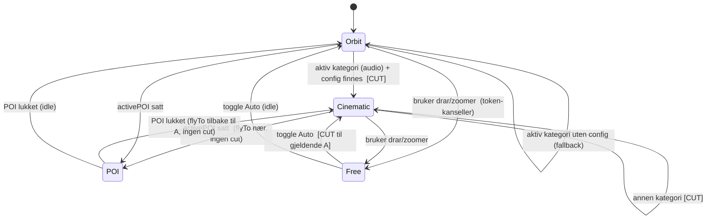
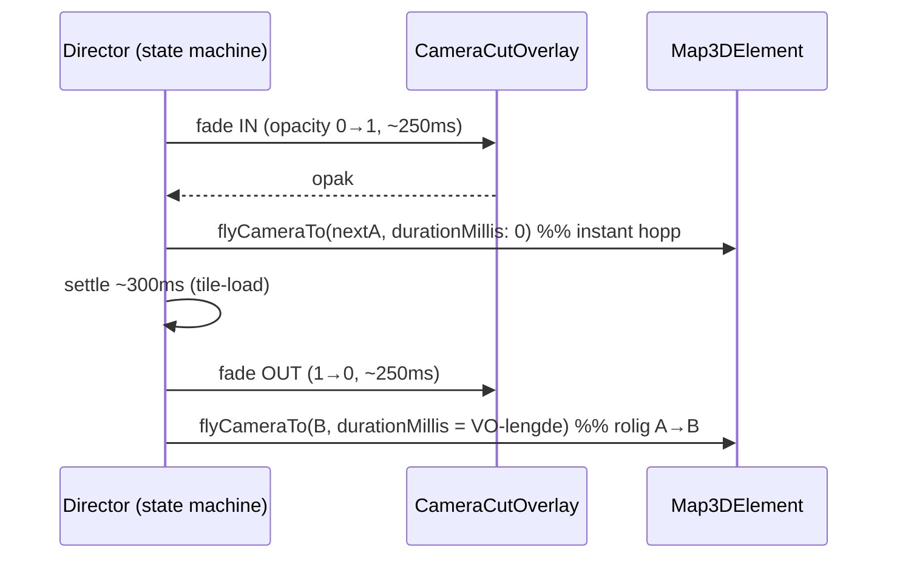

# feat: Per-kategori kamera-waypoints (A→B) med cut-transition i 3D rapport-board

## Overview

3D-rapport-boardet (`BoardMap3D`, Google Photorealistic 3D Tiles) skal slutte å bruke én vilkårlig drone-orbit for alt, og i stedet kjøre en **regissert kamera-bevegelse per kategori**: hver kategori har et autorert startpunkt **A** og sluttpunkt **B**, og dronen beveger seg rolig A→B mens kategoriens voice-over spiller. Ved kategori-skifte gjør vi en **cut** (sort overlay fade-in → instant kamera-hopp til neste kategoris A → fade-out), ikke en meningsløs fly-over på tvers av byen.

Dette løser også et kjent problem: dagens kamera-director har et timer-race (StrictMode dobbel-kjøring → `Fri`-modus stopper ikke orbiten pålitelig). Directoren bygges om til en eksplisitt state-maskin med "token / last-call-wins"-kansellering, som fjerner racet ved design.

På prototype-nivå lagres waypoints i en **lokal config-fil** i repoet (kilde til sannhet nå); promotering til Supabase `products.config` defereres.

## Problem Frame

Stasjonskvartalet (valideringsprosjektet) ligger helt nord i Trondheim sentrum, rett ved vannet. En nord-vendt eller naiv orbit viser i praksis vann/tomhet — ikke kategori-innholdet, som ligger sør/innover. Vi har ikke kontroll på *hva som vises* per kategori. Brukeren vil bestemme vinkel og innhold eksplisitt per voice-over: en kuratert "drone-rute" A→B per kategori, med en cut imellom så vi aldri flyr kjedelig over vannet.

Tidligere ble per-kategori kamera-endring fjernet fordi en *vilkårlig* bearing-mot-centroide var desorienterende. En *kuratert* A→B har motsatt egenskap: den har intensjon. Forskjellen er kuratering, ikke bevegelse.

## Requirements Trace

- **R1** — Hver kategori har autorerte waypoints A (start) og B (slutt); dronen beveger seg A→B under kategoriens voice-over. **Framing-krav:** minst én av posene skal relatere innholdet til hjemmet (prosjektet synlig/markert i bildet, eller A forankret på hjemmet før B avslører kategorien), så kjøperen kan plassere innholdet *i forhold til boligen* — ikke bare se pene bilder. *(doc-review: product-lens P1 — A→B må forankre seeren til hjemmet)*
- **R2** — Kategori-skifte = cut: sort overlay fade-IN → instant reposisjon (hopp) til neste kategoris A → fade-OUT når kartet står riktig. Ingen fly-over på tvers.
- **R3** — Enkel datamodell: en liste `kategori → { A, B, + path-settings }`, lagret lokalt i repoet for nå.
- **R4** — En måte å *sette* A/B uten å gjette koordinater: "fang-fra-live" (fly manuelt → lagre nåværende kamera → JSON til clipboard).
- **R5** — Narrativ-synk: kamera-beatet følger den **audio-drevne** aktive kategorien (ikke rå scroll); A→B-varighet = voice-over-lengden, kjent **synkront ved cut-tidspunkt** (ikke avhengig av at `loadedmetadata` har fyrt).
- **R6** — Fiks kamera-director-racet: `auto`/`Fri` (CameraModeToggle) skal pålitelig starte/stoppe kamera-bevegelsen. Gjelder også cut-sekvensens timere (settle/fade).
- **R7** — Ikke re-introduser per-frame WebGL-churn; én WebGL-kontekst; aldri spread `LatLngAltitude`; aldri rAF-drevet kamera; ingen ~4 Hz `timeupdate`-re-render inn i marker-render-stien.
- **R8** — Respekter `prefers-reduced-motion`: brukere med redusert-bevegelse-preferanse får statisk hold på A (ingen A→B-drift) og instant cut uten fade. *(doc-review: design-lens P2)*

## Scope Boundaries

- **Desktop-only.** 3D-boardet vises kun på desktop (mobil bruker Mapbox 2D `ReelsMap`). Kamera-kinoen er dermed desktop-scope. 2D-mobilens `fitBounds`-oppførsel anses som tilstrekkelig interim-dekning for det kuraterte narrativet; mobil-paritet er bevisst akseptert som ute av scope (se Deferred). *(doc-review: design-lens P3)*
- **Bookend-beats orbiterer bevisst.** `welcome`/`home`/`outro` er IKKE `BoardCategory`-er (`BoardReelsSync` dispatcher `RESET_TO_DEFAULT` → `activeCategoryId` null), så de treffer orbit-fallback (KD-7) — ikke cinematic A→B. Dette er et bevisst valg nå: tour-en åpner/lukker med rolig orbit over prosjektet. Authoring av bookend-poser er deferert (krever utvidet nøkkel-type, se Deferred). *(doc-review: adversarial A4)*
- **Kun Stasjonskvartalet har waypoints (prototype).** `camera-tours.ts` er keyed på slug og seedes kun for `stasjonskvartalet` (Unit 7). ALLE andre 3D-addon-prosjekter (inkl. neste demo/kunde) får orbit-fallback med null waypoints, og det finnes ingen prod-authoring-vei (authoring er dev-flag-gated, clipboard→lokal fil). Dette er en bevisst prototype-begrensning, ikke en gjenbrukbar feature før Supabase-promotering. *(doc-review: adversarial A7)*
- Endrer **ikke** 2D-kartets (`BoardMap.tsx`) eksisterende per-kategori `fitBounds`-tween — det er 2D-analogen og lever videre uendret.
- Endrer **ikke** audio/voice-over-pipelinen eller reels-orchestreringen — vi *konsumerer* dem (current track, duration, track-ended). **Unntak:** `buildReelsCards`/`buildCategoryTracks` (`reels-data.ts`) utvides minimalt til å populere `AudioTrack.durationSec` fra `audioDurationSec(card.audio)` (karaoke-timings), så A→B-varighet er kjent synkront (se KD-5).
- Endrer **ikke** marker-rendering (`Marker3D`/`MapView3D`); waypoint-state holdes ute av marker-render-stien.

### Deferred to Separate Tasks

- **Prod-persistering av waypoints**: promoter lokal config → `ReportThemeConfig.camera` i Supabase `products.config.reportConfig.themes[]` (deep-merge PATCH + optimistic lock + Zod `version`-literal + `revalidateTag`, mappet i **begge** loaderne `getProductFromSupabase` og `getProjectFromSupabase`). Følger gemini-grounding/audio-mønsteret. Tas når vi går fra prototype → prod-aktig.
- **Capture-fra-live → direkte Supabase-lagring** (PATCH fra UI). Nå kun clipboard → lokal fil.
- **Lineær/konstant-hastighets-drift A→B** via egen rAF-tween: `flyCameraTo` gir fast ease-in-out + svak parabolsk bue. Hvis ease-in-out viser seg utilstrekkelig, vurder selv-drevet tween — men det er dagens anti-mønster (jitter), så det defereres bevisst.
- **Sentence-boundary-justerte cut-punkter** (karaoke-timings): A→B spenner hele VO-en nå; finere beats per setning defereres.
- **Auto-utledet framing** (A/B fra kategori-POI-centroid + hjem-posisjon) så kamera-kinoen skalerer uten hand-cinematografi per listing — svaret på skalerings-spørsmålet (product-lens P2), eksplisitt skyldig senere.
- **Authoring av bookend-poser** (`welcome`/`home`/`outro`): krever utvidet nøkkel-type (`AudioTrackCategoryId` i stedet for bare `BoardCategoryId`) i `camera-tours`.
- **Mobil-paritet** for kamera-kino (krever 3D på mobil, som i dag er bevisst av).

## Context & Research

### Relevant Code and Patterns

- `components/variants/report/board/BoardMap3D.tsx` — dagens kamera-director (effekt keyed `[cameraMode, activePOI?.id, map3dInstance, flyToHeroThenOrbit]`), `composeFixedHero`/`composeOrbitHero`/`startOrbit`/`flyToHeroThenOrbit`/`bearingBetween`, `FlyCapableMap`-cast (`flyCameraTo`/`flyCameraAround`/`stopCameraAnimation`), `HeroCamera`-typen `{center:{lat,lng,altitude}, range, tilt, heading}`. Kategori-skifte rører i dag IKKE kameraet — dette endres her.
- `components/variants/report/board/CameraModeToggle.tsx` — `type CameraMode = "auto" | "free"`; nylig lagt til.
- `components/map/map-view-3d.tsx` — `MapView3D` → `Map3DInner` → `MapReadyBridge` (`useMap3D()`) → `onMapReady(map3d)`. `freeMode` aktiv i board (ingen bounds/altitude-clamp). Marker3D er `React.memo`'d, opacity som SVG-attributt.
- `components/variants/report/blocks/report-3d-config.ts` — `DEFAULT_CAMERA_LOCK` (`range 900, tilt 45, ...`).
- `components/variants/report/board/board-state.tsx` — `BoardState {phase, activeCategoryId, activePOIId}`; `phase: "default"|"active"|"poi"`; `SELECT_CATEGORY {id, source?}`; `useActiveCategory()`/`useActivePOI()`. Aktiv kategori settes via `BoardReelsSync` med `source:"audio"`.
- `lib/stores/audio-tour-store.ts` — Zustand; `useCurrentTrack()` (gjeldende kategori), `useAudioTourPhase()`, `AudioTrack {categoryId, url, manus, durationSec?}`.
- `components/variants/report/board/audio-tour/use-audio-element.tsx` — `useAudioElement()` gir live `currentTime` + `duration` (~4 Hz); `onTrackEnded`-hook = beat-slutt (allerede wiret i `ReportReelsPage`).
- `components/variants/report/board/board-data.ts` — `BoardCategory`, `adaptCategory`, `adaptBoardData`; her merges lokal camera-config inn per `categoryId`.
- `components/variants/report/board/BoardMap.tsx` — 2D-analogen: per-kategori `fitBounds`-tween mens audio spiller (keyed `activeCategory?.id`, leser `useAudioTourPhase()`). Mønster å speile konseptuelt.

### Institutional Learnings

- `docs/solutions/feature-implementations/google-maps-3d-camera-control-iteration-20260415.md` — **`flyCameraTo` er DEN eneste animasjons-motoren.** Aldri rAF-driv `map3d.heading = x` (jitter — 4 mislykkede iterasjoner). Aldri spread `LatLngAltitude` (`{...center}` mister `lat/lng`-gettere → `InvalidValueError`); kopier `lat/lng/altitude` eksplisitt. "Cut"-følelse = kort `durationMillis`.
- `docs/solutions/architecture-patterns/map-adapter-pattern-20260419.md` — **`stopCameraAnimation()` er ikke pålitelig på rå `Map3DElement`.** Teamets kansellerings-mønster = **token (rAF-guard + token-bump), "siste `flyCameraTo` vinner"** (API-et køer ikke). Driv cut-sekvenser gjennom token-guard.
- `docs/solutions/ui-bugs/google-maps-3d-webgl-context-crash-touch-devices-20260415.md` — **Én WebGL-kontekst per side** (iOS). All kamera-jobb i den ene aktive `Map3D`; aldri en andre instans for å "preview" et punkt.
- `docs/solutions/feature-implementations/3d-map-real-pois-distance-opacity-20260415.md` — Hold animasjons-/waypoint-state UTE av `Marker3D`-render-stien (`React.memo` + SVG-attributt-opacity), ellers re-render-storm.
- `docs/solutions/ui-bugs/google-maps-3d-popover-not-rendering.md` — StrictMode: en `mounted`-flag beskytter ikke async i `useEffect`; bruk `cleanedUp`-sjekk *etter* await + latest-ref-disiplin.
- `docs/solutions/api-integration/gemini-grounding-pattern-20260418.md` — Per-tema config-persistering (deep-merge PATCH, optimistic lock, Zod `version`-literal, `revalidateTag`) — referanse for den *deferede* prod-persisteringen.

### External References

- Google Maps 3D `Map3DElement` (camera-API): https://developers.google.com/maps/documentation/javascript/reference/3d-map — `flyCameraTo({endCamera, durationMillis})` (**`durationMillis: 0` = teleport/instant cut**, atomisk); easing er **fast ease-in-out + parabolsk bue — ikke konfigurerbar**; `flyCameraAround({camera, durationMillis, repeatCount: Infinity})` orbiterer rundt `camera.center`; `gmp-animationend` bobler men har **ingen payload-diskriminator** og `stopCameraAnimation()` fyrer den ikke pålitelig → driv state-maskinen imperativt, ikke på event-innhold.
- Kamera-eksempel (30s A→B med én `flyCameraTo`): https://developers.google.com/maps/documentation/javascript/examples/3d/move-camera
- `@vis.gl/react-google-maps` (`^1.8.3`, 3D er **alpha/ustabilt**): nå rå `Map3DElement` via `useMap3D()`/`onMapReady` (allerede gjort) og kall native metoder. https://visgl.github.io/react-google-maps/docs/api-reference/components/map-3d
- Google Earth Studio (mental modell for skjemaet): keyframes = `lat/lng/altitude` + `distance` + `pan(heading)/tilt/roll`, per-keyframe easing. Vår `CameraPose` mapper 1:1 på `CameraOptions`.

## Key Technical Decisions

- **KD-1 — `flyCameraTo` for alt; aldri rAF.** A→B = `flyCameraTo(B, durationMillis = VO-lengde)`. Cut = `flyCameraTo(nextA, durationMillis: 0)` (atomisk, ingen halv-frame). Aksepter fast ease-in-out (GPU-smooth, "rolig nok"). Selv-drevet lineær tween er anti-mønster → defereres.
- **KD-2 — Kansellering via token, ikke `stopCameraAnimation`.** Hver kamera-kommando bumper en `tokenRef`; utsatte handlinger sjekker token før de kjører. "Siste kall vinner". **Gjelder ALLE timer-callbacks i cut-sekvensen** (settle→fade-OUT, fade-OUT→A→B): hver `setTimeout` fanger token ved schedule-tid og early-returner hvis `token !== tokenRef.current`. Dette er nødvendig fordi "siste fly vinner" kun dekker fly→fly-overskriving — en bar settle-`setTimeout` har ingen pågående fly å overskrive, så uten token-sjekk vil en foreldet cut fade ut feil frame. Fjerner StrictMode-timer-racet (R6) ved design. *(doc-review: adversarial A2)*
- **KD-3 — Director som eksplisitt state-maskin.** Tilstander: `orbit` (idle, auto) · `cinematic` (aktiv kategori, auto) · `poi` (aktiv POI) · `free` (bruker styrer). Ren beslutnings-funksjon (`decideCameraIntent`) skilles ut og testes; tynt imperativt lag (hooken) kaller fly-metodene. **Ansvarsfordeling Unit 3↔4 (eliminerer tvetydighet):** hooken eier hele cinematic-intent-utførelsen. Når `intent.cut === true` kjører hooken cut-sekvensen (KD-4) OG kicker så A→B-flyet; når `cut === false` (samme kategori, re-render) kjører den A→B direkte. Unit 4 eier cut-orkestreringen *til og med* å starte A→B; Unit 3 eier A→B-flyets parametre/varighet. `flyCameraTo(B)` kalles ett sted (hooken), aldri dobbelt. *(doc-review: coherence C1)*
- **KD-4 — Cut-transition.** Sort overlay: fade-IN (~250 ms) → ved opak: `flyCameraTo(A, durationMillis: 0)` → kort settle for tile-load (~300 ms) → fade-OUT (~250 ms) → start A→B. "Ved opak" detekteres via fast `setTimeout` lik fade-varigheten (CSS-transition er deterministisk), token-guardet (KD-2). Cut brukes ved cinematic-kategori-skifte (inkl. idle→første, free→resume). IKKE ved poi-lukk→samme kategori (nær; vanlig `flyCameraTo`). **Cut-kadens:** se Åpne spørsmål — vurder en "ingen cut hvis kamera-flyttet er under terskel" / minimum-dwell-regel for å unngå at en cut mellom *hver* seksjon i en auto-advance-tour føles som en lysbildeserie.
- **KD-5 — Narrativ-synk på audio-drevet kategori, varighet synkront ved cut-tid.** Cinematic keyer på `useActiveCategory()` (satt via `source:"audio"`). A→B-varighet hentes prioritert: **(1) `track.durationSec` utledet fra karaoke-timings via `audioDurationSec(card.audio)`** — populeres i `buildCategoryTracks`/på `BoardCategory`, så den er kjent SYNKRONT ved cut-tid; (2) live `useAudioElement().duration` som korreksjon når `loadedmetadata` har fyrt; (3) konstant default kun hvis ingen timings finnes. Dette retter at dagens kjede er reelt 2-tier (durationSec settes aldri) og at `duration` er 0 til metadata laster — begge ville kollapse A→B til feil hastighet og bryte R5. Respekterer "audio er kilde til sannhet" (jf. `docs/plans/2026-05-18-001-feat-rapport-board-helhetlig-narrativ-plan.md`). *(doc-review: feasibility F1/F2, adversarial A1)*
- **KD-6 — Cinematic kun i `auto`.** Bruker-drag/wheel/touch på kart-bakgrunn → `free` (token-kanseller cinematic). Toggle → `auto` = cut til gjeldende kategoris A og gjenoppta. Audio-pause midt i et beat: `audioTourPhase` (playing/paused) er input til `decideCameraIntent`; ved pause stopper A→B-flyet (best-effort) så kamera ikke flyr alene mens VO-en er frosset. *(doc-review: adversarial A3)*
- **KD-7 — Fallback når waypoints mangler.** Kategori uten config → behold orbit (graceful). `A` påkrevd, `B` valgfri: kun A → rolig `flyCameraAround` rundt A (alltid litt bevegelse); A+B → `flyCameraTo` A→B. **Verifiser tidlig (Unit 2/3) at et `flyCameraTo` faktisk stopper en pågående `flyCameraAround(repeatCount: Infinity)`** — "siste-kall-vinner" er kun empirisk bekreftet for fly→fly, ikke for å avbryte en uendelig orbit-loop. *(doc-review: adversarial A5)*
- **KD-8 — Lokal config nå.** `CameraPose`/`CategoryCameraConfig`-typene i `lib/types.ts`; selve waypoints i en lokal typed modul keyed på prosjekt-slug. Ingen loader-/DB-endring. Promotering til Supabase = deferert.
- **KD-9 — Authoring via clipboard.** Capture-knapp leser live-kamera (eksplisitt `lat/lng/altitude`-kopi) → waypoint-JSON til clipboard, bak en dev-flag (`?author=1`). Lim inn i den lokale configen.
- **KD-10 — Redusert bevegelse (`prefers-reduced-motion`).** Les media-query én gang ved director-init og send som flag inn i `decideCameraIntent`: ved `reduce` → statisk hold på A (ingen A→B-drift, ingen orbit) og instant cut uten fade. Viktig for rapport-publikummet (eldre demografi, høyere bevegelses-sensitivitet). *(doc-review: design-lens D5, R8)*
- **KD-11 — Duration leses via ref, ikke render-prop.** `useAudioElement()` re-renderer ~4 Hz på `timeupdate`. Director-hooken fanger `duration`/`currentTime` i en ref (latest-ref) i stedet for å la `BoardMap3D` (som eier marker-treet) re-rendre på hver tick → unngår R7-churn i marker-stien. *(doc-review: feasibility F3)*

## Open Questions

### Resolved During Planning

- *Instant cut mulig?* — Ja: `flyCameraTo({endCamera, durationMillis: 0})` teleporterer atomisk. (Brukes i KD-4.)
- *Kan A→B-easing styres til lineær?* — Nei, ikke støttet uten egen rAF-tween (anti-mønster). Aksepter ease-in-out (KD-1); lineær defereres.
- *Hvordan kansellere pålitelig?* — Token "last-call-wins", ikke `stopCameraAnimation`/`gmp-animationend` (KD-2).
- *Hvor lagres waypoints?* — Lokal typed modul i repoet nå (KD-8); Supabase deferert.
- *Hvordan settes A/B?* — Capture-fra-live → clipboard → lim inn lokalt (KD-9).
- *Hva med 2D/mobil?* — Utenfor scope; 3D-board er desktop-only (2D-mobilens fitBounds er interim-dekning).
- *Hvor kommer A→B-varigheten fra ved cut-tid?* — `track.durationSec` utledet fra karaoke-timings, synkront tilgjengelig (KD-5); løser den døde fallback-tieren.
- *Hva med welcome/home/outro?* — Orbiterer bevisst (ikke `BoardCategory`); authoring av bookend-poser deferert (se Scope/Deferred).

### Deferred to Implementation

- Eksakt tile-settle-varighet i cut-en (fast ~300 ms vs. lytt på en idle/tiles-loaded-indikator) — kalibreres mot faktisk tile-pop ved kjøring. Ingen øvre-grense-fallback ennå hvis 300 ms er for kort på treg forbindelse.
- Om `B` skal nås nøyaktig ved VO-slutt eller litt før (buffer) — finjusteres mot faktisk følelse.
- Endelige hook-/funksjons-navn i director-ekstraksjonen.

### Design-beslutninger å avklare (doc-review — krever bruker/design-skjønn)

Disse er bevisst åpne; sett fornuftig default ved implementasjon (Unit 4/5) og verifiser i Unit 7. De er taste-/UX-valg, ikke tekniske blokkere:

- **Cut-overlay-innhold under den sorte framen** (~800 ms total): ren sort, eller kategori-label/ikon som fader inn/ut, eller en tynn progress-strek? Default-forslag: kategori-label + farge fader inn med overlayet (signaliserer "kapittel-skifte", ikke "lasting"). *(design-lens D1)*
- **Toggle-tilstand under en pågående cut**: interaktiv, dimmet, eller disabled? Hva skjer hvis bruker trykker midt i cut-en? *(design-lens D2)*
- **Manuell-takeover recovery-UX**: når drag → `free`, ser ikke-tekniske kjøpere at kameraet "frøs"? Trenger vi en transient label/toast ("Manuell kontroll — trykk Auto for å fortsette"), eller er pillen prominent nok? Evt. timeout tilbake til auto etter inaktivitet? *(design-lens D3)*
- **Første-frame / 3D-tile-load entry-state**: hold cut-overlayet på opacity 1 til første track fyrer / tiles lastet, så åpningen ikke viser tile-pop? *(design-lens D6)*
- **Cut-kadens i auto-advance**: en sort cut mellom *hver* av ~6–9 seksjoner kan føles som lysbildeserie. Trenger vi first-entry-uten-cut, minimum-dwell, eller "soft fly hvis flyttet er lite"? A/B-test cut vs. rask rettet reposisjon i Unit 7. *(product-lens P3, adversarial A6)*
- **Audio-pause midt i A→B**: frys kamera (best-effort på Google 3D, vanskelig) vs. aksepter drift og dokumentér. *(adversarial A3)*

## High-Level Technical Design

> *Dette illustrerer tilnærmingen og er retningsgivende for review, ikke implementasjons-spesifikasjon. Implementerende agent skal behandle det som kontekst, ikke kode å reprodusere.*

**Kamera-state-maskin (KD-3):**



**Cut-sekvens ved kategori-skifte (KD-4):**



**Datamodell (KD-8):**

```
CameraPose            = { lat, lng, range, tilt, heading }
CategoryCameraConfig  = { a: CameraPose, b?: CameraPose, moveDurationMs?: number }
camera-tours[slug]    = Record<BoardCategoryId, CategoryCameraConfig>
```

**Ren beslutnings-funksjon (testbar kjerne, KD-3):**

```
decideCameraIntent({ cameraMode, activePOI, activeCategoryId, config,
                     audioDurationMs, audioTourPhase, reducedMotion, prevIntent })
  → { kind: "free" }
  | { kind: "poi", pose }
  | { kind: "orbit", center }
  | { kind: "cinematic", a, b?, durationMs, cut: boolean }   // cut=true når kategori endret
  // audioTourPhase=paused → A→B fryses (KD-6); reducedMotion → statisk hold på A (KD-10)
  // cut bestemmes ved å sammenligne activeCategoryId mot prevIntent (samme kategori → cut:false)
```

## Implementation Units

### Phase 1 — Kamera-motor

- [ ] **Unit 1: Datamodell + lokal camera-tour-config**

**Goal:** Definere `CameraPose`/`CategoryCameraConfig` og en lokal, typed config keyed på prosjekt-slug + kategori-id, med en defensiv accessor (clamp + validering).

**Requirements:** R3, R5 (durationSec-kilde), R7 (clamp)

**Dependencies:** Ingen

**Files:**
- Modify: `lib/types.ts` (legg til `CameraPose`, `CategoryCameraConfig`)
- Create: `components/variants/report/board/camera-tours.ts` (lokal config + `getCameraTour(slug)` / `getCategoryCamera(slug, categoryId)` med clamp)
- Create: `components/variants/report/board/camera-tours.test.ts`
- Modify: `components/variants/report/reels/reels-data.ts` (populer `AudioTrack.durationSec` fra `audioDurationSec(card.audio)` i `buildCategoryTracks`)
- Modify: `components/variants/report/reels/__tests__/reels-data.test.ts` (assert `durationSec` settes)

**Approach:**
- `CameraPose = { lat, lng, range, tilt, heading }`; `CategoryCameraConfig = { a, b?, moveDurationMs? }`. Typene i `lib/types.ts` (delt, framtidssikrer Supabase-promoteringen).
- `camera-tours.ts` eksporterer `Record<slug, Record<BoardCategoryId, CategoryCameraConfig>>` + accessor som clamper `tilt` (0–90), `heading` (mod 360), `range` (positiv), og returnerer `undefined` for ukjent slug/kategori.
- Starter tom for slugs uten data (Unit 7 fyller Stasjonskvartalet).
- **Duration-kilde-fiks (KD-5):** `buildCategoryTracks` setter `durationSec: audioDurationSec(card.audio)` (funksjonen finnes allerede i `reels-data.ts`, utleder sekunder fra `characterEndTimesSeconds`). Dette gjør den prioriterte fallback-tieren reell og synkront tilgjengelig ved cut-tid — uten det er kjeden i KD-5 reelt 2-tier og A→B desyncer fra VO.

**Patterns to follow:** Eksisterende typed config-moduler i `lib/`; clamp-disiplin fra `report-3d-config.ts`; `audioDurationSec` i `reels-data.ts`.

**Test scenarios:**
- Happy: gyldig config for kjent slug+kategori → returnerer posene uendret; `buildCategoryTracks` → hver track har numerisk `durationSec` fra timings.
- Edge: ukjent slug → `undefined`; ukjent kategori → `undefined`; `b` utelatt → `b === undefined`; kategori uten timings → `durationSec` undefined (faller til default i KD-5).
- Error/clamp: `tilt: 120` → klampes til ≤90; `heading: 400` → 40; negativ `range` → klampet/forkastet.

**Verification:** `camera-tours.test.ts` + reels-data-test grønne; `getCategoryCamera` gir riktig clamp og fallback; `durationSec` populeres.

---

- [ ] **Unit 2: Kamera-director som state-maskin (rebuild + race-fiks)**

**Goal:** Erstatte dagens effekt-/timer-/ref-floke i `BoardMap3D` med en eksplisitt state-maskin: en ren `decideCameraIntent`-funksjon + en tynn hook som utfører intent imperativt med token-kansellering. Fjerner StrictMode-racet (R6).

**Requirements:** R6, R7

**Dependencies:** Unit 1

**Files:**
- Create: `components/variants/report/board/board-3d-camera-director.ts` (ren `decideCameraIntent` + `CameraIntent`-typen)
- Create: `components/variants/report/board/use-board-3d-camera.ts` (hook: tar `map3dInstance`, `cameraMode`, `activeCategory`, `activePOI`, audio-duration (via ref), `audioTourPhase`, `reducedMotion`; kjører intent via `flyCameraTo`/`flyCameraAround` + `tokenRef`)
- Create: `components/variants/report/board/board-3d-camera-director.test.ts`
- Modify: `components/variants/report/board/BoardMap3D.tsx` (bytt ut intern director mot hooken; behold `composeFixedHero`/`bearingBetween`/konstanter (`ORBIT_RANGE/ORBIT_TILT/POI_RANGE/POI_TILT`) som hooken trenger; behold `gmp-click` bakgrunns-lukk-handler og marker-tap-filter)

**Approach:**
- `decideCameraIntent(...)` (KD-3) er ren og synkron → enhetstestbar uten map. Inputs inkluderer `audioTourPhase` (KD-6) og `reducedMotion` (KD-10).
- Hooken holder `tokenRef` (KD-2): hver utført kommando bumper token; **ALLE utsatte callbacks (settle-delays, fade-handoff, orbit-handoff) fanger token ved schedule og early-returner hvis `token !== tokenRef.current`** → "siste vinner", ingen foreldede restarts eller feil-timede fades.
- Latest-ref-disiplin for map-instans og audio-duration/currentTime (StrictMode-trygt + unngår 4 Hz-re-render, KD-11); `cleanedUp`-sjekk etter evt. async.
- POI-gren (`flyCameraTo` nær) og orbit-gren (`flyCameraAround` Infinity) flyttes hit uendret i oppførsel.
- **Bevar eksplisitt** de separate effektene i `BoardMap3D` som IKKE er director-logikk (gmp-click bakgrunns-lukk, marker-tap-filter `closest("gmp-marker-3d-interactive")`) — delvis ekstraksjon kan ellers regresse POI open/close.

**Execution note:** Skriv `decideCameraIntent`-testene først (ren funksjon, lett å TDD-e) før hooken kobles inn.

**Patterns to follow:** Token-pattern fra `docs/solutions/architecture-patterns/map-adapter-pattern-20260419.md`; latest-ref fra `docs/solutions/ui-bugs/google-maps-3d-popover-not-rendering.md`; eksisterende `orbitDesiredRef`/`clearCameraTimers`.

**Test scenarios:**
- Happy: `auto` + ingen kategori → `{kind:"orbit"}`; `auto` + kategori m/config → `{kind:"cinematic", cut:true}` ved kategori-bytte; `activePOI` satt → `{kind:"poi"}`; `free` → `{kind:"free"}`.
- Edge: `auto` + kategori uten config → `{kind:"orbit"}` (fallback, KD-7); samme kategori re-render → `cut:false` (ingen ny cut); `audioTourPhase:"paused"` midt i cinematic → A→B fryses; `reducedMotion:true` → statisk hold på A (ingen drift), cut uten fade.
- Integration: token — en ny intent under en pågående settle-delay kansellerer den gamle (gammel callback no-op'er).
- Regression (R6): gjentatt mount/unmount (StrictMode-mønster) etterlater ikke en aktiv orbit etter at intent ble `free`.

**Verification:** Director-tester grønne; manuelt: veksle `auto`↔`Fri` flere ganger → `Fri` stopper bevegelsen hver gang (ingen spøkelses-restart). **Spike (KD-7):** bekreft empirisk at et `flyCameraTo` faktisk stopper en pågående `flyCameraAround(repeatCount: Infinity)` (sample heading før/etter) — hvis ikke, trenger A-only/orbit→cinematic en annen stopp-strategi.

---

- [ ] **Unit 3: A→B cinematic-bevegelse synket til voice-over**

**Goal:** Når `auto` + aktiv kategori + config: fly A→B over voice-over-lengden. A-only → rolig orbit rundt A. Ingen config → orbit (fallback).

**Requirements:** R1, R5, R7

**Dependencies:** Unit 1, Unit 2

**Files:**
- Modify: `components/variants/report/board/use-board-3d-camera.ts` (cinematic-grenen)
- Modify: `components/variants/report/board/BoardMap3D.tsx` (gi hooken `durationSec` (fra track, synkront) + live `useAudioElement().duration` via ref (KD-11))
- Modify: `components/variants/report/board/board-3d-camera-director.test.ts` (cinematic-varighet)

**Approach:**
- **Hooken eier `flyCameraTo(B)` (ett sted, KD-3):** når intent er cinematic kjører hooken — hvis `cut:true` cut-sekvensen (Unit 4) og kicker så A→B; hvis `cut:false` A→B direkte. Unit 3 leverer A→B-parametrene/varigheten; Unit 4 leverer cut-orkestreringen frem til A→B startes. Ingen dobbel `flyCameraTo(B)`.
- Duration-kilde i prioritert rekkefølge (KD-5): **`track.durationSec` (fra karaoke-timings, synkront ved cut-tid)** → live `useAudioElement().duration` som korreksjon når metadata lastet → konstant default kun uten timings. (Retter at live `duration` er 0 til `loadedmetadata` fyrer, som ellers ville gi feil/teleport-varighet.)
- A-only (KD-7): `flyCameraAround({camera: A, durationMillis: lang, repeatCount: Infinity})` for konstant rolig bevegelse.
- `prefers-reduced-motion` (KD-10): statisk hold på A, ingen A→B/orbit.
- Eksplisitt `lat/lng/altitude`-kopi når `endCamera.center` bygges (R7) — aldri spread.

**Patterns to follow:** Eksisterende `flyToHeroThenOrbit`/`startOrbit`; `bearingBetween` for ev. heading-utledning; `BoardMap.tsx` 2D-tween-synk mot `useAudioTourPhase()`.

**Test scenarios:**
- Happy: kategori m/A+B → intent har `durationMs` = `durationSec*1000`; A-only → orbit-intent ved A.
- Edge: ingen timings + metadata ikke lastet → default-varighet (ikke 0/teleport); ingen config → orbit-fallback; reducedMotion → statisk hold.
- Integration: `center` bygges med eksplisitt lat/lng/altitude (ingen spread) — assert at objektet har numeriske `lat`/`lng`.

**Verification:** Tester grønne; manuelt på Stasjonskvartalet: ved kategori-spilling beveger kameraet seg synlig A→B (heading/center endres over VO-lengden), ikke orbit; varigheten matcher VO-en (ikke default-fart på første beat).

---

- [ ] **Unit 4: Cut-transition med sort overlay**

**Goal:** Ved cinematic-kategori-skifte: sort overlay fade-IN → instant hopp (`durationMillis: 0`) til neste A → settle → fade-OUT → start A→B.

**Requirements:** R2, R7

**Dependencies:** Unit 2, Unit 3

**Files:**
- Create: `components/variants/report/board/CameraCutOverlay.tsx` (absolutt-posisjonert sort div, opacity-styrt, `pointer-events-none`, `transition-opacity`)
- Modify: `components/variants/report/board/use-board-3d-camera.ts` (cut-orkestrering når `intent.cut`)
- Modify: `components/variants/report/board/BoardMap3D.tsx` (render overlay; eksponer cut-state)
- Create: `components/variants/report/board/CameraCutOverlay.test.tsx`

**Approach:**
- Cut-sekvens (KD-4) styres fra hooken via token (KD-2): fade-IN → (etter fade-varighet, token-sjekket) `flyCameraTo(A, 0)` → settle (token-sjekket) → fade-OUT → start A→B (token-sjekket). **Hver `setTimeout`-callback fanger token ved schedule og early-returner hvis stale** — så et kategori-skifte i settle-vinduet ikke fader ut feil frame (en bar settle-timeout har ingen fly å overskrives av "siste-kall-vinner").
- Overlay er ren presentasjon: tar `opacity`-prop (eller `visible`-fase), CSS-`transition-opacity`. Ingen kamera-logikk i komponenten. Holdes ute av `Marker3D`-stien (R7). Default-innhold: kategori-label/farge fader inn (signaliserer kapittel-skifte, ikke lasting) — endelig valg i Design-beslutninger.
- Cut kun ved kategori-endring (`intent.cut`), ikke poi-lukk→samme kategori. Cut dekker 3D-laget; samspill med `UnifiedMapModal` `isSwitching`-spinner avklares (overlap unngås).
- `prefers-reduced-motion` (KD-10): instant cut uten fade.

**Patterns to follow:** `CameraModeToggle.tsx` (overlay-styling, `cn`, absolutt posisjon i map-div); `UnifiedMapModal` switching-state-timing (`docs/solutions/architecture-patterns/unified-map-modal-2d-3d-toggle-20260415.md`).

**Test scenarios:**
- Happy: kategori-skifte → overlay-opacity går 0→1, hopp fyres mens opak, så 1→0.
- Edge: ingen map-instans → cut no-op (ingen krasj); rask dobbel-kategori-skifte → kun siste cut fullføres; **kategori-bytte i settle-vinduet → første cut sin fade-OUT+A→B-callback no-op'er (token), bare andre cut fullfører**; reducedMotion → ingen fade, instant.
- Integration: `flyCameraTo` kalles med `durationMillis: 0` i cut-vinduet (instant), ikke en lang fly.

**Verification:** Overlay-test grønn; manuelt: kategori-skifte gir en ren sort cut uten synlig fly-over-vannet; kartet står på neste A når overlay fader ut. **Empirisk sjekk (F4):** bekreft at `flyCameraTo({durationMillis:0})` teleporterer uten synlig interpolasjon FØR overlay-timingen bygges rundt det; hvis det interpolerer, fade ut først etter at settle bekrefter kamera er på A.

### Phase 2 — Kontroll, authoring og ekte data

- [ ] **Unit 5: CameraModeToggle-integrasjon + interaksjons-takeover**

**Goal:** Cinematic kjører kun i `auto`; bruker-drag/wheel/touch → `free` (kanseller cinematic via token); toggle → `auto` = cut til gjeldende kategoris A og gjenoppta. Bekreft at `Fri` pålitelig stopper (R6).

**Requirements:** R6, R1

**Dependencies:** Unit 2, Unit 4

**Files:**
- Modify: `components/variants/report/board/BoardMap3D.tsx` (koble interaksjons-lyttere + toggle til director-hooken)
- Modify: `components/variants/report/board/use-board-3d-camera.ts` (free-gren + resume-cut)
- Modify: `components/variants/report/board/CameraModeToggle.tsx` (kun ev. tekst/aria-justering hvis nødvendig)

**Approach:**
- `free` settes ved ekte kart-grep (filtrer marker-tap som i dag). `free`-intent → token-kanseller + stopp.
- `auto`-resume → `intent.cut:true` til gjeldende kategoris A (eller orbit hvis idle).
- All start/stopp går nå via director-token → racet er borte (R6).
- **Recovery-UX (design-beslutning):** når drag → `free`, må ikke-tekniske kjøpere forstå at kameraet "frøs". Default-forslag: en transient label/toast ("Manuell kontroll — trykk Auto for å fortsette") + pillen som eneste recovery-affordance. Toggle-tilstand under en pågående cut (interaktiv/dimmet/disabled) avklares — se Design-beslutninger. Vurder timeout tilbake til auto etter inaktivitet.

**Patterns to follow:** Dagens `onGrab`-lyttere i `BoardMap3D.tsx`; `closest("gmp-marker-3d-interactive")`-filter.

**Test scenarios:**
- Happy: drag i `auto` → `free`, cinematic stoppet; toggle `auto` → cut til A + gjenoppta.
- Edge: marker-tap → IKKE `free` (åpner POI i stedet); toggle trykket midt i cut → token håndterer ren overgang (ingen dobbel-cut).
- Regression (R6): `Fri` stopper bevegelsen pålitelig over gjentatte veksler (verifisert mot kamera-heading-sampling).

**Verification:** Manuelt + heading-sampling: `Fri` fryser kameraet; drag flipper til `Fri` (+ recovery-affordance synlig); `Auto` cut-er tilbake.

---

- [ ] **Unit 6: Authoring-affordance (capture-fra-live → clipboard)**

**Goal:** Dev-flag-gated UI for å fange nåværende kamera som A eller B og kopiere waypoint-JSON til clipboard, så waypoints kan autoreres uten å gjette koordinater.

**Requirements:** R4, R7

**Dependencies:** Unit 1

**Files:**
- Create: `components/variants/report/board/CameraWaypointAuthor.tsx` (knapper "Lagre A"/"Lagre B"/"Kopier kategori-JSON"; leser live `map3d.center/range/tilt/heading`)
- Modify: `components/variants/report/board/BoardMap3D.tsx` (render bak flag, f.eks. `?author=1`)

**Approach:**
- Leser live-kamera fra `map3dInstance` med **eksplisitt** `lat/lng/altitude`-kopi (R7, aldri spread).
- Bygger `CameraPose`/`CategoryCameraConfig`-JSON for aktiv kategori → `navigator.clipboard.writeText`.
- Vises kun når dev-flag er på (query-param eller `process.env.NODE_ENV !== "production"`); ingen prod-eksponering.
- **Plassering (safe_auto, D4):** `CameraModeToggle` eier nå topp-venstre. Authoring-panelet plasseres et annet sted (f.eks. bunn-venstre, eller en collapsible floating-knapp) så det IKKE okkluderer toggelen — toggelen må være tilgjengelig under authoring (Unit 5/7 testes i samme økt).
- Capture mens en cut pågår (overlay opak, kamera mid-teleport) ville fange teleport-destinasjonen — disable capture-knappene mens en cut/animasjon er aktiv.

**Patterns to follow:** `CameraModeToggle.tsx` (knapp-styling); live-kamera-lesing som i `BoardMap3D` POI-grenen.

**Test scenarios:**
- Happy: "Lagre A" leser live-kamera → JSON-shape `{a:{lat,lng,range,tilt,heading}}` med numeriske felt (lat/lng kopiert, ikke tapt).
- Edge: ingen map-instans → knapp disabled/no-op; flag av → komponent rendres ikke; panel okkluderer ikke toggelen (topp-venstre).

**Verification:** Manuelt i `?author=1`: fly → "Lagre A" → "Lagre B" → "Kopier" → clipboard har gyldig JSON som limes rett inn i `camera-tours.ts`.

---

- [ ] **Unit 7: Waypoints for Stasjonskvartalet + verifisering**

**Goal:** Autorere ekte A/B per kategori for Stasjonskvartalet i den lokale configen, og verifisere A→B + cuts på det live boardet.

**Requirements:** R1, R2, R5

**Dependencies:** Unit 1–6

**Files:**
- Modify: `components/variants/report/board/camera-tours.ts` (fyll `stasjonskvartalet`-waypoints per kategori vha. Unit 6)

**Approach:**
- Bruk authoring-modus til å fange A/B per kategori som faktisk *viser kategoriens innhold* (peker sør/innover, ikke mot vannet — kjerneproblemet), og som relaterer innholdet til hjemmet (R1: prosjektet synlig eller A forankret på hjemmet).
- Verifiser per kategori: cut inn, A→B beveger seg meningsfullt, ingen fly-over-vannet.
- Gjennomgå hele auto-advance-tour-en for **cut-kadens** (føles cuts mellom hver seksjon som lysbildeserie?) og **pacing** (svært korte/lange VO-er gir for rask/treg drift?).

**Test scenarios:** Test expectation: none — ren data + manuell verifisering (ingen ny oppførsels-kode).

**Verification:** På `/eiendom/bane-nor-eiendom/stasjonskvartalet/rapport-board` (3D): hver kategori cut-er inn og dronen flyr A→B mot relevant innhold; screenshot + kamera-heading/center-sampling bekrefter bevegelse; `Fri` stopper; ingen WebGL-feil i konsollen. **Outcome-sjekk (product-lens P4):** en ikke-teknisk seer som ser hele tour-en kan, per kategori, peke på hvor innholdet ligger *i forhold til hjemmet* — klarer de ikke det, feilet framingen uansett bevegelses-kvalitet.

## System-Wide Impact

- **Interaction graph:** Director-hooken konsumerer board-state (`useActiveCategory`/`useActivePOI`), `CameraModeToggle`-state, og audio (`useAudioElement`/`useCurrentTrack`/`useAudioTourPhase`). Skriver kun til `Map3DElement` via fly-metoder. Påvirker ikke marker-rendering eller 2D-kartet. **`welcome`/`home`/`outro`** gir `activeCategoryId === null` → orbit-fallback (bevisst, se Scope).
- **Re-render-kostnad (R7/KD-11):** `useAudioElement()` er en ~4 Hz-kilde. Den må IKKE konsumeres i `BoardMap3D`s render (eier marker-treet) — duration/currentTime fanges i ref i hooken, ellers re-render-storm i marker-stien. Legg en duration-only-ref/selector-grense.
- **Error propagation:** Manglende config → orbit-fallback (ikke feil). Manglende map-instans → no-op. Token sikrer at avbrutte sekvenser dør stille.
- **State lifecycle risks:** StrictMode dobbel-mount — adressert av token + latest-ref + `cleanedUp`. **Cut-settle-timeout token-guardes (KD-2/Unit 4)** så et raskt kategori-skifte ikke fader ut feil frame. Audio-pause midt i A→B håndteres via `audioTourPhase` (KD-6).
- **API surface parity:** 2D-kartet (`BoardMap.tsx`) har allerede sin egen per-kategori-tween; vi rører den ikke (bevisst divergens — 3D er kuratert A→B, 2D er fitBounds).
- **Integration coverage:** Audio-synk (duration → A→B-varighet; kategori-bytte → cut) bevises best manuelt/integrasjon; ren `decideCameraIntent` dekker beslutnings-logikken.
- **Unchanged invariants:** `MapView3D`/`Marker3D`-kontrakten, `freeMode`, POI-popup-flyten, og 2D-toggle (`UnifiedMapModal`) er uendret. Waypoint-state holdes ute av marker-render-stien.

## Risks & Dependencies

| Risk | Mitigation |
|------|------------|
| `flyCameraTo` ease-in-out føles for "studsete" for en rolig drift | Aksepter i prototype (KD-1); lineær tween er deferert anti-mønster — vurder kun hvis følelsen feiler i Unit 7-verifisering |
| Tile-pop synlig når overlay fader ut etter instant-hopp | Kalibrer settle-varighet (deferert); øk hold før fade-OUT om nødvendig |
| `@vis.gl/react-google-maps` 3D er alpha — ref-flate kan endres | Bruk rå `Map3DElement` via eksisterende `onMapReady` (allerede stabilt i repoet); ingen ny avhengighet av alpha-ref-API |
| Token-mønster feilimplementert → foreldede flys vinner likevel | Ren director-test + manuell rask-skifte-test (Unit 2/4) |
| Authoring-UI lekker til prod | Hard dev-flag-gate (Unit 6); ingen render i production |
| Per-frame churn re-introduseres via cut/A→B-state i marker-props | Hold all kamera-/overlay-state i hooken/overlay, aldri i `pois`/marker-props (R7, Unit 4); duration via ref (KD-11) |
| Sort cut mellom *hver* seksjon føles som lysbildeserie (ikke premium) | Cut-kadens-vurdering + ev. first-entry-uten-cut/minimum-dwell (Design-beslutninger); A/B-test cut vs. rask reposisjon i Unit 7 |
| A→B viser pene bilder men kjøper kan ikke plassere innholdet ift. hjemmet | R1 framing-krav (hjemmet i bildet / A forankret på hjem) + Unit 7 outcome-sjekk (P4) |
| Hand-authoring per kategori per prosjekt skalerer ikke (jf. Propr 1700 listinger/år) | Akseptert som demo-kostnad nå; auto-utledning (A/B fra POI-centroid + hjem) er navngitt deferert spor |
| `flyCameraTo` stopper ikke `flyCameraAround(Infinity) | Tidlig spike i Unit 2/3 (heading-sampling før/etter); alternativ stopp-strategi hvis ikke |

## Documentation / Operational Notes

- Etter landing: vurder `/ce-compound` for å fange (a) narrativ↔kamera-synk-mønsteret og (b) cut-transition-timing — ingen `docs/solutions/` dekker audio-synket kamera i dag.
- Når prototype → prod: følg den defererte Supabase-persisteringen (gemini-grounding-mønsteret) og map feltet i begge loaderne.

## Sources & References

- Relatert kode: `components/variants/report/board/BoardMap3D.tsx`, `components/map/map-view-3d.tsx`, `components/variants/report/board/board-state.tsx`, `components/variants/report/board/audio-tour/use-audio-element.tsx`, `lib/stores/audio-tour-store.ts`, `components/variants/report/board/board-data.ts`, `components/variants/report/board/CameraModeToggle.tsx`
- Læringer: `docs/solutions/feature-implementations/google-maps-3d-camera-control-iteration-20260415.md`, `docs/solutions/architecture-patterns/map-adapter-pattern-20260419.md`, `docs/solutions/ui-bugs/google-maps-3d-webgl-context-crash-touch-devices-20260415.md`, `docs/solutions/feature-implementations/3d-map-real-pois-distance-opacity-20260415.md`, `docs/solutions/ui-bugs/google-maps-3d-popover-not-rendering.md`, `docs/solutions/api-integration/gemini-grounding-pattern-20260418.md`
- Tilstøtende planer: `docs/plans/2026-05-18-001-feat-rapport-board-helhetlig-narrativ-plan.md`, `docs/plans/2026-05-20-001-feat-board-karaoke-cinematic-sidebar-plan.md`, `docs/plans/2026-04-30-003-feat-3d-map-touch-camera-lock-plan.md`
- Eksterne docs: Google Maps 3D `Map3DElement` (https://developers.google.com/maps/documentation/javascript/reference/3d-map), kamera-eksempel (https://developers.google.com/maps/documentation/javascript/examples/3d/move-camera), `@vis.gl/react-google-maps` Map3D (https://visgl.github.io/react-google-maps/docs/api-reference/components/map-3d), Earth Studio (https://earth.google.com/studio/docs/making-animations/keyframes/)
