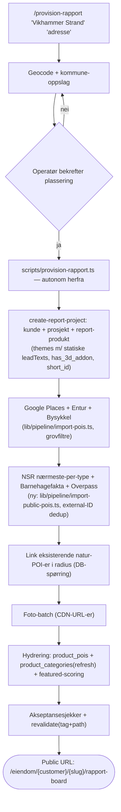

# feat: Basic-tier auto-provisjonering av rapport-board (adresse → public URL)

## Overview

Én kommando tar prosjektnavn + adresse (f.eks. «Vikhammer Strand» eller «Overvik»), bekrefter plasseringen interaktivt, og kjører deretter en **deterministisk TypeScript-pipeline** helt autonomt: POI-discovery fra alle kilder → kategorisering → statiske default-tekster per tema → hydrering → revalidering. Leveransen er en fungerende public URL til rapport-board-et på produksjon (`/eiendom/{customer}/{slug}/rapport-board`).

Modellen er «headless CMS + kommando»: Supabase er CMS-et, provisjoneringsskriptet er connectoren, slash-kommandoen er operatør-grensesnittet. Ingen ny web-UI.

Formål: en basic Placy-rapport som kan settes opp «på en-to-tre» som demo/utgangspunkt for ansvarlige meglere — klar for videre innsalg av reels-kuratering, voice-over m.m. (premium-laget). Strategisk er dette volum-motoren bak Propr-sporet (se `docs/strategy/`): basic-tier til ~null marginalkost, premium forblir 25–35k kuratert.

## Problem Frame

Wesseløkka beviste at rapport-board-et fungerer uten voice-over (empty-state sidebar med temakort, alle POI-er på kartet). Men oppsettet var håndarbeid: ad-hoc ingest-script, manuelt kuraterte tekster, grounding-kjøring. `generate-bolig`-kommandoen lager premium-kvalitet, men er token-kostbar, treg (WebSearch per POI, skolekrets-research, /generate-rapport) og varierende per kjøring. `lib/pipeline/*` (fra selvbetjent-flyten) er deterministisk, men lager bare Explorer-produkter.

Gapet: en deterministisk, gjenkjørbar pipeline som provisjonerer **rapport-board-prosjekter** uten kuratering — og som senere kan trigges fra web-skjema (modning mot 100 % autonom).

## Requirements Trace

- R1. Operatør oppgir prosjektnavn + adresse; plassering (geocode-resultat) bekreftes interaktivt **før** autonom kjøring starter.
- R2. Pipelinen henter ut flest mulig POI-er (Google Places + NSR-skoler + Barnehagefakta + Overpass-idrett + Entur + Bysykkel + eksisterende natur-POI-er) og kategoriserer dem i de 6 aktive bolig-temaene — ingen kuratering, kun mekaniske kvalitetsfiltre.
- R3. Hvert tema får en statisk default-tekst (lik for alle prosjekter) som vises i sidebar-temakortene — og som kan overskrives senere uten at en re-kjøring av pipelinen clobbrer overstyringen.
- R4. Leveransen er en public URL på produksjon som faktisk fungerer (verifisert: markører på kartet, temakort med antall + tekst, 3D-board).
- R5. Kjernen er et deterministisk skript uten LLM-kall — identisk resultat ved re-kjøring (idempotent), gjenbrukbar fra web-skjema senere.
- R6. Seriell kjøring — ingen tunge parallelle prosesser (maskin-hensyn).

## Scope Boundaries

- **Ingen** editorial hooks per POI (premium — `generate-bolig` Steg 7)
- **Ingen** rapport-tekster via `/generate-rapport` (heroIntro, bridgeTexts — premium)
- **Ingen** Gemini-grounding («Les mer»-laget — kan kjøres som separat opt-in etterpå via `scripts/gemini-grounding.ts`)
- **Ingen** hero-illustrasjon / custom prosjekt-assets (generiske tema-illustrasjoner i `public/illustrations/themes/` dekker alle 6 temaer via eksisterende fallback i `lib/themes/category-illustrations.ts`)
- **Ingen** voice-over/reels (det er nettopp innsalgs-objektet — empty-state posisjonerer det som «kommer»)
- **Ingen** skolekrets-research via WebSearch (premium-kvalitet) — basic bruker deterministisk nærmeste-per-type
- **Ingen** EN-oversettelser i basic (board faller tilbake til norsk)
- **Ingen** endringer i board-komponentene — basic-prosjekter rir på den eksisterende `hasVoiceOver=false`-empty-staten uendret

### Deferred to Separate Tasks

- **Web-skjema-trigger** (generation_requests → denne pipelinen): egen iterasjon når Propr-volumet krever selvbetjening — kjernen bygges nå slik at den kan kalles derfra
- **Premium-oppgraderingsløp** (grounding, kuraterte tekster, reels, VO oppå et basic-prosjekt): dokumenteres som oppskrift når første basic-prosjekt selges inn
- **EN-oversettelser for statiske tekster**: når et basic-prosjekt trenger engelsk

## Context & Research

### Relevant Code and Patterns

- `lib/pipeline/create-project.ts` — `createGeneratedProject()`: prosjekt + produkt-opprettelse fra selvbetjent-flyten (gjenbrukspunkt; lager i dag Explorer + UUID-prosjekt-id)
- `lib/pipeline/import-pois.ts` — gjenbrukbar Google/Entur/Bysykkel-discovery med grovfiltre, ekstrahert fra `app/api/admin/import/route.ts` — kan kalles fra CLI uten dev-server
- `lib/generators/poi-quality.ts` — LLM-frie grovfiltre (business_status, gangavstand per kategori, rating/reviews, navn-mismatch)
- `lib/utils/poi-score.ts` — scoring-formel for featured-utvelgelse (walkMin = meter/80)
- `lib/utils/slugify.ts` — kanonisk slugify (æ→ae FØR NFD) — ALDRI inline en ny
- `lib/themes/default-themes.ts` + `.claude/commands/generate-bolig.md` — de 6 aktive bolig-temaene med kanoniske ID-er (`hverdagsliv`, `barn-oppvekst`, `mat-drikke`, `natur-friluftsliv`, `transport`, `trening-aktivitet`; `opplevelser` deaktivert via `disabledThemes`)
- `components/variants/report/board/board-data.ts` — board leser `theme.leadText || theme.intro` som temakort-tekst (linje ~185); `grounding` er valgfri («Skipper hvis udefinert»)
- `components/variants/report/reels/DesktopStorySidebar.tsx` — `SidebarContentPreview`: empty-state temakort (label, antall, lead, illustrasjon) — bevist i prod for Wesseløkka
- `lib/themes/category-illustrations.ts` — `getCategoryIllustrationSrc()`: faller tilbake til `/illustrations/themes/{categoryId}.jpg` når `assets.customIllustrations` ikke er satt — alle 6 temaer dekket
- `app/eiendom/[customer]/[project]/rapport-board/page.tsx` — `getProductAsync(customer, slug, "report")` + cache-tag `product:${customer}_${slug}`, `revalidate: 3600`
- `.claude/commands/generate-adresse.md` — pipeline-konvensjoner: fail-soft-tabell, per-by radius, NSR/Barnehagefakta/Overpass-kall med gotchas
- `scripts/ingest-wesselslokka-pois.ts` — referanse for kuratert merge-ingest (dry-run default, backup-fil, navn-blokkliste)

### Institutional Learnings

- `docs/solutions/feature-implementations/auto-generer-pipeline-20260407.md` — `story_title` ligger på `products`, IKKE `projects`; `short_id` er NOT NULL; `discovery_circles`/`short_id` mangler i genererte TS-typer (cast nødvendig); filsystem-generatoren fungerer ikke på Vercel
- `docs/solutions/feature-implementations/selvbetjent-megler-pipeline-20260306.md` — slug-kollisjon via `crypto.randomUUID().slice(0,6)`; NFC (ikke NFD) for adresse-normalisering; sjekk `SUPABASE_SERVICE_ROLE_KEY` eksplisitt
- `docs/solutions/architecture-patterns/nextjs-revalidate-endpoint-supabase-rest-20260206.md` — Supabase REST-writes trigger ALDRI revalidering automatisk; eksplisitt revalidate-kall er siste pipeline-steg
- `docs/solutions/integration-issues/vercel-data-cache-stale-across-deployments-20260215.md` — `revalidatePath` alene utilstrekkelig på Vercel; bruk tag-basert (`product:{customer}_{slug}`); verifiser ALLTID mot prod, ikke bare lokalt
- `docs/solutions/feature-implementations/generate-bolig-infrastructure-20260227.md` — dedup for NSR/Barnehagefakta/OSM håndheves i DB via partial unique indexes på `nsr_id`/`barnehagefakta_id`/`osm_id`
- `docs/solutions/feature-implementations/poi-quality-pipeline-bolig-20260227.md` — de fire billige grovfiltrene er riktig kvalitetsgulv for basic-tier uten LLM-pass
- `docs/solutions/feature-implementations/generate-bolig-quality-pipeline-rewrite-20260228.md` — featured-flagg mistes hvis `product_pois` slettes etter markering (featured ETTER all filtrering); theme-translations har globale entity_ids (lekker på tvers av prosjekter — derfor ingen translations-writes i basic)
- `docs/solutions/feature-implementations/skolekrets-filtering-bolig-pipeline-20260228.md` — NSR gir 15–20 skoler i radius; uten filtrering er det en dokumentert demo-kvalitetsbrist → basic MÅ ha deterministisk cap
- `docs/solutions/api-integration/gemini-grounding-pattern-20260418.md` — gull-mønsteret for `products.config`-writes: whitelist → backup → match på tema-`id` → shallow-merge → PATCH med optimistisk lås (`updated_at=eq.{lest verdi}`) → deep-equal-sjekk
- `docs/solutions/database-issues/jsonb-merge-vs-overwrite-seed-scripts-20260413.md` — flat config-replace = stille datatap; alltid merge
- `docs/solutions/logic-errors/norwegian-slugify-nfd-ordering-20260206.md` — kanonisk slugify, ikke en sjette inline-variant
- `docs/solutions/logic-errors/empty-product-categories-explorer-zero-pois-20260205.md` — tom `product_categories` = «0 av 0 steder» på public side; eksplisitt skritt + akseptansesjekk
- `docs/solutions/ui-bugs/poi-ids-heterogeneous-not-uuid-20260428.md` — POI-id-er er heterogene strenger (`google-ChIJ…`, `bus-…`), aldri anta UUID-format
- `docs/solutions/best-practices/api-route-security-hardening-20260216.md` + `performance-issues/google-api-runtime-cost-leakage-20260215.md` — foto-URL-er resolves til langlivede `lh3.googleusercontent.com`-CDN-URL-er ved import-tid; API-nøkkel kun i header
- `docs/solutions/feature-implementations/idempotent-backfill-patterns-supabase-20260215.md` — mal for trygt gjenkjørbare skript

### External References

- Kartverket kommuneinfo API (`api.kartverket.no/kommuneinfo/v1/punkt?nord={lat}&ost={lng}&koordsys=4258`) — deterministisk lat/lng → kommunenummer for NSR-oppslag (erstatter WebSearch-steget i generate-bolig)

## Key Technical Decisions

- **Skript-kjerne + tynn kommando** (brukerbeslutning): deterministisk TypeScript i `lib/pipeline/` + CLI-entrypoint i `scripts/`; slash-kommandoen håndterer kun den interaktive plasserings-bekreftelsen og kjører skriptet. Gjenbrukbar fra web-skjema senere uten omskriving.
- **Statisk fast tekst per tema** (brukerbeslutning): samme default-tekst for alle prosjekter (f.eks. Mat & Drikke → «Restauranter, kaféer og spisesteder i nærområdet.»). Lagres som `leadText` i `reportConfig.themes[]` ved opprettelse.
- **Derived-signal-modellen er feature-gatingen — ingen nye flagg**: premium aktiveres ved å *legge til innhold*, ikke skru flagg. Reels-lyd → `hasVoiceOver` flipper board-et fra empty-state til spiller; `assets.customIllustrations` → custom bilder; `grounding` på tema → «Les mer». Basic = fravær av premium-data. (Verifisert i prod for Wesseløkka 2026-06-04.)
- **Defaults skriver aldri over eksisterende verdier**: re-kjøring av pipelinen setter `leadText` kun hvis feltet er tomt/fraværende (merge-semantikk per gull-mønsteret) — dette er det tekniske løftet bak «kan overskrives».
- **Container-ID `{customer}_{slug}`** (ikke UUID som i `create-project.ts`): matcher Wesseløkka (`broset-utvikling-as_wesselslokka`), revalidate-tag-konvensjonen og board-rutens oppslag.
- **Skoler: deterministisk nærmeste-per-type**: nærmeste barneskole + nærmeste ungdomsskole + nærmeste VGS (+ privatskoler ekskludert i basic) i stedet for WebSearch-skolekrets. Kjent kvalitetstap vs premium, dokumentert akseptert.
- **Kommunenummer via Kartverket punkt-oppslag**: deterministisk, dekker alle kommuner (Vikhammer = Malvik, ikke bare Trondheim/Oslo/Bergen-hardkodingen).
- **`has_3d_addon: true` som default**: 3D-board-et er demo-trekkplasteret; Google Tiles-kostnad aksepteres for demo-formål.
- **Foto-henting inkludert**: batch-fetch ved import-tid (CDN-URL-er) — kartet og temakortene er selve produktet i basic.
- **Ingen LLM-kall i kjernen**: CLAUDE.md-regel (build-time only) + determinisme-kravet (R5).

## Open Questions

### Resolved During Planning

- *Hvor skal pipeline-kjernen bo?* → Skript-kjerne i `lib/pipeline/` + tynn kommando (brukerens «headless CMS + kommando»-modell).
- *Hvordan lages default-tekstene?* → Statisk fast tekst per tema (brukervalg).
- *Trenger basic egne illustrasjoner?* → Nei — generisk fallback i `category-illustrations.ts` dekker alle 6 temaer allerede.
- *Hvordan håndteres skoler uten WebSearch?* → Deterministisk nærmeste-per-type med dokumentert kvalitetstap.
- *Kunde for demo-prosjekter?* → Valgfri `--customer`-arg; default demo-kunde (`placy-demo`) slik at URL-en alltid kan leveres.
- *Kommunenummer utenfor Trondheim/Oslo/Bergen?* → Kartverket kommuneinfo punkt-API.

### Deferred to Implementation

- **Prod-revalidering**: for *nye* prosjekter finnes ingen cache-entry (første request rendrer ferskt), så revalidering er trolig unødvendig ved førstegangs-provisjonering — men re-kjøringer trenger den. Om `/api/admin/revalidate` er tilgjengelig på prod (`ADMIN_ENABLED` på Vercel) avklares under implementering; fallback er tag-revalidering via en egen sikret rute eller å akseptere 3600s-vinduet for re-kjøringer.
- **Geocode-gjenbruk**: om `/api/geocode`-logikken ekstraheres til lib-funksjon eller om skriptet kaller Mapbox Geocoding direkte med token fra `.env.local`.
- **`story_title`-default**: eksakt formulering (f.eks. «Nabolaget rundt {prosjektnavn}») besluttes når man ser den i splash/metadata.
- **BoardHome district/city utenfor Trondheim**: hvordan `home.district`/`home.city` utledes når strøk-hierarkiet ikke er seedet (fallback til geocode-kontekst).

## High-Level Technical Design

> *Dette illustrerer tilnærmingen og er retningsgivende for review, ikke implementasjonsspesifikasjon.*

Alle steg kjører serielt (R6). Hvert steg er fail-soft etter samme tabell som `generate-adresse.md` — kun Google Places-feil stopper kjøringen.

## Implementation Units

### Fase 1 — Deterministisk pipeline-kjerne

- [ ] **Unit 1: Rapport-prosjektopprettelse med statiske tema-tekster**

**Goal:** En lib-funksjon som oppretter kunde (upsert), prosjekt og report-produkt med de 6 aktive bolig-temaene ferdig utfylt med statiske default-`leadText`-er — klar for board-rendering fra første sekund.

**Requirements:** R1, R3, R5

**Dependencies:** Ingen

**Files:**
- Create: `lib/pipeline/report-defaults.ts` (statiske tema-tekster + tema-definisjoner + per-by radius)
- Create: `lib/pipeline/create-report-project.ts`
- Test: `lib/pipeline/create-report-project.test.ts`

**Approach:**
- Speil `createGeneratedProject()` i `lib/pipeline/create-project.ts`, men: container-ID `{customer}_{slug}` (ikke UUID), `product_type: "report"`, `config.reportConfig.themes` fra `report-defaults.ts`, `story_title` på **produktet** (ikke prosjektet), `has_3d_addon: true`, `venue_context: "suburban"` default, `tags: ["Eiendom - Bolig"]`
- Geocode-helper (Mapbox) + Kartverket kommuneinfo punkt-oppslag returneres som eget steg slik at kommandoen kan vise plasseringen FØR resten kjører. **Geocode-logikken må kalles uten dev-server** (R5/Unit 5 dry-run): enten ekstraher kjernen fra `app/api/geocode/route.ts` til en lib-funksjon, eller kall Mapbox Geocoding direkte med token fra `.env.local`. Ikke kall `http://localhost:3000/api/geocode` fra skriptet — det ville bryte «kjører uten dev-server»-kontrakten
- Slug via kanonisk `lib/utils/slugify.ts`; kollisjon → suffix `crypto.randomUUID().slice(0,6)`
- Idempotens: finnes prosjektet allerede → returner eksisterende ID-er og **ikke** overskriv config-felt som er satt (merge-semantikk per gull-mønsteret fra `gemini-grounding-pattern`)

**Patterns to follow:**
- `lib/pipeline/create-project.ts` (short_id-generering, discovery_circles-cast, feltstruktur)
- `docs/solutions/api-integration/gemini-grounding-pattern-20260418.md` (config-merge med optimistisk lås)

**Test scenarios:**
- Happy path: navn «Vikhammer Strand» + gyldige koordinater → prosjekt-id `placy-demo_vikhammer-strand`, report-produkt med 6 temaer som alle har ikke-tom `leadText`
- Happy path: norske tegn i navn («Wesseløkka Vest») → slug `wesselokka-vest` (æ/ø/å-håndtering via kanonisk slugify)
- Edge case: prosjekt eksisterer fra før med kuratert `leadText` på ett tema → re-kjøring beholder den kuraterte teksten uendret, fyller kun tomme felt
- Edge case: slug-kollisjon med annet prosjekt hos samme kunde → suffikset slug, ikke overskriving
- Error path: manglende `SUPABASE_SERVICE_ROLE_KEY` → eksplisitt feilmelding før noen writes

**Verification:**
- `getProductAsync(customer, slug, "report")` returnerer produktet med 6 temaer og leadTexts; board-ruten gir ikke 404 lokalt

- [ ] **Unit 2: Offentlige POI-kilder som kode (NSR + Barnehagefakta + Overpass)**

**Goal:** Porter de Claude-utførte stegene 3b/3c/3d fra `generate-bolig.md` til deterministiske TypeScript-moduler — minus WebSearch-skolekretsen, pluss nærmeste-per-type skolefiltrering.

**Requirements:** R2, R5, R6

**Dependencies:** Unit 1 (prosjekt må finnes for linking)

**Files:**
- Create: `lib/pipeline/import-public-pois.ts`
- Test: `lib/pipeline/import-public-pois.test.ts`

**Approach:**
- NSR: hent alle skoler for kommunenummeret (fra Kartverket-oppslaget i Unit 1), filtrer på NaceKode1 (85.201/85.310/85.320) + avstand, velg deterministisk **nærmeste barneskole + nærmeste ungdomsskole + nærmeste VGS** — link kun disse
- Barnehagefakta: radius-søk, `bhf-{slug}`-fallback når id er null
- Overpass: bbox-søk på sports_centre/pitch/swimming_pool, kun navngitte, `out center` for ways, 1 retry med backoff ved 429/500
- Dedup via `nsr_id`/`barnehagefakta_id`/`osm_id` (partial unique indexes — DB håndhever)
- Seriell utførelse av de tre kildene; `AbortSignal.timeout(30000)` per kall; fail-soft (logg + fortsett) per kilde
- Kjente API-gotchas fra generate-bolig: NSR har ikke `ErAktiv`-felt; Barnehagefakta `koordinatLatLng[0]`=lat

**Test scenarios:**
- Happy path: mocket NSR-respons med 18 skoler → eksakt 3 linkes (nærmeste per type), resten lagres ikke i `project_pois`
- Happy path: mocket Barnehagefakta med null-id → POI får `bhf-{slugifisert-navn}` og lagres
- Edge case: to barneskoler på identisk avstand → deterministisk tie-break (f.eks. alfabetisk) så re-kjøring gir samme resultat
- Edge case: Overpass-way uten navn → hoppes over
- Error path: NSR-timeout → advarsel logges, pipeline fortsetter med 0 skoler (fail-soft)
- Integration: re-kjøring mot samme prosjekt → ingen duplikat-POI-er (external-ID dedup), `project_pois` uendret antall

**Verification:**
- Mot et ekte koordinatpunkt: skoler/barnehager/idrett dukker opp i `project_pois` med riktige `source`-verdier og uten duplikater ved andre gangs kjøring

- [ ] **Unit 3: Google-discovery, foto og natur-link i kjernen**

**Goal:** Komplett POI-bestand: Google Places (med grovfiltre) + Entur + Bysykkel via eksisterende `lib/pipeline/import-pois.ts`, foto-batch til CDN-URL-er, og linking av eksisterende natur-POI-er i radius.

**Requirements:** R2, R5, R6

**Dependencies:** Unit 1

**Files:**
- Modify: `lib/pipeline/import-pois.ts` (kun hvis report-flyten trenger parametre som mangler — f.eks. kategori-liste/radius-overstyring)
- Create: `lib/pipeline/enrich-report-pois.ts` (foto-batch + natur-link)
- Test: `lib/pipeline/enrich-report-pois.test.ts`

**Approach:**
- Google-kategoriliste = boligprofilen fra `generate-bolig.md` (14 kategorier), `minRating: 0`, `maxResultsPerCategory: 20`, per-by radius fra `report-defaults.ts`
- Foto: gjenbruk logikken bak `app/api/admin/fetch-photos/route.ts` — **ekstraher kjernen til en lib-funksjon** så hele pipelinen kjører uten dev-server (samme kontrakt som geocode i Unit 1; `import-pois.ts` kaller alt POI-discovery direkte via `lib/generators/poi-discovery`, så foto er den siste route-avhengigheten å fjerne). Resolve til langlivede `lh3.googleusercontent.com`-URL-er ved import-tid, aldri proxy-URL-er
- Natur-link: spørr `pois` etter `category_id in (lekeplass,badeplass,park,outdoor)` innen radius → link via `project_pois` (ingen WebSearch-berikelse i basic)
- Grovfiltrene i `poi-quality.ts` kjører som i dag via import-flyten — ingen LLM-pass

**Test scenarios:**
- Happy path: mocket discovery-resultat → POI-er upsertes med editorial-preservation (eksisterende hooks røres ikke)
- Edge case: eksisterende natur-POI akkurat på radius-grensen → inkludert ved ≤, ekskludert ved >
- Error path: foto-batch feiler for én POI → de andre fortsetter, POI-en faller tilbake til kategorifarge
- Integration: full kjøring mot testprosjekt → `pois` har `photo_reference`/CDN-URL satt for kommersielle POI-er

**Verification:**
- Suburban testpunkt gir 15–40 kommersielle POI-er (normalområdet); under 10 → advarsel logges men kjøringen fullfører

- [ ] **Unit 4: Report-hydrering — product_pois, product_categories, featured**

**Goal:** Koble hele POI-bestanden til report-produktet, refreshe `product_categories`, og markere featured via scoring — i riktig rekkefølge slik at featured aldri mistes.

**Requirements:** R2, R4, R5

**Dependencies:** Unit 2, Unit 3 (full POI-bestand må foreligge)

**Files:**
- Create: `lib/pipeline/hydrate-report.ts`
- Test: `lib/pipeline/hydrate-report.test.ts`

**Approach:**
- Link alle `project_pois` → `product_pois` (merge-duplicates)
- `product_categories`: slett + re-insert med display_order fra tema-rekkefølgen (kjent gotcha: tom tabell = «0 av 0 steder» på public side)
- Featured: score via `lib/utils/poi-score.ts` (institusjonelle POI-er får default rating 4.0/10 reviews for formelen), topp 3 per kategori innen 1500 m — settes SIST, etter all linking
- POI-id-er behandles som heterogene strenger (aldri UUID-validering)

**Test scenarios:**
- Happy path: 60 POI-er over 6 temaer → `product_categories` har alle kategorier med display_order, featured 15–40
- Edge case: tema uten POI-er (f.eks. ingen idrett i området) → temaet rendres IKKE som temakort. `board-data.ts:128` filtrerer bort temaer med `allPOIs.length === 0` (`report.themes.filter((t) => t.allPOIs.length > 0)`), så et tomt tema forsvinner stille — det vises ikke et «0 steder»-kort. Basic-tier bør derfor sikre ≥1 POI per aktivt tema (transport/natur er nesten alltid dekket via Entur/Bysykkel/natur-link), eller akseptere at boardet viser <6 kort
- Edge case: POI med id `bus-dronningens-gate` (ikke-UUID) → scores og linkes uten valideringsfeil
- Integration: re-kjøring → featured-flagg og antall identisk (idempotent)

**Verification:**
- `product_categories` ikke-tom; board viser markører og temakort med riktige antall lokalt
- Antall synlige temakort = antall temaer med ≥1 POI (ikke nødvendigvis 6) — bevisst sjekket mot `board-data.ts`-filteret

### Fase 2 — Operatør-grensesnitt og leveranse

- [ ] **Unit 5: CLI-entrypoint med akseptansesjekker og revalidering**

**Goal:** Ett skript som kjører hele kjeden serielt og avslutter med en maskinell akseptansesjekk + public URL — pipelinens «kontrakt».

**Requirements:** R1, R4, R5, R6

**Dependencies:** Unit 1–4

**Files:**
- Create: `scripts/provision-rapport.ts`
- Modify: `package.json` (npm-script `provision:rapport`)
- Test: `scripts/__tests__/provision-rapport.test.ts` (argument-parsing + sjekk-logikk; pipeline-stegene mockes)

**Approach:**
- Args: `--name`, `--address`, valgfritt `--customer` (default demo-kunde), `--dry-run` (geocode + plan uten writes), `--confirm-coords lat,lng` (slik at kommandoen i Unit 6 kan sende bekreftede koordinater og hoppe over ny geocoding)
- Kjører Unit 1→4 serielt med stegvis logging (kilde, antall, filtrert)
- Akseptansesjekker til slutt: `product_categories` ikke-tom; alle 6 temaer til stede i config med leadText; ≥1 POI i minst 4 av 6 temaer (advarsel ellers); foto-dekning rapportert
- Revalidering: `revalidateTag`-ekvivalent mot prod hvis tilgjengelig (se åpent spørsmål), ellers logg at nytt prosjekt rendrer ferskt ved første request
- Output: lokal URL + prod-URL + oppsummeringstabell (à la generate-adresse Steg 12)
- Dry-run er default-sikkerheten ved re-kjøring mot eksisterende prosjekt: skriptet oppdager eksisterende prosjekt og krever `--update` for å fortsette

**Execution note:** Skriv akseptansesjekkene først (de er pipelinens kontrakt), så stegene som oppfyller dem.

**Test scenarios:**
- Happy path: gyldige args → exit 0, URL skrevet ut, alle sjekker grønne
- Edge case: `--dry-run` → ingen Supabase-writes (verifiser via mock), plan skrives ut
- Edge case: eksisterende prosjekt uten `--update` → avbryter med beskjed, ingen writes
- Error path: geocode gir relevance < 0.5 → exit ≠ 0 med tydelig feilmelding før noen writes
- Error path: Google Places-import feiler → exit ≠ 0, prosjektet beholdes for debugging (fail-soft-tabellen), tydelig statusmelding

**Verification:**
- `npm run provision:rapport -- --name "X" --address "Y" --dry-run` kjører uten dev-server og uten writes; full kjøring produserer fungerende lokal URL

- [ ] **Unit 6: Slash-kommando — interaktiv plasserings-bekreftelse + autonom kjøring**

**Goal:** Operatør-grensesnittet: `/provision-rapport "Vikhammer Strand" "adresse"` → vis geocode-resultat på kart-koordinater → bekreft → kjør skriptet → verifiser prod-URL → lever.

**Requirements:** R1, R4

**Dependencies:** Unit 5

**Files:**
- Create: `.claude/commands/provision-rapport.md` (gitignored som de andre kommandoene — lokal operatør-fil)

**Approach:**
- Steg 1: kjør skriptet med `--dry-run` → vis sted, kommune, koordinater, radius — spør operatøren om bekreftelse (eneste interaktive punkt, R1)
- Steg 2: kjør full pipeline med bekreftede koordinater (`--confirm-coords`)
- Steg 3: verifiser prod-URL (HTTP 200 + Chrome-screenshot av board-et: temakort, markører) — CLAUDE.md-regelen «verifiser at det FUNGERER»
- Steg 4: lever public URL + oppsummering; minn om premium-oppgraderingsstien (grounding/reels/VO)
- Kort fil — all logikk bor i skriptet; kommandoen er bare sekvensering + verifisering

**Test scenarios:**
- Test expectation: none — spec-dokument for operatør-flyt; verifiseres i Unit 7s ende-til-ende-kjøring

**Verification:**
- En full kommando-kjøring fra navn+adresse til levert prod-URL uten andre interaksjoner enn plasserings-bekreftelsen

- [ ] **Unit 7: Ende-til-ende-verifisering med første ekte case**

**Goal:** Provisjonér «Vikhammer Strand» (Malvik — tester også utenfor-Trondheim-løypa: kommune-oppslag, strøk-fallback) og verifiser leveransen live på produksjon.

**Requirements:** R2, R3, R4, R6

**Dependencies:** Unit 6

**Files:**
- Modify: `PROJECT-LOG.md` (worklog-entry med resultat og ev. avvik)

**Approach:**
- Kjør `/provision-rapport "Vikhammer Strand" "{adresse}"` ende-til-ende
- Verifiser på prod i Chrome: empty-state sidebar (temakort med statiske tekster + generiske illustrasjoner + POI-antall), kartmarkører, 3D-board, ingen konsollfeil, ingen 404-er på assets
- Sammenlign mot Wesseløkka som referanse for empty-state-oppførselen
- Dokumentér POI-tall per kilde og total kjøretid (datapunkt for Propr-volum-regnestykket)

**Test scenarios:**
- Integration (manuell, mot prod): alle akseptansekriteriene under «Verification» — dette ER testen for hele kjeden

**Verification:**
- Public URL deles uendret med en megler: board laster, kartet er befolket, temakortene har antall + tekst, voice-over-laget framstår som «kommer»
- Re-kjøring av samme kommando endrer ingenting (idempotens-bevis i praksis)

## System-Wide Impact

- **Interaction graph:** Ingen endringer i board-komponentene — basic-prosjekter bruker eksisterende `hasVoiceOver=false`-løype (`SidebarContentPreview`, alle-POI-er-overview i `BoardMap3D`). Pipeline-writes berører `customers`, `projects`, `products`, `pois`, `project_pois`, `product_pois`, `product_categories`.
- **Error propagation:** Fail-soft per POI-kilde (logg + fortsett); kun Google Places-feil stopper kjøringen. Halvferdige prosjekter slettes aldri (debug-prinsippet fra generate-adresse).
- **State lifecycle risks:** `pois`-tabellen deles på tvers av prosjekter — pipelinen sletter ALDRI derfra, kun koblingsrader. Config-writes følger merge-mønsteret med optimistisk lås. Featured settes sist.
- **API surface parity:** Kjernen eksponeres som lib-funksjoner slik at web-skjema-flyten (generation_requests) kan kalle samme kode senere uten endring.
- **Integration coverage:** Unit 7 er den ekte integrasjonstesten — mot prod-Supabase og prod-Vercel, ikke mocks.
- **Unchanged invariants:** StasjonsKvartalet og Wesseløkka påvirkes ikke (ingen komponent- eller dataendringer for eksisterende prosjekter). `generate-bolig`/`generate-rapport`-premium-løpet består uendret — basic er et nytt, parallelt løp, ikke en erstatning.

## Risks & Dependencies

| Risk | Mitigation |
|------|------------|
| Suburban områder gir for få POI-er til et troverdig kart | Advarsel ved <10 kommersielle POI-er; per-by radius (2500 m default) er kalibrert fra Brøset/Wesseløkka; natur-link supplerer |
| Vercel Data Cache serverer stale data etter re-kjøringer | Tag-basert revalidering; nye prosjekter rendrer uansett ferskt; alltid verifisere mot prod (Unit 7) |
| Google Places-kostnad per provisjonering | Bounded: 14 kategorier × 20 resultater, foto-batch én gang ved import; ingen runtime-kall |
| NSR nærmeste-per-type velger feil skole (krets ≠ nærhet) | Dokumentert kvalitetstap i basic; premium-løpet (WebSearch-skolekrets) er oppgraderingsstien; megler kan be om korreksjon |
| Overpass rate-limiting | 1 retry med backoff; fail-soft (idrett er ikke kritisk) |
| Re-kjøring clobbrer kuraterte overstyringer | Merge-semantikk «fyll kun tomme felt» + `--update`-guard + test-scenario i Unit 1 |
| Strøk-hierarkiet finnes ikke utenfor Trondheim | City-fallback (eksisterende mønster); Vikhammer-casen i Unit 7 verifiserer løypa |

## Documentation / Operational Notes

- Unit 7 logger worklog-entry i `PROJECT-LOG.md` med kjøretid + POI-tall (datapunkt for Propr-regnestykket)
- Premium-oppgraderingsoppskriften (grounding → kuraterte tekster → reels/VO oppå basic-prosjekt) dokumenteres som egen oppgave når første innsalg skjer (se Deferred)
- Kjente skjema-gotchas (story_title på products, short_id NOT NULL, TS-type-hull) er innbakt i Unit 1-approach

## Sources & References

- Origin: brukerdialog 2026-06-05 (ingen requirements-doc — planlagt direkte fra beskrivelse + to avklarte brukerbeslutninger)
- Related code: `lib/pipeline/`, `.claude/commands/generate-bolig.md`, `.claude/commands/generate-adresse.md`, `components/variants/report/reels/`, `lib/themes/category-illustrations.ts`
- Strategisk kontekst: `docs/strategy/LOG.md` (Propr-distribusjonspilot, auto-tier som volum-motor), `docs/brainstorms/2026-04-30-propr-distribusjons-pilot-brainstorm.md`
- Referanse-prosjekt: Wesseløkka (`broset-utvikling-as_wesselslokka`) — MVP-beviset for empty-state-board i prod
