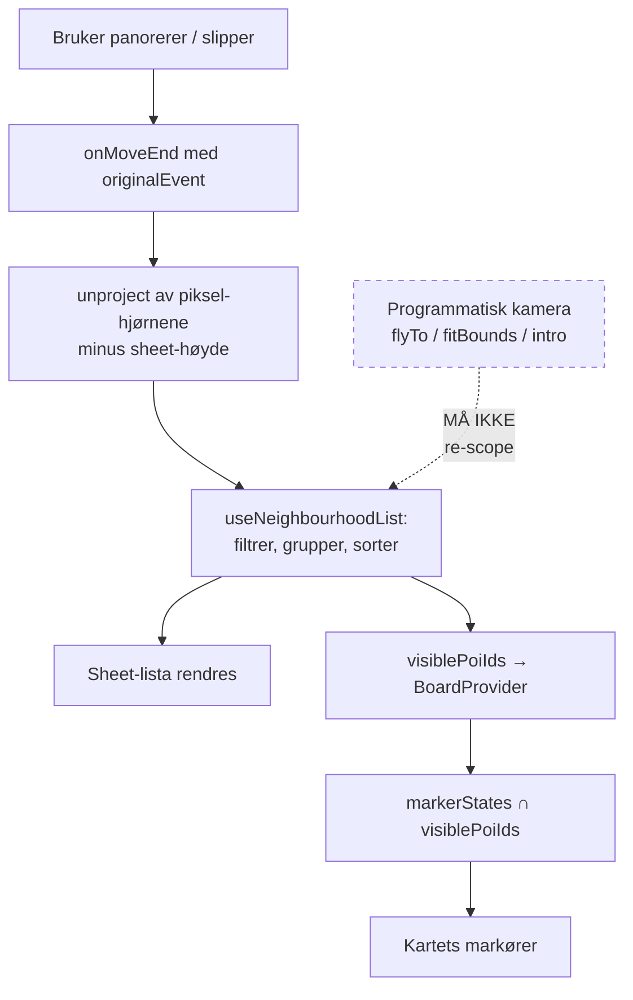
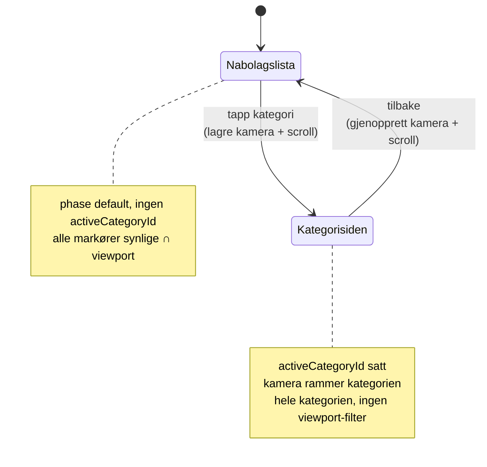

# feat: Mobil nabolagsflate — kart + dragbar liste for boards uten VO

## Overview

Fire av seks rapport-boards har ingen spillbar voice-over, og får derfor ingen
innholdsflate på mobil i det hele tatt — bare et fullskjerm kart etter splash.
Denne planen bygger flaten: kart øverst, fritt dragbar sheet nederst, en liste
som følger kartutsnittet, og en kategoriside som pushes over samme kartinstans.

Arbeidet er delt i to faser. **Fase 1 (Unit 1–4) leverer en testbar prototype**
på `ferjemannsveien-10` — dra, kobling, push/tilbake, ekte gangtider. Den finnes
for å svare på ett spørsmål: føles Citymapper-koblingen riktig for en
nabolagsrapport? **Fase 2 (Unit 5–8)** fullfører flaten når svaret er ja.

Ni units, ikke åtte: Unit 3 er delt i skall og innhold fordi drag-motoren og
listeinnholdet feiler på helt ulike måter og ikke bør dele én avkrysningsboks.

## Problem Frame

`components/variants/report/reels/ReportReelsPage.tsx` gater historie-flaten på
`mapIsSurface = state.mapOpen || !hasAudioMobile`. Uten lyd er kartet permanent
primærflate, og innholdstreet monteres aldri. `2026-06-16`-planen lovet en
no-audio-fallback (R17 der) som aldri ble bygget.

Konsekvensen er konkret: Wesselsløkka har kuratert tekst på 6 av 7 temaer som
rendres på desktop og er uoppnåelig på mobil. Se origin-dokumentet for full
problemramme og board-tabell.

## Requirements Trace

Kravnumrene refererer origin-dokumentet
(`docs/brainstorms/2026-08-03-mobil-nabolagsflate-requirements.md`). Fire krav
deles mellom to units — de er markert med hvilken del hver unit eier.

| Unit | Fase | Krav |
|---|---|---|
| 1 — Kamera-løkken | 1 | R9 *(2D)*, R12, R20 |
| 2 — Nabolagsmodellen | 1 | R6, R10, R11, R13 *(lista)*, R14, R26 *(rad-rendring)* |
| 3a — Sheet-skallet | 1 | R1, R3, R5 *(2D)* |
| 3b — Nabolagslista | 1 | R28 |
| 4 — Kategorisiden | 1 | R2, R15, R16, R18, R27 |
| 5 — Boliglås og ramme | 2 | R4, R7, R8, R23, R24, R25 |
| 6 — Punkt-rad | 2 | R19, R21, R22 |
| 7 — Kuratert vs. generert | 2 | R13 *(prosa)*, R17, R26 *(full)* |
| 8 — 3D-paritet | 2 | R5 *(3D)*, R9 *(3D)* |

Alle 28 krav er dekket. De delte er R5 (Unit 3 måler sheet-høyden og setter
padding i 2D; Unit 8 gjør det samme for 3D, som ikke har mekanismen i dag),
R9 (Unit 1 leser Mapbox-bounds; Unit 8 definerer utsnitt for tiltet 3D-kamera),
R13 (Unit 2 sikrer at lista kun bruker precomputede tall; Unit 7 fjerner
haversine-estimatet fra generert prosa) og R26 (Unit 2 bygger rad-rendringen
uten minutt-tall; Unit 7 dekker den med syntetisk test).

## Scope Boundaries

- Boards **med** spillbar VO (`byggetrinn-4`, `stasjonskvartalet`) beholder
  dagens to-flate-modell uendret. Ingen filer de eier røres.
- Desktop (`DesktopStorySidebar`, `BoardPOIMiniPopup`s popup-bruk) er uendret i
  oppførsel. Unit 6 trekker ut innhold fra popupen, men popupen skal rendre
  identisk etterpå.
- Ingen ny kuratering, ingen nye POI-er, ingen pipeline-endring.
- Ingen søke- eller filterfelt.

### Deferred to Separate Tasks

- Samling av VO-flaten, event-sheeten og nabolagsflaten på én mobil-modell.
  Tas opp når denne er validert på enhet (se origin).
- Tidsbudsjett (5/10/15 min) som eksplisitt kontroll.
- Full ikke-gestuell vei gjennom flaten. Unit 5 gir en tastaturnåbar reset, ikke
  fri utforsking.

## Context & Research

### Relevant Code and Patterns

**Sømmen finnes allerede — vi bygger mindre enn det ser ut.**

- `components/variants/report/board/board-state.tsx` — `BoardProvider` tar
  allerede `visiblePoiIds?: Set<string>`, event-boardets markørfilter. Det er
  kroken viewport-scopingen skal bruke.
- `components/variants/report/board/BoardMap.tsx`
  - `markerStates` (≈l. 224): `phase === "default" && !activeCategory` viser
    ALLE POI-er på tvers av kategorier. Så lenge nabolagslista aldri setter
    `activeCategoryId`, er R20 løst uten ny board-action.
  - `intersectVisible(baseVisible, visiblePoiIds)` (≈l. 239) — viewport-settet
    intersekteres rett inn i markør-synligheten.
  - `setPadding`-effekten (≈l. 277) leser `mapPaddingBottom`-propen. Propen
    virker, men **ingen rapport-forelder sender den i dag** — `EventMobileSheet`
    er eneste kaller, og begge rapport-mountene utelater den. Kommentaren
    refererer en `BoardMobileSheet` som ikke finnes.
  - `fitToVisiblePois` (≈l. 310) med `computeFitBounds` — fit-rutinen finnes,
    men kalles kun fra tour-fit, filter-fit og `eventMode`-ro-fit.
- `components/variants/report/board/board-camera-fit.ts` — `shouldFitToProgram`
  er gaten for ro-fitten.
- `components/variants/report/board/board-data.ts`
  - `BoardPOI` bærer `raw: POI`, så `raw.travelTime?.walk` er tilgjengelig.
  - `adaptCategory` (≈l. 313–344): `editorial` = kuratert, ellers syntetiseres
    `detail = { body, highlights, generated: true }`. **Skillet går på
    `generated`, ikke på om objektet finnes.**
- `components/variants/report/board/event/EventMobileSheet.tsx` — eneste
  eksisterende bottom-sheet. Tre høyder (32/62/92 %), tapp-syklus, ingen drag.
  Hardkoder `mapPaddingBottom` mot en antatt 700 px viewport.
- `components/variants/report/board/BoardPOIMiniPopup.tsx` — *er* en
  `react-map-gl/mapbox`-`<Popup>`. Innholdet må trekkes ut for gjenbruk.
- `lib/hooks/useRealtimeData.ts` + `components/variants/report/blocks/POIRealtimeSection.tsx`
  — direkte gjenbrukbare.

### Institutional Learnings

> **Advarsel: flere løsningsdokumenter refererer slettet kode.** Verifisert
> 2026-08-03: `lib/map/map-adapter.ts`, `lib/map/use-interaction-controller.ts`,
> `UnifiedMapModal`, `ExplorerBottomSheet` og `diversifiedSelection()` finnes
> **ikke** i repoet — de forsvant i cutoveren 2026-07-06. `vaul` står i
> `package.json` men importeres ingen steder. `components/ui/` har en
> `Modal.tsx` (portal + backdrop + escape) som kan gjenbrukes for
> overlay-mekanikk, men ingen drag-sheet eller drawer — drag-laget er nybygg.
> Bygg ikke på de slettede symbolene. Mønstrene i de dokumentene er fortsatt
> gyldige som *mønstre*; koden er borte.

**Direkte anvendbare:**

- `docs/solutions/logic-errors/report-poi-sorting-clustered-first-load-20260304.md`
  — rå avstandssortering ga «3 bysykler på rad» i første batch. Løst med
  round-robin-diversifisering på sub-kategori. **Gjelder Unit 2:** de tre
  punktene på et kategorikort må diversifiseres. Funksjonen er slettet —
  mønsteret reimplementeres.
- `docs/solutions/ui-bugs/useeffect-object-dependency-infinite-loop-20260410.md`
  — objekt i `useEffect`-dep-array ga uendelig løkke. Regelen i repoet:
  primitiver i dep-arrays, objektet i en `useRef` satt hver render. **Et
  bounds-objekt har nøyaktig den formen** — gjelder Unit 1 og Unit 3.
- `docs/solutions/ui-bugs/adaptive-markers-zoom-state-timing-bug-20260208.md`
  — `mapRef` som dep re-fyrer aldri; effekten kjører én gang ved mount mens
  `mapRef.current` er null. Mønsteret er `mapLoaded`-state flippet i `onLoad`
  og brukt som dep. `BoardMap` gjør allerede dette — viewport-hooken må også.
- `docs/solutions/ux-improvements/poi-click-no-camera-move-20260207.md` —
  etablert konvensjon: **klikk på kart-markør skal IKKE flytte kameraet; klikk
  på liste-rad kan.** Gjelder Unit 6 direkte, og bekrefter R19/R21-splittet.
- `docs/solutions/ui-patterns/unified-poi-carousel-report-20260420.md` —
  iOS-felle for et scrollbart sheet-innhold: bruk `overscroll-x-contain`,
  **aldri `touch-none`** på en scroll-container (Safari kansellerer touchen).
  Også a11y-kontrakten repoet bruker for POI-lister.
- `docs/solutions/performance-issues/webgl-context-leak-per-render-probe-20260603.md`
  — en per-render WebGL-probe lekket kontekster og krasjet kartet. **En dragbar
  sheet re-rendrer i gest-frekvens** — ingenting på kart-stien får kjøre per
  render. Verifiser i nystartet Chrome; GPU-prosessen cacher kontekster.
- `docs/solutions/ui-patterns/apple-style-slide-up-modal-with-backdrop-blur-20260415.md`
  — namespace `@keyframes` (duplikatnavn har stille overstyrt animasjoner to
  ganger her), animer kun `transform`/`opacity`, Apple-easing
  `cubic-bezier(0.32, 0.72, 0, 1)`.
- `docs/solutions/feature-implementations/placy-basic-tier-drill-in-20260608.md`
  — nærmeste strukturelle presedens for Unit 4: kategori-drill-in ble bygget
  **uten ny board-state**, ridende på `activeCategoryId`, med bytte av kun
  scroll-regionen inni et fast skjelett. Merk: dokumentet antyder at
  `RESET_TO_DEFAULT` og `BACK_TO_DEFAULT` er samme sak. Det stemmer ikke —
  begge lever i `board-state.tsx` med ulik semantikk (`BACK_TO_DEFAULT` beholder
  `activeCategoryId`, `RESET_TO_DEFAULT` nullstiller alt). Verifisert.
- `docs/solutions/architecture-patterns/mobile-two-surface-reels-model-20260616.md`
  — VO-modellen denne flaten lever ved siden av, og den nærmeste motforestillingen
  mot fri drag: forrige mobil-sheet hadde fire snap-states og ble revet ut fordi
  mellomtilstandene var udefinerte og affordansene koblet til *beat-type* i
  stedet for *flate*. Denne flaten har ingen beats, og R3 definerer eksplisitt
  hva lav hvileposisjon viser — men lærdommen er hvorfor det kravet finnes.

**Gjelder Unit 8 (Google 3D):**

- `docs/solutions/feature-implementations/google-maps-3d-camera-control-iteration-20260415.md`
  — ikke kjemp mot Googles gest-pipeline fra JS (fire mislykkede forsøk, alle
  hakkete); styr deklarativt via `bounds`/`minTilt`/`maxAltitude`. Og
  `map3d.center` er en `LatLngAltitude` der `lat`/`lng` er prototype-gettere —
  **spredning gir `{JB, KB, IB}` og kaster `InvalidValueError`.** Kopier felt
  eksplisitt.
- `docs/solutions/feature-implementations/google-maps-3d-svg-label-marker-og-bounds-semantikk-20260415.md`
  — `Map3D.bounds` er alltid et rektangel (`squareBoundsAround`, `panHalfSideKm`)
  med obligatorisk `cos(lat)`-korreksjon (~0,454 på 63°N). Det er
  senter-pluss-radius-modellen Unit 8 skal bruke, ikke en frustum-projeksjon.
- `docs/solutions/ui-bugs/google-maps-3d-webgl-context-crash-touch-devices-20260415.md`
  — iOS WebKit tåler én WebGL-kontekst. Aldri to instanser. `pointer-events-none`
  på en ikke-interaktiv kart-wrapper spiser tappene.

**Gjelder ved bygg:**

- `docs/solutions/build-errors/turbopack-drops-named-chunks-and-app-build-manifest-20260803.md`
  — `webpackChunkName` er inert. Legger flaten inn en `dynamic()`-grense vi vil
  bevise er utenfor initial load, må det inn en kode-markør i
  `scripts/verify-board-bundle.mjs` — et chunk-navn beviser ingenting.

## Key Technical Decisions

- **Viewport-scoping mates gjennom `visiblePoiIds`, ikke et nytt system.**
  Sømmen eksisterer og er allerede koblet til markør-synligheten.
- **Men filter-fitten må gates først.** `BoardMap.tsx` ≈l. 352 refitter kameraet
  hver gang `visibleIdsKey` endres, og den er *ikke* gated på `eventMode`. Mates
  viewport-avledede IDer inn: panorer → nye IDer → refit → nye bounds → nye IDer.
  Uendelig løkke. Unit 1 må lukke dette før noe annet fungerer.
- **Ingen ny board-action for punkt-fokus (R20).** Nabolagslista holder
  `phase: "default"` uten `activeCategoryId`, som allerede gir alle markører.
  Kategorisiden setter kategori som før.
- **Kategorisiden deler kartinstans (R2).** `gmp-map-3d` kan aldri unmountes.
  Push-en er en innholdsflate; kartet bytter kun kamera-ramme.
- **Fase 1 valideres på `ferjemannsveien-10`, ikke Wesselsløkka.** Dette er en
  korreksjon fra første planutkast. `has_3d_addon` er `true` for `wesselslokka`,
  `teknostallen`, `stasjonskvartalet` og `byggetrinn-4` (verifisert mot v2).
  `BoardMap.tsx:118` initialiserer `view` til `"3d"` når addon finnes, og
  `showMapbox = !has3dAddon || view === "2d"` (l. 203) betyr at Mapbox-instansen
  **aldri monteres** på de boardene ved ankomst. Hele Fase 1-mekanikken lever på
  den instansen. Tvinger man 2D via toggelen, monteres Mapbox som overlay over
  den fortsatt monterte 3D-basen — to WebGL-kontekster samtidig, som iOS WebKit
  ikke tåler.
  De to VO-løse boardene uten 3D er `ferjemannsveien-10` (5 temaer, 284 POI-er)
  og `cutover-pilot` (6 temaer, 206 POI-er). Begge er ren Mapbox. Fase 1 bruker
  `ferjemannsveien-10` som primær og `cutover-pilot` som kontroll.
  **Wesselsløkka blir først et gyldig mål etter Unit 8.** Det er en reell kostnad
  — boardet med den kuraterte teksten er hele motivasjonen — men Fase 1 tester
  mekanikken, ikke innholdet, og kategorisiden viser uansett en gangtidsstige
  før Unit 7.

## Open Questions

### Resolved During Planning

- *Hvordan leser vi kartutsnittet?* Mapbox `onMoveEnd` → `getBounds()` i Fase 1.
  3D utsettes til Unit 8, der utsnittet defineres som kamerasenter + radius
  avledet av `range` — ikke en frustum-projeksjon.
- *Trenger vi en ny board-action for R20?* Nei. `markerStates` gir alle POI-er
  når `activeCategoryId` er null.
- *Hvordan blir «~10 minutters gange» en kamera-ramme?* Bounds over POI-ene med
  `travelTime.walk <= 10`, via eksisterende `computeFitBounds`.
- *Bolig-lås: clamp eller korrigerende reframe?* Korrigerende reframe etter
  gest-slipp — mindre kamp mot fingeren. Avgjøres endelig på enhet.

### Deferred to Implementation

- Konkrete hvileposisjoner for sheeten. Startpunkt ~30 % / ~85 %, justeres på
  enhet. Tallene er en følelse, ikke en beregning.
- Hvor mye bottom-padding som føles riktig (R5). Start med full sheet-høyde.
- Om `BoardMap3D`s eksisterende pointerdown/touchstart-lytter kommer i veien for
  sheet-draget. Oppdages først når Unit 8 kjører.
- Nøyaktig terskel for round-robin-diversifiseringen i Unit 2 — hvor mange av de
  tre radene som skal tvinges til ulik sub-kategori.
- Om flaten beholder Mapbox' default `dragRotate`. Med bearing ≠ 0 gir
  `getBounds()` den akse-justerte konvolutten av et rotert viewport og
  over-selekterer. Enten slå av rotasjon, eller dokumenter toleransen slik
  Unit 8 gjør for 3D-radiusen. Avgjøres i Unit 1.
- Om Wesselsløkka til slutt skal kunne kjøre flaten i tvunget 2D (som ville
  krevd at den persistente 3D-basen ikke monteres for denne flaten), eller om
  Unit 8 er den eneste veien dit. Avgjøres når Unit 8 planlegges — Fase 1
  trenger ikke svaret.

## High-Level Technical Design

> *Dette illustrerer den tiltenkte tilnærmingen og er retningsgivende for
> gjennomgang, ikke implementasjonsspesifikasjon. Den implementerende agenten
> skal behandle det som kontekst, ikke kode å reprodusere.*

Dataflyten i Fase 1 — merk at pilen fra kamera tilbake til `visiblePoiIds`
er den som må brytes ved programmatiske bevegelser:

Navigasjonsstakken er to tilstander over én kartinstans:

## Implementation Units

### Fase 1 — føletesten

- [x] **Unit 1: Bryt kamera-løkken og åpne viewport-avlesning**

**Goal:** Gjøre det trygt å mate viewport-avledede IDer inn i `visiblePoiIds`,
og eksponere kartets utsnitt for konsumenter.

**Requirements:** R9 *(2D-delen — 3D-utsnitt dekkes av Unit 8)*, R12, R20

**Dependencies:** Ingen — dette er første stein.

**Files:**
- Modify: `components/variants/report/board/BoardMap.tsx`
- Modify: `components/variants/report/board/board-camera-fit.ts`
- Modify: `components/variants/report/board/board-state.tsx`
- Modify: `components/variants/report/reels/ReportReelsPage.tsx`
- Test: `components/variants/report/board/board-camera-fit.test.ts`
- Test: `components/variants/report/board/BoardMap.test.tsx`

**Approach:**
- **Først: fiks testriggen.** `BoardMap.test.tsx` mocker `react-map-gl/mapbox`
  med en bar `forwardRef`-div som aldri kaller `props.onLoad` og ikke eksponerer
  `getMap()`. `mapLoaded` blir derfor aldri true, og `fitToVisiblePois`
  early-returner på l. 311. Uten en oppgradert mock — ref med `getMap()` som gir
  spies for `fitBounds`, `setPadding`, `getBounds`, `unproject`, `on`, `off`, og
  et `onLoad`-kall som flipper `mapLoaded` — passerer feedback-loop-testen på dag
  én uten fiksen, og Kulturnatt-regresjonstesten kan aldri bli grønn. Dette er
  ikke valgfritt forarbeid; det er forskjellen mellom en test og en illusjon.
- Innfør en eksplisitt diskriminator for *hvorfor* `visiblePoiIds` er satt —
  event-filter (skal fitte kamera) vs. viewport-scope (skal aldri fitte).
  Filter-fit-effekten leser diskriminatoren og hopper over i viewport-modus.
- **Bygg kanalen oppover.** `visiblePoiIds` er en *prop* på `BoardProvider`,
  regnet ut i den ytre `ReportReelsPage`-komponenten (≈l. 237) og sendt inn ved
  ≈l. 293. Sheeten som utleder viewport-settet lever *inni* provideren. Det
  finnes ingen vei fra subtreet til providerens egen prop i dag. Løs det med en
  setter på `BoardContextValue` som holder viewport-settet som provider-lokal
  state og komponerer med den innkommende propen. Alternativet — å løfte
  viewport- og sheet-høyde-state ut i `ReportReelsPage` og tre det gjennom
  `ResponsiveLayout` — er også gyldig, men velg ett eksplisitt.
- Legg `onMoveEnd` på Mapbox-instansen. Kun brukerinitierte bevegelser skal
  publisere (R12). `MapboxEvent.originalEvent` bærer skillet og er satt både på
  direkte- og inertia-stien, inkludert pinch. Men den er **optional** og mangler
  for handler-drevne bevegelser uten lagret DOM-event (tastatur-pan). Skriv
  guarden som *publiser kun når `originalEvent` finnes*, ikke som *undertrykk når
  den mangler* — feilmodusen til den strenge formen er en foreldet liste, som er
  tryggere enn en løkke.
- **Rektangelet er en piksel-operasjon, ikke bounds-aritmetikk.** `getBounds()`
  ignorerer paddingen satt på l. 280, så «trekk fra sheet-høyden» kan ikke gjøres
  ved å interpolere breddegrad. Publiser i stedet hjørnene fra
  `map.unproject([0, 0])` og `map.unproject([w, h - sheetHeightPx])`. Avklar
  samtidig om `dragRotate` er på: med bearing ≠ 0 returnerer `getBounds()`
  den akse-justerte konvolutten av et rotert viewport og over-selekterer. Enten
  slå av rotasjon på flaten, eller dokumenter toleransen slik Unit 8 gjør for
  3D-radiusen.
- Ikke rør `markerStates`-logikken. Den gjør allerede det vi trenger.

**Execution note:** Oppgrader mocken først, så skriv den feilende testen for
feedback-loopen — mat viewport-IDer inn og assert at `fitBounds` ikke kalles.
Verifiser at testen faktisk *feiler* mot dagens kode før fiksen skrives; med
nåværende mock ville den vært grønn fra start.

**Patterns to follow:**
- `shouldFitToProgram` i `board-camera-fit.ts` — samme form på gaten.
- `visibleIdsKey`-memoiseringen i `BoardMap.tsx` — stabil join av sorterte IDer,
  ikke Set-identitet. Behold den, og bruk samme grep for bounds: publiser en
  primitiv nøkkel, ikke bounds-objektet (`useeffect-object-dependency-infinite-loop`).
- `mapLoaded`-state som dep, aldri `mapRef` — `mapRef.current` er null ved mount
  og ref-endringer re-fyrer ikke effekter
  (`adaptive-markers-zoom-state-timing-bug-20260208`). `BoardMap` gjør det
  allerede riktig i `setPadding`- og `fitToVisiblePois`-effektene.

**Test scenarios:**
- Happy path: viewport-modus, `visiblePoiIds` endres → `fitBounds` kalles ikke.
- Happy path: event-modus, `visiblePoiIds` endres → `fitBounds` kalles som før.
  (Regresjonsvern for Kulturnatt-boardet.)
- Happy path: brukerinitiert pan → bounds publiseres én gang, ved slipp.
- Edge case: `visiblePoiIds` uendret i innhold men ny Set-identitet → ingen
  effekt-refyring.
- Edge case: tom `visiblePoiIds` → markørsettet blir tomt, kameraet står stille.
- Error path: programmatisk `flyTo` under viewport-modus → ingen bounds
  publiseres, lista står stille.
- Integration: `tourActive` og viewport-modus samtidig → tour-fitten vinner,
  ingen konflikt.

**Verification:**
- Man kan sette viewport-settet gjentatte ganger uten at kameraet beveger seg.
- Event-boardet (Kulturnatt) oppfører seg identisk med før.
- Testen som beviser dette feilet mot koden før fiksen.

---

- [x] **Unit 2: Nabolagsmodellen — ren logikk, ingen UI**

**Goal:** Gitt bounds, sheet-høyde og board-data: produsere den grupperte,
sorterte lista.

**Requirements:** R6, R10, R11, R13 *(lista — generert prosa dekkes av Unit 7)*,
R14, R26 *(rad-rendring uten minutt-tall)*

**Dependencies:** Ingen (kan bygges parallelt med Unit 1).

**Files:**
- Create: `lib/board/neighbourhood-list.ts`
- Create: `lib/board/neighbourhood-list.test.ts`

**Approach:**
- Rent funksjonelt: `(categories, bounds, homeCoords) => NeighbourhoodList`.
  Ingen React, ingen kart-avhengighet. Dette er unitten som bærer testdekningen.
- Gangtid leses fra `poi.raw.travelTime?.walk`. Mangler den, faller punktet sist
  i sin gruppe og rendres uten minutt-tall (R26 — grenen bygges nå selv om den
  ikke fyrer på produksjonsdata).
- Kategorier sorteres på gangtiden til sitt nærmeste synlige punkt (R10).
- Kategorier uten synlige punkter utelates helt (R14).
- De tre punktene per kort **diversifiseres på sub-kategori** før de kuttes —
  ikke bare topp tre fra gangtidssorteringen. Uten dette viser Transport tre
  bysykkelstasjoner (dokumentert i `report-poi-sorting-clustered-first-load`).
  Den opprinnelige `diversifiedSelection()` er slettet; mønsteret reimplementeres
  her.
- Beregn også dekning og tidsspenn per kategori (`9 av 17 synlig · 4–21 min`).
- **Nevneren er board-settet, ikke databasen.** `CATEGORY_FILTER_RULES` i
  `components/variants/report/report-data.ts` (≈l. 257) kapper `bus`/`tram`/`bike`
  til de nærmeste, `idrett` til få, `skole` til skolekrets-treff, og barn-POIer
  med `parent_poi_id` merges inn i foreldre. «17 steder» er altså 17 på boardet.
  Dette er også grunnen til at panorering ute i kanten bare kan skjule — settet
  er endelig og allerede beskåret. Unit 5s ankomstramme er motvekten.
- Signaturen tar primitiver (bounds som fire tall), ikke et bounds-objekt, så
  kallstedet slipper objekt-identitet i dep-arrays.

**Execution note:** Test-først. Dette er den eneste unitten der korrektheten er
fullt avgjørbar uten en telefon.

**Patterns to follow:**
- Round-robin-diversifiseringen i
  `docs/solutions/logic-errors/report-poi-sorting-clustered-first-load-20260304.md`.
- Eksisterende rene board-moduler som `board-camera-fit.ts` — samme testform.

**Test scenarios:**
- Happy path: tre kategorier med punkter i utsnittet → sortert på nærmeste
  punkts gangtid, nærmeste kategori først.
- Happy path: kategori med 17 punkter, 9 i utsnittet → dekning «9 av 17», spenn
  fra laveste til høyeste gangtid blant de ni.
- Happy path: kategori med fem bysykler og én buss innen utsnittet → de tre
  viste radene inneholder bussen, ikke tre bysykler.
- Edge case: null punkter i utsnittet → tom liste, ikke kategorier med tomme kort.
- Edge case: ett punkt i utsnittet → én kategori, spenn vises som ett tall.
- Edge case: alle punkter i utsnittet → dekning er «17 av 17» (sant, men
  Unit 5 gjør denne tilstanden sjelden).
- Edge case: punkt nøyaktig på bounds-kanten → deterministisk inkludert eller
  ekskludert, ikke flakete.
- Error path: POI uten `travelTime.walk` → sist i gruppen, ingen minutt-tall,
  ingen NaN i tidsspennet.
- Error path: kategori der *alle* punkter mangler gangtid → kortet rendres, men
  uten tidsspenn i underoverskriften.

**Verification:**
- Kjørt mot ekte Wesselsløkka-data gir en liste som stemmer med kartet.

---

- [x] **Unit 3a: Sheet-skallet — drag, måling og monteringspunkt**

**Goal:** En dragbar sheet over kartet, med målt høyde koblet til kartets
padding og til scope-rektangelet. Innholdet er en plassholder.

**Requirements:** R1, R3, R5 *(2D-delen — 3D dekkes av Unit 8)*

**Dependencies:** Unit 1.

**Files:**
- Create: `components/variants/report/board/neighbourhood/NeighbourhoodSheet.tsx`
- Modify: `components/variants/report/reels/ReportReelsPage.tsx`
- Test: `components/variants/report/board/neighbourhood/NeighbourhoodSheet.test.tsx`

**Approach:**
- Monteres i den grenen der `!hasAudioMobile` i dag gir fullskjerm kart. VO-grenen
  røres ikke — betingelsen skal være additiv, ikke en omskriving av `mapIsSurface`.
- **Avgjør bygg-eller-adopter eksplisitt før første linje.** `vaul@^1.1.2` står i
  `package.json` uten en eneste import. Enten tas den i bruk, eller så fjernes
  den — ikke la valget stå implisitt. `components/ui/Modal.tsx` gir portal og
  backdrop som kan gjenbrukes; drag-laget er uansett nybygg.
- Sheeten måler sin egen høyde og sender den som `mapPaddingBottom`. **Ikke** anta
  viewport-høyde slik `EventMobileSheet` gjør. Propen finnes og virker
  (`BoardMap.tsx:277`), men ingen rapport-forelder sender den i dag — kun
  `EventMobileSheet`. Koblingen er ny.
- Sheet-høyden inngår i det ikke-okkluderte rektangelet, og endring av
  hvileposisjon teller som en scope-endring (R12).
- Fri drag med snap ved slipp. Gest-koeksistens mot kart-pan: sheeten eier
  vertikale gester som starter på sheet-flaten; kartet eier resten.

**Kjente feller (fra `docs/solutions/`):**
- **Aldri `touch-none`** på sheetens scroll-container — iOS Safari kansellerer
  touchen og dreper gesten. Bruk `overscroll-x-contain`
  (`unified-poi-carousel-report-20260420`).
- Sheeten re-rendrer i gest-frekvens under drag. **Ingenting på kart-stien får
  kjøre per render** — en per-render WebGL-probe lekket kontekster og krasjet
  kartet før (`webgl-context-leak-per-render-probe-20260603`).
- Animer kun `transform` og `opacity`. Namespace `@keyframes` og grep
  `app/globals.css` først — duplikatnavn har stille overstyrt animasjoner to
  ganger i dette repoet (`apple-style-slide-up-modal-with-backdrop-blur-20260415`).

**Execution note:** Bygg med `EventMobileSheet` åpen ved siden av — den løste
gest-konflikten ved å unngå drag, og forskjellene er der problemene ligger.

**Patterns to follow:**
- `EventMobileSheet.tsx` for struktur, `SHEET_HEIGHT_PCT`-formen og
  padding-koblingen — men erstatt tapp-syklusen med drag, og den hardkodede
  700 px med faktisk måling.

**Test scenarios:**
<!-- Gest-scenarier hører ikke hjemme her — se Verification. -->
- Happy path: board uten VO → sheeten monteres; board med VO → den gjør ikke
  (krever `matchMedia`-stub og at `ResponsiveLayout`s `ssr: false`-grense
  omgås i testen).
- Happy path: gitt en mocket målt høyde propageres den til `mapPaddingBottom`.
- Edge case: hvileposisjon endres → ny høyde propageres, kameraet står stille.
- Edge case: måling returnerer 0 (skjult container) → ingen padding settes,
  ingen NaN.

**Verification (på enhet, ikke i jsdom):**
- `ferjemannsveien-10` på iPhone: sheeten dras jevnt, snapper ved slipp, og
  kart-pan under sheeten fungerer uten at sheeten flytter seg.
- Ingen nye WebGL-kontekster gjennom en dra-sesjon (mål i nystartet Chrome).

---

- [x] **Unit 3b: Nabolagslista — kategorikort og innhold**

**Goal:** Innholdet i sheeten: ett kort per kategori i utsnittet, med dekning,
tidsspenn og inntil tre punkter.

**Requirements:** R28 (førstegangs-hint)

**Dependencies:** Unit 2, Unit 3a.

**Files:**
- Create: `components/variants/report/board/neighbourhood/NeighbourhoodCategoryCard.tsx`
- Create: `components/variants/report/board/neighbourhood/use-neighbourhood-list.ts`
- Modify: `components/variants/report/board/neighbourhood/NeighbourhoodSheet.tsx`
- Test: `components/variants/report/board/neighbourhood/NeighbourhoodCategoryCard.test.tsx`

**Approach:**
- Hooken binder Unit 2s rene modell til viewport-rektangelet fra Unit 1. Den tar
  primitiver som deps, aldri bounds-objektet
  (`useeffect-object-dependency-infinite-loop-20260410`).
- Kortet viser ikon, navn, dekning og tidsspenn, så inntil tre punkter.
- Førstegangs-hintet (R28) er en enkel, ikke-blokkerende linje som forsvinner
  ved første pan. Ingen modal, ingen coach-mark som må avvises.
- A11y-kontrakten repoet bruker for POI-lister gjelder — ikke
  `role=listbox`/`role=option`, som var en bug de fikset
  (`unified-poi-carousel-report-20260420`).

**Patterns to follow:**
- Progressive-disclosure-konvensjonen i
  `docs/solutions/ui-patterns/progressive-disclosure-kuratert-poi-slots-20260420.md`:
  samme DOM i begge tilstander, `aria-hidden` og `pointer-events-none` når
  innholdet er skjult, så halvsynlige rader ikke er tappbare.

**Test scenarios:**
- Happy path: tre kategorier i utsnittet → tre kort, sortert på nærmeste punkt.
- Happy path: kort viser dekning og tidsspenn som stemmer med modellens output.
- Edge case: lav hvileposisjon viser header + minst ett fullt kategorikort (R3).
- Edge case: null kategorier i utsnittet → sheeten rendrer uten å kollapse.
- Edge case: kategori med færre enn tre synlige punkter → ingen tom rad, ingen
  «se alle»-rad.
- Edge case: halvsynlig rad ved sheet-kanten er ikke tappbar.
- Integration: hintet vises én gang og kommer ikke tilbake etter første pan.

**Verification:**
- `ferjemannsveien-10` på iPhone: lista svarer på panorering, tallene stemmer
  med det som er synlig på kartet.

---

- [x] **Unit 4: Kategorisiden og veien tilbake**

**Goal:** Fullskjerms innholdsflate over samme kartinstans, med nøyaktig
gjenoppretting ved tilbake.

**Requirements:** R2, R15, R16, R18, R27

**Dependencies:** Unit 3b (og transitivt Unit 1 — kamera-gjenopprettingen ved
tilbake må ikke utløse en scope-endring, som er gaten Unit 1 bygger).

**Files:**
- Create: `components/variants/report/board/neighbourhood/CategoryPage.tsx`
- Modify: `components/variants/report/board/neighbourhood/NeighbourhoodSheet.tsx`
- Modify: `components/variants/report/board/BoardMap.tsx`
- Test: `components/variants/report/board/neighbourhood/CategoryPage.test.tsx`

**Approach:**
- Push-en er en innholdsflate, ikke et nytt kart. Kartinstansen forblir montert;
  kun kamera-rammen endres. Dette er ikke-forhandlebart så lenge `gmp-map-3d`
  ikke kan unmountes.
- Ved push: lagre kamera-tilstand og sheet-scroll, sett `activeCategoryId`,
  ramm inn kategoriens punkter.
- Ved tilbake: gjenopprett begge nøyaktig. «Nøyaktig» betyr samme senter, zoom
  og bearing — ikke en ny fit som havner omtrent på samme sted.
- Kategorisiden ignorerer viewport-filteret (R16) — hele kategorien vises.
- Fase 1 viser lista sortert på gangtid. Kuratert rekkefølge og prosa kommer i
  Unit 7; til prototypen er en gangtidsstige nok til å teste navigasjonen.

**Patterns to follow:**
- `docs/solutions/feature-implementations/placy-basic-tier-drill-in-20260608.md`
  — desktop-drill-in ble bygget **uten ny board-state**: den rir på
  `activeCategoryId` og bytter kun scroll-regionen inni et fast skjelett. Gjør
  det samme her. Merk at `BACK_TO_DEFAULT` og `RESET_TO_DEFAULT` er *ulike*
  handlinger i `board-state.tsx` — den første beholder `activeCategoryId`, den
  andre nullstiller. Tilbake fra kategorisiden trenger nullstilling.
- `board-category-camera.ts` for kategori-innramming.
- Exit-chevronen i `ReportReelsPage.tsx` (≈l. 950) for plassering og
  safe-area-håndtering.

**Test scenarios:**
- Happy path: tapp kategorikort → kategorisiden vises med alle kategoriens
  punkter, ikke bare de synlige.
- Happy path: tilbake → nabolagslista med identisk kamera og scroll-posisjon.
- Edge case: kategori med ett punkt → kameraet rammer fornuftig, ikke maks zoom.
- Edge case: drill inn fra et panorert utsnitt → tilbake gir det panorerte
  utsnittet, ikke ankomst-utsnittet.
- Error path: kategori som forsvinner fra data mens siden er åpen → tilbake til
  nabolagslista uten krasj.
- Integration: kartinstansen unmountes aldri gjennom push og tilbake (assert på
  DOM-identitet).

**Verification:**
- Fram og tilbake ti ganger etterlater kartet i nøyaktig utgangstilstand.
- **Fase 1 er ferdig her.** Prototypen valideres på `ferjemannsveien-10`
  (primær) og `cutover-pilot` (kontroll) — de to VO-løse boardene uten
  3D-addon. Wesselsløkka er ikke et gyldig mål før Unit 8.

---

### Fase 2 — komplett flate

- [ ] **Unit 5: Boliglås, ankomstramme og reframe-handling**

**Goal:** Gjøre viewport-mekanikken sunn — boligen alltid synlig, ankomst
rammer en gangbar radius, og en vei tilbake som alltid finnes.

**Requirements:** R4, R7, R8, R23, R24, R25

**Dependencies:** Unit 3.

**Files:**
- Modify: `components/variants/report/board/BoardMap.tsx`
- Modify: `components/variants/report/board/board-camera-fit.ts`
- Modify: `components/variants/report/board/neighbourhood/NeighbourhoodSheet.tsx`
- Test: `components/variants/report/board/board-camera-fit.test.ts`

**Approach:**
- Bolig-låsen som korrigerende reframe etter gest-slipp, ikke clamp under draget.
- Ankomst-rammen: bounds over POI-ene med `travelTime.walk <= 10`, via
  `computeFitBounds`. Har boardet ingen punkter innen 10 min, utvid til nærmeste
  terskel som gir minst ett punkt — flaten skal aldri åpne tom.
- Eksponer `fitToVisiblePois` som en handling flaten kan kalle. Gaten i
  `shouldFitToProgram` må utvides — i dag er ro-fitten låst til `eventMode`.
- **Men utvidelsen åpner en andre feedback-dør.** `fitToVisiblePois` er en
  `useCallback` med `mapPaddingBottom` i dep-arrayet (`BoardMap.tsx:327`), og
  ro-fit-effekten har callbacken blant sine deps (l. 372). Unit 3a lar sheeten
  publisere sin målte høyde som `mapPaddingBottom` — så hver hvileposisjon gir
  callbacken ny identitet, og i det øyeblikket gaten åpnes flyr kameraet ved
  hvert sheet-drag. Unit 1s gate dekker det ikke; den gater filter-fitten, ikke
  ro-fitten. Les padding-verdiene via en ref satt hver render (slik
  `visiblePOIsRef` allerede gjør på l. 299), og key den utvidede effekten på et
  primitivt grunn-token i stedet for på callback-identiteten.
- Reframe-knappen er tilgjengelig når utsnittet avviker fra ankomst-utsnittet
  (R24), ikke bare når lista er tom.
- Ankomstkoreografi splittes på 3D-addon: med 3D venter sheeten på at
  flythrough-en lander; uten 3D kommer den direkte ved splash-fade.

**Test scenarios:**
- Happy path: pan som ville tatt boligen ut av utsnittet → korrigerende reframe,
  boligen er synlig etterpå.
- Happy path: ankomst rammer punkter innen 10 min, ikke hele settet.
- Happy path: reframe-knappen vises når utsnittet avviker, skjules når det ikke gjør det.
- Edge case: board uten punkter innen 10 min → rammen utvides til nærmeste
  terskel med treff.
- Edge case: pan til null punkter → tom tilstand med reframe som eneste innhold.
- Edge case: pan til ett fjernt punkt → ikke tom tilstand, men reframe er
  fortsatt tilgjengelig.
- Integration: 3D-board venter på `END_INTRO`; 2D-board venter ikke.
- Integration: event-boardets ro-fit er uendret etter at gaten utvides.
- Integration: sheet-høyde endres i viewport-modus → ingen kamera-bevegelse.
  Dette er den andre feedback-døren; testen må feile mot en naiv gate-utvidelse.

**Verification:**
- Boligmarkøren er synlig i hvert frame gjennom en fri panoreringssesjon.

---

- [ ] **Unit 6: Punkt-rad, POI-detaljekstraksjon og opprydding**

**Goal:** Utvidbar punkt-rad med ekte innhold, uten å duplisere popup-logikken.

**Requirements:** R19, R21, R22

**Dependencies:** Unit 3.

**Files:**
- Create: `components/variants/report/board/POIDetailContent.tsx`
- Modify: `components/variants/report/board/BoardPOIMiniPopup.tsx`
- Modify: `components/variants/report/board/BoardPOI3DMiniPopup.tsx`
- Modify: `components/variants/report/board/use-popup-mode.ts`
- Modify: `components/variants/report/board/neighbourhood/NeighbourhoodCategoryCard.tsx`
- Test: `components/variants/report/board/POIDetailContent.test.tsx`

**Approach:**
- Trekk ut innholdet fra `BoardPOIMiniPopup` i en motor-uavhengig komponent:
  ikon, navn, adresse, body, gangtid fra boligen, `POIRealtimeSection`. Popupen
  beholder `<Popup>`-skallet og rendrer den nye komponenten inni. Begge
  popup-variantene og den utvidede raden deler da én kilde.
- Gangtid er nytt i popup-innholdet — den vises ikke i dag.
- Rad-utvidelse er en disclosure, ikke navigasjon. Rader med chevron navigerer;
  rader uten utvider. Visuelt skille kreves.
- Tapp på kart-pin markerer og scroller til raden (R21), men **flytter ikke
  kameraet** — det er en etablert konvensjon i repoet
  (`poi-click-no-camera-move-20260207`): markør-klikk holder kameraet i ro,
  liste-klikk kan fly. R19 og R21 lander riktig på hver sin side av den regelen.
  Kun én rad utvidet.
- `prefers-reduced-motion` → umiddelbar reframe i stedet for fly-to (R22).
- Rydd den døde `BoardMobileSheet`-referansen i `use-popup-mode.ts` og
  `BoardMap.tsx` i samme runde.

**Execution note:** Karakteriseringsdekning på `BoardPOIMiniPopup` skal **lande
før** ekstraksjonen starter, ikke parallelt. Risikoen er ensidig: mobil er ny
flate uten eksisterende oppførsel å bevare, så den delte komponenten vil
naturlig dras mot radens behov — og desktop er det eneste som kan regrere.
Merk også at `use-popup-mode` returnerer `"sheet"` på mobil og `BoardMap` kun
rendrer popupen ved `"mini"`, så det finnes ingen mobil POI-popup i dag.
Ekstraksjonen er i praksis desktop-bevaring pluss ny mobil-konsument.

**Test scenarios:**
- Happy path: utvid rad → adresse, body og gangtid vises; kartet flyr til punktet.
- Happy path: transport-POI → sanntidsblokk vises; ikke-transport → den gjør ikke.
- Happy path: tapp pin → tilsvarende rad markeres og scrolles inn i syne.
- Edge case: POI uten body → raden utvides uten tom tekstblokk.
- Edge case: POI uten adresse → ingen tom linje.
- Edge case: utvid rad B mens A er utvidet → A kollapser.
- Edge case: tapp pin for POI i en kategori uten utvidede rader → kategorien åpnes.
- Error path: sanntids-API feiler → raden rendres uten sanntidsblokk, ingen krasj.
- Error path: `prefers-reduced-motion` satt → ingen fly-animasjon, kameraet
  hopper.
- Integration: desktop-popupen rendrer identisk før og etter ekstraksjonen.

**Verification:**
- Desktop-boardet er visuelt uendret.
- Ingen referanser til `BoardMobileSheet` igjen i repoet.

---

- [ ] **Unit 7: Kuratert vs. generert, prosa og manglende tall**

**Goal:** Sørge for at maskingenerert innhold aldri presenteres som kurators
arbeid.

**Requirements:** R13 *(generert prosa — lista er dekket av Unit 2)*, R17,
R26 *(syntetisk testdekning)*

**Dependencies:** Unit 4.

**Files:**
- Modify: `components/variants/report/board/neighbourhood/CategoryPage.tsx`
- Modify: `lib/generators/bridge-text-generator.ts`
- Test: `components/variants/report/board/neighbourhood/CategoryPage.test.tsx`
- Test: `lib/generators/bridge-text-generator.test.ts`

**Approach:**
- Diskriminer på `BoardCategoryEditorial.generated`. Er den `true`: prosaen
  vises uten kuratert-ramme, høydepunktene får ingen egen seksjon, hele lista
  sorteres på gangtid.
- Er innholdet kuratert: høydepunktene først i kurators rekkefølge, visuelt
  skilt. Skillelinjen bruker **ikke** ordet «kuratert» i brukervendt tekst.
- Hjemme-forankret prosa skal fremstå som hjemme-forankret, ikke som en
  beskrivelse av det brukeren har panorert til.
- `bridge-text-generator.ts` faller i dag tilbake på haversine × 1,3 når
  `travelTime.walk` mangler. Det bryter R13 og kan gi «fem minutter unna» i
  prosaen over en rad som står uten minutt-tall. Generatoren skal utelate
  minuttallet i stedet.
- **Men fiksen treffer ikke Wesselsløkka.** `report-data.ts:592` er
  `bridgeText: themeDef.bridgeText || generateBridgeText(...)` — generatoren
  kjører kun på fallback-grenen, og migrasjon 062/063 skrev lagret `bridgeText`
  per tema for `wesselslokka`. Verifiser derfor på et board der
  `reportConfig.themes[].bridgeText` er tom, og legg til en test som fastslår at
  den lagrede grenen bevisst er urørt — ellers blir grønn test forvekslet med
  oppfylt krav på boardet som demonstreres.
- `teknostallen` har et tema som heter «Nabolaget». Sheet-headeren kan ikke
  bruke samme ord der.

**Test scenarios:**
- Happy path: kuratert kategori → høydepunkt-seksjon i `highlightPoiIds`-rekkefølge.
- Happy path: generert kategori → ingen høydepunkt-seksjon, ren gangtidsstige.
- Happy path: `ferjemannsveien-10` og `cutover-pilot` → ingen kuratert-etikett noe sted.
- Edge case: kuratert body men null overlevende highlights → prosa vises, ingen
  tom seksjon.
- Edge case: highlight-POI som ikke er i kategoriens punkter → utelates uten feil.
- Error path: `bridge-text-generator` med POI uten `travelTime.walk` → teksten
  produseres uten minuttall, ikke med et haversine-estimat.
- Integration: desktop-sidebaren viser samme skille (regresjonsvern — den leser
  samme felt).

**Verification:**
- Ingen brukervendt tekst på et board uten kuratering antyder at innholdet er
  redaksjonelt.

---

- [ ] **Unit 8: 3D-paritet**

**Goal:** Få flaten til å virke på boards der 3D er default-motoren.

**Requirements:** R5 (3D-delen), R9 (3D-delen)

**Dependencies:** Unit 1–6.

**Files:**
- Modify: `components/variants/report/board/BoardMap3D.tsx`
- Modify: `components/variants/report/board/BoardMap.tsx`
- Modify: `components/map/motor-camera.ts`
- Test: `components/variants/report/board/BoardMap3D.test.tsx`

**Approach:**
- Definer «synlig utsnitt» i 3D som kamerasenter + radius avledet av `range`.
  **Ikke** en frustum-projeksjon: med tilt 45–75° strekker frustumet seg mot
  horisonten og ville inkludert nesten alt, som gjør filteret meningsløst.
  `google-maps-3d-svg-label-marker-og-bounds-semantikk-20260415` beskriver samme
  modell (`squareBoundsAround` / `panHalfSideKm`) med obligatorisk
  `cos(lat)`-korreksjon — ~0,454 på 63°N. Uten den blir utsnittet over dobbelt
  så bredt som det ser ut.
- Radiusen er en tilnærming, ikke en sannhet. Det er riktig avveining — brukeren
  vurderer «hva er i nærheten av det jeg ser på», ikke en eksakt geometri.
- `map3d.center` er en `LatLngAltitude` med prototype-gettere. **Spredning gir
  `{JB, KB, IB}` og kaster `InvalidValueError`** — kopier `lat`/`lng` eksplisitt
  (`google-maps-3d-camera-control-iteration-20260415`).
- Styr deklarativt via `bounds`/`minTilt`/`maxAltitude`. Samme dokument beskriver
  fire mislykkede forsøk på å kontrollere Googles gest-pipeline fra JS — alle
  hakkete. Ikke gjenta dem.
- `BoardMap3D` har ingen bottom-padding og deklarerer `mapPaddingLeft` uten å
  bruke den. Sheet-okklusjonen må kompenseres i kamera-senteret.
- Det finnes **ingen** `MapAdapter` å utvide — `lib/map/map-adapter.ts` ble
  slettet i cutoveren. Enten gjeninnfør et minimalt to-metoders interface etter
  mønsteret i `map-adapter-pattern-20260419.md`, eller hold motor-forskjellen i
  `BoardMap`. Velg ett; ikke la begge motorer få hver sin ad hoc-vei.
- Verifiser at 3D-instansen aldri unmountes gjennom hele flaten, og at det aldri
  finnes to WebGL-kontekster samtidig — iOS WebKit tåler én
  (`google-maps-3d-webgl-context-crash-touch-devices-20260415`).

**Test scenarios:**
- Happy path: 3D-kamera flyttes → bounds publiseres som senter + radius.
- Happy path: sheet-høyde endres i 3D → kamerasenteret kompenserer.
- Edge case: tilt satt til maks (75°) → radiusen vokser ikke ukontrollert.
- Edge case: bytte 2D↔3D midt i en scoping-sesjon → lista holder seg konsistent,
  ingen tom tilstand som blafrer.
- Integration: 3D-instansen har samme DOM-identitet før og etter push, tilbake
  og motorbytte.
- Integration: `BoardMap3D`s pointerdown/touchstart-lytter stjeler ikke
  sheet-draget.

**Verification:**
- Wesselsløkka i 3D oppfører seg som i 2D, med den forventede unøyaktigheten i
  utsnittet.

## System-Wide Impact

- **Interaction graph:** `BoardProvider` deles av desktop-sidebar, event-board,
  VO-mobil og den nye flaten. Endringer i `visiblePoiIds`-semantikken (Unit 1)
  treffer event-boardet — Kulturnatt er regresjonsflaten som må sjekkes.
- **Error propagation:** Viewport-avlesning som feiler skal degradere til «vis
  alt», aldri til tom liste. En tom liste uten årsak leses som en bug.
- **State lifecycle risks:** Kamera-tilstanden lagres og gjenopprettes ved
  push/tilbake (Unit 4). Går den tapt, mister brukeren posisjonen sin uten at
  noe krasjer — stille feil, derfor eksplisitt testet.
- **API surface parity:** `POIDetailContent` (Unit 6) blir delt av tre
  konsumenter. Endringer der treffer desktop.
- **Integration coverage:** At 3D-instansen aldri unmountes kan ikke bevises av
  unit-tester på komponentnivå — det krever en DOM-identitetsassertion gjennom
  en full navigasjonssyklus.
- **Unchanged invariants:** `mapIsSurface`-grenen for VO-boards, `markerStates`'
  kategori-logikk, `BoardPOIMiniPopup`s visuelle utfall på desktop, og
  event-boardets filter-fit skal alle være uendret når planen er ferdig.

## Risks & Dependencies

| Risk | Mitigation |
|------|------------|
| Kamera-feedback-løkken (pan → refit → pan) gjør flaten ubrukelig | Unit 1 lukker den før noe annet bygges, med en test som feiler først |
| Sheet-drag og kart-pan kolliderer på ekte enhet | Fase 1 er nettopp denne føletesten; `EventMobileSheet` unngikk problemet ved å droppe drag, så det er kjent farlig terreng |
| Unit 1 brekker event-boardet (Kulturnatt) | Eksplisitt regresjonstest i Unit 1; `visiblePoiIds`-semantikken utvides, ikke endres |
| 3D-utsnittet blir så upresist at filteret føles tilfeldig | Utsettes til Unit 8, etter at 2D har bevist at mekanikken er verdt å ha |
| `POIDetailContent`-ekstraksjonen endrer desktop utilsiktet | Karakteriseringsdekning før ekstraksjon (Unit 6) |
| Viewport-koblingen viser seg feil akse etter Fase 1 | Fasedelingen er nettopp forsikringen — Unit 5–8 bygges ikke før Fase 1 er dømt |
| Implementerende agent bygger på slettet kode fra utdaterte løsningsdokumenter | Advarselen øverst i Institutional Learnings navngir de fem symbolene eksplisitt; `docs/solutions/`-oppryddingen under Documentation lukker kilden |
| Sheet-drag i gest-frekvens trigger per-render-arbeid på kart-stien | Kjent krasjmodus i dette repoet (WebGL-kontekstlekkasje). Eksplisitt felle-liste i Unit 3a, verifiseres i nystartet Chrome |
| Kameraet flyr på hvert sheet-drag når Unit 5 åpner ro-fit-gaten | Andre feedback-dør, gjennom `fitToVisiblePois`-callbackens identitet. Ref-stabilisering + primitivt grunn-token, med egen feilende test i Unit 5 |
| Gest-scenarier skrives som jsdom-tester og blir innholdsløse | Suiten kjører `jsdom` uten browser-driver. Gest-koeksistens ligger under Verification som enhets-sjekk, ikke under Test scenarios |
| Wesselsløkka er ikke testbar før Unit 8, men er boardet med den kuraterte teksten | Bevisst akseptert. Fase 1 tester mekanikk, ikke innhold; `ferjemannsveien-10` og `cutover-pilot` er ren Mapbox og dekker føletesten fullt |

## Documentation / Operational Notes

- Ved landing: `docs/solutions/architecture-patterns/` bør få et notat om
  viewport-scoping gjennom `visiblePoiIds` og feedback-loop-gaten — det er en
  felle neste konsument av sømmen vil gå i.
- **Uavhengig opprydding, oppdaget under planlegging:** fem løsningsdokumenter
  beskriver kode som ble slettet i cutoveren 2026-07-06 —
  `map-adapter-pattern-20260419.md`, `unified-map-modal-2d-3d-toggle-20260415.md`
  og `placy-guide-mobile-prototype.md` refererer `lib/map/map-adapter.ts`,
  `use-interaction-controller.ts`, `UnifiedMapModal` og `ExplorerBottomSheet`,
  ingen av dem i repoet. `report-poi-sorting-clustered-first-load-20260304.md`
  navngir `diversifiedSelection()`, også borte. De bør merkes som historiske
  mønstre, ikke levende referanser — de villeder agenter aktivt i dag. Egen
  oppgave, ikke en del av denne planen.
- `vaul@^1.1.2` står i `package.json` uten en eneste import. Kandidat for
  fjerning i samme opprydding.
- `PROJECT-LOG.md` oppdateres ved fase-slutt, ikke per unit.
- Ingen migrasjon, ingen miljøvariabler, ingen deploy-koreografi. Flaten leser
  data som allerede finnes.

## Sources & References

- **Origin document:** `docs/brainstorms/2026-08-03-mobil-nabolagsflate-requirements.md`
- Prior mobile model: `docs/brainstorms/2026-06-16-mobil-rapport-board-ux-requirements.md`
- `docs/solutions/logic-errors/report-poi-sorting-clustered-first-load-20260304.md`
- `docs/solutions/architecture-patterns/map-adapter-pattern-20260419.md`
- `docs/solutions/architecture-patterns/mobile-two-surface-reels-model-20260616.md`
- `docs/solutions/architecture-patterns/unified-map-modal-2d-3d-toggle-20260415.md`
- Kilde-opptak: Citymapper London, to skjermopptak 2026-08-03 (analysert, ikke
  arkivert i repoet)
