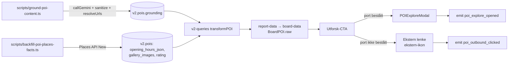
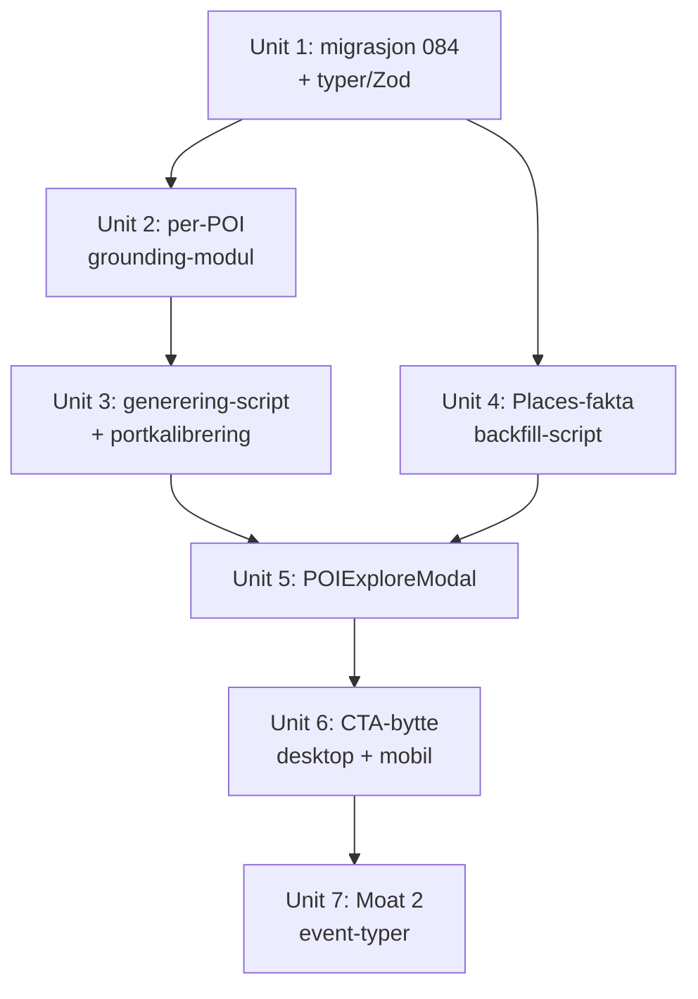

# feat: Utforsk-modal med Google-grounded POI-innhold (Sundsøya-pilot)

## Overview

«Utforsk»-knappen i board-POI-popupene sender i dag brukeren ut av Placy til Google AI Mode (`?udm=50`). Vi erstatter den med en modal inne i Placy som viser Google-grounded stedsinnhold generert build-time per POI, med Google-attribusjon og kildelenker, pluss Google-fakta (bilder, åpningstider, rating) lest fra DB. POI-er som ikke består kvalitetsporten beholder ekstern lenke, visuelt merket med «ekstern lenke»-ikon.

Pilot-flaten er Sundsøya-boardet (`placy-demo_sundsoya`, 78 POI-er). Genereringen er et frittstående script — pipeline-integrasjon er bevisst utsatt.

## Problem Frame

Brukeren forlater Placy midt i opplevelsen, og klikket — det sterkeste interessesignalet per POI — er uinstrumentert, så det går tapt for Moat 2 (se origin: `docs/brainstorms/2026-08-12-utforsk-modal-grounded-poi-innhold-requirements.md`).

Verifisert 2026-08-12: Googles egne AI-sammendrag i Places API (`generativeSummary`/`reviewSummary`) er ikke tilgjengelige i Norge (0 av 12 norske probe-POI-er; US-kontroll returnerte full pakke). Build-time Gemini + Google Search-grounding reproduserer AI Mode-innholdet på norsk med kilder. Vi bygger derfor samme funksjon Google ruller ut regionvis — den rå teksten er commodity-/bootstrap-lag, Moat 1-substansen er det kuraterte laget som bygges oppå senere.

## Requirements Trace

- R1. Build-time per-POI grounding via Gemini + Google Search, lagret på POI-et, ingen runtime-LLM → Unit 2, 3
- R2. Genereres for alle POI-er på boardet (Moat 1-akkumulering) → Unit 3
- R3. Kvalitetsport avgjør publisering; kalibrering kjøres før modal-UI bygges → Unit 3
- R4. Provider-agnostisk lagring; provider-spesifikk attribusjonsblokk; generert vs. kuratert skilt → Unit 1
- R5. Genereringstidspunkt + versjonert re-generering som compliance-mekanisme → Unit 1, 3
- R6. Modal åpnes i Placy med tekst, kilder, fakta; degraderer pent → Unit 5, 6
- R7. Google-attribusjon per ToS, DOMPurify-sanering gjenbrukt → Unit 2, 5
- R8. Places-fakta build-time eller via cachet proxy, aldri ukontrollert per visning → Unit 4
- R9. Fungerer desktop og mobil (mobil-native) → Unit 6
- R10. Fallback til ekstern lenke, visuelt merket → Unit 6
- R11. Modal-åpning + utgående klikk logges som Moat 2-signal → Unit 7
- R12. Kostnadskontroll: engangs build-time, ~0 per visning → Unit 3, 4

## Scope Boundaries

- Kun Sundsøya-boardet får **generert innhold** (`placy-demo_sundsoya`). NB: kode-endringene ligger i delte komponenter, så CTA-logikken er aktiv på alle boards — men siden gatingen er på faktisk innhold, oppfører boards uten grounding seg som i dag (ekstern lenke på desktop, uendret mobil)
- Ingen «Ask anything»-oppfølging i modalen (runtime-LLM er forbudt)
- `blocks/TransitDashboardCard.tsx:48` sin `udm=50`-lenke endres ikke (holdeplass-avganger, annet formål)
- Ingen endring i `editorial_hook`/`local_insight` eller kategori-tekstene — nytt innholdslag
- Ingen ny WebGL-flate i modalen (iOS WebKit tåler én kontekst; se `docs/solutions/architecture-patterns/unified-map-modal-2d-3d-toggle-20260415.md`)

### Deferred to Separate Tasks

- Pipeline-integrasjon (generering som steg i `lib/pipeline/`) — etter pilot-evaluering
- Backfill av eksisterende boards (Midtbyen, StasjonsKvartalet m.fl.) — etter pipeline-integrasjon
- Google-swap til `generativeSummary` når Norge dekkes — Unit 1 gjør det mulig; re-probe kvartalsvis med scriptet fra 2026-08-12
- Megler-kuratering av grounded innhold (forfatterskap på `curated`-feltet) — eget spor

## Context & Research

### Relevant Code and Patterns

**Grounding-infrastruktur (gjenbrukes uendret):**
- `lib/gemini/grounding.ts` — `callGemini()` mot `gemini-2.5-flash`, `x-goog-api-key`-header, `splitLongParagraphs()`-fallback. `buildPrompt()` er temaskala og må få en per-POI-variant
- `lib/gemini/sanitize.ts` — `sanitizeSearchEntryPointHtml()`, DOMPurify strikt whitelist, kjøres build-time før lagring
- `lib/gemini/url-resolver.ts` — `resolveUrlsParallel` (p-limit 5), SSRF-guard: DNS pre-resolve + `ipaddr.js` unicast + max 3 hops + https-final
- `lib/gemini/types.ts` — Zod-skjema for Gemini-responsen
- `scripts/gemini-grounding.ts` — CLI-malen: dry-run default, backup til `backups/`, optimistic lock på `updated_at`, post-write-verifisering, `revalidateTag` via `/api/revalidate`

**Lagring og dataflyt:**
- `supabase/migrations/070_baseline.sql:168` — `v2.pois` DDL. `opening_hours_json jsonb` er presedensen for cachet ekstern-data per POI
- `lib/supabase/v2-queries.ts` — `transformPOI` (snake→camel); ny kolonne må mappes eksplisitt
- `lib/types.ts:29` (`POI`), `:161` (`ReportThemeGrounding`), `:242` (`ReportThemeGroundingViewSchema` — discriminated union på `groundingVersion`)
- `components/variants/report/board/board-data.ts:27` — `BoardPOI` bærer `raw: POI`, så nye POI-felt er tilgjengelige som `poi.raw.<felt>` uten BoardPOI-endring
- `lib/supabase/cached-board-reads.ts` — `unstable_cache`, tag `product:${customer}_${slug}`, 3600s

**UI:**
- `components/ui/Modal.tsx` — portal, backdrop `z-[100]`, ESC/backdrop-close, body-scroll-lock, **innebygd adaptiv split**: `items-end` + `animate-slide-up` på mobil, sentrert `max-w-[480px]` på desktop. Header / scrollbart innhold / sticky footer
- `components/variants/report/board/BoardPOIMiniPopup.tsx:44` og `BoardPOI3DMiniPopup.tsx:100` — de to `udm=50`-CTA-ene som byttes
- `components/variants/report/board/use-popup-mode.ts` — `useBoardPopupMode()`: `"mini"` (≥1024px) / `"sheet"` (mobil)
- `components/variants/report/board/board-state.tsx` — `useReducer`-Context (ikke Zustand). `OPEN_POI` → `phase: "poi"` + `activePOIId`
- `components/ui/GoogleRating.tsx` — etablert rating-visning

**Instrumentering:**
- `lib/instrumentation/event-types.ts` — `EVENT_TYPES` + `EngagementContextEnvelope` (obligatorisk `payload.context`)
- `lib/instrumentation/event-schema.ts:97` — `logEventSchema` discriminated union med `_AllTypesCovered`-kompileringsvakt
- `lib/instrumentation/engagement-scope.tsx` — `useEngagement().emit(type, {poiId?, payload?})`

### Institutional Learnings

- `docs/solutions/api-integration/gemini-grounding-pattern-20260418.md` — åtte navngitte mønstre, alle gjelder per-POI-varianten. ToS: `searchEntryPointHtml` verbatim, sanert før lagring; mangler feltet → omit hele enheten. Ved flere grounded responses må chips stå adjacent til sin egen response → chips inne i modalen per POI, aldri aggregert
- `docs/solutions/ui-bugs/poi-ids-heterogeneous-not-uuid-20260428.md` — **`v2.pois.id` er TEXT** (`google-ChIJ…`, `entur-NSR-…`, uuid). `z.string().uuid()` feilet stille for 6/7 temaer. Bruk `z.string().min(1)` og gjør valideringsfeil støyende
- `docs/solutions/performance-issues/google-api-runtime-cost-leakage-20260215.md` — in-memory `Map()`-cache i API-routes er ubrukelig på Vercel (cold starts). 339 kr/halvmåned lekkasje; Photo-SKU var 71 % av spend. Persister Places-fakta i DB, lagre stabile `lh3`-CDN-URL-er
- `docs/solutions/database-issues/jsonb-merge-vs-overwrite-seed-scripts-20260413.md` — naiv `SET col = '{...}'::jsonb` sletter andre nøkler. Bruk merge eller les-modifiser-skriv med whitelist
- `docs/solutions/ui-patterns/progressive-disclosure-kuratert-poi-slots-20260420.md` — «juridisk» Google-stoff (chips/kilder) skal ikke skyve hovedinnhold ned. Placy-narrativ først, attribusjon etter
- `docs/solutions/architecture-patterns/unified-map-modal-2d-3d-toggle-20260415.md` + `docs/solutions/ui-bugs/google-maps-3d-popover-not-rendering.md` — modal må være DOM-overlay i portal utenfor kart-elementet; gmp-map-3d rendrer ikke React-popovers pålitelig
- `docs/solutions/architecture-patterns/mobile-two-surface-reels-model-20260616.md` — enkel sheet med alltid-tilgjengelig exit; multi-snap med affordanser på feil akse skapte lock-bugs

### External References

- [Gemini API Additional Terms](https://ai.google.dev/gemini-api/terms) — Grounded Results: caching/syndikering forbudt som hovedregel, men lagring av **teksten** tillatt i inntil **2 år** for visnings-/optimaliseringsformål. Tracking av interaksjoner med spesifikke Grounded Results er forbudt
- [AI-powered place summaries](https://developers.google.com/maps/documentation/places/web-service/place-summaries) — `generativeSummary`, per nå India/US, ikke Norge
- Places API (New) pricing: Place Details med bilder/anmeldelser = Enterprise-SKU (~$20/1k)

## Key Technical Decisions

- **Ny `grounding jsonb`-kolonne på `v2.pois`** (ikke `products.config`, ikke `place_knowledge`): grounded innhold er prosjekt-uavhengig POI-data som gjenbrukes på tvers av boards, og `opening_hours_json` er den etablerte presedensen for cachet ekstern-data per POI. `place_knowledge` har fakta-atom-shape (`fact_text`/`confidence`), ikke narrativ + attribusjons-HTML
- **Verifiserte funn som endret planen** (research 2026-08-12): (a) det finnes **ingen** UI-komponent som rendrer grounding i dag — render-laget ble trimmet ved cutover, så modalen blir første renderer av `searchEntryPointHtml`; (b) `components/ui/Modal.tsx` er allerede adaptiv desktop/mobil, så R9 krever ingen ny sheet-komponent; (c) `/api/places` har **ingen** klient-konsument — Google-fakta leses fra DB-kolonner i hele kodebasen
- **Places-fakta hentes build-time inn i DB-kolonner**, ikke via runtime-proxy: følger etablert mønster (`googleRating`, `openingHoursJson`, `gallery_images`), og unngår kostnadslekkasjen fra 2026-02 der in-memory-cache viste seg ubrukelig på Vercel. Modal-åpning koster da 0 Google-kall
- **Mobil: POI-tap åpner modalen direkte.** Mobil har i dag ingen POI-detaljflate (`BoardMobileSheet` finnes ikke — kun omtalt i kommentarer). Modalen blir mobilens POI-flate, i stedet for å bygge et popup-lag først (beslutning Andreas 2026-08-12)
- **Fallback-CTA merkes visuelt** med «ekstern lenke»-ikon i stedet for sparkles (beslutning Andreas 2026-08-12)
- **Zod: `z.string().min(1)` for POI-ID-felt**, aldri `.uuid()` — heterogene TEXT-IDer, og valideringsfeil skal logges støyende, ikke silent-skippes
- **Egen `poiGroundingVersion: z.literal(1)`** — per-POI-shapen er ikke tema-shapen; ikke gjenbruk `ReportThemeGrounding`-skjemaet
- **Migrasjonsnummer 084** — 081/082 er tatt av umerget `feat/megler-self-serve`, 083 er siste i main

## Open Questions

### Resolved During Planning

- Hvor lagres per-POI grounded innhold? → Ny `grounding jsonb`-kolonne på `v2.pois`, presedens `opening_hours_json`
- Bilder/fakta build-time vs. runtime? → Build-time inn i DB-kolonner (kostnadslekkasje-lærdom + etablert mønster)
- Modal-komponentvalg og desktop/mobil-split? → Gjenbruk `components/ui/Modal.tsx` (allerede adaptiv)
- Hvilket Moat 2-oppsett? → Ny event-type via to-stegs-kontrakten; `useEngagement().emit()` er emit-veien
- Gemini-vilkår for lagring? → 2-års tekstvindu bekreftet; tracking per Grounded Result forbudt

### Deferred to Implementation

- Konkrete kvalitetsport-terskler: kalibreres empirisk på Sundsøya-settet i Unit 3 — kan ikke settes før vi ser fordelingen av kilde-antall og innholdslengde på 78 POI-er
- Endelig prompt-formulering for per-POI-grounding: iterativt arbeid mot faktisk output; startpunkt er `buildPrompt()` omskrevet til stedsskala med beboer-perspektiv
- Hvorvidt modal-åpning trenger egen board-state-action eller kan være lokal state i popup-laget: avhenger av om `BoardReelsSync` (`ReportReelsPage.tsx:362`) wiper ved fase-endring i praksis
- Om POI-radene i `neighbourhood/CategoryPage.tsx` (i dag ikke-klikkbare `<li>`-elementer) skal bli en inngang til modalen: på mobil dekker nabolags-sheeten 55–85 % av skjermen, så kart-pin er en trang vei inn til innholdet. Vurder etter at Unit 6 er verifisert — kan være en liten tilleggs-endring med stor effekt på mobil-bruk, men er ikke nødvendig for at R9 er oppfylt
- Om `has_3d_addon` er satt på Sundsøya: avgjør om dobbel-mount-fellen ville truffet pilot-flaten umiddelbart. Modalen plasseres i board-skallet uansett, så det er ikke blokkerende — men verd å sjekke ved verifisering

## High-Level Technical Design

> *Dette illustrerer intendert tilnærming og er retningsgivende for review, ikke implementasjonsspesifikasjon. Implementerende agent skal behandle det som kontekst, ikke kode å reprodusere.*

**Lagret shape på `v2.pois.grounding` (jsonb):**

```
{
  poiGroundingVersion: 1,
  generated: {                    // provider-swappbart lag
    provider: "gemini-search-grounding",
    narrative: string,            // norsk, intro + punkter
    sources: [{ title, url, domain }],
    searchEntryPointHtml: string, // sanert build-time, rendres verbatim
    searchQueries: string[],
    model: string,
    fetchedAt: ISO-timestamp,
    qualityGate: { passed: boolean, sourceCount, charCount, reason? }
  },
  curated?: {                     // Placy-eid lag — overlever provider-swap
    narrative: string,
    curatedAt: ISO-timestamp
  }
}
```

Attribusjonsblokken er provider-spesifikk: `generated.provider` avgjør hvilken attribusjon som rendres (grounding → kildelenker + searchEntryPoint; en fremtidig `places-generative-summary` → disclosure-tekst + flag-lenke).

**Dataflyt:**



**Unit-avhengigheter:**



## Implementation Units

- [ ] **Unit 1: Lagringsskjema — migrasjon 084, typer og Zod-validering**

**Goal:** `v2.pois` får en `grounding jsonb`-kolonne, og TS-siden kan lese den typesikkert med støyende validering.

**Requirements:** R4, R5

**Dependencies:** Ingen

**Files:**
- Create: `supabase/migrations/084_poi_grounding_kolonne.sql`
- Modify: `lib/types.ts` (ny `PoiGrounding`-type + `PoiGroundingViewSchema`; `POI`-typen får `grounding?`)
- Modify: `lib/supabase/v2-queries.ts` (`transformPOI` mapper `grounding` **og `gallery_images`**)
- Test: `lib/types.test.ts` (utvid med per-POI-grounding-schema-tester)

**Approach:**
- Kolonnen er nullable jsonb uten default — fravær betyr «ikke generert», ikke «tom»
- `PoiGroundingViewSchema` er en discriminated union på `poiGroundingVersion` (`z.literal(1)`) etter mønsteret i `lib/types.ts:242`, men med **eget** skjema — ikke gjenbruk av `ReportThemeGroundingViewSchema`
- Parse-feil logges (server-log) OG utelater innholdet — men aldri stille: log-linjen skal navngi POI-IDen slik at feil er sporbar. Dette er direkte respons på `poi-ids-heterogeneous-not-uuid-20260428.md`
- `generated.searchEntryPointHtml` er `z.string().min(1)` og påkrevd i `generated` — mangler den, kan hele `generated` ikke vises (ToS-krav)
- Migrasjonen kjøres og verifiseres mot prod som del av denne unit-en (CLAUDE.md: «jobben er ikke ferdig før migrasjonen er kjørt og verifisert»)
- **Verifisert hull som må lukkes her**: `POI.galleryImages` finnes i `lib/types.ts:37`, men `transformPOI` mapper **ikke** `gallery_images` — ingen komponent leser feltet i dag, så feilen er usynlig. Uten denne mappingen blir bildekarusellen i Unit 5 alltid tom selv etter at Unit 4 har brukt Google-kvote på å hente bildene. Legg mappingen til med samme cast-mønster som `anchor_summary`-linja

**Patterns to follow:**
- `supabase/migrations/083_recall_kategorier.sql` for migrasjonsform
- `lib/types.ts:242` (`ReportThemeGroundingViewSchema`) for discriminated-union-formen
- `lib/supabase/v2-queries.ts:73-103` for `transformPOI`-mapping (merk `anchor_summary`-linja som bruker cast-mønsteret for nye kolonner)

**Test scenarios:**
- Happy path: gyldig `grounding`-objekt med `poiGroundingVersion: 1` og komplett `generated` parses og returneres
- Happy path: objekt med både `generated` og `curated` parses; begge lag bevares
- Edge case: `grounding: null` → `undefined` i POI-typen, ingen feil-log
- Edge case: POI-ID i form `google-ChIJe2pnuSJibUYRqz4D6mc_JdM` og `entur-NSR-12345` passerer validering (regresjonsvern mot `.uuid()`-fellen)
- Integration: POI med `gallery_images` i DB gir `poi.galleryImages` etter `transformPOI` (dekker mapping-hullet over)
- Error path: `generated` uten `searchEntryPointHtml` → hele `generated` utelates, feil logges med POI-ID
- Error path: ukjent `poiGroundingVersion: 2` → utelates, feil logges (versjon-bump-kontrakt)
- Integration: `transformPOI` på en faktisk DB-rad med grounding gir POI-objekt der `grounding.generated.narrative` er lesbar

**Verification:**
- Migrasjonen er kjørt mot prod og `curl`-verifisert (kolonnen finnes i `?select=grounding&limit=1`)
- `npx tsc --noEmit` er grønn, `npm test` passerer
- En manuelt innsatt test-rad leses korrekt gjennom `getProductFromSupabaseV2`

---

- [ ] **Unit 2: Per-POI grounding-modul**

**Goal:** En gjenbrukbar funksjon som tar et POI (navn, adresse, kategori) og returnerer validert, sanert grounded innhold klart til lagring.

**Requirements:** R1, R7

**Dependencies:** Unit 1

**Files:**
- Create: `lib/gemini/poi-grounding.ts`
- Test: `lib/gemini/poi-grounding.test.ts`

**Approach:**
- Wrapper rundt eksisterende `callGemini()` — ingen ny API-klient, ingen ny nøkkelhåndtering
- Ny prompt-builder på stedsskala: intro (2 setninger) + 3–5 punkter med det som faktisk finnes der. Beboer-perspektiv, faktaorientert, presens — ikke turist-vinkel, ikke poesi, ikke byggeår/historikk (jf. etablerte redaksjonelle preferanser). Åpningstider/priser skal IKKE med i narrativet — de kommer fra DB (Unit 4)
- Kaller `sanitizeSearchEntryPointHtml()` på entry-point-HTML **før** retur, og `resolveUrlsParallel()` for å få reelle domener bak Gemini-redirects (SSRF-guardet)
- Returnerer `{ ok: true, generated }` eller `{ ok: false, reason }` — per-POI-feil skal aldri kaste og velte en batch (mønster 7 i grounding-pattern-doccen)
- Kvalitetsport-evalueringen er en **egen ren funksjon** i denne modulen (`evaluatePoiQualityGate`) slik at den kan enhetstestes og kalibreres uten API-kall

**Execution note:** Prompt-formuleringen er iterativ — kjør mot noen få reelle POI-er (Muustrøparken som referanse, pluss en OSM-POI uten place_id) før scriptet i Unit 3 bygges.

**Patterns to follow:**
- `lib/gemini/grounding.ts` — `callGemini`-signatur, `splitLongParagraphs`-fallback, timeout-håndtering
- `scripts/gemini-grounding.ts` sin per-enhet-feilhåndtering (`Promise.allSettled` + omit)

**Test scenarios:**
- Happy path: mocket Gemini-respons med narrativ + 4 kilder + entry-point → `ok: true`, sanert HTML, resolvede domener
- Happy path: `evaluatePoiQualityGate` med 4 kilder og 700 tegn → `passed: true`
- Edge case: `evaluatePoiQualityGate` med 1 kilde og 120 tegn → `passed: false` med lesbar `reason`
- Edge case: POI uten adresse (kun navn + kategori) → prompt bygges likevel, ingen crash
- Error path: Gemini-respons uten `groundingMetadata` → `ok: false`, ingen kast
- Error path: Gemini-respons uten `searchEntryPoint` → `ok: false` med ToS-begrunnelse (kan ikke vise grounding uten attribusjon)
- Error path: timeout/nettverksfeil → `ok: false`, ingen kast
- Integration: sanering fjerner `<script>` fra entry-point-HTML før retur (verifiser at `sanitizeSearchEntryPointHtml` faktisk er i kjeden, ikke bare importert)

**Verification:**
- Enhetstester dekker både port-utfall og alle feilstier
- Ett manuelt kall mot reell Gemini-API for Muustrøparken gir innhold på nivå med AI Mode-referansen (skulpturene, amfiet, kvernhuset) med kilder

---

- [ ] **Unit 3: Generering-script for Sundsøya + portkalibrering**

**Goal:** Alle 78 POI-er på Sundsøya-boardet får generert grounding lagret i DB, og kvalitetsportens terskler er kalibrert empirisk med rapportert dekningsgrad.

**Requirements:** R1, R2, R3, R5, R12

**Dependencies:** Unit 2

**Files:**
- Create: `scripts/ground-poi-content.ts`
- Test: `scripts/ground-poi-content.test.ts`

**Approach:**
- CLI: `<project_id> [--apply] [--force] [--limit N]`, **dry-run som default**. Kopier sikkerhetsnettet fra `scripts/gemini-grounding.ts`: prosjekt-ID-formvakt, backup til `backups/` før write, optimistic lock på `updated_at`, post-write-verifisering
- Leser POI-utvalget via `product_pois` for prosjektets rapport-produkt (78 POI-er på Sundsøya, verifisert 2026-08-12)
- `p-limit` for parallellitet, `Promise.allSettled` per POI, totalfeil-terskel som aborterer uten write ved høy feilrate
- **Skriving per POI**: PATCH mot `v2.pois` med `Content-Profile: v2`. Kun `grounding`-kolonnen settes — ingen jsonb-overwrite av andre kolonner (jf. `jsonb-merge-vs-overwrite`-læringen). Hvis en POI allerede har `curated`, bevares det ved re-generering (`--force` overskriver kun `generated`)
- **Strykere lagres også** (med `qualityGate.passed = false` + `reason` + `fetchedAt`). Uten dette blir Unit 6s `passed === true`-gate meningsløs (feltet ville alltid vært true når det finnes), dekningsgraden ville bare eksistert i konsoll-output fra dry-run, og hver kjøring uten `--force` ville re-generert de samme strykerne med ny Gemini-kost. Scriptet hopper over POI-er med ferskt strykende forsøk med mindre `--force` er satt
- **Dry-run rapporterer dekningsfordelingen**: antall POI-er per port-utfall, med kilde-antall og lengde-histogram — dette er kalibreringsgrunnlaget. Tersklene settes basert på denne kjøringen, ikke gjettet på forhånd
- Cache-bust: `/api/revalidate?tag=product:placy-demo_sundsoya` etter write
- Kostnadsforventning: 78 grounding-kall ligger innenfor gratiskvoten (1 500/dag); logg faktisk antall kall og flagg avvik (R12)

**Execution note:** Kjør dry-run FØRST og rapporter dekningsgraden til Andreas før `--apply`. Lav pass-rate er et pilot-funn som skal omdirigere innsatsen, ikke oppdages etter at UI-en er bygd (R3).

**Patterns to follow:**
- `scripts/gemini-grounding.ts` i sin helhet — arg-parsing, backup, lock, verifisering, revalidate
- `scripts/refresh-opening-hours.ts` for batch-skriving mot `v2.pois` (BATCH_SIZE 5, 300ms delay)
- `scripts/load-env.ts` som første import hvis `lib/supabase/client.ts` trekkes inn

**Test scenarios:**
- Happy path: dry-run på mocket POI-sett skriver ingenting og rapporterer fordeling per port-utfall
- Happy path: `--apply` skriver `grounding` for POI-er som består porten, hopper over de som ikke gjør det
- Edge case: POI som allerede har `curated`-lag → `curated` bevares uendret etter re-generering
- Edge case: `--limit 5` behandler kun 5 POI-er (kalibrerings-verktøy)
- Error path: ugyldig prosjekt-ID → exit uten API-kall
- Error path: optimistic lock feiler (raden endret mellom lesing og skriving) → ingen write, tydelig feilmelding
- Error path: høy feilrate fra Gemini → abort uten write, exit-kode ≠ 0
- Integration: etter `--apply` mot testdata leses `grounding` tilbake gjennom `getProductFromSupabaseV2` og validerer mot Unit 1s Zod-skjema

**Verification:**
- Dry-run-rapporten viser dekningsgrad per kategori for alle 78 Sundsøya-POI-er
- Etter `--apply`: `curl` mot `v2.pois?select=id,name,grounding` viser lagret innhold, og antall POI-er med `grounding.generated.qualityGate.passed = true` matcher dry-run-rapporten
- Muustrøparken har innhold på nivå med AI Mode-referansen

---

- [ ] **Unit 4: Places-fakta backfill for Sundsøya**

**Goal:** De 45 POI-ene med `google_place_id` får åpningstider og bilder lagret i DB, slik at modalen kan vise Google-fakta uten API-kall per visning.

**Requirements:** R8, R12

**Dependencies:** Unit 1 (uavhengig av Unit 2/3 — kan kjøres parallelt)

**Files:**
- Modify: `scripts/refresh-opening-hours.ts` (migrer til Places API New med header-nøkkel — se sikkerhetsfunnet under)
- Modify: `scripts/backfill-gallery-images.ts` (kjøres for Sundsøya; utvid kun hvis den mangler `photo_resolved_at`-stempling)
- Test: `scripts/refresh-opening-hours.test.ts`
- Create: kun hvis de to over viser seg utilstrekkelige etter lesing — ikke lag et femte Places-script uten å begrunne det

**Approach:**
- Verifisert utgangspunkt (2026-08-12): av 78 POI-er har 45 `google_place_id`, 41 har `google_rating`/`google_review_count`, men **0** har `opening_hours_json`, `gallery_images` eller `photo_reference`. Rating finnes altså allerede; åpningstider og bilder må hentes
- **Gjenbruk, ikke nybygg**: kodebasen har allerede fire scripts på denne stien — `scripts/backfill-gallery-images.ts` (henter bilder via Places New, skriver `gallery_images` idempotent), `scripts/refresh-opening-hours.ts` (skriver `opening_hours_json`), `scripts/refresh-photo-urls.ts` og `scripts/resolve-photo-urls.ts` (re-resolving av utløpte URL-er). Et femte script ville bryte kodebase-hygienereglen. Les alle fire før du skriver kode
- **SIKKERHETSFUNN som må fikses her** (verifisert 2026-08-12): `scripts/refresh-opening-hours.ts:78` kaller LEGACY-endepunktet `maps.googleapis.com/maps/api/place/details/json?...&key=${GOOGLE_API_KEY}` — API-nøkkelen ligger i querystringen, i strid med CLAUDE.md-regelen «ALLTID API-nøkkel i header, aldri URL-querystring (leker i logs)». Migrer scriptet til `fetchPlaceDetails` (Places New, `X-Goog-Api-Key`-header) som del av denne unit-en. Dette er ikke scope-kryp — det er å ikke kopiere et regelbrudd videre
- **Språk-felle på åpningstider**: `MapPopupCard.tsx:69-80` matcher **engelske** dagsnavn (`"Monday"`…) mot `weekday_text`. Hentes åpningstidene på norsk, blir `todayHours` alltid null og feilen er usynlig i test. Behold engelsk `languageCode` for åpningstider, eller oppdater konsumenten samtidig — velg én og dokumenter valget
- **Bilde-URL-er råtner**: `scripts/refresh-photo-urls.ts` finnes nettopp fordi lh3-CDN-URL-er utløper (14-dagers cutoff via `photo_resolved_at`). «Stabile CDN-URL-er» er derfor et for sterkt premiss — sett `photo_resolved_at` ved skriving, og legg refresh-kjøring inn i demo-rutinen (se Documentation-seksjonen)
- Dry-run default, `--apply` for skriving, samme sikkerhetsnett som Unit 3
- POI-er uten `google_place_id` (33 stk, typisk OSM/NSR/barnehagefakta) hoppes over med tydelig rapportering — modalen viser da grounded tekst uten fakta-seksjon
- Kostnadsforventning: 45 Place Details-kall på Enterprise-SKU (~$20/1k → under 1 USD) + photo-media. Logg faktisk antall kall (R12)

**Patterns to follow:**
- `lib/google-places/fetch-place-details.ts` — `fetchPlaceDetails` + `DEFAULT_FIELDS` (Places New, header-nøkkel). Dette er den korrekte klienten; legacy-stien i `refresh-opening-hours.ts` er det som skal bort
- `scripts/backfill-gallery-images.ts` for idempotent bilde-skriving
- `docs/solutions/best-practices/places-api-new-photo-migration-20260216.md` for CDN-URL-håndtering

**Test scenarios:**
- Happy path: mocket Places-respons med `regularOpeningHours` + `photos` → `opening_hours_json` og `gallery_images` skrives
- Happy path: dry-run rapporterer hvor mange POI-er som ville blitt oppdatert, uten å skrive
- Edge case: POI uten `google_place_id` hoppes over og telles i rapporten
- Edge case: Places-respons uten `regularOpeningHours` (park uten åpningstider) → kun bilder skrives, ingen tom-verdi
- Error path: 404 fra Places (place_id utdatert) → POI hoppes over, logges, batch fortsetter
- Error path: 429/403 fra Places → abort med tydelig kvote-melding, ingen delvis skriving som ser komplett ut
- Error path: API-nøkkelen forekommer ALDRI i en URL etter migreringen (assert mot request-URL i test — regresjonsvern for CLAUDE.md-regelen)
- Integration: etter kjøring leses `openingHoursJson` gjennom `transformPOI` og har `weekday_text`-formen `MapPopupCard.tsx:69` forventer — inkludert at dagsnavn-språket matcher konsumentens matching (engelsk)
- Integration: `photo_resolved_at` settes når `gallery_images` skrives, slik at `refresh-photo-urls.ts` kan finne utløpte URL-er senere

**Verification:**
- `curl` viser `opening_hours_json` og `gallery_images` populert for POI-er med place_id
- Rapport viser antall oppdatert / hoppet over / feilet, og faktisk antall Google-API-kall
- Ingen POI mistet eksisterende data (spot-sjekk mot backup)

---

- [ ] **Unit 5: POIExploreModal**

**Goal:** En modal som viser grounded innhold, Google-fakta og attribusjon for én POI, med korrekt ToS-etterlevelse og pen degradering.

**Requirements:** R6, R7

**Dependencies:** Unit 3, Unit 4

**Files:**
- Create: `components/variants/report/board/POIExploreModal.tsx`
- Test: `components/variants/report/board/POIExploreModal.test.tsx`
- Modify: `components/ui/Modal.tsx` (fokus-håndtering — se under; verifiser at `event/BoardCollectionDrawer.tsx` fortsatt oppfører seg som før)
- Modify: `components/variants/report/board/board-data.ts` (eksponer grounding på BoardPOI hvis `raw`-gjennomgang viser seg upraktisk i praksis)

**Approach:**
- Bygger på `components/ui/Modal.tsx` — portal, ESC/backdrop-close, scroll-lock og adaptiv desktop/mobil-plassering er allerede løst der (verifisert: `items-end md:items-center`, `animate-slide-up md:animate-modal-in`, `z-[100]`/`z-[101]`). **Ingen ny WebGL-flate**, ren DOM-overlay i portal utenfor kart-elementet (iOS-kontekst-begrensning + gmp-map-3d-popover-fellen)
- **Høyde-begrensning å ta stilling til**: `Modal.tsx` setter `max-h-[85vh] md:max-h-[50vh]`. 50vh på desktop er trangt for bilder + narrativ + fakta + attribusjon, og ToS krever at kildene er tilgjengelige innen én interaksjon. Enten utvid max-høyden for denne modalen (prop eller variant), eller strukturér innholdet så attribusjonen ligger i sticky footer utenfor scroll-området — ikke la kildene falle utenfor rekkevidde
- Innholdsrekkefølge (progressive-disclosure-læringen — attribusjon skal ikke skyve hovedinnhold ned):
  1. POI-navn + adresse + kategori-ikon (samme visuelle identitet som popupen)
  2. Bildekarusell hvis `gallery_images` finnes
  3. Grounded narrativ (intro + punkter) — `curated` vinner over `generated` når begge finnes
  4. Google-fakta: rating (`components/ui/GoogleRating.tsx`), åpningstider, telefon/nettside
  5. Kildelenker + `searchEntryPointHtml` rendret **verbatim** via `dangerouslySetInnerHTML` (innholdet er sanert build-time) + «Hentet via Google Søk»-merking
- Degradering: narrativ + kilder vises alltid når `generated` finnes; fakta-seksjonen utelates stille når data mangler. Modalen skal aldri vises tom
- Attribusjonsblokken velges av `generated.provider` — forberedt for Places-summaries-varianten uten omskriving (R4)
- **A11y — verifisert hull**: `Modal.tsx` har `role="dialog"` og ESC-listener, men **ingen** autofokus, fokus-felle eller fokus-retur. Legg dette i den delte komponenten (ikke duplisert i POIExploreModal): autofokus på dialog-containeren ved open, fokus-felle innenfor `role="dialog"`, og fokus-retur til forrige `activeElement` ved lukking. Attribusjonsteksten må være eksponert for skjermleser, ikke bare visuelt til stede (ToS-kravet gjelder alle brukere)

**Patterns to follow:**
- `components/ui/Modal.tsx` — API og adaptiv oppførsel
- `components/variants/report/MapPopupCard.tsx:69` — hvordan `openingHoursJson.weekday_text` rendres i dag
- `components/ui/GoogleRating.tsx` — rating-visning
- `components/variants/report/board/BoardPOIMiniPopup.tsx` — ikon/farge-identitet (`getFilledIcon`, `markerCircleStyle`)

**Test scenarios:**
- Happy path: POI med komplett grounding + fakta rendrer narrativ, punkter, rating, åpningstider, kilder og attribusjon
- Happy path: POI med `curated`-lag viser kuratert narrativ, ikke generert
- Edge case: POI uten `gallery_images` → ingen bildeseksjon, ingen broken image
- Edge case: bilde-URL som feiler ved last (utløpt lh3-URL) → `onError` skjuler karusellen i stedet for å vise brutt bilde. URL-utløp kan ikke oppdages build-time, så runtime-degradering er nødvendig
- Edge case: POI uten `opening_hours_json` og uten rating → fakta-seksjon utelates helt, narrativ vises
- Edge case: lang narrativ scroller innenfor modalen uten at attribusjonen forsvinner utenfor rekkevidde (ToS: kilder må være tilgjengelige innen én interaksjon)
- Error path: `generated` mangler `searchEntryPointHtml` → grounding vises IKKE (ToS-vern); modalen faller tilbake til fakta + ekstern lenke
- Integration: `searchEntryPointHtml` rendres verbatim — test at et sanert `<style>`-blokk-eksempel faktisk havner i DOM (dette er kodebasens første grounding-render, så kontrakten må bevises)
- Integration: ESC lukker modalen og fokus returneres til utløsende element

**Verification:**
- Modalen vist for Muustrøparken i nettleser matcher AI Mode-referansen i innholdsdybde
- Chrome DevTools viser 0 konsollfeil og ingen nettverkskall til Google ved åpning
- Attribusjon og kildelenker er synlige uten ekstra interaksjon

---

- [ ] **Unit 6: CTA-bytte på desktop + ny mobil-inngang**

**Goal:** Utforsk-CTA-en åpner modalen der innhold finnes og lenker ut (visuelt merket) der det ikke gjør, på begge desktop-popupene — og POI-tap på mobil åpner modalen direkte.

**Requirements:** R6, R9, R10

**Dependencies:** Unit 5

**Files:**
- Modify: `components/variants/report/board/BoardPOIMiniPopup.tsx`
- Modify: `components/variants/report/board/BoardPOI3DMiniPopup.tsx`
- Modify: `components/variants/report/reels/ReportReelsPage.tsx` (mobil-inngang: rendre modalen ÉN gang i board-skallet — se dobbel-mount-funnet under)
- Test: `components/variants/report/board/BoardPOIMiniPopup.test.tsx` (utvid)
- Test: `components/variants/report/board/BoardPOI3DMiniPopup.test.tsx` (utvid)

**Approach:**
- Gating-signal: `poi.raw.grounding?.generated?.qualityGate?.passed === true` (eller `curated` finnes) → modal-CTA; ellers ekstern lenke
- Visuelt skille (beslutning 2026-08-12): modal-varianten beholder `Sparkles` + dagens amber-pill; ekstern-varianten bruker standard «ekstern lenke»-ikon. Samme plassering og størrelse — kun ikonet og `target`-oppførselen skiller
- **Mobil-modalen rendres ÉN gang i board-skallet**, ikke i kart-komponentene. Verifisert dobbel-mount-felle: ved 3D-addon er BoardMap3D permanent montert (`{has3dAddon && …}`, `BoardMap.tsx:665`) SAMTIDIG som Mapbox-overlayet (`showMapbox = !has3dAddon || view === "2d"`, linje 237/685). Hadde begge filene rendret modalen på `popupMode === "sheet" && activePOIId`, ville to portal-modaler stått oppå hverandre på `z-[100]` — og siden Unit 7 emitter fra modalen, ville selve Moat 2-signalet blitt dobbelttelt. Dagens dobbel-render av mini-popupen er skjult fordi 3D-popupen ligger under Mapbox-overlayet på `z-[5]`; en portal-modal har ingen slik okklusjon. Riktig eier er `ResponsiveLayoutInner` i `ReportReelsPage.tsx`, som allerede ligger under både BoardProvider og EngagementProvider
- **Gating på innhold, ikke på flate**: mobil-modalen åpnes kun når POI-en faktisk har noe å vise (grounding bestått ELLER Google-fakta finnes). POI-er uten innhold beholder dagens mobil-oppførsel — gangvei (`BoardPathLayer`), tids-chip (`BoardPathMidpointMarker`) og navne-pille (`BoardPOILabel`) — som en `max-h-[85vh]`-modal ellers ville dekket. Uten denne gatingen ville mobil-POI-tap blitt *dårligere* enn i dag på boards uten grounded innhold
- Modal-lukking på mobil dispatcher `BACK_TO_DEFAULT` slik at kart-state og modal holdes i sync (bidirectional-sync-mønsteret). Hold modalen innenfor `phase === "poi"` så `BoardReelsSync` (`ReportReelsPage.tsx:362`) ikke wiper
- 3D-flaten: modalen må rendres i portal utenfor `gmp-map-3d`-elementet (kjent popover-felle)
- **Breakpoint-avvik å håndtere**: `useBoardPopupMode` bytter på 1024px, mens `Modal.tsx` bruker `md:` (768px) for desktop-geometri. Mellom 768 og 1023px får brukeren sheet-logikken med desktop-geometri og `md:max-h-[50vh]`. Overstyr via `className` (Modal bruker twMerge) eller juster breakpointet — ikke la det stå udefinert

**Patterns to follow:**
- `components/variants/report/board/use-popup-mode.ts` for flate-splitten
- `components/variants/report/board/BoardMap.tsx:753` for hvordan mini-popup rendres betinget i dag
- `components/variants/report/board/event/EventMobileSheet.tsx` for mobil-POI-oppførsel (auto-hev ved `phase === "poi"`)

**Test scenarios:**
- Happy path (desktop 2D): POI med godkjent grounding → klikk på Utforsk åpner modal, ingen navigasjon
- Happy path (desktop 3D): samme oppførsel i 3D-popupen
- Happy path (mobil): aktiv POI rendrer modalen direkte uten mellomliggende popup
- Edge case: POI uten grounding → CTA har ekstern-lenke-ikon, `target="_blank"` og `rel="noopener noreferrer"` bevart
- Edge case: POI med kun `curated` (ingen `generated`) → modal-CTA vises
- Edge case: mobil-POI uten grounding OG uten Google-fakta → ingen modal; gangvei, tids-chip og navne-pille beholdes som i dag
- Edge case: mobil-POI uten grounding men MED Google-fakta → modal med fakta + ekstern-lenke-CTA
- Integration: board med 3D-addon (begge kart-komponenter montert) åpner nøyaktig ÉN modal — regresjonsvern mot dobbel-mount og dobbelttelt event
- Edge case: viewport 800px bred (mellom Modal-ens `md:` og popup-modusens 1024px) gir lesbar modal, ikke halv skjermhøyde med avkuttet innhold
- Error path: `grounding` med ugyldig shape (Zod-avvist i Unit 1) → behandles som «ingen innhold», ekstern lenke, ingen crash
- Integration: modal-lukking på mobil nullstiller board-state slik at markør-labelen kommer tilbake og kartet er interaktivt

**Verification:**
- Chrome (desktop og device-emulering): begge CTA-varianter oppfører seg som spesifisert, 0 konsollfeil
- Mobil-emulering: POI-tap gir modal; lukking returnerer til kart uten låst scroll
- `?udm=50`-lenken i `TransitDashboardCard.tsx` er uendret (grep-verifisert)

---

- [ ] **Unit 7: Moat 2-instrumentering**

**Goal:** Modal-åpning og utgående fallback-klikk logges per POI med kontekst-konvolutt, innenfor ToS-grensene.

**Requirements:** R11

**Dependencies:** Unit 6

**Files:**
- Create: `supabase/migrations/085_event_types_utforsk.sql`
- Modify: `lib/instrumentation/event-types.ts` (`EVENT_TYPES` + `EventPayloads`)
- Modify: `lib/instrumentation/event-schema.ts` (ny variant i `logEventSchema`)
- Modify: `components/variants/report/board/POIExploreModal.tsx` (emit ved åpning)
- Modify: `components/variants/report/board/BoardPOIMiniPopup.tsx`, `BoardPOI3DMiniPopup.tsx` (emit ved utgående klikk)
- Test: `lib/instrumentation/event-types.test.ts`, `lib/instrumentation/event-schema.test.ts` (utvid)

**Approach:**
- **To-stegs-kontrakten (ufravikelig)**: migrasjonen som utvider `events_event_type_check` MÅ landes før koden sender de nye typene. `_AllTypesCovered`-kompileringsvakten i `event-schema.ts` feiler tsc til alle tre kodeendringer er gjort synkront
- To nye typer: `poi_explore_opened` (modal åpnet) og `poi_outbound_clicked` (fallback-lenke klikket). Begge trenger `poiId` i top-level `events.poi_id`, altså egen skjema-variant (dagens skjema tillater `poi_id` kun på `poi_clicked`)
- Kontekst-konvolutten (`mode`, `has_3d_addon`, `categories_presented`, `locale`) sendes på begge — events uten konvolutt er ubrukelige som moat-data og kan ikke repareres i ettertid
- **ToS-grense**: vi logger at modalen ble åpnet / at fallback-lenken ble klikket. Vi logger ALDRI klikk på enkelte kildelenker eller Search Suggestions (forbudt per Gemini-vilkårene)
- **Ingen beacon nødvendig** (avklart i planlegging): emit-stien er `logEvent` som er en `"use server"`-action — `navigator.sendBeacon` kan ikke kalle en server action, og det finnes ingen event-ingest-route i `app/api/`. Men behovet er heller ikke reelt: fallback-lenken har `target="_blank"`, så den opprinnelige siden unloades ikke og server-actionen fullfører normalt. Emit før navigasjon via vanlig `emit()`; ikke bygg en ny ingest-flate for dette
- Merk: `poi_clicked` emittes i dag kun fra `BoardMap3D.tsx:312`, ikke fra 2D-kartet. Ikke utvid det hullet — de nye eventene skal emittes fra begge flater

**Patterns to follow:**
- `lib/instrumentation/event-types.ts` sin egen dokumenterte to-stegs-grense
- `lib/instrumentation/engagement-scope.tsx` — `useEngagement().emit()`
- `supabase/migrations/070_baseline.sql:347` — den ENESTE definisjonen av `events_event_type_check` (inline i CREATE TABLE). Migrasjonen må derfor gjøre `ALTER TABLE v2.events DROP CONSTRAINT events_event_type_check;` fulgt av `ADD CONSTRAINT` med hele det utvidede settet (fire eksisterende + `poi_explore_opened` + `poi_outbound_clicked`). NB: `078_events_volum_tak.sql` er IKKE presedens — den inneholder ingen CONSTRAINT-endring, bare en BEFORE INSERT-volumguard på samme tabell (som må fortsette å virke etter endringen)

**Test scenarios:**
- Happy path: modal-åpning emitter `poi_explore_opened` med `poiId` og komplett kontekst-konvolutt
- Happy path: fallback-klikk emitter `poi_outbound_clicked` med `poiId`
- Edge case: emit utenfor `EngagementProvider` er no-op uten crash (etablert fail-soft-kontrakt)
- Edge case: heterogen POI-ID (`google-ChIJ…`) passerer `logEventSchema`-validering
- Error path: event uten kontekst-konvolutt avvises av Zod-skjemaet (vern mot ubrukelige moat-rader)
- Error path: ukjent event-type avvises av `isEventType`
- Integration: `_AllTypesCovered`-vakten kompilerer først når EVENT_TYPES, EventPayloads og logEventSchema alle er oppdatert
- Integration: etter migrasjon + emit finnes raden i `v2.events` med riktig `event_type` og `poi_id` (verifiser mot prod-DB)

**Verification:**
- Migrasjon 085 kjørt og verifisert mot prod
- Manuell modal-åpning på Sundsøya-boardet gir en ny rad i `v2.events` med `event_type = 'poi_explore_opened'` og komplett `payload.context`
- `npx tsc --noEmit`, `npm run lint`, `npm test` alle grønne

## System-Wide Impact

- **Interaction graph:** Ny kolonne på `v2.pois` treffer `transformPOI` → alle POI-konsumenter (Explorer, Guide, Report, audio-tour manus-feed). Feltet er optional, så eksisterende konsumenter er upåvirket. Nye event-typer treffer `logEventSchema`-unionen og dens kompileringsvakt
- **Error propagation:** Zod-parse-feil på `grounding` utelater innholdet men logger med POI-ID (ikke silent skip — direkte lærdom fra `poi-ids-heterogeneous-not-uuid`). Script-feil per POI omittes, aldri `null`-skrives. Emit-kjeden er fail-soft hele veien
- **State lifecycle risks:** Modal-tilstand på mobil må holdes innenfor `phase === "poi"` så `BoardReelsSync` (`ReportReelsPage.tsx:362`) ikke wiper. Re-generering med `--force` må bevare `curated`-laget — ellers går megler-kuratering tapt
- **API surface parity:** Begge desktop-popupene (2D og 3D) må endres likt; `TransitDashboardCard` bevisst utenfor. Mobil får en flate som ikke fantes
- **Integration coverage:** `searchEntryPointHtml`-rendering er kodebasens første — kontrakten (sanert build-time, verbatim ved render) må bevises med test, ikke antas. Mobil-modal + board-state-sync krever integrasjonstest, ikke bare unit
- **Unchanged invariants:** `editorial_hook`/`local_insight` og kategori-editorial er urørt. `products.config.reportConfig.themes[].grounding` (tema-grounding) er urørt — per-POI-grounding er et separat lag med eget skjema og egen versjon. Ingen andre boards enn Sundsøya får generert innhold

## Risks & Dependencies

| Risk | Mitigation |
|------|------------|
| Lav pass-rate på ruralt board gjør modalen nesten usynlig, og Sundsøya er samtidig et aktivt salgscase mot HEM | Unit 3 kjører dry-run og rapporterer dekningsgrad FØR UI bygges (R3-sekvensering). Lav dekning omdirigerer innsatsen i stedet for å oppdages i kundedemo |
| Google-API-kostnad løper (tidligere lekkasje: 339 kr/halvmåned, Photo-SKU 71 %) | Alt hentes build-time inn i DB-kolonner; modal-åpning gjør 0 Google-kall. Scriptene logger faktisk antall kall og flagger avvik (R12) |
| ToS-brudd på attribusjon i kodebasens første grounding-render | `searchEntryPointHtml` sanert build-time og rendret verbatim; mangler feltet vises grounding ikke i det hele tatt. Integrasjonstest beviser kontrakten. Ingen tracking per Grounded Result (Unit 7) |
| Zod-validering feiler stille slik den gjorde for 6/7 temaer i april | `z.string().min(1)` for POI-IDer (aldri `.uuid()`), og parse-feil logges med POI-ID. Egen regresjonstest med `google-ChIJ…`- og `entur-NSR-…`-IDer |
| Migrasjon på delt tabell (`v2.pois`, `v2.events`) i prod | Nullable kolonne uten default (ingen backfill-lås); CHECK-utvidelse er additiv. Kjøres via psql og verifiseres med `curl` som del av unit-en |
| Umerget `feat/megler-self-serve` eier migrasjon 081/082 → nummerkollisjon ved merge | Bruk 084/085 (verifisert ledige i main). Ved senere merge må rekkefølgen sjekkes |
| Innhold drifter (sesong, nedlagte steder) i salgsperioden | `fetchedAt` + versjonert re-generering (R5); 2-års ToS-vinduet er øvre grense, praktisk maks-alder settes lavere |
| Payload-vekst: `ReportReelsPage` er `"use client"` og får hele POI-settet som props, så grounding følger med i initial-payloaden for ALLE besøkende — ikke bare de som åpner modalen. 78 POI-er × (narrativ ~700 tegn + `searchEntryPointHtml` typisk 1,5–3 KB) ≈ 150–250 KB ukomprimert på et mobil-først salgsboard | Mål faktisk payload-delta i Unit 5-verifiseringen. Overstiger det ~150 KB gzip, flytt `searchEntryPointHtml` (den tyngste delen) til on-demand-henting ved modal-åpning i stedet for inline i bundelen — narrativ og kilder kan fortsatt ligge inline |
| Bilde-URL-er utløper (lh3-CDN, 14-dagers cutoff) midt i salgsperioden | `photo_resolved_at` settes ved skriving (Unit 4); `refresh-photo-urls.ts` kjøres før demo/visning; `onError`-degradering i modalen (Unit 5) |

## Documentation / Operational Notes

- Oppdater `docs/solutions/api-integration/gemini-grounding-pattern-20260418.md` med to nye fakta: (a) 2-års lagringsvindu og tracking-forbudet fra Gemini-vilkårene (gjelder også dagens tema-grounding), (b) per-POI-varianten som eget skjema med egen versjon
- Nytt løsningsdokument når modalen er verifisert: første grounding-render i UI, med DOMPurify-verbatim-kontrakten dokumentert
- `COMMANDS.md`: legg til `ground-poi-content.ts` med dry-run-first-bruk, og noter at `refresh-photo-urls.ts` skal kjøres før demo/visning i salgsperioden (bilde-URL-er utløper etter ~14 dager)
- Merk i løsningsdokumentet at `refresh-opening-hours.ts` ble migrert bort fra legacy-endepunktet med nøkkel i querystring — det var et stående brudd på CLAUDE.md-regelen som denne planen lukker
- Re-probe Places AI-felt for Norge kvartalsvis (probe-kommandoen fra 2026-08-12-testen) — når `generativeSummary` dekker Norge, kan `generated.provider` bytte uten UI-endring
- Migrasjonene 084 og 085 må kjøres mot prod som del av sine units (CLAUDE.md-regel)

## Sources & References

- **Origin document:** [docs/brainstorms/2026-08-12-utforsk-modal-grounded-poi-innhold-requirements.md](docs/brainstorms/2026-08-12-utforsk-modal-grounded-poi-innhold-requirements.md)
- Grounding-mønster: `docs/solutions/api-integration/gemini-grounding-pattern-20260418.md`
- POI-ID-fellen: `docs/solutions/ui-bugs/poi-ids-heterogeneous-not-uuid-20260428.md`
- Kostnadslekkasje: `docs/solutions/performance-issues/google-api-runtime-cost-leakage-20260215.md`
- Modal/WebGL: `docs/solutions/architecture-patterns/unified-map-modal-2d-3d-toggle-20260415.md`
- Gemini-vilkår: https://ai.google.dev/gemini-api/terms
- Places AI-sammendrag (ikke Norge ennå): https://developers.google.com/maps/documentation/places/web-service/place-summaries
