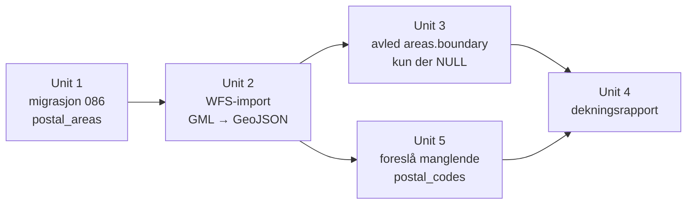

# feat: Dekningsregnskap på postnummer

## Overview

Placy kan i dag ikke svare på spørsmålet «hvilke steder dekker vi?». Det finnes 46 rader
i `v2.areas`, men bare 9 har både polygon og redaksjonelt innhold — og ingenting i systemet
teller det, viser det, eller bruker det til å prioritere hva som kurateres neste.

Denne planen gjør dekning til et regnskap. Kartverkets postnummerområde-polygoner importeres
til en ny referansetabell, de 37 områdene som mangler polygon får det avledet fra postnumrene
sine, og et rapportsteg klassifiserer hvert av de 114 postnumrene som `ukjent`, `geometri`,
`kuratert` eller `dekket` — 105 i markedet (Trondheim, Stjørdal, Melhus, Malvik) pluss 9 der
to allerede kuraterte områder ligger.

Modellen er Fastout-modellen: gjør jobben på området **før** noen spør. Når en megler en dag
skal selge en bolig i et strøk, er lokasjonen det eneste som trengs — alt annet ligger klart.

## Problem Frame

Moat 1 (Lokalkunnskap) er Placy-eid stedskunnskap. Strategi-dokumentet fra 2026-08-13
avgrenset *hva* i den som er vår, og landet at leverandør-tekst er stillas og kuratert tekst
er varelageret (se `docs/strategy/2026-08-13-moat-1-avgrensning-leverandortekst-vs-eid-kunnskap.md`).

Det dokumentet lot ett spørsmål stå åpent: hvordan vet vi hvor vi står? I dag finnes tre
symptomer på at vi ikke vet:

1. **Geofencen avviser boliger vi burde dekket.** `findAreaForPoint` krever at `areas`-raden
   har både `boundary` og `report_editorial`. 37 av 46 rader mangler polygon, og det avviste
   16 av Grilstadportens 35 boliger — ikke fordi kunnskapen manglet, men fordi ingen hadde
   tegnet en form.
2. **`postal_codes` leses aldri.** Kolonnen skrives av `scripts/curate-area.ts` og har ingen
   konsument. Det finnes altså ingen adresse → dekning-oppslag.
3. **«Dekket» er et flagg, ikke en måling.** Systemet vet at et område har 6 temaer, men ikke
   om punktene inne i området har kunnskap.

Verifisert grunnlag (kjørt live 2026-08-13, ikke antatt):

| Kilde | Funn |
|---|---|
| Kartverket Postnummerområder WFS | Leverer polygoner med `postnummer`, `poststed`, `kommune`. Ingen API-nøkkel. Filter på kommune virker. |
| Samme WFS, kommune 5001 | **77 unike postnumre** i Trondheim, 268 KB GML |
| Brings postnummerregister | **77** geografiske postnumre i Trondheim (type G/B) — to uavhengige kilder stemmer |
| Brings register, øvrige | Stjørdal 16, Melhus 8, Malvik 4 → **105** i de fire kommunene |
| Brings register, to kuraterte områder utenfor | Oppdal (5021) 7, Inderøy (5053) 2 → **114 totalt** med disse |
| Kartverket adresse-API | `Martin Barstads veg 23C` → `7056 RANHEIM` + koordinater, gratis, uten nøkkel |
| `v2.areas` i prod | 46 rader, 9 med `boundary` + 6 temaer, 37 uten polygon |
| `v2.postal_areas` i prod | Finnes ikke (404) |

## Requirements Trace

- **R1.** Hvert av de 105 geografiske postnumrene i Trondheim, Stjørdal, Melhus og Malvik
  finnes som en rad med polygon i basen, hentet fra Kartverket. I tillegg tas Oppdal (7) og
  Inderøy (2) med — ikke fordi de er markedet, men fordi to av områdene med håndtegnet
  polygon ligger der (Straumen og Oppdal), og de må kunne telles. **114 totalt.**
- **R2.** Importen er idempotent — kan kjøres på nytt når Kartverket oppdaterer, uten
  duplikater og uten å endre rader som er uendret i kilden.
- **R3.** `areas`-rader som mangler `boundary` får det avledet som en MultiPolygon av
  områdets `postal_codes`.
- **R4.** De 9 `areas`-radene som allerede har håndtegnet `boundary` endres ikke.
- **R5.** Et rapportsteg klassifiserer hvert postnummer som `ukjent`, `geometri`, `kuratert`
  eller `dekket`, og oppgir totaler per kommune.
- **R6.** Rapporten oppgir eksplisitt hva som ikke er dekket av kjøringen (postnumre uten
  område, områder uten `postal_codes`) — aldri stille utelatelse.
- **R7.** `lib/pipeline/find-area-for-point.ts` endres ikke. Den skal treffe flere områder
  fordi dataene er bedre, ikke fordi koden er endret.
- **R8.** Områder som har polygon men tom `postal_codes` får forslag til hvilke postnumre
  som overlapper, slik at de ikke faller ut av regnskapet. Straumen og Oppdal har begge
  håndtegnet polygon og tom liste — og Straumen er det mest komplette området vi har, så
  uten dette ville rapporten oversett nettopp det beste eksempelet.

  *Korrigert under implementering:* denne planen sa først «ni ferdig kuraterte områder».
  Regnskapet viser at det er **åtte**. Oppdal har alle seks tema-nøkler, men hver `body` er
  tom — tellingen bak «ni» telte nøkler, ikke innhold.

## Scope Boundaries

- **Ingen visuell dekningskart-flate.** Rapporten er tekstlig (CLI), som `curate-pois --list`.
- **Ingen grunnkretser.** Kartverket har dem gratis på samme sted, men postnummer er
  oppslagsnøkkelen megleren faktisk har. Finere oppdeling er unødvendig før vi merker at
  et postnummer er for grovt.
- **Ingen kuratering av innhold.** Denne planen bygger regnskapet, ikke varelageret.
- **Ingen ny geometri-avhengighet.** Ekte polygon-union (sammensmelting av naboformer til
  én ytre kontur) gjøres ikke — se Beslutning 3.
- **Ingen endring av `find-area-for-point.ts`** (R7).

### Deferred to Separate Tasks

- **`coverage_demand` skal logge postnummer i tillegg til adresse**, slik at etterspørselen
  grupperes på område i stedet for på enkeltbolig. Tabellen finnes i prod (migrasjon 082),
  men koden som kaller `record_coverage_demand` ligger på den ukoblede branchen
  `feat/megler-self-serve` (worktree `../placy-megler`). Gjøres der, etter at denne planen
  har landet, siden den trenger `postal_areas` for å slå opp postnummeret.
- **Dekningskart som salgs-asset** — grå/grønne polygoner over Trondheim. Egen oppgave når
  regnskapet finnes og har tall å vise.
- **Sortering av arbeidskøen på faktisk etterspørsel** — avhenger av at `coverage_demand`
  har rader og logger postnummer. Til da sorteres rapporten på kommune og postnummer.

## Context & Research

### Relevant Code and Patterns

- `lib/pipeline/find-area-for-point.ts` — geofencen. Krever `boundary` + `report_editorial`,
  filtrerer server-side, kjører `pointInGeometry` per rad, fail-soft til nivå 1. Skal ikke
  endres, men er grunnen til at avledningen har verdi.
- `lib/utils/geo.ts` — `pointInGeometry` håndterer **både `Polygon` og `MultiPolygon`**
  (verifisert linje 119–140). Dette er hele grunnlaget for Beslutning 3.
- `lib/pipeline/area-staging.ts` — Zod-validering av staging-form. Mønster for ren,
  testbar validering. `postal_codes: z.array(z.string().min(1)).optional()` finnes alt.
- `lib/pipeline/apply-area-staging.ts` — skrivemønsteret mot `v2.areas`: rå REST med
  `Content-Profile: v2`, klient-side spread-merge → PATCH på id. **`areas` har ingen
  `updated_at`-kolonne**, så ingen optimistisk lås (dokumentert valg, én-operatør-PoC).
  0-rader-PATCH er en feil, ikke en no-op.
- `scripts/ground-poi-content-lib.ts` + `scripts/ground-poi-content.ts` — konvensjonen for
  ren logikk i en `-lib`-fil med tester, og I/O + CLI i wrapper-scriptet.
- `scripts/curate-area.ts` — skriver `postal_codes` i dag (linje ~175). Eneste produsent.
- `supabase/migrations/084_poi_grounding_kolonne.sql` — migrasjonsstilen: tung
  HVA/HVORFOR/FORM-header, additiv, med ROLLBACK-seksjon.

### Institutional Learnings

- `docs/solutions/data-import/import-wfs-geographic-data-20260125.md` — WFS-import er gjort
  før (227 POI-er fra Trondheim kommunes GeoServer). Viktig delta: **den WFS-en returnerte
  GeoJSON direkte. Kartverkets gjør ikke** — den tilbyr bare GML og `text/xml`. Sjekklista
  i dokumentet (be om WGS84 direkte, håndter begge geometri-typer, ID-kollisjonssjekk,
  verifiser mot basen etterpå) gjelder fortsatt.
- `docs/solutions/database-issues/jsonb-merge-vs-overwrite-seed-scripts-20260413.md` —
  seed-scripts som overskriver jsonb i stedet for å merge har bitt oss før. Relevant for
  Unit 3: avledningen skal bare røre `boundary`, ikke hele raden.

### External References

- Kartverket «Postnummerområder», Geonorge-uuid `462a5297-33ef-438a-82a5-07fff5799be3`.
  WFS: `https://wfs.geonorge.no/skwms1/wfs.postnummeromrader`, typenavn
  `app:Postnummerområde`, default CRS `EPSG::4258`.
- Nedlastings-APIet for samme datasett tilbyr **GeoJSON, GML, SOSI, FGDB** per kommune
  (kommunekoder: Trondheim 5001, Melhus 5028, Malvik 5031, Stjørdal 5035). Aktuelt som
  reserveløsning — se Beslutning 2.
- Brings postnummerregister: `https://www.bring.no/postnummerregister-ansi.txt`,
  Windows-1252, tab-separert, CRLF. Kolonner: postnummer, poststed, kommunenummer,
  kommunenavn, type (`G` gateadresse, `B` både, `P` postboks, `S` service).

## Key Technical Decisions

**Beslutning 1 — Egen tabell `v2.postal_areas`, ikke rader i `areas`.**
114 postnummer-polygoner er referansegeometri fra Kartverket, ikke kuraterte Placy-strøk.
Lagt i `areas` ville de mer enn tredoblet tabellen, gjort `level`-feltet meningsløst, og
blandet «data vi eier» med «data vi henter». `areas.postal_codes` er koblingen.

**Beslutning 2 — WFS + GML-parsing, ikke nedlastings-APIet.**
Nedlastings-APIet gir GeoJSON og sparer oss for parsing, men krever en asynkron
bestill → poll → hent-zip-flyt med filartefakter. WFS er ett synkront GET per kommune,
verifisert live, med filter på kommune. `fast-xml-parser@^5.3.4` er allerede en avhengighet,
så GML-parsing koster ingen ny pakke. Hvis GML-formen viser seg mer variert enn de fire
kommunene avslører, er nedlastings-APIet reserveløsningen — noter det i scriptets header.

**Beslutning 3 — Avledet `boundary` er en MultiPolygon, ikke en ekte union.**
Et område med fire postnumre får en MultiPolygon med fire flater, ikke én sammensmeltet
ytterkontur. Grunnen er at `pointInGeometry` allerede itererer over alle flater i en
MultiPolygon, så treff-oppførselen er identisk — og en ekte union krever et
polygon-clipping-bibliotek vi ellers ikke trenger. Kostnaden er kosmetisk: tegner vi formen
i et kart senere, vises indre grenser mellom postnumrene. Det er akseptabelt, og kan løses
den dagen kartet bygges.

**Beslutning 4 — Koordinatrekkefølge må snus.**
Kartverkets GML leverer `EPSG::4258` med **lat før lon** (`63.469560 10.539321` — verifisert
i uttrekket). GeoJSON krever `[lng, lat]`. Dette er den mest sannsynlige stille feilen i hele
planen: en ombyttet form havner i Somalia uten å kaste noen feil, og `pointInGeometry` ville
bare returnert `false` for alt. Derfor har Unit 2 en eksplisitt test på rekkefølgen og Unit 3
en fornuftssjekk på at avledede polygoner ligger innenfor Norges bbox.

**Beslutning 5 — `postnummer` er tekst, aldri tall.**
`0010` er et gyldig postnummer og blir `10` som tall. Samme regel som POI-IDer, som er TEXT
og aldri uuid.

**Beslutning 6 — «Dekket» defineres som en terskel, med et forsvarbart utgangspunkt.**
De fire statusene:

| Status | Betyr |
|---|---|
| `ukjent` | Ingen `areas`-rad lister dette postnummeret i `postal_codes` |
| `geometri` | Område finnes med polygon, men `report_editorial` er tom |
| `kuratert` | Alle 6 bolig-temaer har redaksjonell tekst |
| `dekket` | `kuratert` **og** minst 4 høydepunkt-POIer per tema har brukbar tekst |

«Brukbar tekst» = `grounding.curated` eller en `grounding.generated` som passerte
kvalitetsporten. Terskelen 4 kommer fra høydepunkt-regnestykket i strategi-dokumentet
(4–6 per tema × 6 temaer = 25–35 per strøk). Tallet skal være en konstant med navn, ikke
strødd i logikken, slik at det kan justeres når vi ser hva som faktisk holder.

## Open Questions

### Resolved During Planning

- **Finnes polygonene gratis?** Ja. Kartverket, WFS, ingen nøkkel. Verifisert ved å hente
  Ranheim-polygonene (7053/7054/7055) og hele Trondheim (77 features).
- **Virker kommune-filteret, eller må vi hente hele Norge?** Filter virker med WFS 2.0
  `fes:Filter` på `kommune`. 268 KB for Trondheim.
- **Stemmer antallet?** Ja — 77 fra WFS mot 77 fra Brings register for Trondheim.
- **Trenger vi et geometri-bibliotek for union?** Nei (Beslutning 3).
- **Trenger vi en ny XML-avhengighet?** Nei, `fast-xml-parser` er allerede inne.
- **Er `boundary`-avledningen risikabel?** Nei. Ingenting er shippet til noen kunde, så
  verste utfall er å kjøre importen på nytt. Regelen om å ikke røre de 9 håndtegnede
  polygonene står som et kvalitetskrav (de er finere enn postnummerformen), ikke som
  datasikkerhet.

### Deferred to Implementation

- **Om GML-en inneholder `MultiSurface` med flere `patches` for noen postnumre.** De testede
  uttrekkene hadde én flate per postnummer, men eksklaver finnes i Norge. Parseren skal
  håndtere begge, og implementeringen avgjør om det trengs mer enn en enkel patch-løkke.
- **Eksakt oppslag fra `poststed` til `areas`-rad.** Flere postnumre deler poststed
  (7053–7056 er alle RANHEIM). Om rapporten skal gruppere på poststed i tillegg til
  kommune avgjøres når tallene er på skjermen.
- **Hvor mange av de 37 områdene som faktisk har `postal_codes`.** 9 rader har 0 postnumre
  i uttrekket, mest på `city`/`bydel`-nivå — men Straumen og Oppdal er ferdig kuraterte
  `strok` med tom liste. Unit 3 rapporterer disse i stedet for å gjette.

## Implementation Units

Arbeidet hører i en egen worktree fra `main` — dette er uavhengig av Utforsk-modalens
12 ukoblede commits på `feat/utforsk-modal`, og skal ikke arve dem inn i en PR.

- [ ] **Unit 1: Migrasjon 086 — `v2.postal_areas`**

**Goal:** Referansetabellen for Kartverkets postnummer-polygoner finnes i prod.

**Requirements:** R1

**Dependencies:** Ingen

**Files:**
- Create: `supabase/migrations/086_postal_areas.sql`

**Approach:**
- Kolonner: `postnummer` (text, PK — Beslutning 5), `poststed` (text), `kommunenummer`
  (text), `kommunenavn` (text), `boundary` (jsonb, GeoJSON MultiPolygon), `source_local_id`
  (text, Kartverkets `lokalId`), `source_updated_at` (timestamptz, fra
  `oppdateringsdato`), `imported_at` (timestamptz default now()).
- `boundary` som jsonb, ikke PostGIS-geometri — resten av kodebasen gjør point-in-polygon
  i TypeScript (`lib/utils/geo.ts`), og PostGIS ville introdusert en andre sannhet om
  geometri i systemet.
- RLS default-deny, service-role-only grant. Nye objekter arver ikke 070s `ALL TABLES`-grant
  (samme fallgruve som migrasjon 082 dokumenterte).
- Indeks på `kommunenummer` — rapporten grupperer på den.
- ROLLBACK-seksjon i kommentar, som 084.
- Kjøres via psql direkte (`supabase db push` virker ikke med vår nummerering) og verifiseres
  mot prod før uniten regnes som ferdig.

**Patterns to follow:**
- `supabase/migrations/084_poi_grounding_kolonne.sql` — header-form og ROLLBACK
- `supabase/migrations/082_*.sql` i `../placy-megler` — grant- og RLS-oppsettet for en ny tabell

**Test expectation:** none — DDL. Verifiseres ved at et `select=postnummer&limit=1`-kall mot
`v2.postal_areas` svarer 200 i stedet for 404.

**Verification:**
- Tabellen svarer 200 på REST med `Accept-Profile: v2`
- Anon-nøkkel får ikke lese den

---

- [ ] **Unit 2: WFS-import med GML-parsing**

**Goal:** De 114 postnumrene ligger i `postal_areas` med riktig orienterte polygoner, og
kjøringen kan gjentas.

**Requirements:** R1, R2

**Dependencies:** Unit 1

**Files:**
- Create: `lib/pipeline/postal-area-import.ts` (ren logikk: GML → GeoJSON, validering)
- Create: `lib/pipeline/postal-area-import.test.ts`
- Create: `scripts/import-postal-areas.ts` (CLI: fetch, upsert, rapport)
- Modify: `COMMANDS.md`

**Approach:**
- Ren logikk skilt fra I/O, som `ground-poi-content-lib.ts` mot `ground-poi-content.ts`.
  Parsing og geometri-normalisering er der testene ligger; nettverk og skriving i scriptet.
- Ett WFS-kall per kommune med `fes:Filter` på `kommune`. Kommunekoder som en navngitt
  konstant, overstyrbar via CLI-flagg. Default: Trondheim 5001, Stjørdal 5035, Melhus 5028,
  Malvik 5031 (markedet) pluss Oppdal 5021 og Inderøy 5053 (der Oppdal- og Straumen-området
  ligger). Konstanten skal ha en kommentar som sier hvorfor de to siste er med, ellers ser de
  ut som støy og blir fjernet av neste person.
- Parse med `fast-xml-parser`. Ut av hver feature: `postnummer`, `poststed`, `kommune`,
  `lokalId`, `oppdateringsdato` og alle `gml:posList`-flater.
- **Snu koordinatparene** (Beslutning 4) og normaliser alltid til MultiPolygon, også når
  det er én flate — én form i basen er enklere enn to.
- Lukk ringer som ikke er lukket i kilden (GeoJSON krever at første og siste punkt er like).
- Upsert på `postnummer`. Skriv bare når `source_updated_at` eller geometrien faktisk er
  endret, slik at gjentatte kjøringer ikke støyer (R2).
- Dry-run som default, `--apply` for å skrive — samme kontrakt som
  `ground-poi-content.ts` og `refresh-opening-hours.ts`.
- Avbryt kjøringen hvis en kommune returnerer 0 features. Vi vet at alle fire har flere, så
  0 betyr endret API-kontrakt, ikke tomt datasett.
- Rapporter antall per kommune mot forventet fra Brings register, og skriv avviket eksplisitt.

**Execution note:** Skriv parser-testene før parseren. Koordinatrekkefølge og ringlukking er
nøyaktig den typen feil som ikke kaster noen exception, og en test som feiler først er den
billigste måten å bevise at snuingen skjer.

**Patterns to follow:**
- `scripts/ground-poi-content-lib.ts` — ren logikk + `SkipReason`-klassifisering
- `docs/solutions/data-import/import-wfs-geographic-data-20260125.md` — WFS-sjekklista
- `scripts/seed-osm-pois.ts` — eksisterende ekstern-data-seed med dry-run

**Test scenarios:**
- *Happy path:* GML med ett `Postnummerområde` → én rad med `postnummer` `"7053"`,
  `poststed` `"RANHEIM"`, `boundary.type === "MultiPolygon"`
- *Happy path:* `posList` `"63.469560 10.539321 63.446336 10.571055"` → koordinater
  `[[10.539321, 63.469560], [10.571055, 63.446336]]` — lon først
- *Happy path:* feature med to `patches` → MultiPolygon med to flater
- *Happy path:* feature med én flate → fortsatt MultiPolygon, ikke Polygon
- *Edge case:* ring der siste punkt ≠ første → ringen lukkes, siste punkt lik første
- *Edge case:* postnummer `"0010"` → bevart som streng `"0010"`, ikke `10`
- *Edge case:* `oppdateringsdato` mangler på en feature → raden importeres med
  `source_updated_at = null`, ikke forkastet
- *Edge case:* `posList` med oddetall antall tall → feature forkastet med navngitt årsak,
  resten av kjøringen fortsetter
- *Error path:* svaret er en `ows:ExceptionReport` → feil kastes med
  `ExceptionText` i meldingen, ingen tom liste returneres
- *Error path:* 0 features for en kommune → kjøringen avbrytes med exit-kode ≠ 0
- *Error path:* koordinat utenfor Norges bbox (lat 57–72, lon 4–32) → feature forkastet med
  navngitt årsak. Fanger en ombyttet rekkefølge som slipper gjennom alt annet
- *Integration:* upsert av samme datasett to ganger → andre kjøring rapporterer 0 endringer

**Verification:**
- `postal_areas` har 114 rader, fordelt 77 / 16 / 8 / 7 / 4 / 2 på Trondheim / Stjørdal /
  Melhus / Oppdal / Malvik / Inderøy
- Et kjent punkt (Martin Barstads veg 23C, 63.4217 / 10.5198) ligger inne i polygonet for 7056
- Andre kjøring uten `--apply` rapporterer ingen endringer

---

- [ ] **Unit 3: Avled `areas.boundary` fra `postal_codes`**

**Goal:** De 37 områdene uten polygon får et, uten at de 9 håndtegnede røres.

**Requirements:** R3, R4, R6, R7

**Dependencies:** Unit 2

**Files:**
- Create: `lib/pipeline/derive-area-boundary.ts`
- Create: `lib/pipeline/derive-area-boundary.test.ts`
- Modify: `scripts/import-postal-areas.ts` (nytt `--derive-boundaries`-steg)
- Modify: `COMMANDS.md`

**Approach:**
- For hver `areas`-rad: hopp over hvis `boundary` er satt (R4 — dette er den viktigste
  regelen i uniten og skal ha en test som låser den). Hopp over med navngitt årsak hvis
  `postal_codes` er tom eller null.
- Slå opp hvert postnummer i `postal_areas`, samle alle flater til én MultiPolygon
  (Beslutning 3).
- Skriv **bare** `boundary`-feltet via PATCH på id. Ikke spread hele raden inn igjen —
  `jsonb-merge-vs-overwrite`-læringen gjelder. `areas` har ingen `updated_at`, så ingen
  optimistisk lås (samme dokumenterte valg som `apply-area-staging.ts`).
- Rapporter fire tall: avledet, hoppet over fordi boundary fantes, hoppet over fordi
  `postal_codes` manglet, og postnumre i `postal_codes` som ikke fantes i `postal_areas` (R6).
- Dry-run default, `--apply` for å skrive.

**Execution note:** Skriv testen som beviser at en rad med eksisterende `boundary` forblir
byte-identisk, før avledningen implementeres. R4 er det ene stedet uniten kan gjøre reell
skade på kuratert arbeid.

**Patterns to follow:**
- `lib/pipeline/apply-area-staging.ts` — PATCH mot `v2.areas` med `Content-Profile: v2`,
  0-rader-PATCH som feil
- `lib/utils/geo.ts` — `GeoJsonPolygonGeometry`-typen som `find-area-for-point` forventer

**Test scenarios:**
- *Happy path:* område med `postal_codes` `["7053","7054"]` → MultiPolygon med flatene fra
  begge postnumre
- *Happy path:* område med ett postnummer → MultiPolygon med én flate
- *Edge case:* område som allerede har `boundary` → uendret, og PATCH sendes ikke i det hele
  tatt (R4)
- *Edge case:* `postal_codes` er `null` → hoppet over, tellet som «mangler postnummer»
- *Edge case:* `postal_codes` er `[]` → samme som null
- *Edge case:* `postal_codes` inneholder et postnummer som ikke finnes i `postal_areas` →
  advarsel, de øvrige flatene brukes likevel
- *Edge case:* ingen av områdets postnumre finnes → ingen `boundary` skrives (en tom
  MultiPolygon ville gjort raden synlig for geofencen uten å treffe noe)
- *Error path:* PATCH returnerer 0 rader → feil, ikke stille no-op
- *Integration:* etter avledning returnerer `findAreaForPoint` for et punkt inne i et nylig
  avledet område den raden — uten at `find-area-for-point.ts` er endret (R7)
- *Integration:* et punkt i et område som har både håndtegnet boundary og postnumre treffer
  fortsatt samme rad som før avledningen

**Verification:**
- Antall `areas`-rader med `boundary` har gått fra 9 til 9 + antall rader som hadde
  `postal_codes`
- De 9 opprinnelige polygonene er uendret (sammenlign før/etter)
- `findAreaForPoint` treffer minst ett nytt område som den avviste før

---

- [ ] **Unit 4: Dekningsrapport**

**Goal:** Ett kall svarer på «hvilke steder dekker vi, og hva mangler».

**Requirements:** R5, R6

**Dependencies:** Unit 2, Unit 3

**Files:**
- Create: `lib/pipeline/coverage-ledger.ts`
- Create: `lib/pipeline/coverage-ledger.test.ts`
- Create: `scripts/coverage-report.ts`
- Modify: `COMMANDS.md`

**Approach:**
- Ren klassifiseringsfunksjon: gitt postnumre, `areas`-rader og POI-tekst-tilstand, returner
  status per postnummer etter Beslutning 6. Testene ligger på klassifiseringen, ikke på
  utskriften.
- Terskelen for `dekket` som navngitt konstant, ikke et magisk tall i logikken.
- Utskrift: én linje per postnummer gruppert på kommune, med totaler og prosent per status.
- Rapporter eksplisitt begge retninger av hull (R6): postnumre uten område, **og** områder
  uten postnumre. Det siste er hvordan Straumen og Oppdal ble oppdaget.
- Sorter på kommune og postnummer. Etterspørsels-sortering venter på `coverage_demand`
  (se Deferred to Separate Tasks) — og rapporten skal si at den ikke er der ennå, ikke
  bare utelate den.

**Patterns to follow:**
- `scripts/curate-pois-lib.ts` — `WHY_RANK`-mønsteret for rangert klassifisering, og regelen
  om at ingenting droppes stille fra en liste
- `scripts/ground-poi-content.ts` — dekningsgrad-utskrift med histogram

**Test scenarios:**
- *Happy path:* postnummer som ingen `areas`-rad lister → `ukjent`
- *Happy path:* postnummer i et område med `boundary` men tom `report_editorial` → `geometri`
- *Happy path:* postnummer i et område med alle 6 temaer, men 0 POI-er med tekst → `kuratert`
- *Happy path:* samme område der hvert tema har 4+ høydepunkter med tekst → `dekket`
- *Edge case:* tema med 3 POI-er med tekst der terskelen er 4 → fortsatt `kuratert`,
  ikke `dekket`
- *Edge case:* POI med `grounding.curated` teller; POI med bare `grounding.lastAttempt`
  teller ikke
- *Edge case:* POI med `grounding.generated` som ikke passerte porten teller ikke
- *Edge case:* postnummer listet i to `areas`-rader → høyeste status vinner, og overlappet
  rapporteres
- *Edge case:* område med `report_editorial` men uten `boundary` → `geometri` kan ikke gjelde;
  klassifiseres som `ukjent` med egen merknad, siden geofencen ikke kan treffe det
- *Integration:* totalene summerer til 114, og summen av statusene er lik totalen — ingen
  postnummer forsvinner mellom kategoriene

**Verification:**
- Rapporten kjører mot prod og oppgir 114 postnumre fordelt på fire statuser
- Summen av statusene er 114, og markedet (de fire kommunene, 105) er skilt ut som eget tall
  slik at Oppdal og Inderøy ikke pynter på dekningsgraden
- Områder uten postnumre er listet separat, og Straumen og Oppdal står der

---

- [ ] **Unit 5: Foreslå manglende `postal_codes` fra polygon-overlapp**

**Goal:** Områder med polygon men tom postnummerliste faller ikke ut av regnskapet.

**Requirements:** R8, R6

**Dependencies:** Unit 2

**Files:**
- Create: `lib/pipeline/suggest-area-postal-codes.ts`
- Create: `lib/pipeline/suggest-area-postal-codes.test.ts`
- Modify: `scripts/coverage-report.ts` (eget `--suggest-postal-codes`-steg)

**Approach:**
- Motsatt retning av Unit 3: der Unit 3 lager geometri fra postnumre, leser denne uniten
  geometri og foreslår postnumre.
- **Rapporterer, skriver ikke.** Forslagene går til kurator som kopierer dem inn i
  `curate-area.ts`-staging. Grunnen er ikke risiko (ingenting er shippet), men at
  postnummer-tilknytning er en påstand om hvor et strøk *er* — og det er kurators
  beslutning, ikke en geometrisk bieffekt. Samme prinsipp som at `curate-pois.ts` lager en
  arbeidsliste i stedet for å skrive tekst selv.
- Overlappstesten bruker `pointInGeometry` som allerede finnes, i to retninger for å unngå
  begge blindsonene: postnummerets ringpunkter testet mot områdets polygon, og områdets
  `center_lat`/`center_lng` testet mot postnummerets polygon. Første fanger delvis overlapp,
  andre fanger et lite område som ligger helt inne i ett stort postnummer uten at noe
  ringpunkt er innenfor.
- Metoden er **tilnærmet**, og det skal stå i rapporten. Den kan i prinsippet overse et
  postnummer som overlapper området i et smalt bånd uten ringpunkter innenfor. For 9 områder
  er kurator-bekreftelse billigere enn en eksakt polygon-skjæring som ville krevd et nytt
  bibliotek (samme avveining som Beslutning 3).
- Sorter forslagene på hvor mange ringpunkter som traff, slik at det mest sannsynlige
  postnummeret står først.

**Patterns to follow:**
- `lib/utils/geo.ts` — `pointInGeometry`, håndterer Polygon og MultiPolygon
- `scripts/curate-pois.ts --list` — foreslår arbeid i stedet for å utføre det
- `scripts/curate-area.ts --list-pois` — read-only kandidatliste kurator kopierer fra

**Test scenarios:**
- *Happy path:* område hvis polygon overlapper to postnummerområder → begge foreslått,
  sortert på antall treffpunkter
- *Happy path:* lite område helt inne i ett stort postnummer, uten ringpunkter innenfor →
  fanget av senterpunkt-testen
- *Edge case:* område som allerede har `postal_codes` → hoppes over, ingen forslag
- *Edge case:* område uten `boundary` → hoppes over med navngitt årsak (kan ikke overlappe noe)
- *Edge case:* område som ikke overlapper noe postnummer i basen (kommunen er ikke importert)
  → rapportert som «ingen treff — kommunen mangler i importen», ikke stille utelatt
- *Edge case:* område med `center_lat`/`center_lng` null → bare ringpunkt-testen kjøres
- *Integration:* kjørt mot prod gir Straumen forslag om 7670 (Inderøy) og Oppdal-området
  forslag blant 7340–7347 — begge kommunene er med i importens default-liste (Unit 2)

**Verification:**
- Alle `areas`-rader med boundary og tom `postal_codes` er listet, med forslag eller med
  eksplisitt «ingen treff»
- Rapporten sier at metoden er tilnærmet og krever kurator-bekreftelse
- Ingen skriving til `areas` skjer i dette steget

## System-Wide Impact

- **Interaction graph:** `findAreaForPoint` er den eneste leseren av `areas.boundary`, og
  kalles fra `inherit-area-editorial.ts` i provisjonerings-pipelinen. Unit 3 endrer *dataene*
  den leser, ikke koden. Flere områder som treffer betyr at flere boards arver nivå-2-editorial
  — det er hele poenget, men det betyr også at et board som før falt til nivå 1 nå kan komme
  med arvet innhold. Verifiser på minst ett eksisterende board at arven ikke endrer seg
  uventet.
- **Error propagation:** Importen feiler høyt (exit ≠ 0) ved API-kontraktsbrudd. Avledningen
  feiler høyt ved 0-rader-PATCH. Rapporten skal aldri feile på manglende data — det er dens
  jobb å rapportere fravær.
- **State lifecycle risks:** Avbrutt avledning etterlater noen områder med boundary og andre
  uten. Det er trygt fordi steget er idempotent: et område som har boundary hoppes over ved
  neste kjøring uansett grunn.
- **API surface parity:** Ingen ny API-rute. Alt er scripts, som resten av
  provisjonerings-pipelinen.
- **Unchanged invariants:** `lib/pipeline/find-area-for-point.ts` er uendret (R7). De 9
  håndtegnede polygonene er uendret (R4). `areas`-skjemaet får ingen nye kolonner.
  `curate-area.ts` fortsetter å skrive `postal_codes` som før — den blir nå lest, men
  kontrakten er den samme.

## Risks & Dependencies

| Risk | Mitigation |
|------|------------|
| Ombyttet lat/lon gir polygoner i havet uten å kaste feil | Eksplisitt test på rekkefølge (Unit 2) + Norge-bbox-sjekk som forkaster feature (Beslutning 4) |
| Avledningen overskriver kuratert håndtegnet geometri | `boundary IS NULL`-gate, test som låser byte-identitet, dry-run default (R4) |
| Postnummerformen er grovere enn strøket, så geofencen godtar adresser i nabostrøket | Akseptert. Et treff med arvet nabolagsinnhold er bedre enn en avvisning, og de 9 kuraterte områdene beholder sin finere form. Merk i rapporten hvilke områder som har avledet vs. håndtegnet form |
| Kartverket endrer WFS-kontrakten | 0-features-abort fanger det ved neste kjøring i stedet for å tømme tabellen stille. Nedlastings-APIet med GeoJSON er reserveløsningen (Beslutning 2) |
| `coverage_demand`-koden ligger på en ukoblet branch | Eksplisitt utsatt (Deferred to Separate Tasks). Denne planen leverer verdi uten den |
| Migrasjonsnummer kolliderer på tvers av worktrees | 086 er verifisert ledig i dette repoet, men `../placy-megler` har 081–082 og hovedrepoet har en utracket 083. Sjekk `ls supabase/migrations/` i alle worktrees før nummeret låses |

## Documentation / Operational Notes

- `COMMANDS.md` får en seksjon for de to nye scriptene, og en rad i vedlikeholdstabellen:
  postnummer-importen kjøres når Kartverket oppdaterer (sjelden — årlig er nok), til 0 API-kost
  siden datasettet er gratis.
- Når regnskapet gir sitt første tall, hører det i `docs/strategy/LOG.md` — dekningsgraden er
  et forretningstall, ikke bare et teknisk.
- Nytt læringsdokument i `docs/solutions/data-import/` for Kartverket-GML: at WFS-en ikke gir
  GeoJSON, at lat kommer før lon, og at kommune-filteret er `fes:Filter` på `kommune`. Det er
  de tre tingene neste person kommer til å bruke tid på.

## Sources & References

- Strategi-kontekst: `docs/strategy/2026-08-13-moat-1-avgrensning-leverandortekst-vs-eid-kunnskap.md`
- Geofence: `lib/pipeline/find-area-for-point.ts`
- Skrivemønster: `lib/pipeline/apply-area-staging.ts`
- WFS-læring: `docs/solutions/data-import/import-wfs-geographic-data-20260125.md`
- Kartverket Postnummerområder: Geonorge-uuid `462a5297-33ef-438a-82a5-07fff5799be3`
- Brings postnummerregister: `https://www.bring.no/postnummerregister-ansi.txt`
