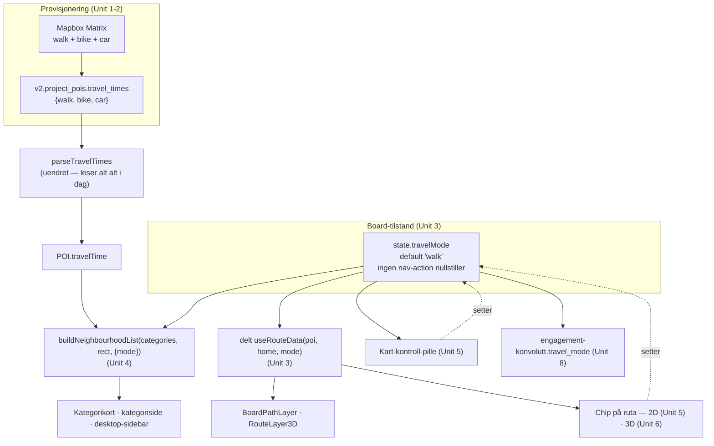
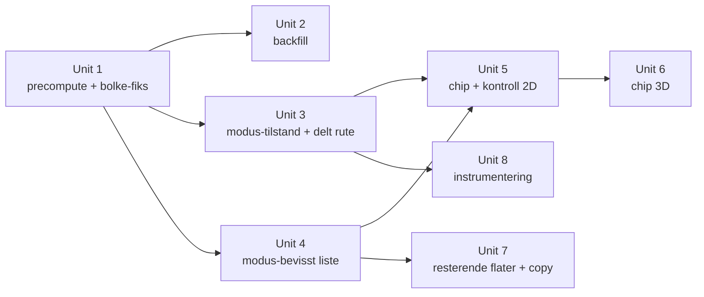

# feat: Reisemodus-veksler på rapport-boardet (gå / sykkel / bil)

## Overview

Rapport-boardet oppgir alle avstander som gangtid. Denne planen gir boardet én aktiv
reisemodus — gå (default), sykkel eller bil — som styrer alle minutt-tall, sorteringen og
rutelinja. Reisetidene precomputes for alle tre modus ved provisjonering, så et modusbytte
er et perspektiv-bytte uten nettverkskall.

Arbeidet har fire lag: pipeline (precompute + backfill), tilstand (modus i board-state),
lesemodell (nabolagslista blir modus-parametrisert i stedet for gang-hardkodet), og
presentasjon (chip på ruta i begge kartmotorer + vedvarende kontroll).

## Problem Frame

Se origin: `docs/brainstorms/2026-08-14-reisemodus-veksler-board-requirements.md`.

Kort: boardet undersolgt hver adresse som ikke er tett by. Målt på
`intern_martin-barstads-veg-23c` er Solbakken barnehage 35 minutter å gå, 17 å sykle og 11 å
kjøre — boardet forteller bare det første tallet. Gangtid er den eneste linsen som finnes.

## Requirements Trace

Alle R-numre refererer til origin-dokumentet.

- R1. Én aktiv modus per board: gå (default), sykkel, bil. Gå ved hver sidelasting.
- R2. Valget gjelder hele boardet — alle minutt-tall leser aktiv modus.
- R3. Valget lever i økten, ikke per punkt. Navigasjon nullstiller det ikke.
- R4. Sortering og rangering følger aktiv modus.
- R5. To innganger med delt tilstand: chip på ruta (punkt åpent) + vedvarende kart-kontroll.
- R6. Modus uten data skjules, ikke vises tom.
- R7. Alle tre profiler precomputes ved provisjonering.
- R8. Eksisterende boards backfilles — inkludert reparasjon av manglende gangtider.
- R9. Bolke-inndelingen må aldri produsere en bolk med én destinasjon.
- R10. Rutelinja følger aktiv modus.
- R11. Chipen fungerer i begge kartmotorer.
- R12. Utvidet chip kolliderer ikke med POI-popup eller kart-kontroll.
- R13. Statiske «alt i gangavstand»-tekster gjøres modus-nøytrale.
- R14. Aktiv modus bæres i engagement-kontekst-konvolutten.

## Scope Boundaries

- **Kollektiv er ikke en modus.** Se origin. Entur-reiseplanleggingen røres ikke.
- **POI-utvalget og discovery-radiusen endres ikke.** Modusbytte re-rammer samme sett.
  `lib/pipeline/report-defaults.ts` er uendret.
- **Byggetids-utvalgslogikk forblir gang-basert.** Konkret: tema-kvalifiseringen i
  `components/variants/report/report-data.ts` (opplevelser krever et punkt innen 15 min gange),
  POI-scoringen i `lib/utils/poi-score.ts` og `lib/utils/category-score.ts`, og
  kvalitetsfilteret i `lib/pipeline/poi-quality.ts`. Disse avgjør *hvilke* punkter som er på
  boardet — endres de per modus, endres boardets innhold, som er utenfor scope.
- **Generert og kuratert prosa forblir gang-rammet.** `lib/generators/bridge-text-generator.ts`
  røres ikke. Kun de statiske påstandene i R13 endres (syv tekster i fem filer — se Unit 7).
- **Paraform-varianten (`/rapport-paraform`) får ingen modusveksler.** `POIPopover.tsx` er live
  der, men på en annen produktflate uten kontroll — den forblir gang-basert.
- **Ingen ny global state-store.** Modusen hører i board-reduceren.
- **Midtbyen-giggen (`app/midtbyen/page.tsx`) får ingen nye modus.** Datasettet
  `lib/gigs/midtbyen/stores.json` har bare `walkMinutes` og bygges i kode, ikke via pipelinen.
  R6 dekker dette: boardet viser bare gå.

### Deferred to Separate Tasks

- **Modus-bevisst POI-radius** (bil-modus utvider settet utover gangavstand for rurale boards)
  — eget spor, se origin.
- **Kollektiv som fjerde modus** — når Entur-reiseplanleggingen får sin første konsument.
- **Sletting av `components/variants/report/ReportPOICard.tsx`** — verifisert 2026-08-14: filen
  importeres av ingen. Den leser `travelTime?.walk` og ville ellers stått som en gang-hardkodet
  flate. Dead-code-fjerning hører i en egen opprydding, ikke i denne planen.
- **Sletting av `components/variants/report/MapPopupCard.tsx`** — planen antok at denne var live
  via `POIExploreModal`. **Feil, verifisert under implementering 2026-08-14:** ingen komponent
  importerer den (bare kommentar-referanser fra `POIExploreModal`, `places-backfill-lib` og
  `scripts/midtbyen/enrich-stores.ts`, hvorav den siste sier det rett ut: «ingen montert komponent
  viser dem i dag»). Den er altså i samme kategori som `ReportPOICard`, og behandles likt: ikke
  gjort modus-bevisst, siden det ville vært arbeid på en flate ingen rendrer.
- **Orfan CSS for `gmp-popover`** i `app/globals.css:74-89` — stylet et Google 3D-popover som
  ble slettet med `components/map/poi-marker-3d.tsx` i cutover. Samme opprydding.

## Context & Research

### Relevant Code and Patterns

**Reisetid-motoren (finnes, underutnyttet)**
- `lib/pipeline/travel-times.ts` — `calculateTravelTimes` tar `profiles: TravelMode[]` og
  støtter walk/bike/car i dag. `computeProjectTravelTimes` kaller den med `["walk"]` hardkodet.
  Skriver til `v2.project_pois.travel_times` som `{walk?, bike?, car?}`.
- `lib/pipeline/provision.ts` — Steg 7 kaller `computeProjectTravelTimes`. Logglinja sier
  `(walk)` i klartekst.
- `lib/supabase/v2-queries.ts` — `parseTravelTimes` leser alle tre nøkler ut til
  `POI.travelTime` alt i dag. Read-siden er ferdig.
- `lib/types.ts` — `TravelMode = "walk" | "bike" | "car"` og `POI.travelTime` finnes.
  `travelModeLabels`/`travelModeIcons`/`travelModeToMapboxProfile` i `lib/utils.ts` finnes også,
  som arv fra Explorer — gjenbrukes.

**Lesemodellen for minutter**
- `lib/board/neighbourhood-list.ts` — ren funksjon uten kart eller nettverk.
  `walkMinutesOf`, `compareRows`, `categorySubline`, og felt-navnene
  `NeighbourhoodRow.walkMinutes` / `NeighbourhoodCategory.minWalk` / `.maxWalk`. Alt gang-navngitt.
- `components/variants/report/board/neighbourhood/use-viewport-category-list.ts` — speiler
  `minWalk`/`maxWalk` og leser `travelTime?.walk` direkte for punkter utenfor utsnittet.
- Render-flater som viser radminutter: `NeighbourhoodCategoryCard.tsx`, `CategoryPage.tsx`,
  `reels/DesktopStorySidebar.tsx`.

**Kart og rute**
- `lib/map/use-route-data.ts` — hardkoder `profile=walking`. Kalles fra
  `BoardPathLayer.tsx`, `BoardPathMidpointMarker.tsx` og `BoardMap3D.tsx`, altså **to til tre
  identiske Directions-kall per POI-klikk**. Duplikatet er dokumentert i kommentaren som
  akseptert prototype-gjeld med forslag om delt context.
- `components/variants/report/board/BoardPathMidpointMarker.tsx` — dagens chip. Sitter på
  rutens midtpunkt (bevisst valg 2026-04-30, `docs/plans/2026-04-30-002-fix-rapport-board-travel-time-placement-plan.md`).
- `components/map/route-layer-3d.tsx` — 3D-tidsmerket er en inline-SVG i et Google
  `Marker3DInteractiveElement`. Templaten må inneholde `` eller `<svg>`.
- `components/variants/report/board/BoardPOI3DMiniPopup.tsx` — **det live mønsteret for HTML
  over 3D-kartet**: React-overlay posisjonert per frame via `projectLatLngToScreen`, som
  skriver `transform: translate3d` direkte til DOM i stedet for setState per frame.
- `app/api/directions/route.ts` — mapper alt `walk|bike|car` → Mapbox-profil. Ingen
  API-endring nødvendig.

**Kontroll-UI**
- `components/variants/report/board/BoardMapControls.tsx` — pillen nederst-midt, med
  `compact`- og `collapsed`-varianter for mobil (collapsed = ⚙-FAB + popover).

### Institutional Learnings

- `docs/solutions/architecture-patterns/map-adapter-pattern-20260419.md` — **delvis utdatert**.
  `lib/map/map-adapter.ts` finnes ikke lenger (verifisert 2026-08-14; `lib/map/` inneholder bare
  `use-route-data.ts`). Prinsippet om et smalt motor-agnostisk grensesnitt er fortsatt riktig,
  men det finnes ingen adapter å bygge på.
- `docs/solutions/ui-bugs/google-maps-3d-popover-not-rendering.md` — **delvis utdatert**.
  `components/map/poi-marker-3d.tsx` er slettet, og ingen kode bruker `PopoverElement` i dag.
  Den overførbare lærdommen er `cleanedUp`-flagget: sjekk *etter* at `importLibrary` har
  resolvet, ikke via en `mounted`-flagg som cleanup nullstiller først. Gjelder all async i
  `useEffect` mot Google 3D. Bruk overlay-mønsteret fra `BoardPOI3DMiniPopup`, ikke
  `PopoverElement`.
- `docs/solutions/logic-errors/report-poi-sorting-clustered-first-load-20260304.md` —
  sorteringsrekkefølge på POI-er har vært en feilkilde før. Relevant for Unit 4.

### External References

- Mapbox-prising, verifisert 2026-08-14: Matrix faktureres per **element** (origo–destinasjon-par),
  100 000 gratis i måneden, deretter 2,00 USD per 1 000. Directions faktureres per **request**,
  samme gratiskvote. Backfillen (Unit 2) er ~3 200 elementer ≈ 3 % av månedskvoten. Et nytt
  board går fra ~97 til ~291 elementer. Kostnad er ikke en skranke for precompute; Directions
  skalerer derimot med trafikk og med antall modusbytter.

## Key Technical Decisions

- **Modus i board-reduceren, ikke i en ny store.** `BoardState` har allerede
  navigasjons-tilstand med eksplisitt regel om hva hver action nullstiller. Modus legges til
  som et felt som **ingen** navigasjons-action rører — det er forskjellen mot `exploreOpen`,
  som nullstilles overalt. Det er R3 uttrykt i reduceren.
- **`buildNeighbourhoodList` blir modus-parametrisert, og feltene renames.**
  `walkMinutes` → `minutes`, `minWalk`/`maxWalk` → `minMinutes`/`maxMinutes`. Alternativet —
  å la gang-navngitte felt bære sykkeltider — gjør typen til en løgn og garanterer at neste
  leser tolker tallet feil. Renamen har kjent blast-radius (fem render-flater + to testfiler),
  og den er mekanisk.
- **Fiks bolke-bugen før tre profiler regnes.** Feilen (Mapbox Matrix avviser bolker med én
  destinasjon) rammer i dag ett punkt per board med POI-antall ≡ 1 (mod 24). Med tre profiler
  rammer den samme punkt tre ganger, og den maskeres av at steget er fail-soft.
- **Kontroll-pillen må monteres uavhengig av 3D-tillegget.** Verifisert 2026-08-14:
  `BoardMapControls` rendres bare når `has3dAddon && interactive` (`BoardMap.tsx:902`). Boardet
  som motiverte funksjonen har ikke 3D-tillegget, så uten en gate-endring ville
  modusvelgeren være usynlig på nøyaktig de boardsene som trenger den. Pillen blir generell
  «kart-kontroll»; Kart/3D-segmentet beholder sin `has3dAddon`-betingelse *inne* i komponenten.
- **Delt rute-data før modus-multiplikator.** Tre komponenter kaller `useRouteData` uavhengig.
  Med modusbytte fyrer hvert bytte 2–3 Directions-kall i stedet for ett. Konsolidering til én
  kilde i board-treet er derfor en del av Unit 3, ikke en senere opprydding.
- **3D-chipen bygges som HTML-overlay, ikke i marker-templaten.** SVG-i-template kan ikke bli
  et utvidbart panel. `BoardPOI3DMiniPopup`-mønsteret er det som faktisk virker i dag.
- **`travel_mode` i kontekst-konvolutten, ikke som ny event-type.**
  `lib/instrumentation/event-types.ts:49` navngir `travel_mode` som additivt eksempel og
  payloaden er jsonb. Ingen migrasjon, ingen `EVENT_TYPES`-bump, ingen berøring av
  to-stegs-utvidelsesgrensen.

## Open Questions

### Resolved During Planning

- **Hvor bor modusvelgeren når ingen POI er åpen?** I `BoardMapControls`-pillen, med
  monterings-gaten endret slik at pillen finnes uten 3D-tillegget. (Se Key Technical Decisions.)
- **Kan 3D-chipen bruke Googles `PopoverElement`?** Nei i praksis — kodegrunnlaget i
  læringsdokumentet er slettet og ingenting bruker API-et i dag. HTML-overlay via
  `projectLatLngToScreen` er det live mønsteret.
- **Trenger `/api/directions` endring for sykkel/bil?** Nei. Ruta mapper alt
  `walk|bike|car|walking|cycling|driving` til riktig Mapbox-profil i dag.
- **Trenger instrumenteringen migrasjon?** Nei. Konvolutten er jsonb og navngir `travel_mode`.
- **Hvilke minutt-flater er live?** Verifisert: `MapPopupCard` (via `POIExploreModal`),
  `DesktopStorySidebar`, `NeighbourhoodCategoryCard`, `CategoryPage`. `ReportPOICard` er
  død kode; `POIPopover` er live men bare på paraform-flaten.

### Deferred to Implementation

- ~~**Årsaken til gangtids-hullene på Grilstad Marina (58 %), Sundsøya (53 %) og Oppdal (77 %).**~~
  **AVGJORT 2026-08-14 mot faktiske data.** Tallene over var feil — de kom fra et usidet
  PostgREST-oppslag. Autoritativ telling (`Prefer: count=exact`): Grilstad Marina hadde **ingen**
  hull (182/182), Sundsøya manglet 37 av 78, Oppdal 30 av 128, og Martin Barstads veg 1 av 97.
  To årsaker, ikke én:
  1. **POI-er lagt til utenfor provisjonerings-løpet.** Sundsøyas manglende punkter er
     opprettet 12. august mens tidene er fra 11. august; Oppdals 30 er alle `osm`. Steg 7
     kjører allerede etter hydrering i pipelinen, så steget trenger **ikke** flyttes —
     backfill alene er riktig fiks, og scriptet blir stående reparasjonsverktøy.
  2. **Bolke-bugen.** Martin Barstads veg har 97 POI-er, og 97 ≡ 1 (mod 24). Nøyaktig ett
     punkt manglet. Fikset i Unit 1.
- **Om kategori-rekkefølgen (nærmeste kategori først) skal re-sorteres per modus, eller bare
  radene innenfor hver kategori.** Origin-dokumentet lot dette stå åpent. Anbefaling: la begge
  følge modus, siden en kategori-rekkefølge sortert på gangtid mens radene viser biltid leser
  som en feil. Avgjøres når renamen i Unit 4 er på plass og diffen er synlig.
- **Om `viewportGestures`/kamera-fit skal reagere på modusbytte.** Modusbytte endrer ikke
  hvilke punkter som er synlige, bare tallene — men kategori-rekkefølgen endres, og
  desktop-sidebarens aktive rad kan flytte seg. Avklares ved implementasjon av Unit 4.
- **Eksakt plassering av mobilens modusvelger.** `collapsed`-varianten av pillen ligger bak et
  ⚙-ikon. Nabolags-sheetens header er kandidaten. Avgjøres i Unit 5 med skjermbilder på faktisk
  mobilbredde, ikke på papir.

## High-Level Technical Design

> *Dette illustrerer den tilsiktede formen og er retningsgivende for review, ikke en
> implementasjons-spesifikasjon. Den implementerende agenten skal lese det som kontekst, ikke
> som kode å reprodusere.*

Dataflyten fra pipeline til skjerm, med modus som den ene nye parameteren:



Chip-anatomien, som referanse (fra origin-dokumentet):

```
(a) PUNKT ÅPENT — på rutens midtpunkt      (b) INGEN PUNKT ÅPENT — kart-kontrollen

    ╭──────────────────╮                    ╭──────────────────────────────────╮
    │  🚲  17 min   ⌄  │  kollapset         │  🚶  🚲  🚗  │  Kart      3D     │
    ╰──────────────────╯                    ╰──────────────────────────────────╯
            │ klikk                                ▲              ▲
            ▼                                      │              └ kun med 3D-tillegg
    ╭──────────────────╮                           └ ny, alltid montert
    │  🚶   35 min     │
    │  🚲   17 min  ✓  │  utvidet
    │  🚗   11 min     │
    │ ┈┈┈┈┈┈┈┈┈┈┈┈┈┈┈┈ │
    │  Omtrentlige     │
    ╰──────────────────╯
```

## Implementation Units

Avhengighetene er ikke lineære — Unit 3 og Unit 4 kan gå parallelt etter Unit 1, og Unit 8
henger bare på Unit 3:



- [x] **Unit 1: Precompute alle tre profiler, og fiks bolke-bugen**

**Goal:** Provisjonering skriver gang-, sykkel- og biltid for hvert POI, og bolke-inndelingen
mister aldri et punkt.

**Requirements:** R7, R9

**Dependencies:** Ingen

**Files:**
- Modify: `lib/pipeline/travel-times.ts`
- Modify: `lib/pipeline/provision.ts`
- Test: `lib/pipeline/travel-times.test.ts`

**Approach:**
- Bolke-inndelingen i `calculateForProfile` deler i bolker på 24 og kan etterlate en siste bolk
  med én destinasjon, som Mapbox Matrix avviser med HTTP 422 og teksten «minimum number of
  matrix elements is 2». Fiksen bør garantere invarianten «ingen bolk har færre enn 2
  destinasjoner» — enten ved å slå en etterfølgende enkelt-destinasjon sammen med forrige bolk
  (25 koordinater er over Matrix' grense på 25 totalt inkl. origo, så en omfordeling til
  23 + 2 er tryggere enn 24 + 1 → 25), eller ved å rebalansere de to siste bolkene. Velg det
  som er enklest å lese og test invarianten direkte.
- Ett totalt POI-antall på 1 er et reelt kanttilfelle (Matrix kan ikke svare i det hele fall).
  Da skal steget rapportere en warning, ikke kaste — fail-soft-kontrakten er uendret.
- `computeProjectTravelTimes` ber om `["walk", "bike", "car"]` i stedet for `["walk"]`.
  Skrivingen håndterer allerede alle tre nøklene.
- Logglinja i `provision.ts` Steg 7 sier i dag `(walk)`. Den bør rapportere dekning per profil,
  slik at en delvis feilet profil er synlig i CLI-outputen i stedet for skjult i warnings.
- Fail-soft-semantikken skjerpes ett hakk: hvis én profil feiler helt mens andre lykkes, skal
  POI-et fortsatt få de profilene som lyktes. Dagens `calculateTravelTimes` gjør dette
  implisitt — verifiser at det holder med tre profiler.

**Execution note:** Bolke-invarianten bør skrives som en failing test først — den er lettere å
formulere som en påstand enn å lese seg til i eksisterende kode.

**Patterns to follow:**
- Fail-soft-kontrakten i `lib/pipeline/travel-times.ts` (samler warnings, kaster aldri).
- Enhets-kontrakten: MINUTTER via `Math.ceil(durasjon / 60)`, aldri sekunder.
- Token-hygienen: logg aldri full request-URL (den inneholder Mapbox-tokenet).

**Test scenarios:**
- Happy path: 48 destinasjoner, tre profiler → alle 48 får `walk`, `bike` og `car` skrevet.
- Edge case: 25 destinasjoner → ingen bolk har 1 destinasjon, og alle 25 får reisetid. Dette er
  regresjonstesten for 422-bugen.
- Edge case: 97 destinasjoner (det faktiske tilfellet på `intern_martin-barstads-veg-23c`) →
  97 av 97 får reisetid.
- Edge case: 2 destinasjoner totalt → én bolk, ingen omfordeling, begge får reisetid.
- Edge case: 1 destinasjon totalt → warning samlet, ingen kast, `computed` er 0.
- Error path: Matrix svarer HTTP 422 på sykkel-bolken men 200 på gå → POI-ene beholder `walk`,
  `bike` er `undefined`, warning er samlet, steget kaster ikke.
- Error path: `MAPBOX_TOKEN` mangler → warning, `computed: 0`, ingen kast (uendret oppførsel).
- Edge case: POI uten koordinater filtreres bort før bolking, og påvirker ikke
  bolke-invarianten.

**Verification:**
- En ny provisjonering av et board med 97 POI-er rapporterer 97 av 97 for alle tre profiler.
- `travel_times`-raden for et vilkårlig POI inneholder tre tallverdier.

---

- [x] **Unit 2: Backfill av eksisterende boards**

> **Kjørt 2026-08-14.** 1514 av 1514 POI-er på alle ni boards har gå, sykkel og bil. 0 hull.
> Idempotensen er verifisert mot produksjon (andre kjøring: 0 skrevet, alt uendret).
>
> **Funn under kjøring — datatap som måtte fikses først:** `update({ travel_times })` erstatter
> hele jsonb-objektet, så en profil som feilet slettet en verdi som alt var riktig. Første
> apply-kjøring ble rate-limitet av Mapbox (429) og tømte gangtiden på 31 POI-er på Sundsøya.
> `mergeTravelTimes` slår nå sammen mot det som står i basen, og 429 retries med `Retry-After`
> i stedet for å hoppe over bolken. Begge har egne regresjonstester.

**Goal:** Alle ni eksisterende boards har gang-, sykkel- og biltid på alle POI-er de kan ha det
for — inkludert de 147 punktene som mangler gangtid i dag.

**Requirements:** R8

**Dependencies:** Unit 1 (bolke-fiksen må være på plass, ellers reproduserer backfillen bugen
tre ganger per board)

**Files:**
- Create: `scripts/backfill-travel-times.ts`
- Modify: `lib/board/neighbourhood-list.ts` (kun dokumentasjons-kommentaren som hevder 100 %
  dekning på alle mål-boards — den er verifisert utdatert)

**Approach:**
- Start med diagnose, ikke med skriving: hvorfor mangler Grilstad Marina 42 % av sine
  gangtider? Hypotesen er at POI-er er importert etter at Steg 7 kjørte. Alternativet er at
  Matrix ikke klarer å rute til dem (rurale punkter, punkter i vann, koordinat-feil). De to
  årsakene krever ulik fiks: den første løses av backfill alene, den andre krever at Steg 7
  flyttes eller kjøres om etter import ved `--update`.
- Scriptet bør ha `--dry-run` som rapporterer dekning per board før og etter uten å skrive, i
  tråd med hvordan `provision-rapport` behandler bekreftelse før mutasjon.
- Idempotent: å kjøre backfillen to ganger skal ikke endre noe den andre gangen. Eksisterende
  verdier overskrives med friske beregninger (reisetid er ikke kuratert innhold), men
  resultatet skal være stabilt.
- Én kjøring for hele porteføljen er ~3 200 Matrix-elementer, altså godt innenfor gratiskvoten.
  Ingen batching over døgn nødvendig.

**Patterns to follow:**
- `scripts/provision-rapport.ts` — `--dry-run` først, bekreftelse, deretter mutasjon.
- Paginering mot PostgREST: `project_pois` har 1 519 rader og default-grensen er 1 000. Et
  usidet `select` gir stille avkortede tall. (Dette skjedde under research 2026-08-14.)
- `lib/pipeline/travel-times.ts` — gjenbruk `computeProjectTravelTimes` framfor å duplisere
  Matrix-logikk i scriptet.

**Test scenarios:**
- Happy path: `--dry-run` mot et board med kjent dekning rapporterer riktige tall for alle tre
  profiler uten å skrive til databasen.
- Edge case: paginering — et board med over 1 000 `project_pois`-rader rapporteres komplett,
  ikke avkortet. (Ingen board er der i dag; testen beskytter mot at tallene stille blir feil
  når et blir det.)
- Integration: etter kjøring har `intern_martin-barstads-veg-23c` 97 av 97 på alle tre
  profiler, verifisert med et databaseoppslag, ikke bare av scriptets egen logg.
- Edge case: gjentatt kjøring er idempotent — andre kjøring rapporterer 0 endringer i dekning.

**Verification:**
- Et dekningsoppslag over alle boards viser 0 POI-er uten `walk`, `bike` og `car`, med unntak
  av punkter der Matrix beviselig ikke kan rute — og de er da eksplisitt listet, ikke stille
  borte.
- Grilstad Marina, Sundsøya og Oppdal sentrum har full gangtidsdekning.

---

- [x] **Unit 3: Modus-tilstand i board-state, og delt rute-data**

**Goal:** Boardet har én aktiv modus som overlever navigasjon, og rutedata hentes én gang per
(punkt, modus) i stedet for to til tre ganger.

**Requirements:** R1, R3, R10

**Dependencies:** Unit 1 (ikke teknisk, men modusbytte uten data å bytte til er ikke testbart)

**Files:**
- Modify: `components/variants/report/board/board-state.tsx`
- Modify: `lib/map/use-route-data.ts`
- Modify: `components/variants/report/board/BoardPathLayer.tsx`
- Modify: `components/variants/report/board/BoardPathMidpointMarker.tsx`
- Modify: `components/variants/report/board/BoardMap3D.tsx`
- Test: `lib/map/use-route-data.test.ts`
- Test: `components/variants/report/board/board-state.test.tsx` (opprett hvis den ikke finnes)

**Approach:**
- `BoardState` får et `travelMode`-felt med `"walk"` som initialverdi, og en
  `SET_TRAVEL_MODE`-action. Det avgjørende: **ingen** eksisterende action skriver til feltet.
  `SELECT_CATEGORY`, `OPEN_POI`, `BACK_TO_*` og `RESET_TO_DEFAULT` lister eksplisitt hva de
  nullstiller, og `travelMode` skal ikke være i noen av dem. `RESET_TO_DEFAULT` returnerer i
  dag `initialBoardState` — den må bevare modusen i stedet, ellers nullstiller en reset til
  standardvisningen leserens valg.
- `useRouteData` tar imot modus og sender riktig profil til `/api/directions`. Ruta mapper
  `walk|bike|car` selv, så kortnavnet kan sendes direkte.
- Rutedata løftes til én kilde i board-treet slik at `BoardPathLayer`,
  `BoardPathMidpointMarker` og `BoardMap3D` leser samme resultat. Kommentaren i
  `use-route-data.ts` foreslår allerede dette; modusbytte gjør det nødvendig, siden hvert bytte
  ellers multipliserer Directions-kallene.
- Fetch-livssyklusen må håndtere modusbytte som en ny nøkkel på samme måte som POI-bytte:
  AbortController avbryter forrige kall, debounce på 200 ms demper rask klikking i den utvidede
  chipen.

**Execution note:** Reducer-oppførselen bør skrives test-først. Regelen «ingen navigasjon rører
modusen» er lett å bryte ved en senere refaktorering, og testen er billigere enn oppdagelsen.

**Patterns to follow:**
- `board-state.tsx` — hver action lister eksplisitt hvilke felt den nullstiller, med kommentar
  om hvorfor. Følg den formen for det nye feltet, med motsatt begrunnelse.
- `use-route-data.ts` — AbortController + debounce + Zod-validering + silent-på-feil. Uendret
  kontrakt, ny parameter.
- Zustand-selector-regelen i CLAUDE.md gjelder ikke her (dette er Context + reducer), men
  prinsippet om å ikke lese hele kontekstobjektet i hot paths gjelder.

**Test scenarios:**
- Happy path: `SET_TRAVEL_MODE` til `"bike"` setter feltet og rører ingen andre felt.
- Happy path (R3): modus satt til `"bike"`, deretter `OPEN_POI` → modusen er fortsatt `"bike"`.
- Happy path (R3): modus satt til `"car"`, deretter `SELECT_CATEGORY`, `BACK_TO_ACTIVE`,
  `BACK_TO_DEFAULT` → modusen er fortsatt `"car"` etter hver.
- Edge case (R1): `RESET_TO_DEFAULT` nullstiller fase, kategori og POI, men **bevarer** modusen.
- Edge case (R1): initialtilstanden er `"walk"`.
- Happy path: `useRouteData` med modus `"bike"` kaller `/api/directions` med sykkel-profilen.
- Edge case: modusbytte mens et kall er underveis → forrige kall avbrytes, ingen
  AbortError-logg, siste modus vinner.
- Edge case: rask veksling gå → sykkel → bil innenfor debounce-vinduet → kun ett kall gjøres,
  for bil.
- Error path: `/api/directions` svarer 429 (rate-limit) for én modus → ingen krasj, chipen viser
  ikke et tall for den modusen, tidligere linje forblir eller fades ut uten å låse UI.
- Integration: tre komponenter montert samtidig med samme aktive POI og modus → ett
  Directions-kall, ikke tre.

**Verification:**
- Et POI-klikk på et 3D-board gir ett Directions-kall i nettverkspanelet, ikke tre.
- Rutelinja endrer form når modus endres, ikke bare tallet.

---

- [x] **Unit 4: Modus-bevisst nabolagsliste**

**Goal:** Alle minutt-tall, tidsspenn og sorteringer i nabolagslista leser aktiv modus.

**Requirements:** R2, R4, R6

**Dependencies:** Unit 1

**Files:**
- Modify: `lib/board/neighbourhood-list.ts`
- Modify: `components/variants/report/board/neighbourhood/use-viewport-category-list.ts`
- Modify: `components/variants/report/board/neighbourhood/use-neighbourhood-list.ts`
- Modify: `components/variants/report/board/neighbourhood/NeighbourhoodCategoryCard.tsx`
- Modify: `components/variants/report/board/neighbourhood/CategoryPage.tsx`
- Modify: `components/variants/report/reels/DesktopStorySidebar.tsx`
- Test: `lib/board/neighbourhood-list.test.ts`
- Test: `components/variants/report/board/neighbourhood/use-viewport-category-list.test.tsx`

**Approach:**
- `buildNeighbourhoodList` tar modus i `options`. `walkMinutesOf` blir en modus-parametrisert
  oppslagsfunksjon. Endre feltnavnene samtidig: `NeighbourhoodRow.walkMinutes` → `minutes`,
  `NeighbourhoodCategory.minWalk`/`maxWalk` → `minMinutes`/`maxMinutes`. Renamen er poenget —
  et gang-navngitt felt som bærer biltid er en felle for neste leser.
- `categorySubline` er allerede modus-agnostisk i formen («9 av 17 synlig · 6–22 min») og
  trenger bare de nye feltnavnene. Teksten skal ikke tilføyes modus-ord; chipen og kontrollen
  sier hvilken modus som er valgt.
- Sorteringen (`compareRows` og kategori-rekkefølgen) leser modusens tid. NaN/Infinity-siling
  må bevares — den finnes fordi en korrupt rad ellers lekker inn i et tidsspenn.
- R6 trenger et svar på «har dette boardet data for modus X?». Den naturlige formen er en
  avledning over boardets POI-er: en modus er tilgjengelig hvis minst ett punkt har en verdi
  for den. Avledningen hører sammen med lesemodellen her, ikke i UI-komponenten, slik at både
  chipen og kontrollen leser samme svar.
- `use-viewport-category-list.ts` leser `travelTime?.walk` direkte for det aktive punktet når
  det ligger utenfor utsnittet. Samme sted må bli modus-bevisst.

**Patterns to follow:**
- `lib/board/neighbourhood-list.ts` — ren funksjon, ingen kart-instans, ingen nettverk. Hold
  den slik; det er grunnen til at den er testbar.
- Dep-array-hygienen i `use-neighbourhood-list.ts`: primitivene i dep-arrayen, rektangelet
  bygget inne i memoen (jf. `useeffect-object-dependency-infinite-loop`-læringen).

**Test scenarios:**
- Happy path: samme kategori bygget med modus `"walk"` og `"bike"` gir ulike `minutes` per rad
  og ulikt `minMinutes`/`maxMinutes`.
- Happy path (R4): et punkt som er langt unna til fots og nært i bil rykker oppover i
  radrekkefølgen når modus er `"car"`. Bruk de målte verdiene fra origin-dokumentet
  (Hansbakkfjæra: 28 gå / 8 bil) som konkret tilfelle.
- Edge case (R6): et board der ingen POI har `bike` → `bike` rapporteres som utilgjengelig, og
  ingen rad viser et tomt minutt-felt.
- Edge case: et board der *noen* punkter har `bike` og andre ikke → modusen er tilgjengelig,
  punktene uten verdi sorteres sist og rendres uten tall (uendret oppførsel for manglende gå).
- Edge case: korrupt verdi (`NaN`, `Infinity`, streng) i `travel_times.bike` → siles bort,
  lekker ikke inn i tidsspennet eller sorteringen.
- Edge case: kategori der alle punkter mangler valgt modus → kategorien rendres uten tidsspenn,
  faller ikke ut av lista.
- Edge case: `rect` er `null` (kartet kunne ikke leses) → lista viser alt, `scoped: false`,
  modusen påvirker fortsatt tallene.
- Happy path: `categorySubline` med `minMinutes === maxMinutes` skriver «4 min», ikke «4–4 min».
- Integration: viewport-lista og kategorikortet viser samme tall for samme punkt i samme modus.

**Verification:**
- Bytte til sykkel på `intern_martin-barstads-veg-23c` endrer Transport-kortets tidsspenn fra
  «6–22 min» til sykkel-spennet, og radene reordner seg.
- Ingen render-flate viser et gang-tall mens en annen viser et sykkel-tall.

---

- [x] **Unit 5: Chip på ruta og vedvarende kart-kontroll (2D)**

**Goal:** Leseren kan bytte modus fra chipen på ruta og fra kart-kontrollen, og de viser samme
tilstand.

**Requirements:** R5, R6, R12

**Dependencies:** Unit 3, Unit 4

**Files:**
- Create: `components/variants/report/board/TravelModeSelector.tsx`
- Modify: `components/variants/report/board/BoardPathMidpointMarker.tsx`
- Modify: `components/variants/report/board/BoardMapControls.tsx`
- Modify: `components/variants/report/board/BoardMap.tsx`
- Test: `components/variants/report/board/TravelModeSelector.test.tsx`
- Test: `components/variants/report/board/BoardPathMidpointMarker.test.tsx` (opprett)

**Approach:**
- Én delt presentasjonskomponent for modus-utvalget, brukt i to skall: chipens utvidede panel
  og kontroll-pillens segment. Det er søm-punktet som holder de to inngangene fra å drifte fra
  hverandre.
- `BoardMap.tsx:902` gater `BoardMapControls` på `has3dAddon && interactive`. Gaten må åpnes
  slik at pillen finnes uten 3D-tillegget. Kart/3D-segmentet beholder sin betingelse *inne* i
  `BoardMapControls` (props finnes allerede for å skjule kameramodus-segmentet — følg samme
  form for view-segmentet).
- Chipen viser i dag ett tall med et klokke-ikon og er `pointer-events-none` for ikke å blokkere
  markørklikk nær rutens midtpunkt. Kollapset tilstand må bli klikkbar uten å gjøre hele
  markøren til en klikkfelle — hold treffområdet på selve chipen, ikke på wrapperen.
- Utvidet panel viser alle tre tidene for det åpne punktet. Tallene kommer fra precomputet data
  (umiddelbart), ikke fra Directions — Directions gir bare linja for aktiv modus. Det er
  grunnen til at panelet ikke har en lastetilstand.
- R12: panelet må ikke havne under POI-popupen eller kontroll-pillen. Chipen sitter på rutens
  midtpunkt, som kan være hvor som helst i viewporten — panelet trenger derfor en
  retningsvalg-regel (folde opp eller ned avhengig av plass), ikke en fast retning.
- Ikoner og labels finnes i `lib/utils.ts` (`travelModeLabels`, `travelModeIcons`) som arv fra
  Explorer. Gjenbruk dem framfor å definere nye.
- Mobil: `collapsed`-varianten legger kontrollene bak et ⚙-ikon. Modusvalget skal ikke havne
  der. Se Deferred to Implementation.

**Patterns to follow:**
- `BoardMapControls.tsx` — `controlsBody` er delt mellom full pille og FAB-popover nettopp for
  å hindre drift. Samme prinsipp for modus-segmentet.
- Disclosure-animasjon: max-height-animasjon ved expand, ingen auto-scroll (etablert
  Placy-preferanse).
- `BoardPathMidpointMarker.tsx` — react-map-gl `<Marker>` projiserer lat/lng automatisk;
  behold det, ikke manuell posisjonering i 2D.

**Test scenarios:**
- Happy path: kollapset chip viser aktiv modus' ikon og tid for det åpne punktet.
- Happy path: klikk på kollapset chip åpner panelet med tre rader; klikk på «sykkel» setter
  modus og lukker panelet.
- Happy path (R5): modus valgt i chipen vises som aktiv i kart-kontrollen.
- Happy path (R5): modus valgt i kart-kontrollen endrer chipens kollapsede tall.
- Edge case (R6): board uten sykkel-data → sykkel-raden finnes ikke i panelet og ikke i
  kontrollen; de to gjenværende modusene fyller bredden uten hull.
- Edge case: board med bare gangtid → ingen veksler rendres i det hele tatt, chipen ser ut som
  i dag.
- Edge case (R12): chip nær viewportens øvre kant → panelet folder nedover; nær nedre kant →
  oppover.
- Edge case: klikk utenfor det utvidede panelet lukker det uten å endre modus.
- Edge case: POI byttes mens panelet er åpent → panelet lukkes (samme prinsipp som
  `exploreOpen` som nullstilles ved all navigasjon).
- Edge case: board uten 3D-tillegg → kart-kontrollen er montert og viser modus-segmentet, men
  ikke Kart/3D-segmentet. Dette er regresjonstesten for gate-endringen.
- Error path: aktivt punkt mangler verdi for aktiv modus → chipen viser ikke et tomt tall;
  panelet markerer raden som uten data i stedet for å vise «undefined min».
- Integration: markørklikk på et POI nær rutens midtpunkt åpner POI-et, ikke chipen.

**Verification:**
- På `intern_martin-barstads-veg-23c` (ingen 3D-tillegg) er kontroll-pillen synlig og
  modus-segmentet virker.
- Skjermbilde av utvidet chip i to posisjoner (øvre og nedre del av viewporten) viser at
  panelet ikke går utenfor kartflaten.

---

- [x] **Unit 6: Chip i 3D-motoren**

**Goal:** Samme chip-oppførsel når Google 3D er den aktive kartflaten.

**Requirements:** R11

**Dependencies:** Unit 5

**Files:**
- Create: `components/variants/report/board/BoardTravelChip3D.tsx`
- Modify: `components/map/route-layer-3d.tsx`
- Modify: `components/variants/report/board/BoardMap3D.tsx`
- Test: `components/variants/report/board/BoardTravelChip3D.test.tsx`

**Approach:**
- Dagens tidsmerke i 3D er en inline-SVG i et `Marker3DInteractiveElement`. Templaten må
  inneholde `` eller `<svg>`, så et utvidbart HTML-panel kan ikke bo der. SVG-badgen
  fjernes fra `route-layer-3d.tsx` og erstattes av et HTML-overlay.
- Mønsteret er `BoardPOI3DMiniPopup`: React-komponent utenfor kart-elementet, posisjonert per
  frame via `projectLatLngToScreen`, som skriver `transform: translate3d` direkte til DOM i
  stedet for setState per frame. Begrunnelsen står i den komponentens kommentar — setState per
  frame gir dropped frames under kamera-animasjon.
- Posisjonen er rutens midtpunkt (`pathMidpoint`), samme som i 2D, med samme altitude-hensyn
  som eksisterende 3D-overlegg.
- Læringen fra `docs/solutions/ui-bugs/google-maps-3d-popover-not-rendering.md` som fortsatt
  gjelder: async i `useEffect` mot Google 3D må sjekke en `cleanedUp`-flagg *etter* at
  `importLibrary` har resolvet. Dette overlayet trenger ikke `importLibrary` i det hele tatt
  hvis det er ren HTML — men `route-layer-3d.tsx` gjør det, og opprydningen der må ikke bryte
  flagget.
- Selve utvalgs-UI-et gjenbrukes fra Unit 5. Bare skallet og posisjoneringen er ny.

**Patterns to follow:**
- `components/variants/report/board/BoardPOI3DMiniPopup.tsx` — per-frame-projeksjon,
  `translate3d`-skriving, rAF-håndtering og opprydding.
- `components/map/project-latlng-to-screen.ts` — den delte projeksjonen.

**Test scenarios:**
- Happy path: med aktivt POI og 3D-motor montert rendres chipen, og klikk åpner panelet.
- Happy path: modus valgt i 3D-chipen er den samme som kontroll-pillen viser.
- Edge case: ingen aktivt POI → ingen chip.
- Edge case: `pathMidpoint` returnerer `null` (rute med under tre koordinater) → ingen chip,
  ingen krasj.
- Edge case: motorbytte 3D → 2D mens panelet er åpent → ingen dobbel chip, ingen orfan DOM-node.
- Edge case: kart-instansen er `null` (3D ikke lastet ennå) → ingen chip, ingen kast.
- Integration: SVG-badgen fra `route-layer-3d.tsx` er borte — ikke to tids-visninger samtidig.

**Verification:**
- På et board med 3D-tillegg viser 3D-flaten én tids-chip, ikke to, og den kan utvides.
- Chipen følger rutens midtpunkt ved panorering og zoom uten synlig hopping.

---

- [x] **Unit 7: Resterende minutt-flater og modus-nøytral copy**

> **Korrigert under implementering:** planen navnga TRE statiske «gangavstand»-tekster. Det var
> SYV, i fem filer — de tre variantene i `reels-data.ts` (bolig/næring/hotell), to i
> `ReportReelsPage.tsx` (loader + embed), og `DEFAULT_INTRO` i begge splash-komponentene. Alle er
> rettet, og en kilde-skannende vakt (`reels-copy-mode-neutral.test.ts`) fanger en åttende hvis
> noen legger den til. `MapPopupCard` viste seg å være død kode — se Deferred to Separate Tasks.

**Goal:** Ingen live board-flate viser gangtid mens boardet står i en annen modus, og de
statiske «alt i gangavstand»-påstandene er borte.

**Requirements:** R2, R13

**Dependencies:** Unit 4

**Files:**
- Modify: `components/variants/report/MapPopupCard.tsx`
- Modify: `components/variants/report/reels/reels-data.ts`
- Modify: `components/variants/report/reels/ReportReelsPage.tsx`

**Approach:**
- `MapPopupCard` er live via `POIExploreModal` og leser `travelTime?.walk` direkte. Den må lese
  aktiv modus.
- Tre statiske tekster lover gangavstand: hero-underteksten i `reels-data.ts`, og de to
  embed-tekstene i `ReportReelsPage.tsx`. De skal beskrive nærområdet uten å påstå gangavstand.
  Merk at dette er en retting av en påstand som allerede er feil: hero-teksten sier «i
  gangavstand» på et board der spredningen er 6–35 minutter.
- `components/variants/report/POIPopover.tsx` og `lib/hooks/useTransportDashboard.ts` leser
  også gangtid, men hører til paraform-flaten og transport-dashbordet. De er utenfor scope
  (se Scope Boundaries) — ikke endre dem, og ikke la dem se ut som glemte.

**Test scenarios:**
- Happy path: `MapPopupCard` i sykkel-modus viser sykkeltiden for punktet.
- Edge case: punktet mangler verdi for aktiv modus → minutt-linja utelates helt (dagens
  oppførsel for manglende gangtid), ingen «undefined min».
- Edge case: `MapPopupCard` brukt i en kontekst uten board-modus tilgjengelig → faller tilbake
  på gangtid uten å kaste.
- Happy path: hero-underteksten inneholder ikke ordet «gangavstand» og leses naturlig uten det.

**Verification:**
- Et tekstsøk etter «gangavstand» i `components/variants/report/reels/` gir ingen treff i de
  tre rettede tekstene, og treffene som står igjen i genererte tekster er bevisste (se Scope
  Boundaries).

---

- [x] **Unit 8: Instrumentering av modusbytte**

> **Funn planen ikke navnga:** `contextEnvelope` i `lib/instrumentation/event-schema.ts` er
> `.strict()`, og `logEvent` er fail-soft. Et nytt konvolutt-felt som ikke også legges til der
> stanser ALL event-logging stille. Skjemaet er utvidet i samme commit.
>
> **Pre-eksisterende bug oppdaget under verifisering (egen commit):** `ReportReelsPage` sendte
> `project.id` som `projectId`, men det feltet er PRODUKT-UUID-en (`v2-queries.ts:330`), ikke
> container-formen `{customer}_{slug}` som `logEventSchema` krever. HVERT event på rapport-boardene
> ble derfor avvist av valideringen — stille. Nyeste rad i `v2.events` var 2026-08-10 (fra
> midtbyen, som sender riktig form). Fikset, og verifisert: events lander nå med riktig
> `project_id` OG `travel_mode`, inkludert en rad med `"car"` som beviser emit-tidspunkt-lesingen.

**Goal:** Moat 2 kan lese hvilke reisemåter lesere faktisk bytter til.

**Requirements:** R14

**Dependencies:** Unit 3

**Files:**
- Modify: `lib/instrumentation/event-types.ts`
- Modify: `components/variants/report/reels/ReportReelsPage.tsx`
- Test: `lib/instrumentation/event-types.test.ts`

**Approach:**
- `travel_mode` legges til `EngagementContextEnvelope`. Kommentaren på linje 49 navngir
  eksplisitt `travel_mode` som et additivt utvidelses-eksempel, og payloaden er jsonb — så
  dette er ikke en ny event-type og krever ingen migrasjon. To-stegs-utvidelsesgrensen gjelder
  bare `EVENT_TYPES`, som ikke røres.
- Konvolutten bygges i `ReportReelsPage.tsx` (der `has_3d_addon`, `categories_presented` og
  `locale` settes i dag). Modusen må leses derfra, som betyr at konvolutt-byggingen må se
  board-tilstanden.
- Verdien er modusen **ved emit-tidspunktet**, ikke modusen ved sidelasting. Det er hele
  poenget: et `poi_clicked` i bil-modus er et annet signal enn samme klikk i gå-modus.
- Feltet er obligatorisk i typen, med `"walk"` som verdi når ingenting er valgt — ikke
  optional. En manglende verdi er umulig å skille fra «gå» ved aggregering, og da er optional
  bare støy.

**Patterns to follow:**
- `lib/instrumentation/event-types.ts` — konvolutten er board-render-øktens statiske ramme.
  Dokumenter det nye feltet i samme form som de eksisterende.
- `lib/instrumentation/engagement-scope.tsx` — `EngagementEmitter` sender konvolutten på hvert
  event; ingen emit-sted skal måtte huske modusen selv.

**Test scenarios:**
- Happy path: konvolutten inneholder `travel_mode: "walk"` på et board der ingenting er valgt.
- Happy path: etter bytte til sykkel bærer neste event `travel_mode: "bike"`.
- Edge case: alle tre verdiene er gyldige og typede — en vilkårlig streng skal ikke kunne
  settes.
- Integration: `poi_clicked` emittet etter et modusbytte har den nye modusen i payloaden, ikke
  den ved sidelasting.

**Verification:**
- Et modusbytte fulgt av et POI-klikk gir en event-rad i `v2.events` med `travel_mode` satt til
  den nye modusen.

## System-Wide Impact

- **Interaction graph:** Modusen leses av tre uavhengige subtrær — nabolagslista (kort,
  kategoriside, desktop-sidebar), kartlagene (rutelinje, chip i to motorer), og
  instrumenterings-konvolutten. Kilden må være én; hvis modusen dupliseres i lokal state noe
  sted, drifter flatene fra hverandre uten at noen test fanger det.
- **Error propagation:** Manglende data for en modus er ikke en feil. Den skal føre til at
  modusen skjules (R6) eller at et enkelt tall utelates — aldri til en tom streng, «undefined
  min», eller et kast. Precompute-steget er fail-soft og skal forbli det.
- **State lifecycle risks:** `RESET_TO_DEFAULT` returnerer i dag `initialBoardState` og vil
  nullstille modusen hvis den legges naivt inn i initialtilstanden. Det er den mest sannsynlige
  regresjonen i hele planen, og den har en eksplisitt test i Unit 3.
- **API surface parity:** `/api/directions` trenger ingen endring. `/api/travel-times` er
  reference-only uten live konsument (`docs/rebuild/transport-reference-only.md`) og skal ikke
  vekkes til liv av denne planen.
- **Integration coverage:** Det unit-tester ikke beviser: at chipen, kortene og sidebaren viser
  samme tall for samme punkt i samme modus samtidig, og at ett POI-klikk gir ett
  Directions-kall etter konsolideringen i Unit 3.
- **Unchanged invariants:** Reisetid måles alltid fra boligen, aldri fra kartsenteret.
  Enhets-kontrakten er MINUTTER. POI-settet på boardet er fastlagt ved provisjonering og endres
  ikke av modus. Dekningsbrøken («9 av 17 synlig») er viewport-basert og skal ikke bli
  tidsbasert.

## Risks & Dependencies

| Risk | Mitigation |
|------|------------|
| `RESET_TO_DEFAULT` nullstiller modusen fordi den ligger i `initialBoardState` | Eksplisitt test i Unit 3; reduceren bevarer modusen ved reset |
| Renamen `walkMinutes` → `minutes` treffer flere flater enn ventet, og en glemt flate viser gangtid i sykkel-modus | TypeScript fanger felt-renamen mekanisk; `npx tsc --noEmit` er porten, ikke øyet |
| Backfillen reproduserer bolke-bugen tre ganger per board | Unit 2 avhenger av Unit 1; rekkefølgen er ikke valgfri |
| Directions-kall multipliseres av modusbytte og spiser kvote | Konsolidering til delt rute-data er del av Unit 3, ikke en senere opprydding |
| Kart-kontrollen er usynlig på boards uten 3D-tillegg, så halve R5 blir uvirksom | Gate-endringen i Unit 5 har egen regresjonstest |
| 3D-chipen drifter fra markøren under kamera-animasjon | Gjenbruk `BoardPOI3DMiniPopup`s per-frame-`translate3d`, ikke setState per frame |
| Bil-modus komprimerer tallene så mye at stigen føles informasjonsløs på tette bysentrum-boards | Målt på et suburbant board (10 distinkte verdier); verifiser på StasjonsKvartalet eller Midtbyen-radiusen før shipping, og la R6 dekke tilfellet der en modus ikke tilfører noe |
| Paginering: `project_pois` har over 1 000 rader og PostgREST avkorter stille | Eksplisitt i Unit 2s mønstre; skjedde under research |

## Documentation / Operational Notes

- Backfillen (Unit 2) er en datamutasjon mot produksjonsdatabasen. `--dry-run` først, og
  dekningsrapport før og etter. Reisetid er beregnet data, ikke kuratert innhold, så
  overskriving er trygg — men kjøringen skal likevel være verifiserbar.
- Kommentaren i `lib/board/neighbourhood-list.ts` om 100 % gangtidsdekning er verifisert
  utdatert og rettes i Unit 2.
- Ny provisjonering koster ~291 Matrix-elementer per board i stedet for ~97. Ingen praktisk
  konsekvens innenfor gratiskvoten, men logglinja i Steg 7 bør si det slik at avviket er synlig
  hvis kvoten en gang blir en skranke.
- Effort-flagg: Unit 2 er en masse-mutasjon mot produksjonsdata og fortjener `/effort xhigh`.
  Resten er ordinært UI- og lesemodell-arbeid på `/effort high`.

## Sources & References

- **Origin document:** `docs/brainstorms/2026-08-14-reisemodus-veksler-board-requirements.md`
- Reisetid-motoren: `lib/pipeline/travel-times.ts`, `lib/pipeline/provision.ts`
- Lesemodellen: `lib/board/neighbourhood-list.ts`
- Board-tilstand: `components/variants/report/board/board-state.tsx`
- Rute-data: `lib/map/use-route-data.ts`, `app/api/directions/route.ts`
- 3D-overlay-mønsteret: `components/variants/report/board/BoardPOI3DMiniPopup.tsx`,
  `components/map/project-latlng-to-screen.ts`
- Kontroll-UI: `components/variants/report/board/BoardMapControls.tsx`,
  `components/variants/report/board/BoardMap.tsx`
- Instrumentering: `lib/instrumentation/event-types.ts`
- Chip-plassering (historikk): `docs/plans/2026-04-30-002-fix-rapport-board-travel-time-placement-plan.md`
- Læringer (delvis utdaterte, se Context):
  `docs/solutions/ui-bugs/google-maps-3d-popover-not-rendering.md`,
  `docs/solutions/architecture-patterns/map-adapter-pattern-20260419.md`
- Mapbox-prising: https://www.mapbox.com/pricing (verifisert 2026-08-14)
