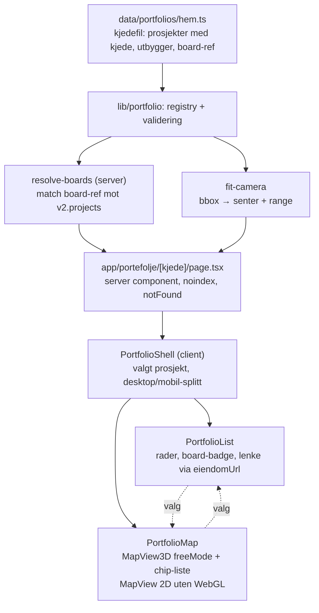

# Porteføljekart per kjede - Plan

## Goal Capsule

- **Objective:** Andreas kan åpne første møte med Thomas Løbakk (HEM) på et kart over HEMs egne nybyggprosjekter, der Thomas kjenner igjen beliggenhetene uten forklaring og ett klikk på Wesselsløkka åpner det levende boardet. Kartet planter tanken om at Placy hører hjemme på alle prosjektene i porteføljen, ikke på ett.
- **Means:** En ny, lett kartside på `/portefolje/<kjede>` bygd på den frittstående Google 3D-kartkomponenten, med prosjektliste ved siden av kartet og en manuelt vedlikeholdt prosjektfil per kjede (KTD1, KTD3).
- **Product authority:** Andreas Harstad. Det kommersielle løpet kjøres solo (business-logg 2026-09-01). Det nasjonale felleskartet og integrasjon i pitch-decken er ikke aktivt scope, se How This Work Fits Together.
- **Execution profile:** Én branch i egen worktree, fire enheter i avhengighetsrekkefølge, ingen migrasjoner, ingen datamutasjoner i prod. Verifiseres i Chrome på desktop og mobil før merge.
- **Stop conditions:** Stopp og spør hvis Google 3D-kartet ikke kan rammes inn over hele HEM-utstrekningen med egen kameramatematikk (KTD2), hvis prosjekt-chip-markøren ikke kan generaliseres uten å endre boardets oppførsel (KTD4), eller hvis en HEM-koordinat ikke kan slås opp med rimelig sikkerhet.
- **Tail ownership:** Implementeringen eier lint, typer, tester og build. Andreas eier visuell QA av HEM-koordinatene før møtet og lesing av Vercel Analytics etterpå.
- **Product Contract preservation:** changed: R1 — motorvalget presisert til Google 3D-satellitt som åpningsvisning og Mapbox 2D kun som reserve uten WebGL (bekreftet av Andreas 2026-09-02); R11 — mekanismen fastsatt til Vercel Analytics-sidevisninger. Ingen krav fjernet. AE8–AE10 lagt til for tilfeller research avdekket.

---

## Product Contract

### Summary

Et porteføljekart per meglerkjede: én kjedes nybyggprosjekter som pins på Google 3D-satellitt, med prosjektliste i sidekolonnen på desktop og et bunnpanel på mobil. Prosjekter som har et Placy-board åpner boardet ved klikk, resten er pins uten lenke. Kartet bygges som en ny lett komponent på den frittstående 3D-kartkomponenten, ikke på boardets kart, og leser kjedens prosjekter fra en fil i repoet. Første og eneste datasett i v1 er HEM, brukt som åpningsbilde i møte 1 med Thomas og som delbar lenke han kan sende videre til Einar Ringen Jr.

### Problem Frame

Prosjekt-SKU-en selges i dag ett prosjekt om gangen, og Thomas-prosessen (business-logg 2026-09-01) legger porteføljesamtalen først etter måned-3-dataene fra Wesselsløkka. Hypotesen bak dette kartet er at HEM tenker prosjekt for prosjekt fordi hvert prosjekt har egen nettside, eget kart og egen leverandør, og at ingen har vist dem porteføljen som én flate med ett lag oppå. Hypotesen er Andreas' egen, ingen observasjon fra HEM bekrefter den ennå.

HEM har allerede et flatt kart over sine nybygg-treff på hem.no/nybygg og en liste over 13 prosjekter på prosjekt.hem.no. Pinsene i seg selv er derfor ikke nytt for Thomas. Det kartet mangler er et levende nabolagsboard bak pinnen og et bilde som viser hele porteføljen med Placy-status per prosjekt.

Møte 1 er ikke et salgsmøte. Målet er engasjement og at Thomas tar materiellet videre internt til Einar, som eier kjøpet. Materiellet må derfor kunne åpnes fra en lenke på mobil, uten Andreas i rommet.

### Key Decisions

- **Kartet er ramme, ikke produkt.** Verdien er gjenkjenning på satellittbildet og klikket inn i et levende board, ikke pinsene. Governs R1, R3, R4.
- **Google 3D-satellitt er åpningsvisningen.** (session-settled: user-directed — chosen over Mapbox 2D som åpningsvisning: boardet har 3D-satellitt som standard og kartet skal vise det samme fra start, tross at boardets innrammingshjelper er låst til 4 km og må erstattes med egen matematikk.) Governs R1.
- **Bare prosjekter med eksisterende board er klikkbare.** (session-settled: user-directed — chosen over å provisjonere nivå-1-boards for alle HEM-prosjektene før møtet: en videre lenke finnes bare der et board finnes, dette er demo-nivå nå og utvides senere.) Governs R4.
- **Egen delbar side, ikke slide i pitch-decken.** (session-settled: user-directed — chosen over å legge kartet som første slide i Wesselsløkka-decken: deck-integrasjon blir en egen prosess.) Governs R9.
- **Kartutsnittet regnes ut fra prosjektene som er lagt inn.** (session-settled: user-directed — chosen over et fast Trondheim-utsnitt: HEMs fotavtrykk spenner Trondheim, Melhus og kysten, og utsnittet skal følge dataene.) Governs R2.
- **Kjede og utbygger er egen merking per prosjekt, uavhengig av betalende kunde.** Wesselsløkkas kunde i dataene er Brøset Utvikling, Sundsøyas er placy-demo, og begge selges av HEM. Merkingen er det som gjør kartet gjenbrukbart for neste kjede. Governs R6, R8.
- **Manuell prosjektliste, ingen feed.** Andreas legger inn kjedens prosjekter før møtet. En feed hører til det nasjonale felleskartet. Governs R7.
- **Ingen pris i kartet.** Møte 1 er uten pris per Thomas-prosessen, og volumtrappen hører til møte 2 og priskortet. Governs R12.

### Actors

- A1. **Andreas** — presenterer kartet i møtet og legger inn kjedens prosjektliste på forhånd.
- A2. **Thomas Løbakk** — prosjektmegler hos HEM, ser kartet i møte 1 på Andreas' skjerm og skal kjenne igjen sine egne prosjekter.
- A3. **Einar Ringen Jr.** — it- og markedssjef hos HEM, mottar lenka videresendt fra Thomas og åpner den på mobil uten Andreas til stede.

### Requirements

**Kartflaten**

- R1. Kartet viser én kjedes nybyggprosjekter som pins på Google 3D-satellitt, boardets 3D-motor. Uten WebGL vises Mapbox 2D med samme pins, og lista fungerer uansett.
- R2. Kartutsnittet ved åpning regnes ut fra posisjonene til prosjektene som er lagt inn, slik at alle pins er synlige uansett hvor spredt de ligger.
- R3. Prosjektene listes i en sidekolonne på desktop og i et bunnpanel på mobil. Liste og pins viser samme utvalg, og valg i det ene markerer det andre.
- R4. Prosjekter med et Placy-board er klikkbare i både liste og kart og åpner boardet. Prosjekter uten board vises som pin og navn i lista, uten lenke og uten kort, og skillet mellom de to er synlig.
- R5. Fra et åpnet board tilbake til kartet er ett steg, og kartet åpner da på nytt med utsnittet fra R2.

**Prosjektlista og merking**

- R6. Hvert prosjekt i kartet bærer navn, posisjon, meglerkjede, utbygger og eventuell referanse til et eksisterende board. Kjede og utbygger settes uavhengig av hvilken kunde boardet er registrert på.
- R7. Prosjektlista for en kjede legges inn manuelt av Andreas før møtet. v1-innholdet er HEMs prosjekter fra prosjekt.hem.no og hem.no/nybygg, rundt 15 stykker, pluss Sundsøya.
- R8. Kartet er per kjede, og lenka identifiserer kjeden. Ukjent kjede eller kjede uten prosjekter gir 404. Strukturen er kjede-generisk, bare HEM har data i v1.

**Deling og synlighet**

- R9. Kartet har én delbar lenke som fungerer på mobil uten innlogging.
- R10. Siden indekseres ikke av søkemotorer, samme mønster som pitch-siden og redirect-stubben under `app/kart/`.
- R11. Sidevisninger på kartruten telles i Vercel Analytics, som allerede er montert for hele appen, slik at Andreas kan se åpninger fra andre enheter enn sin egen. Ingen egen hendelsestype.

**Innhold**

- R12. Kartet viser ingen pris, volumtrapp eller salgsargumenter. Det viser prosjekter og board-lenker, ingenting annet.

### Key Flows

- F1. Møteåpning
  - **Trigger:** Andreas åpner kartlenka for HEM på egen skjerm i møte 1.
  - **Actors:** A1, A2
  - **Steps:** Kartet åpner med utsnitt rundt HEMs prosjekter. Thomas ser pinsene og lista og kjenner igjen prosjektene. Andreas klikker Wesselsløkka i lista. Boardet åpner. Etter demoen går Andreas ett steg tilbake til kartet, der resten av porteføljen fortsatt står som pins uten board.
  - **Covers:** R1, R2, R3, R4, R5, R12

- F2. Videresending
  - **Trigger:** Andreas sender kartlenka til Thomas etter møtet.
  - **Actors:** A1, A2, A3
  - **Steps:** Thomas sender lenka videre til Einar. Einar åpner den på mobil. Lista ligger i bunnpanelet under kartet. Einar trykker Wesselsløkka og lander i boardet. Sidevisningen dukker opp i Vercel Analytics med en annen enhet enn Andreas'.
  - **Covers:** R3, R4, R9, R11

- F3. Forberedelse
  - **Trigger:** Andreas skal ha kartet klart før møtet.
  - **Actors:** A1
  - **Steps:** Andreas legger inn HEMs prosjekter i kjedefila med navn, posisjon, kjede, utbygger og board-referanse der board finnes. Testen for fila fanger ugyldige koordinater. Kartet for HEM reflekterer lista ved neste deploy, og Andreas ser over utsnittet visuelt.
  - **Covers:** R6, R7, R8

### Acceptance Examples

- AE1. **Covers R4.** Gitt at Wesselsløkka har et board, når Thomas eller Andreas klikker Wesselsløkka i lista eller på pinnen, så åpner Wesselsløkka-boardet.
- AE2. **Covers R4.** Gitt at Berg Hageby ikke har et board, når noen klikker pinnen eller navnet, så navigerer ingenting, og prosjektet er synlig merket som uten board.
- AE3. **Covers R2.** Gitt at HEM-lista inneholder både Wesselsløkka (Trondheim), Ole Brumms Hage (Melhus) og Sundsøya (Inderøy), når kartet åpner, så er alle tre pins synlige uten at brukeren zoomer.
- AE4. **Covers R8.** Gitt at Grilstad Marina og Stasjonskvartalet har boards men ikke er merket HEM, når HEM-kartet åpner, så vises de ikke.
- AE5. **Covers R6.** Gitt at Sundsøya-boardet er registrert på kunden placy-demo men prosjektet er merket kjede HEM, når HEM-kartet åpner, så vises Sundsøya som klikkbart prosjekt.
- AE6. **Covers R3, R9.** Gitt at Einar åpner lenka på en telefon med 390 px bredde, når siden laster, så ligger prosjektlista i et bunnpanel under kartet og alle prosjektene kan nås uten desktop-kolonne.
- AE7. **Covers R12.** Gitt et hvilket som helst prosjekt i kartet, når det vises i liste eller pin, så finnes ingen pris, ingen volumtrapp og ingen salgstekst.
- AE8. **Covers R8.** Gitt lenka `/portefolje/finnes-ikke`, eller en kjede som er registrert men har null prosjekter, når siden åpnes, så svarer den 404 slik `app/kart/[slug]` gjør for ukjent adresse.
- AE9. **Covers R3.** Gitt HEM-kartet på desktop, når Andreas fører pekeren over eller klikker Solsletta Hageby i lista, så markeres Solsletta-pinnen i kartet, og når han klikker en pin uten board, så markeres raden i lista og rulles inn i syne.
- AE10. **Covers R1.** Gitt en nettleser uten WebGL, når HEM-kartet åpner, så vises Mapbox 2D med samme pins og samme utsnitt, og lista er klikkbar som normalt.
- AE11. **Covers R2, R4.** Gitt at Melhustorget og Sollia - Melhus Vest ligger under 2 km fra hverandre, når HEM-kartet åpner på 390 px bredde, så er begge chips treffbare hver for seg uten zoom, og ingen av dem viser navn før den er valgt.

### Success Criteria

- Thomas navngir eller peker på minst ett av sine prosjekter i kartet før Andreas har forklart det.
- Veien fra åpnet kart til Wesselsløkka-boardet tar under ett minutt i møtet.
- Lenka blir åpnet fra minst én enhet som ikke er Andreas' innen en uke etter møtet, lest av i Vercel Analytics.
- Kartet åpner uten konsollfeil i Chrome på desktop og mobil, samme standard som boardet.

### Scope Boundaries

**Deferred for later**

- Det nasjonale felleskartet: alle nybyggprosjekter uavhengig av kjede, senere bruktboliger, og placy.no som åpen indeks. Krever en prosjekt-feed og gjenåpner cutover-beslutningen fra 2026-07-06 om at Placy er embeds og boards per kunde, ikke et frittstående nettsted.
- Automatisk feed av prosjekter fra FINN Nybygg, Byggfakta eller kjedenes egne sider.
- Provisjonering av nivå-1-boards for prosjekter uten board, slik at flere pins blir klikkbare.
- Prosjektkort eller nabolagsfakta på pins uten board.
- Data for andre kjeder enn HEM. Strukturen er klar for det per R8, innholdet er ikke.
- Integrasjon av kartet i Wesselsløkka-pitch-decken. Egen prosess.
- Pris- eller volumtrapp-visning på kartet. Hører til møte 2 og priskortet.

**Outside this product's identity**

- Kartet er ikke en konkurrent til FINN Nybyggs kartsøk. Det viser én kjedes portefølje med Placy-status, ikke boliger til salgs.

**Deferred to Follow-Up Work**

- Fly-til-prosjekt i 3D når et prosjekt velges i lista. v1 holder kameraet på oversikten.
- 2D/3D-veksler på porteføljesiden. v1 har 3D, og 2D bare som WebGL-reserve.
- Utvide `eiendomUrl` i `lib/urls.ts` med en `rapport-board`-modus. Dagens kallsted konkatenerer suffikset, og planen gjør det samme.
- Flytte Sundsøya-boardet fra kunden placy-demo. Kjede-merkingen dekker behovet i v1.
- Kopier-lenke-knapp på siden. Lenka i adressefeltet er nok i v1.

### Dependencies / Assumptions

- Premisset om at HEM tenker prosjekt for prosjekt er en hypotese uten observert bevis. Kartet er også testen av den.
- HEMs prosjektliste per 2026-09-02: 13 prosjekter på prosjekt.hem.no (Berg Hageby, Edøya Paradis, Gimsøya, Leangen Stasjonsby, Lundamo Park, Melhustorget, Ole Brumms Hage, Solbergåsen, Sollia - Melhus Vest, Svaberget, Veiholmen Panorama, Wesselsløkka, Årnestunet), pluss Solsletta Hageby bygg D og Saga Park fra hem.no/nybygg, pluss Sundsøya (HEM avd. Rosten, salgsstart høst 2026). Koordinater slås opp ved innlegging via prosjektsidene eller `app/api/geocode`.
- Boards som finnes for HEM-prosjekter: Wesselsløkka (kunde broset-utvikling-as, 3D-tillegg) og Sundsøya (kunde placy-demo).
- På 150 km avstand viser Google 3D satellittbilde, ikke fotorealistisk mesh. Fliskvaliteten over Inderøy og Smøla påvirker derfor bare zoom-inn, som ikke er i v1.
- Google Maps-nøkkelen (`NEXT_PUBLIC_GOOGLE_MAPS_API_KEY`) og Mapbox-tokenet er alt satt for boardet og gjelder samme domene.

<!-- ce-section: work-relationships -->
### How This Work Fits Together

Denne planen eier porteføljekartet per kjede, med HEM som eneste datasett. Resten under er dagens forståelse, ikke en forpliktet plan.

- Nasjonalt felleskart (alle nybygg, senere brukt, placy.no som indeks)
  - Depends on: en prosjekt-feed og kjede/utbygger-merkingen fra R6.
  - Still to decide: gjenåpner cutover-beslutningen om at Placy ikke er et frittstående nettsted, og trenger egen renderingsstrategi for SEO (business-logg 2026-08-06).
- Integrasjon i Wesselsløkka-pitch-decken (`app/pitch/wesselslokka/`)
  - Can proceed independently of: dette kartet. Egen prosess.
  - Shares: samme lenke og board-embed-mønster.
- Megler self-serve (branch `feat/megler-self-serve`, ikke merget)
  - Shares: et kontor- og kjedebegrep (`broker_offices`, migrasjon 081) som bare finnes på den branchen. Kjedefila i denne planen står alene i v1; en senere sammenslåing er mulig når den branchen merges.
- Provisjonering av nivå-1-boards for resten av kjedens prosjekter
  - Enables: flere klikkbare pins. Utvidelsespunktet er bevisst lagt utenfor v1.

### Sources

- `components/map/map-view-3d.tsx` — frittstående Google 3D-komponent (`MapView3DProps`: `center`, `cameraLock`, `pois`, `projectSite`, `freeMode`, `onPOIClick`), WebGL-sjekk via `useWebGLCheck` med statisk tekst-tilstand uten reserve.
- `components/map/motor-camera.ts` — `CameraLock` og `DEFAULT_CAMERA_LOCK` (range 900 m, maxAltitude 2000 m, panHalfSideKm 4.5), grensene porteføljekartet må løfte eller slå av med `freeMode`.
- `components/map/map-view.tsx` — frittstående Mapbox 2D-komponent, reserven i R1; har i dag fast zoom og ingen bounds-prop.
- `components/map/ProjectSitePin.tsx` og `components/map/DomMarker3D.tsx` — prosjekt-chippen (én disc-farge, én ring-farge, bevisst ikke-interaktiv i dag) og DOM-markøren som bærer den (eksponerer bare klikk).
- `components/variants/report/board/story/StoryRail.tsx` — `aria-current`-mønsteret for valgt rad.
- `components/variants/report/board/board-camera-fit.ts` — boardets innramming, `deriveFocusCamera3D` er låst til 4 000 m og brukes ikke her.
- `lib/utils/camera-map.ts` — `zoomToRange` og `rangeToZoom`, felles konvertering mellom Mapbox-zoom og Google-range.
- `lib/hooks/useMediaQuery.ts` — desktop/mobil-splitt.
- `lib/urls.ts` — `eiendomUrl`; `app/eiendom/[customer]/[project]/page.tsx` viser suffiks-mønsteret for `rapport-board`.
- `lib/supabase/v2-queries.ts` (`getProductFromSupabaseV2`) og `lib/supabase/client.ts` (`createServerClient`) — server-side lesesti og oppslagsmønster mot `v2.projects`.
- `app/kart/[slug]/page.tsx`, `app/pitch/wesselslokka/page.tsx`, `app/eiendom/(tools)/generer/page.tsx` — noindex-mønster og ikke-board-side som presedens.
- `app/layout.tsx` — `@vercel/analytics` montert for alle ruter.
- `supabase/migrations/070_baseline.sql` — `v2.projects`-kolonner; ingen kjede-kolonne på `projects` eller `customers`.
- `docs/solutions/performance-issues/webgl-context-leak-per-render-probe-20260603.md`, `docs/solutions/ui-bugs/google-maps-3d-webgl-context-crash-touch-devices-20260415.md`, `docs/solutions/feature-implementations/google-maps-3d-svg-label-marker-og-bounds-semantikk-20260415.md` — leses før U3.
- `docs/solutions/ui-patterns/mobil-sheet-en-scroller-tre-stopp-20260825.md` — én scroller i mobilpanelet.
- `docs/solutions/architecture-patterns/eiendom-url-arkitektur-migration-20260307.md` — rute-grupper og middleware-unntak; sjekk `proxy.ts`/middleware for `/kart/` før ruten låses.
- `docs/strategy/LOG.md` 2026-09-01 — Thomas-prosessen, ingen pris i møte 1.
- `PROJECT-LOG.md` 2026-09-01 — kamera-inversen for Google-motoren.
- hem.no/nybygg (38 treff, Leaflet-kart) og prosjekt.hem.no (13 prosjekter), sjekket i browser 2026-09-02.

---

## Planning Contract

### Key Technical Decisions

- KTD1. **Ny lett komponent på `MapView3D`, ikke på `BoardMap`.** `BoardMap` krever hele boardets `BoardData`, kategori-reducer og lydspor-tilstand. `MapView3D` tar en punktliste og en kameraprofil og brukes alt frittstående. Governs R1, R3.
- KTD2. **Egen innramming for oversikten: `freeMode` pluss beregnet senter og range fra prosjektenes bounding-boks.** (session-settled: user-directed — inherited from Key Decision «Google 3D-satellitt er åpningsvisningen»: boardets `deriveFocusCamera3D` er låst til 4 000 m og `DEFAULT_CAMERA_LOCK` til 2 000 m høyde, så porteføljekartet regner range fra boksens diagonal med margin og lav tilt, og bruker `zoomToRange` for paritet med Mapbox-reserven.) Governs R1, R2.
- KTD3. **Kjedens prosjektliste er en server-only TypeScript-fil under `data/portfolios/`, ikke en tabell.** Femten rader lagt inn én gang før et møte trenger ingen migrasjon, og repoet har presedens for håndskrevne per-prosjekt-konstanter i kode. Board-referansen i fila er kunde-id pluss slug. Governs R6, R7.
- KTD4. **Prosjektpins gjenbruker prosjekt-chip-markøren `ProjectSitePin` som `MapView3D` alt tegner for `projectSite`, generalisert til en liste.** Tre tilstander er fastsatt: med board = dagens fargespråk (disc pluss ring); uten board = samme fargespråk uten ring; valgt = én ekstra markeringsring utenpå. På oversikts-range tegnes chips uten navn, og navnet vises bare for valgt eller hovret prosjekt, lista bærer navnene (jf. KTD10). Alternativet, syntetiske POI-er med oppdiktet kategori, gir ikonpins uten navn. Endringen er additiv: dagens enkelt-`projectSite` i boardet forblir ikke-interaktiv og uendret. Governs R3, R4.
- KTD5. **Board-eksistens slås opp server-side ved lasting mot `v2.projects`.** Hele tabellen er tolv rader, så én lesing og matching på kunde-id og slug holder. En referanse uten treff rendres som pin uten board, ikke som død lenke. Governs R4, R6.
- KTD6. **Ruten er `app/portefolje/[kjede]`.** `/kart/<ett segment>` svelges av den gamle redirect-ruten. Siden er `force-dynamic`, ukjent eller tom kjede gir `notFound()`, og `metadata` bruker noindex-mønsteret fra `app/kart/[slug]/page.tsx`. Governs R8, R10.
- KTD7. **Desktop/mobil-splitten er én stabil komponentstruktur med responsive klasser, ikke to grener.** `useMediaQuery` starter som «false» før første effekt, så en gren-splitt ville rendret mobil-layout først på desktop og remontert 3D-kartet ved flippen. Kart og liste ligger derfor alltid på samme plass i treet, splitten gjøres med Tailwind-klasser (kolonne på mobil, rad på `lg:`), og hooken brukes bare til oppførsel som å rulle valgt rad inn i syne. Boardets `NeighbourhoodSheet` brukes ikke, den er bundet til kategorikort. Mobilpanelet er et fast bunnpanel med én scroller. Governs R3.
- KTD8. **Måling er Vercel Analytics-sidevisninger, ingen ny hendelsestype.** En ny type i `v2.events` krever migrasjon av CHECK-constrainten pluss kodeendring, for én måling som analytics-dashbordet alt gir per rute og enhet. Governs R11.
- KTD9. **WebGL-reserven er `MapView` (Mapbox 2D), utvidet additivt med valgfri `bounds` og et markør-slot.** `MapView3D` viser bare en tekst-tilstand uten WebGL, og F2 har ingen i rommet til å redde et tomt kart. `MapView` har i dag fast zoom, ingen bounds-prop og bare kategori-markører, så reserven trenger `bounds` matet til startvisningen og `children` for egne chip-markører. Eksisterende kall uten propene er uendret. Governs R1.
- KTD10. **Ingen navn på chips ved oversikts-range.** På 150 km-utsnittet ligger Trondheim-prosjektene 10–50 px fra hverandre på desktop og 4–17 px på mobil, mens én chip er rundt 40 px pluss navn. Chip-komponenten har ingen kollisjonshåndtering, og boardets decluttering gjelder bare POI-løkka. Derfor: disc uten navn som standard, navn på valgt eller hovret chip, lista bærer alle navnene. Governs R2, R3, R4.

### High-Level Technical Design

Dataflyten går én vei fra fil til side. Serveren gjør alt oppslag og all kameramatematikk, klienten holder bare valgt prosjekt og skjermbredde.

### Sequencing

U1 → U2 → U3 → U4. U3 og U4 kan utvikles parallelt etter U2, men U4 kan ikke verifiseres uten U3.

---

## Implementation Units

### U1. Kjedefil og porteføljetyper

- **Goal:** En typet kjedefil for HEM med alle prosjekter, og et register som slår opp kjeder på slug.
- **Requirements:** R6, R7, R8, F3
- **Dependencies:** Ingen
- **Files:** `lib/portfolio/types.ts` (ny), `lib/portfolio/portfolios.ts` (ny), `data/portfolios/hem.ts` (ny), `data/portfolios/portfolios.test.ts` (ny)
- **Approach:**
  1. Definer prosjekttypen per R6: id, navn, posisjon, kjede, utbygger, valgfri board-referanse (kunde-id + slug), valgfri undertittel (bydel/kommune).
  2. Registeret eksporterer kjedens metadata (slug, visningsnavn) og prosjektlista, og returnerer `null` for ukjent slug.
  3. Fyll HEM-fila med prosjektene fra Dependencies / Assumptions. Slå opp koordinater via prosjektsidene eller `app/api/geocode`, og sett board-referanse bare på Wesselsløkka og Sundsøya.
  4. Fila er server-only: importeres kun fra server components og lib-kode, aldri fra klientkomponenter (KTD3).
- **Patterns to follow:** Håndskrevne per-prosjekt-konstanter i `components/variants/report/board/board-establishing-shots.ts`; `@/`-imports.
- **Test scenarios:**
  - Alle HEM-prosjekter har lat innenfor 57.9–71.3 og lng innenfor 4.3–31.2 (Norges bounding-boks).
  - Ingen to prosjekter i samme kjede deler id.
  - Hver board-referanse har både kunde-id og slug, ingen tomme strenger.
  - Registeret returnerer HEM for slug `hem` og `null` for `finnes-ikke`.
  - Covers AE4. Grilstad Marina og Stasjonskvartalet finnes ikke i HEM-fila.
- **Verification:** `npm test` grønn for den nye testfila, `npx tsc --noEmit` uten feil, HEM-fila har minst 15 prosjekter med koordinater.

### U2. Board-oppslag og kamerainnramming

- **Goal:** Server-hjelpere som avgjør hvilke prosjekter som har board og hvor kameraet skal stå.
- **Requirements:** R2, R4, R5, R6, KTD2, KTD5
- **Dependencies:** U1
- **Files:** `lib/portfolio/resolve-boards.ts` (ny), `lib/portfolio/resolve-boards.test.ts` (ny), `lib/portfolio/fit-camera.ts` (ny), `lib/portfolio/fit-camera.test.ts` (ny)
- **Approach:**
  1. `resolve-boards` leser `id`, `customer_id`, `url_slug` fra `v2.projects` én gang via `createServerClient`, matcher mot prosjektenes board-referanser, og returnerer prosjektene med `boardUrl` satt bare der treffet finnes. Feil fra Supabase logges og gir prosjekter uten lenker, ikke en krasj (CLAUDE.md: håndter feiltilstand).
  2. Board-URL bygges med `eiendomUrl(kunde, slug)` pluss `/rapport-board`-suffikset slik `app/eiendom/[customer]/[project]/page.tsx` gjør.
  3. `fit-camera` tar en punktliste og returnerer senter (bbox-midtpunkt), range fra boksens diagonal med margin, og lav tilt. Ett punkt gir en fast nær-range. Tom liste gir `null`. Bruk `zoomToRange`/`rangeToZoom` fra `lib/utils/camera-map.ts` så Mapbox-reserven får samme utsnitt.
  4. Ingen klamp på range; `freeMode` i U3 slår av motorens høydegrenser.
- **Patterns to follow:** Oppslagsmønsteret i `lib/supabase/v2-queries.ts` (`maybeSingle`, null-sikker); `computeFitBounds` i `board-camera-fit.ts` for bbox-formen, uten klampen.
- **Test scenarios:**
  - Covers AE1, AE5. Wesselsløkka (broset-utvikling-as/wesselslokka) og Sundsøya (placy-demo/sundsoya) får `boardUrl` når begge rader finnes i mock-data.
  - Covers AE2. Et prosjekt uten board-referanse får ingen `boardUrl`.
  - En board-referanse uten treff i tabellen gir prosjekt uten `boardUrl`, ikke feil.
  - Supabase-feil (mockad) gir alle prosjekter uten `boardUrl` og én loggført feil.
  - Covers AE3. Tre punkter fra Trondheim, Melhus og Inderøy gir et senter innenfor boksen og en range som dekker diagonalen med margin.
  - Ett punkt gir fast nær-range; tom liste gir `null`.
  - Et punkt med byttet lat/lng (lng 63, lat 10) avvises av valideringen i U1 og når aldri `fit-camera`.
- **Verification:** Testene over grønne, `npx tsc --noEmit` uten feil.

### U3. Kartlaget: prosjekt-chips i MapView3D og PortfolioMap

- **Goal:** Et kart som viser kjedens prosjekter som navngitte chips på Google 3D-satellitt med hele porteføljen i utsnittet, og faller til Mapbox 2D uten WebGL.
- **Requirements:** R1, R2, R3, R4, KTD1, KTD2, KTD4, KTD9
- **Dependencies:** U2
- **Files:** `components/map/map-view-3d.tsx` (endres, additivt), `components/map/ProjectSitePin.tsx` (endres, additivt; tegnes via `DomMarker3D`), `components/map/map-view.tsx` (endres, additivt: valgfri `bounds` og `children`), `components/portfolio/PortfolioMap.tsx` (ny), `components/portfolio/portfolio-pins.test.ts` (ny)
- **Approach:**
  1. Legg til en valgfri liste-prop i `MapView3D` som tegner én `ProjectSitePin` per element, med de tre tilstandene fra KTD4 (med board, uten board, valgt) og navn bare på valgt eller hovret chip (KTD10). Klikk og hover settes på chip-innholdet, ikke på `DomMarker3D`-wrapperen, som bare eksponerer klikk. Dagens enkelt-`projectSite` i boardet forblir ikke-interaktiv og visuelt uendret.
  2. `PortfolioMap` er klientkomponent, monterer `MapView3D` én gang med `freeMode`, kamera fra U2, og tom `pois`-liste. Klikk på chip med board navigerer til `boardUrl`; klikk på chip uten board melder valg opp til skallet (R4).
  3. Når `useWebGLCheck` sier nei, rendrer `PortfolioMap` `MapView` (Mapbox 2D) i stedet for 3D (KTD9). `MapView` får valgfri `bounds` (matet til startvisningen med padding) og `children` slik at `PortfolioMap` rendrer egne chip-markører med samme tre tilstander. Aldri begge motorer samtidig.
  4. Les de tre WebGL-læringene i Sources før arbeidet: probe én gang, aldri to 3D-instanser, `pointer-events` på sovende lag.
- **Execution note:** Verifiser i en nystartet Chrome at antall WebGL-kontekster holder seg flatt ved hover over lista, før komponenten anses ferdig.
- **Patterns to follow:** Chip-markøren for `projectSite` (SVG-rasterisert, inline-attributter, `system-ui`); `freeMode`-bruken i boardet; `Marker3D` med altitude relativt til bakken.
- **Test scenarios:**
  - Ren funksjon som bygger chip-modellen fra prosjekter: prosjekt med `boardUrl` får variant «board», uten får «uten board».
  - Covers AE9. Valgt id gir valgt-tilstand på nøyaktig én chip.
  - Eksisterende `projectSite`-rendering er uendret når liste-propen ikke er satt (regresjon, ren funksjon eller snapshot av props).
  - Chip-modellen på oversikts-range har navn bare på valgt eller hovret prosjekt; alle andre er disc uten navn (KTD10).
  - `MapView` uten `bounds` og `children` oppfører seg som før (regresjon på props-defaults).
  - Covers AE11. To prosjekter under 2 km fra hverandre gir to separate chip-modeller, begge uten navn når ingen er valgt.
  - Covers AE10. Med WebGL-sjekk mocket til `false` velger `PortfolioMap` 2D-grenen (enhetstest på grenvalget som ren funksjon).
- **Verification:** Alle HEM-pins synlige ved åpning i Chrome 1440×900 som discs uten navn, navn vises ved hover og valg, Melhustorget og Sollia treffbare hver for seg på 390 px (AE11), klikk på Wesselsløkka åpner boardet, klikk på Berg Hageby navigerer ikke, boardets egen `projectSite`-markør uendret på et eksisterende board, 0 konsollfeil, WebGL-kontekster flate.

### U4. Ruten og skallet: side, liste og mobilpanel

- **Goal:** Siden `/portefolje/hem` som setter alt sammen med desktop-kolonne, mobilpanel, kryss-markering, noindex og 404.
- **Requirements:** R3, R4, R5, R8, R9, R10, R11, R12, F1, F2, KTD6, KTD7, KTD8
- **Dependencies:** U2, U3
- **Files:** `app/portefolje/[kjede]/page.tsx` (ny), `app/portefolje/layout.tsx` (ny, kopierer CDN-lenken til `mapbox-gl.css` fra `app/kart/layout.tsx`; 2D-reserven trenger den, `components/map/map-view.tsx` importerer ikke CSS selv), `components/portfolio/PortfolioShell.tsx` (ny), `components/portfolio/PortfolioList.tsx` (ny), `lib/portfolio/rows.ts` (ny), `lib/portfolio/rows.test.ts` (ny)
- **Approach:**
  1. `page.tsx` er server component med `export const metadata` (tittel, `robots: { index: false, follow: false }`) og `dynamic = "force-dynamic"`. Ukjent kjede eller tom liste → `notFound()`. Kaller U1-registeret, U2-oppslaget og U2-kameraet, og sender ferdige data til `PortfolioShell`.
  2. `PortfolioShell` holder valgt prosjekt-id. Kart og liste ligger alltid på samme plass i komponenttreet; desktop-kolonne kontra mobil-bunnpanel løses med responsive klasser (kolonne på mobil, rad fra `lg:`), aldri med to JSX-grener som bytter kartets forelder (KTD7). `useMediaQuery("(min-width: 1024px)")` brukes bare til oppførsel, som å rulle valgt rad inn i syne. Valgt rad får `aria-current` etter mønsteret i `StoryRail`.
  3. `PortfolioList` rendrer rader fra `rows.ts` (ren visningsmodell: navn, undertittel, board-status, lenke). Rader med board er `Link` til `boardUrl`; rader uten er knapper som bare setter valg. Hover og valg markerer raden; valg fra kartet ruller raden inn i syne.
  4. Ingen pris, ingen salgstekst (R12). Ingen egen måling; Vercel Analytics i `app/layout.tsx` dekker ruten (KTD8).
  5. Sjekk `proxy.ts`/middleware for regler som treffer `/portefolje` før ruten låses.
- **Patterns to follow:** `app/eiendom/(tools)/generer/page.tsx` for ikke-board-side; `app/kart/[slug]/page.tsx` for noindex og `notFound()`; én-scroller-prinsippet fra mobil-sheet-læringen.
- **Test scenarios:**
  - Covers AE1, AE2. `rows.ts` gir lenke for prosjekt med `boardUrl` og ingen lenke pluss «uten board»-status for prosjekt uten.
  - Rader sorteres stabilt (alfabetisk eller filas rekkefølge, velg én og test den).
  - Covers AE8. Server-funksjonen som bygger sidedata returnerer «ikke funnet» for ukjent kjede og for kjede med tom liste.
  - Covers AE7. Ingen rad-modell inneholder prisfelt (typen har ikke feltet; testen bekrefter at visningsmodellen bare bærer navn, undertittel, status, lenke).
- **Verification:** `/portefolje/hem` åpner i Chrome 1440×900 med liste til venstre og kart til høyre uten at 3D-kartet remonteres etter første render (WebGL-kontekster flate ved desktop-lasting); 390×844 viser kart øverst og bunnpanel med alle prosjekter; `/portefolje/finnes-ikke` gir 404; siden har noindex i `<head>`; klikk fra Wesselsløkka-boardet tilbake i nettleseren gir kartet på nytt med hele utsnittet (R5); 0 konsollfeil på begge; mobil verifisert over LAN med `scripts/mobile-url.sh --path /portefolje/hem`.

---

## Verification Contract

| Sjekk | Kommando / handling | Gjelder | Ferdig-signal |
|---|---|---|---|
| Lint | `npm run lint` | Alle enheter | 0 errors |
| Typer | `npx tsc --noEmit` | Alle enheter | 0 feil |
| Enhetstester | `npm test` | U1–U4 | Alle grønne, inkl. de nye testfilene |
| Build | `npm run build` | Før PR | Bygger uten feil |
| Desktop | Chrome DevTools 1440×900 på `/portefolje/hem` | U3, U4 | Alle pins synlige, liste + kart, AE1/AE2/AE9 oppfylt, 0 konsollfeil |
| Mobil | `scripts/mobile-url.sh --path /portefolje/hem`, telefon eller 390×844 | U4 | Bunnpanel med alle prosjekter, AE6 oppfylt, 0 konsollfeil |
| 404 og noindex | Åpne `/portefolje/finnes-ikke`; inspiser `<meta name="robots">` på `/portefolje/hem` | U4 | 404 og `noindex, nofollow` |
| WebGL-hygiene | Nystartet Chrome, tell WebGL-kontekster under hover over lista | U3 | Flatt antall |
| Koordinat-QA | Andreas ser over HEM-kartet visuelt før møtet | U1 | Ingen pin på feil sted |
| Måling | Vercel Analytics viser ruten etter deploy | U4 | Sidevisning registrert fra to enheter |

---

## Definition of Done

- Alle fire enheter er landet på én branch, og alle rader i Verification Contract er grønne.
- `/portefolje/hem` viser alle HEM-prosjekter med Wesselsløkka og Sundsøya klikkbare og resten som pins uten lenke (AE1–AE5).
- Siden fungerer på mobil (AE6) og uten WebGL (AE10), og gir 404 for ukjent kjede (AE8).
- Ingen pris eller salgstekst på siden (AE7).
- Eksisterende board-flater er uendret: `projectSite`-markøren i boardet ser og oppfører seg som før.
- Ingen dead code eller eksperiment-kode fra forkastede tilnærminger ligger igjen i diffen.
- Worklog-oppføring i `PROJECT-LOG.md` skrives av `ce-work` ved ferdigstilling.
