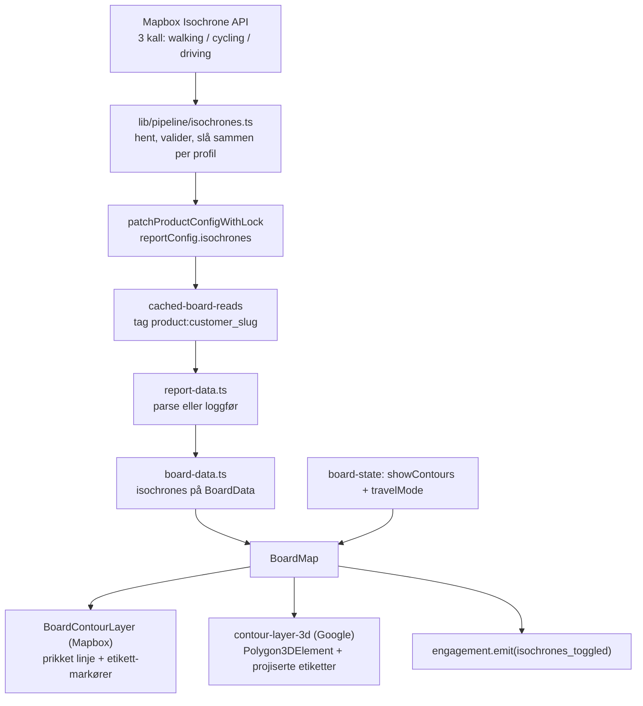

# Rekkevidde-konturer på boardet (isokroner) - Plan

## Goal Capsule

- **Objective:** En boligkjøper på boardet kan slå på tre prikkede konturer som viser hvor langt hun kommer fra boligen på 5, 10 og 15 minutter med valgt reisemåte, uten at stedene på kartet blir mindre lesbare. Det gir det romlige svaret på «hvor stort er nabolaget mitt til fots», som FINNs Nabolagsprofil ikke har og hjem.no besvarer med fargeflater som skjuler kartet.
- **Means:** Ett nytt provisjonssteg som henter isokroner fra Mapbox (samme veinett som reisetidene alt bruker), lagring i produktets eksisterende config-blob, en av/på-knapp i kartkontrollen, og to tegnelag — prikket linje i Mapbox-visningen «Kart», tynn heltrukket kontur på Google-motoren i «Satellitt» og «3D».
- **Product authority:** Andreas Harstad. Scope ratifisert i brainstormen 2026-09-02 og bekreftet i scoping-synteseen 2026-09-03.
- **Execution profile:** Sju enheter i avhengighetsrekkefølge på én branch. Én migrasjon (hendelsestype, kjøres med psql). Ingen datamutasjoner utover å skrive konturer inn i `products.config` for eksisterende boards via et backfill-script som er read-only til `--apply`. Verifiseres i nystartet Chrome på begge motorer og på mobil.
- **Stop conditions:** Stopp og spør hvis U6-spiken viser at `Polygon3DElement` ikke laster på kanalen repoet bruker i dag (da er R6 på Google-motoren blokkert og resten kan fortsatt landes), eller hvis R2-akseptansen feiler systematisk — altså at POI-er med **målt** gangtid under 10 min faller utenfor 10-minutt-konturen på flere boards (POI-er med luftlinje-anslag teller ikke). Det siste ville betyde at Matrix og Isochrone ikke er sammenlignbare, og da er hele premisset om «én kilde» feil.
- **Tail ownership:** Implementeringen eier lint, typer, tester, build, migrasjon og verifisering i Chrome. Andreas eier den visuelle dommen over konturenes styrke mot pinnene (R5) og lesing av bruks-tallene etterpå (R8).
- **Product Contract preservation:** changed: R6 — brainstormen skrev «Mapbox 2D (Kart / Satellitt)», men «Satellitt» er Google-motoren sett rett ovenfra, ikke en Mapbox-stil. Prikket linje er derfor bare mulig i «Kart»; «Satellitt» og «3D» får tynn heltrukket kontur, og «Satellitt» er standardvisningen på 3D-boards uten voice-over. Rettelsen er bekreftet av Andreas 2026-09-03. changed: R7 — etiketten plasseres på et beregnet punkt (konturens nordligste punkt) i stedet for «et punkt langs linjen», fordi Mapbox' etiketter langs linje er kjent upålitelige i denne kodebasen. Ingen krav fjernet. Åpne spørsmål fra brainstormen er avgjort som KTD1 (lagringssted), KTD2 (cache-bust) og KTD8 (mobilplassering).

---

## Product Contract

### Summary

Boardet får et visningsvalg som tegner tre prikkede rekkevidde-konturer rundt boligen: 5, 10 og 15 minutter med den reisemåten brukeren alt har valgt. Konturene beregnes én gang ved provisjonering via Mapbox Isochrone — samme veinett som gir POI-reisetidene — lagres sammen med resten av rapport-konfigurasjonen, og leses ved render. Valget er av som standard, huskes gjennom sesjonen som reisemåten gjør, fungerer i alle tre kartvisningene, og logges som en hendelse så vi ser om det brukes.

### Problem Frame

Boardet svarer i dag presist på «hva ligger 7 minutter unna» per sted, med liste og minutt-kolonne. Det svarer ikke på «hvor stort er nabolaget mitt», som er spørsmålet en boligkjøper faktisk stiller seg først. Konturen er det romlige svaret.

Konkurrentbildet: FINNs Nabolagsprofil, som ligger på Placys plass i annonsen, har ingen rekkevidde-visning. hjem.no har det som fire fargelagte flater som dekker hele kartet og skjuler stedene under. Andreas' vurdering er at vi vinner ved å gjøre mindre: bare konturlinjer, ingen flater.

Kostnaden er nær null. Dataene kommer fra leverandøren vi alt betaler for reisetidene, tre kall per prosjekt, ved provisjonering.

### Requirements

**Beregning og data**

1. R1 — Konturene beregnes i pipelinen, aldri ved render. Mapbox Isochrone kalles i et nytt provisjonssteg ved siden av reisetid-steget: ett kall per profil (walking / cycling / driving) med `contours_minutes=5,10,15`. Tre kall per prosjekt. Resultatet lagres per prosjekt og leses ved render. Steget er fail-soft som reisetid-steget: mangler konturene, skjules visningsvalget.
2. R2 — Én kilde for reisetid og kontur. Konturene og POI-reisetidene kommer fra samme Mapbox-veinett. Et sted med `travelTime.walk = 7` skal ligge innenfor 10-minutt-konturen. Dette er et akseptansekriterium som skal testes på minst ett provisjonert board, ikke antas.

**Flate og oppførsel**

3. R3 — Visningsvalg, ikke default. Konturene er av som standard. Brukeren slår dem på i kartkontrollen nederst, samme familie som Kart / Satellitt / 3D. Valget huskes innenfor sesjonen, på tvers av kategorier, som `travelMode` gjør i dag.
4. R4 — Følger reisemåten. Bytter brukeren fra til fots til sykkel, bytter konturene til sykkel-polygonene. Ingen ekstra valg. Reisemåte-veksleren er kontrakten.
5. R5 — Prikkede konturer, ikke fyll. Tre linjer (5 / 10 / 15), ingen fargeflater. Stedene under skal være like lesbare med konturene på som av. Den innerste kan være tydeligst og de ytre svakere, men ingen skal konkurrere med pinnene. hjem.no-varianten med fire fargelag er eksplisitt forkastet.
6. R6 — Fungerer i alle tre kartvisningene. I «Kart» (Mapbox) tegnes prikket linje med `line-dasharray`. I «Satellitt» og «3D» (samme Google-instans, ulik kameravinkel) tegnes `gmp-polygon-3d` drapert på terrenget; prikket kant støttes ikke der, så det aksepteres tynn heltrukket kant uten fyll. Samme av/på-valg og samme reisemåte-kobling gjelder i alle tre.
7. R7 — Etikett per kontur. Hver kontur får en liten etikett («5 min», «10 min», «15 min») så leseren ikke må gjette hvilken som er hvilken. Etiketten skjules ved lav zoom.
8. R8 — Måles. Av/på logges som hendelse i Innsikt-sporet, på linje med `faq_opened`. Vi vil vite om folk faktisk bruker det før vi bygger videre på det.

### Key Decisions

- **Isokroner hentes ved provisjonering, ikke ved render.** Følger CLAUDE.md-regelen om ingen runtime-LLM/eksterne kall i lesestien, og gjør flaten gratis å vise. Governs R1.
- **Konturene og reisetidene deler leverandør bevisst.** Alternativet — en gratis isokron-tjeneste — ville gitt konturer som ikke stemmer med minuttene i lista. Konsistens er hele poenget. Governs R2.
- **Reisemåte-veksleren er den eneste kontrollen som styrer hvilke konturer som vises.** Ingen egen «vis 10 min»-velger. Governs R4.
- **Bare linjer, aldri flater.** (session-settled: user-directed — chosen over hjem.nos fire fargelag: «jeg synes hjem.no tar helt av», stedene skal være like lesbare med konturene på.) Governs R5.
- **Prikkene ofres på Google-motoren, ikke konturene.** Google 3D har ingen prikket strek. Å droppe konturene i Satellitt og 3D ville tatt dem ut av standardvisningen på 3D-boards. Governs R6.
- **Kollektiv-kontur er ute.** Mapbox Isochrone støtter ikke kollektiv, Entur har ingen isokron-API. Se Deferred.

### Acceptance Examples

- AE1. Et board provisjoneres på nytt: `products.config.reportConfig.isochrones` inneholder tre profiler med tre konturer hver, og et `fetchedAt`-tidspunkt.
- AE2. Mapbox svarer 429 på sykkel-kallet, 200 på gange og bil: gange og bil lagres, sykkel mangler, provisjoneringen fullfører med en advarsel, og av/på-knappen vises fordi minst én profil finnes.
- AE3. Alle tre kall feiler: ingenting lagres, provisjoneringen fullfører med advarsel, av/på-knappen vises ikke i det hele tatt.
- AE4. På et board med konturer for gange og bil, men ikke sykkel: brukeren har konturene på og bytter til sykkel — konturene forsvinner uten at knappen forsvinner, og kommer tilbake ved bytte tilbake til gange.
- AE5. R2-akseptansen på Wesselsløkka: hver POI med **målt** gangtid ≤ 10 min ligger innenfor 10-minutt-gangkonturen. POI-er uten målt reisetid (der boardet viser et luftlinje-anslag) er utenfor akseptansen og rapporteres for seg.
- AE6. Brukeren slår på konturene i «Kart», bytter til «Satellitt», og konturene er fortsatt på — nå som tynne heltrukne linjer.
- AE7. Brukeren slår på konturene, går inn i en kategori og tilbake til oversikten: konturene er fortsatt på.
- AE8. Ved zoom under konturenes egen etikett-grense forsvinner «5 min»-etikettene, konturlinjene blir stående. Ved boardets åpningszoom er etikettene synlige.
- AE9. Av/på gir én `isochrones_toggled`-rad i `v2.events` med reisemåte og ny tilstand.
- AE10. På et board uten 3D-tillegg finnes bare «Kart»-visningen, og konturene fungerer der uten at Google-koden lastes.

### Success Criteria

- Konturene stemmer med minuttene i lista (AE5) på minst ett board, målt og skrevet ned.
- Ingen synlig degradering av pinne-lesbarheten med konturene på, dømt av Andreas i Chrome på begge motorer.
- Av/på-tallene er lesbare i Innsikt-flaten etter deploy.

### Scope Boundaries

Innenfor: provisjonssteget, backfill av eksisterende boards, lagring og lesing, av/på i kartkontrollen, tegning i begge motorer, etiketter, hendelsesmåling.

Utenfor: alt under Deferred, samt endringer i hvordan reisetider per POI beregnes eller vises.

### Deferred to Separate Tasks

- **Kamera-ramming etter kontur** («vis meg 10 min til fots» som kamerabounds). Blir mulig når konturen finnes, men er kamera-arbeid på Google-motoren, som har kjente hull i dag — omvisningens kamera er fortsatt no-op der. Tas opp i omvisning/kamera-sporet.
- **Kontur-filtrering av listen** (skjul steder utenfor valgt kontur). Boardet filtrerer alt på reisetid per sted, så konturen tilfører ikke ny informasjon der. Vurderes hvis R8 viser bruk.
- **Kollektiv-kontur.** Krever egen ruteberegningsmotor (OpenTripPlanner/Valhalla). Ikke verdt det nå.
- **20/30 minutter.** `TimeBudget` har verdiene, men 15 min er nabolagets grense til fots, og 15-minutters bilkontur dekker mer enn nok. Legges til bare hvis en kunde spør.
- **Mobilens permanente hjem for kartkontroller.** Uavklart produktspørsmål fra 2026-08-14. Denne planen legger konturvalget der resten av kontrollene alt bor på mobil, og flytter ingenting.

### Dependencies / Assumptions

- Mapbox Isochrone er inkludert i tokenet vi alt bruker for Matrix og Directions. Antatt, verifiseres i U1 ved første ekte kall; feiler det, er R1 blokkert og planen stopper der.
- `Polygon3DElement` er tilgjengelig på Google Maps-kanalen repoet laster i dag (`libraries={["maps3d","marker"]}`, kanal ikke pinnet). Antatt, verifiseres i U6-spiken.
- Isochrone-grenser: maks 4 verdier i `contours_minutes`, hver ≤ 60 min, 300 kall/min, 100 000 kall/mnd gratis. Tre kall per prosjekt ligger langt under.
- Cache-bust i prod skjer via `GET /api/revalidate?tag=…&secret=$REVALIDATE_SECRET`, som er secret-gatet og ikke ligger bak admin-gaten — det er endepunktet `scripts/curate-narrative.ts` og `scripts/gemini-grounding.ts` alt bruker. 403-en fra admin-nedstengingen gjelder bare `/api/admin/revalidate`. Ingen deploy trengs for å vise nye konturer.

---

## Planning Contract

### Key Technical Decisions

- KTD1. **Konturene lagres i `products.config.reportConfig.isochrones`, ikke i en ny kolonne i v2.** Ingen migrasjon for data, samme optimistiske låse-skriving som board-fakta-steget bruker, samme cache-tag ved lesing, og samme «parse eller loggfør»-mønster ved render. Polygonene er små: tre profiler × tre konturer. Avgjør brainstormens åpne spørsmål om lagringssted. Governs R1.
- KTD2. **Cache-bust arves fra config-skrivingen.** Fordi konturene ligger i samme blob som resten av rapport-konfigurasjonen, treffer den eksisterende revalideringen på `product:${customer}_${slug}` dem gratis. Ingen ny bust-flate. Prod-begrensningen står i Dependencies. Governs R1.
- KTD3. **Nytt provisjonssteg 7c, etter board-fakta og før editorial.** Da ligger alle config-skrivingene sammenhengende i pipelinen, og steget kan gjenbruke låse-skrivingen uten å slåss om `updated_at` med et steg som kjører etter. Rekkefølge-kommentaren i toppen av `provision.ts` oppdateres. Governs R1.
- KTD4. **Skrivingen slår sammen per profil, aldri per blob.** Et 429 på sykkel skal ikke slette en frisk sykkel-kontur fra forrige kjøring. Samme «fersk vinner, manglende beholdes»-regel som `mergeTravelTimes`. Governs R1, AE2.
- KTD5. **Geometrien valideres med Zod og et versjonstall som literal, som board-fakta.** Ugyldig eller ukjent versjon gir loggført feil og ingen konturer, aldri en krasj i lesestien. Polygon-formene gjenbrukes fra `lib/pipeline/area-staging.ts`. Governs R1.
- KTD6. **Av/på-tilstanden bor i board-reduceren ved siden av `travelMode`, ikke i lokal state i kartet.** Den skal overleve navigasjon inn i og ut av kategorier (AE7), og reduceren er stedet som alt bærer slik tilstand gjennom `resetNavigation`. `view` og `cameraMode` bor i lokal state i kartet og er derfor ikke forbildet her. Governs R3.
- KTD7. **Knappen gates på tilgjengelige profiler, ikke på et flagg.** Samme mønster som reisemåte-velgeren, som utleder tilgjengelige reisemåter fra dataene. Ingen konturer for noen profil = ingen knapp (AE3). Konturer for noen profiler = knapp, og tomt kart for profilene som mangler (AE4). Governs R1, R3.
- KTD8. **På mobil legges knappen i det eksisterende kontroll-popoveret, ikke i en ny flate.** Pillen nederst er alt på kapasitetsgrensen ved 320 px bredde. Avgjør brainstormens åpne spørsmål om mobilplassering; det større spørsmålet om hvor kartkontroller hører hjemme på mobil er eksplisitt utenfor scope. Governs R3.
- KTD9. **To tegnelag, ett per motor, begge montert én gang og skjult framfor avmontert.** Google-elementet kan ikke frigjøre WebGL-konteksten sin, så mønsteret i repoet er å beholde instansen og mutere den. Mapbox-laget følger rute-lagets `Source`/`Layer`-mønster. Governs R6.
- KTD10. **Etikettene tegnes som markører på et beregnet punkt, ikke som etiketter langs linjen.** Konturens nordligste punkt velges, så de tre etikettene stables utover fra boligen og ikke kolliderer med hverandre. Mapbox' `symbol-placement: line` er kjent upålitelig i denne kodebasen, og Google-motoren har ingen linje-etiketter i det hele tatt — der projiseres etiketten til skjermkoordinater per frame, som reise-chippen alt gjør. Governs R7.
- KTD11. **Hendelsestypen krever migrasjon 091 før koden sender den.** CHECK-constrainten på `v2.events` avviser ukjente typer, og skjemaet i koden dropper hendelser stille hvis varianten mangler i unionen. Begge gatene må åpnes. Governs R8.

### High-Level Technical Design

Dataflyten går én vei: pipeline skriver, lesestien parser, kartet tegner. Reduceren holder av/på og reisemåte, og velger hvilken profil de to tegnelagene får se.

### Sequencing

U2 → U1 → U3 → U4 → (U5, U6 parallelt) → U7. U6 begynner med en spike; feiler den, landes U1–U5 og U7 uten Google-laget, og R6 rapporteres som delvis oppfylt.

---

## Implementation Units

### U1. Provisjonssteget: hent og lagre isokroner

- **Goal:** Et fail-soft pipeline-steg som henter tre isokron-profiler fra Mapbox og skriver dem inn i produktets config uten å skade eksisterende data.
- **Requirements:** R1, KTD1, KTD3, KTD4
- **Dependencies:** U2 (typene og Zod-skjemaet må finnes før dette steget kompileres)
- **Files:** `lib/pipeline/isochrones.ts` (ny), `lib/pipeline/isochrones.test.ts` (ny), `lib/pipeline/__fixtures__/isochrone-walking.json` (ny), `lib/pipeline/provision.ts` (endres: nytt steg 7c + rekkefølge-kommentar)
- **Approach:**
  1. `computeProjectIsochrones({ productId, centerLat, centerLng })` kaller Isochrone én gang per profil: `GET /isochrone/v1/mapbox/{profile}/{lng},{lat}?contours_minutes=5,10,15&polygons=true&denoise=1&generalize=<meter>&access_token=...`. Profil-tabellen (`walk`→`walking`, `bike`→`cycling`, `car`→`driving`) speiler reisetid-steget; gjenbruk `travelModeToMapboxProfile` fra `@/lib/utils` framfor å skrive tabellen på nytt.
  2. Tokenet leses som i reisetid-steget (`MAPBOX_TOKEN` med fallback til den offentlige). Tokenet ligger i querystringen fordi Isochrone krever det — logg derfor aldri hele URL-en, bare profil og status.
  3. Timeout og retry som reisetid-steget: `AbortSignal.timeout`, én retry på 429 med respekt for `Retry-After`. Feil kaster aldri; de blir advarsler.
  4. Svaret er en FeatureCollection der hver feature har `contour`-egenskapen (5/10/15). Valider med Zod-skjemaet fra U2. Ugyldig svar for en profil = den profilen mangler, resten lagres.
  5. Sett sammen `{ isochronesVersion: 1, fetchedAt, byMode: { walk?, bike?, car? } }`, slå sammen mot eksisterende config per profil (KTD4), og skriv med den optimistiske låsen. Null rader tilbake fra skrivingen = advarsel, aldri kast. Steget tar `productId` og ikke `projectId` fordi låse-skrivingen adresserer produktet, ikke prosjektet — nøyaktig som board-fakta-steget.
  6. Koble steget inn i `provision.ts` som steg 7c, etter board-fakta og før editorial, og oppdater rekkefølge-kommentaren i toppen av fila. Kall det med produkt-id-en fra provisjonerings-resultatet, slik steg 7b gjør.
  7. Legg en linje om rekkevidde-konturer i `.claude/commands/provision-rapport.md` så steget er synlig i provisjonerings-flyten.
- **Patterns to follow:** `lib/pipeline/travel-times.ts` for kall, retry, sammenslåing og advarsels-kontrakten; `lib/pipeline/board-facts-step.ts` og `lib/pipeline/patch-product-config.ts` for config-lesing/-skriving med lås og for at config kan være både jsonb og JSON-streng.
- **Test scenarios:**
  - Covers AE1. Tre stubbede 200-svar gir tre profiler med tre konturer hver og et `fetchedAt`.
  - Covers AE2. 429 på sykkel og 200 på de to andre gir to profiler lagret, én advarsel, ingen kast.
  - Covers AE3. Alle tre feiler: ingen skriving, advarsel, ingen kast.
  - Eksisterende sykkel-kontur i config beholdes når sykkel-kallet feiler i denne kjøringen (KTD4).
  - Ugyldig geometri i svaret (koordinater som tall i stedet for par) gir profilen forkastet, ikke hele skrivingen.
  - Config lest som JSON-streng behandles likt som jsonb.
  - Advarselen inneholder profil og status, aldri hele URL-en med token.
- **Verification:** `npm test` grønn for den nye testfila; `npx tsc --noEmit` uten feil; ett ekte kall kjørt mot Mapbox med tokenet i `.env.local` for å bekrefte at Isochrone er inkludert (Dependencies-antakelsen).

### U2. Typer, skjema og lesesti

- **Goal:** Konturene har en typet, versjonert form som valideres ved lesing og når fram til boardets datamodell.
- **Requirements:** R1, KTD5
- **Dependencies:** Ingen
- **Files:** `lib/types.ts` (endres: `IsochroneSet`-type, Zod-skjema, `isochrones?` på `ReportConfig`), `components/variants/report/report-data.ts` (endres: parse eller loggfør), `components/variants/report/board/board-data.ts` (endres: felt på boardets data)
- **Approach:**
  1. Definer geometri-formen ved å gjenbruke polygon-skjemaene fra `lib/pipeline/area-staging.ts` (WGS84, `[lng, lat]`), slik at en kontur er Polygon eller MultiPolygon.
  2. `IsochroneSetSchema` = `{ isochronesVersion: z.literal(1), fetchedAt: string, byMode: Partial<Record<TravelMode, Record<"5"|"10"|"15", geometri>>> }`. Versjonen som literal gjør at en framtidig format-endring buster seg selv, som `factsVersion` gjør for board-fakta.
  3. Legg `isochrones?` på `ReportConfig` og parse den i lesestien med samme «safeParse eller `console.error`»-hjelper som board-fakta bruker. Ugyldig = ingen konturer.
  4. Send det videre til boardets datamodell som et felt boardets kart kan lese.
- **Patterns to follow:** `ReportBoardFactsSchema` og `parseBoardFactsOrLog` i `report-data.ts`; `BoundarySchema` i `area-staging.ts`.
- **Test scenarios:**
  - Gyldig sett med tre profiler parser og beholder alle konturene.
  - Sett med bare gange parser (delvis er lovlig, AE4).
  - `isochronesVersion: 2` avvises og gir ingen konturer.
  - Koordinatpar med feil aritet avvises.
  - Manglende `isochrones` i config gir `undefined`, ingen loggført feil.
  - Ugyldig sett gir `undefined` og én loggført feil, ingen kast.
- **Verification:** `npm test` grønn; `npx tsc --noEmit` uten feil.

### U3. Av/på-tilstand i board-reduceren

- **Goal:** Konturvalget overlever navigasjon mellom kategorier og oversikt, som reisemåten gjør.
- **Requirements:** R3, KTD6, AE7
- **Dependencies:** Ingen
- **Files:** `components/variants/report/board/board-state.tsx` (endres: nytt felt, handling, bæres i `resetNavigation`), `components/variants/report/board/board-state.test.ts` (endres)
- **Approach:**
  1. Legg `showContours: boolean` i reducerens tilstand med `false` som utgangspunkt (R3), og en handling som slår den av og på.
  2. `resetNavigation` skal bære feltet videre, akkurat som `travelMode`. Alle handlinger som går gjennom den — tilbake til utgangspunkt og tilbake til aktiv kategori — må bevare valget.
  3. Legg en avledet hjelper ved siden av den eksisterende for tilgjengelige reisemåter, som svarer på hvilke profiler som har konturer (KTD7). Den brukes av både knappen og tegnelagene.
- **Patterns to follow:** `travelMode` i samme reducer; `useAvailableTravelModes()` for avledning fra data.
- **Test scenarios:**
  - Covers AE7. `showContours: true` overlever hver handling som går via `resetNavigation`, testet per handling.
  - Utgangsverdien er `false`.
  - Av/på veksler.
  - Hjelperen returnerer tom liste når konturer mangler, og bare profilene som finnes ved delvis sett.
- **Verification:** `npm test` grønn; `npx tsc --noEmit` uten feil.

### U4. Knappen i kartkontrollen

- **Goal:** Brukeren kan slå konturene av og på fra kartkontrollen på desktop og mobil, og knappen finnes ikke når konturene mangler.
- **Requirements:** R3, KTD7, KTD8, AE3, AE10
- **Dependencies:** U2, U3
- **Files:** `components/variants/report/board/BoardMapControls.tsx` (endres), `components/variants/report/board/BoardMapControls.test.tsx` (endres), `components/variants/report/board/BoardMap.tsx` (endres: kobler reducer til kontroll og tegnelag)
- **Approach:**
  1. Legg knappen i den delte kontroll-kroppen, slik at den følger med både i pillen på desktop og i popoveret på mobil (KTD8) uten to grener.
  2. Plasser den etter motorvalget, med skilletegn etter samme mønster som de andre gruppene. Skilletegnenes bredde-konstanter og DOM-rekkefølge-testen må oppdateres i takt, ellers blir bredderegnestykket feil.
  3. Knappen rendres bare når minst én profil har konturer (KTD7). Kontrollen returnerer alt `null` når ingenting skal vises; den logikken må fortsatt holde.
  4. `BoardMap` sender reducerens tilstand ned og handlingen opp, og sender samme tilstand til de to tegnelagene.
  5. Knappen er en av/på-bryter og skal si sin tilstand til hjelpeteknologi, som de andre valgene i pillen gjør. Kopien er fastsatt her så den ikke oppfinnes under bygging: synlig tekst **«Rekkevidde»** med `Radar`-ikonet fra `lucide-react` foran (samme ikon-pluss-tekst-form som Auto/Fri-valget bruker med `Orbit` og `Hand`), og `aria-label` **«Vis rekkevidde-konturer»**.
- **Patterns to follow:** De eksisterende valggruppene i kontrollen, inkludert bredde-konstantene og rekkefølge-testen; `aria-pressed`-testene i samme testfil.
- **Test scenarios:**
  - Covers AE3. Ingen konturer i dataene: knappen finnes ikke.
  - Knappen finnes når bare gange har konturer.
  - Av/på-tilstanden meldes ut som `aria-pressed`, og klikk kaller handlingen.
  - Covers AE10. På et board uten 3D-tillegg vises knappen, og motorvalget vises ikke.
  - DOM-rekkefølge og skilletegn stemmer med bredde-konstantene ved både full og kompakt bredde.
  - Kontrollen returnerer fortsatt `null` når ingen grupper skal vises.
- **Verification:** `npm test` grønn; knappen synlig og virksom i Chrome 1440×900 og i popoveret ved 390 px; ingen visuell overflyt av pillen ved 320 px.

### U5. Mapbox-laget: prikkede konturer i «Kart»

- **Goal:** Tre prikkede konturer med etiketter i Mapbox-visningen, som følger reisemåten og ikke svekker pinne-lesbarheten.
- **Requirements:** R4, R5, R6, R7, KTD9, KTD10
- **Dependencies:** U4
- **Files:** `components/variants/report/board/BoardContourLayer.tsx` (ny), `components/variants/report/board/BoardContourLayer.test.tsx` (ny), `components/variants/report/board/use-board-zoom-tier.ts` (endres: ny `CONTOUR_LABEL_BREAKPOINT`), `components/variants/report/board/BoardMap.tsx` (endres: monterer laget)
- **Approach:**
  1. Bygg en GeoJSON-samling av de tre konturene for valgt profil, memoisert på profil og data, og render `Source` + linje-`Layer` etter rute-lagets mønster. Ingen data eller av = returner `null`.
  2. Prikkene settes med `line-dasharray`; verdiene er relative til linjebredden, så bredde og prikkmønster må velges sammen. Ikke slå på linje-metrikk på et prikket lag.
  3. Ingen fyll-lag i det hele tatt (R5). Den innerste konturen får høyest ugjennomsiktighet, de ytre lavere. Laget legges under pinne-lagene så pinnene alltid vinner.
  4. Etikettene tegnes som markører på konturens nordligste punkt (KTD10), og skjules under en **egen** terskel, `CONTOUR_LABEL_BREAKPOINT`, kalibrert mot boardets åpningszoom 13,5 (R7, AE8). POI-etikettenes eksisterende grense på zoom 16 kan ikke gjenbrukes: ved zoom 16 er synsfeltet smalere enn diameteren på 10- og 15-minutt-gangkonturene, så etikettene ville vært skjult i nøyaktig den zoomen konturene leses i.
  5. Bytte av reisemåte bytter kilde-dataene; laget monteres ikke om.
- **Patterns to follow:** `BoardPathLayer.tsx` for `Source`/`Layer`, memoisering og overgangs-ugjennomsiktighet; `BoardPathMidpointMarker.tsx` for etikett-markør på en linje; `use-board-zoom-tier.ts` for hvordan zoomterskler er formet — den nye `CONTOUR_LABEL_BREAKPOINT` legges der ved siden av de eksisterende, ikke i kontur-laget.
- **Test scenarios:**
  - Ren funksjon: konturene for valgt profil blir tre features med `contour`-egenskapen bevart.
  - Covers AE4. Profil uten konturer gir `null` fra laget.
  - Av-tilstand gir `null`.
  - Covers AE8. Under konturenes egen zoomgrense rendres ingen etiketter, men linjene består; ved åpningszoom 13,5 rendres alle tre.
  - Etikett-punktet er konturens nordligste punkt, testet på en kjent polygon.
  - Bytte av profil endrer kilde-dataene uten å bytte kilde-id (ingen remontering).
- **Verification:** `npm test` grønn; i Chrome på «Kart»: tre prikkede konturer synlige, etiketter lesbare, pinnene like lesbare med konturene på som av (Andreas dømmer R5), 0 konsollfeil.

### U6. Google-laget: konturer i «Satellitt» og «3D»

- **Goal:** De samme tre konturene tegnet på Google-motoren, tynne og heltrukne, med etiketter, uten å røre den vedvarende 3D-instansen.
- **Requirements:** R4, R5, R6, R7, KTD9, KTD10
- **Dependencies:** U4
- **Files:** `components/map/contour-layer-3d.tsx` (ny), `components/map/contour-layer-3d.test.tsx` (ny), `components/variants/report/board/BoardMap3D.tsx` (endres: monterer laget)
- **Approach:**
  1. **Spike først, før resten av enheten skrives:** bekreft i nettleseren at `Polygon3DElement` faktisk laster på kanalen repoet bruker i dag, og at en tynn heltrukket kontur er lesbar mot fotorealistiske fliser. Feiler dette, stopp enheten og rapporter (se Stop conditions) — U1–U5 og U7 kan fortsatt landes.
  2. Laget importerer 3D-biblioteket dynamisk og oppretter langlivede polygon-elementer per kart-instans. **Antallet følger antall ytre ringer, ikke antall konturer:** et polygon-element bærer én ytre ring pluss hull, mens U2 tillater at en kontur er MultiPolygon. Normaliser derfor hver kontur til en liste ytre ringer (Polygon → én, MultiPolygon → n), opprett eller gjenbruk ett element per ring med hull som `innerCoordinates`, og la elementsamlingen vokse ved behov men aldri rives. Uten dette blir en flerflate-kontur tegnet bare delvis, uten feilmelding. Koordinatene settes før elementet legges i DOM-en, og muteres ved bytte av reisemåte. Ved av eller manglende data fjernes elementene fra DOM-en, men referansene beholdes — 3D-motoren kan ikke frigjøre konteksten sin, så ingenting avmonteres.
  3. Høyde relativt til bakken med noen få meter, som rute-laget, så konturen ligger på terrenget og ikke skjæres av det. Ingen ekstrudering, ingen fyll.
  4. Et opphevings-flagg må håndtere at effekten kjøres dobbelt i utvikling, ellers får kartet duplikate polygoner.
  5. Etikettene tegnes som HTML projisert til skjermkoordinater per frame, som reise-chippen alt gjør, på samme nordligste punkt som i U5.
- **Patterns to follow:** `components/map/route-layer-3d.tsx` i sin helhet — dynamisk import, langlivet instans, sett stien før innsetting, opphevings-flagg; `BoardTravelChip3D.tsx` og `project-latlng-to-screen.ts` for projiserte etiketter.
- **Test scenarios:**
  - Med et falskt polygon-element og stubbet bibliotek-lasting: tre enkle konturer gir tre elementer, ett per ytre ring.
  - En MultiPolygon-kontur med to flater gir to elementer for den konturen, og hull havner som `innerCoordinates`.
  - Bytte av reisemåte muterer koordinatene på de eksisterende elementene og oppretter ingen nye.
  - Av fjerner elementene fra DOM-en men beholder referansene.
  - Covers AE4. Profil uten konturer gir ingen elementer i DOM-en, ingen feil.
  - Dobbel kjøring av effekten gir ikke duplikate elementer.
  - Covers AE6. Av/på-tilstanden leses fra samme kilde som Mapbox-laget (delt tilstand, ikke egen).
- **Verification:** `npm test` grønn; i nystartet Chrome på «Satellitt» og «3D»: konturene synlige og drapert på terrenget, etiketter følger kartet ved panorering, 0 konsollfeil, antall WebGL-kontekster flatt ved bytte mellom alle tre visninger og av/på flere ganger.

### U7. Måling og akseptanse

- **Goal:** Av/på logges som hendelse, og R2-påstanden er målt på et ekte board.
- **Requirements:** R2, R8, KTD11, AE5, AE9
- **Dependencies:** U1 og U2 for R2-målingen (konsistens-scriptet leser lagret geometri og lagrede reisetider, ikke kartlagene); U4 for hendelses-utsendingen
- **Files:** `supabase/migrations/091_event_type_isochrones_toggled.sql` (ny), `lib/instrumentation/event-types.ts` (endres), `lib/instrumentation/event-types.test.ts` (endres), `lib/instrumentation/event-schema.ts` (endres), `lib/instrumentation/event-schema.test.ts` (endres), `lib/insight/aggregate.ts` (endres), `lib/insight/demo-data.ts` (endres), `components/variants/report/board/BoardMapControls.tsx` eller `BoardMap.tsx` (endres: sender hendelsen der handlingen utløses), `scripts/backfill-isochrones.ts` (ny), `scripts/check-isochrone-consistency.ts` (ny)
- **Approach:**
  1. **Migrasjonen først.** 091 dropper og gjenoppretter CHECK-constrainten på `v2.events` med den fulle typelista pluss `isochrones_toggled`, i en transaksjon, med tilbakerullings-blokk og en verifiserings-spørring i kommentar. Kjøres med psql per CLAUDE.md — `supabase db push` fungerer ikke med vår nummerering. Koden må ikke sende typen før migrasjonen er kjørt.
  2. Legg typen i hendelses-tuppelen og i nyttelast-kartet, og legg den eksplisitte varianten i skjema-unionen. Mangler varianten, forkastes alle hendelser av typen stille — begge stedene må endres. Testene som pinner tuppelen ordrett oppdateres.
  3. Nyttelasten er liten: ny av/på-tilstand. Reisemåten ligger alt i konvolutten og skal ikke dupliseres.
  4. Send hendelsen der av/på-handlingen faktisk utløses, med det eksisterende engasjements-oppsettet, etter mønsteret i FAQ-seksjonen.
  5. Legg typen i aggregeringen og i demo-dataene, ellers er den usynlig i Innsikt-flaten.
  6. `scripts/backfill-isochrones.ts` kjører U1-steget for eksisterende boards: read-only som standard, skriver bare med `--apply`, kan filtreres på prosjekt, laster miljø som de andre backfill-scriptene. **Skrivingen må bustes eksplisitt:** bruk `patchThenRevalidate` fra `lib/pipeline/patch-product-config.ts`, eller treff `GET /api/revalidate?tag=product:<customer>_<slug>&secret=$REVALIDATE_SECRET` slik `scripts/curate-narrative.ts` gjør. Uten dette ligger konturene i basen mens boardet viser gammel config, og knappen dukker aldri opp.
  7. `scripts/check-isochrone-consistency.ts` er R2-målingen: for et gitt board, sjekk at hver POI med **målt** gangtid ≤ 10 min ligger innenfor 10-minutt-gangkonturen, og skriv ut avvikene. Målt betyr rå-verdien i `v2.project_pois.travel_times.walk` — les den direkte, aldri via `estimateWalkMin`, som faller tilbake på luftlinje ganget med 1,3 når reisetiden mangler. POI-er uten målt verdi rapporteres i en egen «ikke målbar»-bøtte utenfor akseptansen; et luftlinje-anslag ligger systematisk utenfor en veinett-isokron, og ville ellers sett ut som at Matrix og Isochrone ikke er sammenlignbare. Kjøres på Wesselsløkka, og resultatet skrives ned. Enkelte avvik i randsonen er forventet (isokronen er generalisert); systematiske avvik blant målte POI-er er en stoppbetingelse.
- **Patterns to follow:** `supabase/migrations/086_event_type_faq_opened.sql` som migrasjonsmal; hendelses-utsendingen i `components/variants/report/board/FAQSection.tsx`; `scripts/backfill-travel-times.ts` for tørrkjøring-som-standard.
- **Test scenarios:**
  - Tuppel-testen inneholder den nye typen på forventet plass.
  - Skjema-testen godtar en gyldig nyttelast og avviser en med ukjent felt (skjemaet er strengt).
  - Covers AE9. Av/på kaller utsendingen én gang med riktig type og tilstand.
  - Aggregeringen teller den nye typen.
  - Punkt-i-geometri gjenbrukes fra `@/lib/utils/geo` (`pointInGeometry`, håndterer både Polygon og MultiPolygon og er alt testet) — ingen ny hjelper skrives. Scriptets utskrift nevner at hull ignoreres, som er den milde retningen for en akseptansesjekk.
  - Konsistens-scriptet skiller målte og ikke-målte POI-er: en POI uten `travel_times.walk` havner i «ikke målbar»-bøtta og teller ikke som avvik.
- **Verification:** Migrasjonen kjørt med psql mot prod og verifisert med en spørring mot constrainten; `npm test` grønn; av/på i Chrome gir én rad i `v2.events` (AE9); `scripts/check-isochrone-consistency.ts` kjørt på Wesselsløkka og resultatet ført i worklogen (AE5); backfill kjørt tørt og deretter med `--apply` på minst ett eksisterende board.

---

## Verification Contract

| Sjekk | Kommando / handling | Gjelder | Ferdig-signal |
|---|---|---|---|
| Lint | `npm run lint` | Alle enheter | 0 errors |
| Typer | `npx tsc --noEmit` | Alle enheter | 0 feil |
| Enhetstester | `npm test` | U1–U7 | Alle grønne, inkl. de nye testfilene |
| Build | `npm run build` | Før PR | Bygger uten feil |
| Ekte Isochrone-kall | Kjør U1-steget mot Mapbox med token fra `.env.local` | U1 | Tre profiler med tre konturer hver, ingen 401/403 |
| Migrasjon | psql med `supabase/migrations/091_...sql`, deretter spørring mot constrainten | U7 | `isochrones_toggled` godtatt av `v2.events` |
| Provisjonering | `/provision-rapport` eller `scripts/backfill-isochrones.ts --apply` på ett board | U1, U7 | `reportConfig.isochrones` finnes i config (AE1), taggen er bustet, og boardet viser konturene uten deploy |
| Desktop «Kart» | Chrome 1440×900, slå konturene på | U5 | Tre prikkede konturer + etiketter, pinner like lesbare, 0 konsollfeil |
| Desktop «Satellitt» og «3D» | Nystartet Chrome, bytt mellom alle tre visninger med konturene på | U6 | Konturene består (AE6), drapert på terrenget, 0 konsollfeil |
| WebGL-hygiene | Nystartet Chrome, tell kontekster gjennom flere visnings- og av/på-bytter | U6 | Flatt antall |
| Reisemåte | Bytt gange → sykkel → bil med konturene på | U5, U6 | Konturene bytter; profil uten data gir tomt kart, knappen består (AE4) |
| Navigasjon | Slå på, gå inn i kategori, tilbake | U3 | Konturene fortsatt på (AE7) |
| Zoom | Åpne boardet, så zoom ut under konturenes etikett-grense | U5, U6 | Etiketter synlige ved åpningszoom, borte under grensen, linjer består (AE8) |
| Mobil | `scripts/mobile-url.sh` på et board, telefon eller 390×844 | U4, U5, U6 | Knappen nåbar i kontroll-popoveret, konturene synlige, 0 konsollfeil |
| Board uten 3D | Åpne et board uten 3D-tillegg | U4, U5 | Bare «Kart», konturene virker, Google-koden lastes ikke (AE10) |
| R2-akseptanse | `scripts/check-isochrone-consistency.ts` på Wesselsløkka | U7 | Ingen systematiske avvik; resultatet skrevet ned (AE5) |
| Måling | Slå av/på, spør `v2.events` | U7 | Én rad per bytte med riktig reisemåte og tilstand (AE9) |

---

## Definition of Done

- Alle sju enheter er landet på én branch, og alle rader i Verification Contract er grønne.
- Konturene finnes i config på minst ett provisjonert board, og backfill-scriptet kan gi dem til resten.
- Av/på virker i alle tre kartvisningene, følger reisemåten, og overlever navigasjon (AE4, AE6, AE7).
- Knappen finnes ikke når konturene mangler, og forsvinner ikke når bare én profil mangler (AE3, AE4).
- R2-akseptansen er målt, ikke antatt, og resultatet er ført i worklogen (AE5).
- Migrasjonen 091 er kjørt og verifisert mot prod, og av/på gir hendelser (AE9).
- Pinne-lesbarheten er uendret med konturene på, dømt visuelt av Andreas (R5).
- Ingen dead code fra forkastede tilnærminger, ingen utkommentert eksperimentkode.
- Worklog-oppføring i `PROJECT-LOG.md` skrives av `ce-work` ved ferdigstilling.
