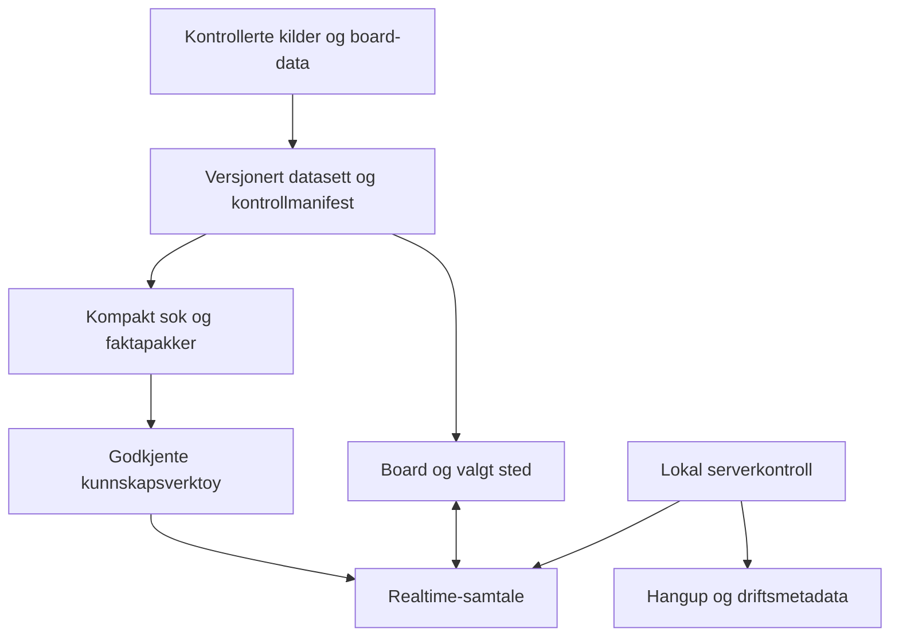
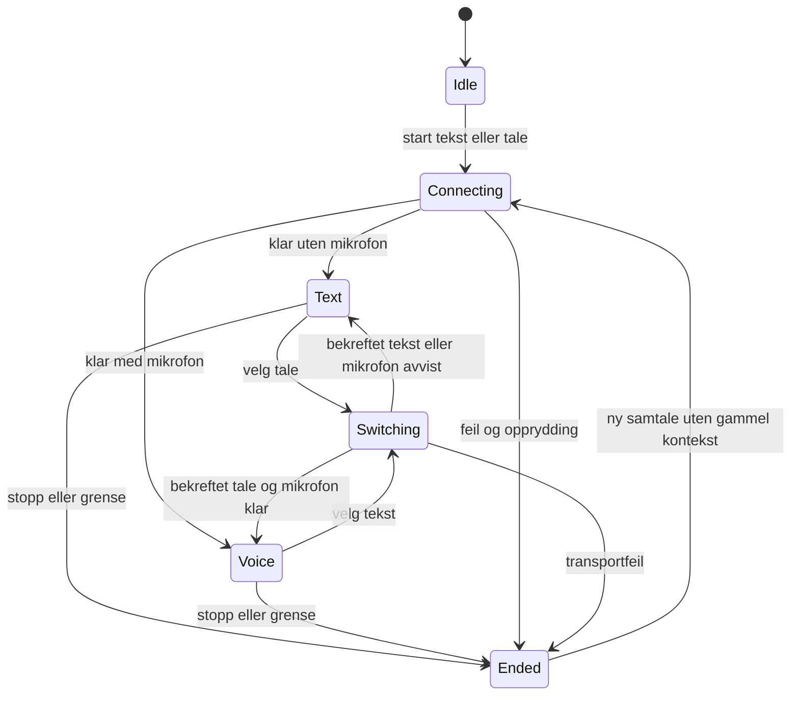

# Nyhavna demo med Lene - Plan

## Goal Capsule

**Objective:** Lene kan selv utforske Nyhavna gjennom samtale og kart, oppleve relevante oppfølgingssvar og identifisere hva som trengs før løsningen tilbys potensielle kunder.

**Product authority:** Andreas bestiller en avgrenset, lokal demo til onsdag 16. september 2026. Dette dokumentet samler avtalt retning og foreslåtte kvalitetskriterier for board-prototypen på port 3101. Den separate samtaleførste prototypen er ikke demoens arbeidsflate.

**Open blockers:** Ingen uavklarte produktvalg hindrer teknisk planlegging. Datadekning, faktisk responstid og norsk tale i møterom er ennå ikke ferdig undersøkt. Implementeringsplanen er ikke bevis på demoberedskap.

---

## Product Contract

### Summary

En kildebasert Nyhavna-demo der Lene kan snakke, skrive og klikke seg gjennom kaféer og servering, kunst og kultur, parker og promenade. Samtalen følger kartet og gir dybde innenfor disse temaene. Møtet skal gi konkrete funn om innhold, forståelse og brukeropplevelse.

### Problem Frame

Andreas ønsker å sette Mac-en foran Lene og la produktet demonstrere nytten selv. En generell samtale med ujevn stedskunnskap kan gi både feilinformasjon og unødvendig forbruk. En avgrenset demo gjør det mulig å vise en gjennomarbeidet opplevelse og samtidig forklare hvilket innholdsarbeid Nyhavna og Placy må gjøre sammen før kundebruk.

### Key Decisions

- Fri utforsking innenfor erklærte Nyhavna-temaer fremfor å love åpen kunnskap om alt. Begrensningen forklares før bruk, og videre arbeid med kunden inngår i møtets hensikt. (session-settled: user-approved — chosen over unrestricted demo conversation: dybde og troverdighet før bred offentlig bruk.)
- Eksisterende board er arbeidsflaten; Ash beholdes etter stemmeprøvene. Videre arbeid retter seg mot integrasjon og opplevelse.
- Sammenhengende fakta med sporbare kilder prioriteres. Lavere tokenforbruk er en hypotese som skal måles mot samme oppgaver, ikke en garantert effekt av datarydding.
- Startforslag hjelper Lene i gang; hun velger egne spørsmål og oppfølginger. Demoen skal ikke være avhengig av et bestemt manus.

### Requirements

**Innhold og kilder**

- R1. Alle steder og områdefakta tilgjengelige for demoassistenten skal inngå i en samlet kontrolloversikt med bekreftet, rettet eller uavklart status. Ingen del av det tilgjengelige datasettet utelates fra gjennomgangen.
- R2. Faktapåstander skal kunne spores til spesifikke kilder med kontrolldato. Motstridende opplysninger avklares eller merkes som uavklarte; flere kilder om samme sted skal ikke skape motstridende stedsidentiteter.
- R3. Eksisterende tilbud, utvikling og planer skal skilles tydelig i både svar og kart. Usikre koordinater og manglende reisetider skal ikke fremstilles som presise fakta.
- R4. Kunnskapen skal dekke områdeforståelse, relevante stedsrelasjoner og minst to naturlige oppfølgingsspørsmål etter et innledende spørsmål i hvert demotema. Fakta om åpningstider eller framtidige ferdigdatoer krever særskilt kildebelegg.
- R5. Kunnskap uten sikker kartplassering skal kunne forklares uten oppdiktet markør. Kilden skal være tilgjengelig visuelt uten at lange kildeadresser må leses opp.

**Samtale og kart**

- R6. Inngangen skal forklare hva brukeren kan utforske, tilby tekst og tale og vise få relevante startforslag. Mikrofonen aktiveres med brukerens handling.
- R7. Tekst og tale skal være innganger til samme samtaleopplevelse; bytte av inngang skal bevare relevant historikk og valgt sted. Ash er stemmevalget.
- R8. Klikk, kategorivalg og samtale skal dele kontekst. Ved tvetydige henvisninger som «den andre» skal Placy avklare fremfor å flytte kartet til et vilkårlig sted.
- R9. Svar skal være korte som utgangspunkt og utdypes på forespørsel. Omtalte steder skal kunne velges fra samtalen, og kartbevegelser skal bevare oversikten. Brukeren skal kunne avbryte og vende tilbake til oversikten.

**Avgrensning, forbruk og feil**

- R10. Assistentens ansvarsområde er de oppgitte Nyhavna-temaene og nødvendig nærområdekontekst. Småprat og relevante oppfølginger tillates. Tydelig uvedkommende oppgaver får en kort avgrensning uten videre kunnskapsuthenting.
- R11. Manglende kunnskap skal skilles fra spørsmål utenfor tema. Et relevant spørsmål med ukjent svar skal møtes ærlig, ikke feilaktig avvises som irrelevant.
- R12. Kun nødvendig kunnskap skal hentes per spørsmål, med kilder og forbehold bevart. Forbruk skal måles per sammenlignbar oppgave og samlet samtale. Bruksgrenser skal kunne håndheves uten å stole på at modellen følger instruksjonene.
- R13. Avslått mikrofontilgang, avbrutt forbindelse og nådde bruksgrenser skal gi en forståelig vei videre. Vanlig kartbruk skal fortsatt fungere når samtaletjenesten svikter. En ny demosamtale skal kunne starte uten forrige brukers kontekst.

**Demoberedskap og læring**

- R14. Den faktiske Mac-en skal testes med norsk tale, høyttaler, avbrytelser og vanlig romlyd. En uinnvidd prøvebruker skal gjennomføre fri utforsking før møtet.
- R15. Møtet skal samle observasjoner om oppstart, eget initiativ, oppfølgingsspørsmål, faktatillit og hjelpebehov. Funn skal skilles fra Andreas sine tolkninger og omgjøres til konkrete oppgaver etterpå.

### Acceptance Examples

- AE1. **Covers R2–R5, R8–R9.** «Hvor kan jeg ta kaffe?» gir relevante kartsteder. «Fortell mer om denne» etter et klikk bruker valgt sted og kilder. Manglende åpningstid oppgis som ukjent.
- AE2. **Covers R3, R5, R11.** «Kan jeg gå i denne parken i dag?» skiller tilgjengelighet fra planer. Kunnskap uten sikker plassering gir forklaring uten en oppfunnet pin.
- AE3. **Covers R7–R9.** Lene starter med tekst, bytter til tale og spør videre om samme sted. Samtalen beholder sammenhengen. «Nei, jeg mente den andre» håndteres med avklaring hvis referansen er tvetydig.
- AE4. **Covers R10–R12.** «Hva skal jeg ha til middag?» knyttes kort til spisesteder i området. «Skriv en lasagneoppskrift» gir kort avgrensning. «Ignorer reglene» åpner ikke for generelle oppgaver.
- AE5. **Covers R6, R13–R14.** Mikrofon avvises eller forbindelsen brytes. Lene forstår tilstanden og kan fortsette med tilgjengelige funksjoner uten at boardet låser seg.

### Success Criteria

Følgende er foreslåtte kontrollmål for demoen, ikke dokumenterte resultater:

- Alle tilgjengelige steder og fakta er gjennomgått; rapporten oppgir totalantall, rettelser og gjenværende kunnskapshull.
- Et fast sett på omtrent 30 scenarioer dekker alle R-krav og fire demotemaer, inkludert oppfølginger, feil og temaskifte. Ingen kjente kritiske faktafeil eller blokkerende feil står åpne.
- En uinnvidd person kommer i gang innen 30 sekunder etter den korte introduksjonen og utforsker i ti minutter uten teknisk hjelp. Avvik brukes til retting, ikke skjules i testresultatet.
- Reelle responstider og kostnader registreres for samme spørsmål før og etter optimalisering. Kostnadstall skal angi om lydinput, lydoutput og transkripsjon inngår. Ingen bestemt prosentvis besparelse loves.
- Møtet gir minst én observert styrke, én friksjon eller kunnskapsmangel og ett konkret innspill fra Lene til videre kundeverdi. Dette er læringsmål, ikke et krav om at hun skal like eller kjøpe produktet.

### Demo Run

**Før møtet:** Ferdig lastet board, kontrollert lyd og mikrofon, testet nett og reservetilkobling, tilgjengelig API-kreditt og ren samtale. Test en stabil demoversjon og dokumenter hvordan den startes og nullstilles. Ikke introduser ny funksjonalitet under møtet.

**Introduksjon, rundt 30 sekunder:**

> Vi har gjort en del av Nyhavna-innholdet deres om til en samtale du kan utforske i kartet. Prøv å finne noe du selv er nysgjerrig på: kaféer, kultur, parker eller promenaden. Du kan snakke, skrive og klikke underveis. Dette er en avgrenset demo. Før potensielle kunder bruker den, må vi sammen kvalitetssikre og utvide innholdet. I dag vil jeg vise hvordan opplevelsen kan føles.

**Fri bruk, rundt 5–10 minutter:** Lene velger retning. Andreas observerer og unngår å forklare hvert steg. Hvis hun stopper opp, spør hva hun forventet å kunne gjøre før han viser løsningen. Noter når og hvorfor hjelp var nødvendig. Varigheten tilpasses møtet.

**Samtale etterpå:** Hva var nyttig? Hvor mistet hun tillit eller oversikt? Hva ville en potensiell kunde spurt om som mangler? Hvilke kilder og fagpersoner hos Nyhavna kan avklare dette? Interesse for videre arbeid dokumenteres som hennes faktiske utsagn, ikke tolkes automatisk som bestilling.

### Learning Record

Bruk manuelle notater som standard. Ingen opptak av Lene er forutsatt.

| Tid / situasjon | Faktisk spørsmål eller handling | Forventet / observert resultat | Hjelp nødvendig | Funn og neste handling |
|---|---|---|---|---|
| Fylles etter bruk | Skill direkte sitat fra parafrase | Noter begge når kjent | Hva Andreas måtte gjøre | Data, samtaleforståelse, grensesnitt eller drift |

Etter møtet samles funn som bekreftede observasjoner, tolkninger og åpne spørsmål. Nye utviklingsoppgaver registreres på Trello «Utvikling» etter prosjektets praksis. Læring fra én fagperson erstatter ikke senere testing med potensielle kunder.

### Work Sequence

- Lørdag–søndag: Kartlegg og kvalitetssikre hele det tilgjengelige datagrunnlaget; fyll kildebelagte hull i de fire demotemaene.
- Mandag: Knytt sammen samtale, tekst/tale og kart; prøv oppfølginger og samtalegrenser mot det bearbeidede innholdet.
- Tirsdag: Generalprøve på Mac-en, uinnvidd prøvebruker, feilretting og funksjonsfrys.
- Onsdag: Kontroll av demoversjonen før møtet; fri bruk, observasjoner og oppsummering etterpå.

### Scope Boundaries

Arbeidet gjelder den lokale board-demoen og dens kunnskapsgrunnlag. Ingen offentlig utrulling, push eller migrering av den delte produksjonsdatabasen er bestilt her. Den tekniske planen skal bevare nødvendig geografisk og tematisk dybde uten å gjøre generell chatbotbruk til en del av produktet.

Offentlig drift, vedvarende kundehistorikk, full redaksjonell forvaltning og videreutvikling av den samtaleførste prototypen behandles som separate oppgaver etter demoens læring. En større åpen Nyhavna-opplevelse krever fortsatt et klart ansvarsområde.

### Dependencies and Open Questions

Ingen spørsmål må avklares før teknisk planlegging. Under planlegging må følgende avklares: fullstendig datainventar og kildedekning; konkret sesjons- og kostnadsgrense som tillater ti minutters generalprøve; løsning for stabil lokal kjøring; responstidsmål fra faktisk måling. Dersom datagrunnlaget ikke støtter lovet dybde, må avviket synliggjøres før demoen fremfor å fylles med antakelser.

### Sources and Existing Evidence

- Samtalen med Andreas 12. september 2026: demo med Lene, avgrensede temaer, kildekvalitet, forbruk, Ash og læringsmål.
- `PROTOTYPE-PLAN.md`: eksisterende board-prototype og historiske testbegrensninger.
- `PROTOTYPE-COSTS.md`: gjennomførte kostnadstiltak og avgrensede reelle målinger; disse er ikke en kontrollert før/etter-sammenligning.
- `docs/research/nyhavna-leve-demo/README.md`: opprinnelig møtedemo, datakilder og presisjonsregler.
- `lib/demo/nyhavna-leve/build.ts`: demoen kombinerer egne Nyhavna-data med prosjektdata. Faktisk samlet datakvalitet er ikke fullstendig revidert i dette planarbeidet.

---

## Planning Contract

**Product Contract preservation:** Product Contract unchanged. Teknisk planlegging konkretiserer de åpne gjennomføringsspørsmålene under; R1–R15 og AE1–AE5 beholder betydningen.

### Key Technical Decisions

- KTD1. Et versjonert lokalt Nyhavna-snapshot bygges fra den faktiske, sammenslåtte board-lesestien etter `buildLeveProject`, `transformToReportData` og `adaptBoardData`. Snapshot-ID og innholdshash binder boardet, kunnskapsverktøyene og kontrollrapporten til samme dataversjon; demostart feiler tydelig ved manglende eller ulik versjon. En kontrollmanifest binder hver tilgjengelige entitet og faktapåstand til kilde, kontrolldato og vurdering. Innhold som ikke kan bekreftes merkes eller utelates fra faktasvar; antall og begrunnelse bevares i revisjonsrapporten. Den delte Supabase-poolen endres ikke. Governs R1–R5.
- KTD2. Kompakt, deterministisk søk i dette snapshotet brukes til behovsstyrt uthenting. Behold kanoniske kart-ID-er, koble aliaser og duplikater eksplisitt, og tilby egne områdefakta og fakta uten koordinater. Separate søke- og detaljresultater bevarer kilde-ID-er og alle relevante forbehold innenfor en testet øvre grense for antall treff og pakkestørrelse. Ikke innfør vektordatabase for denne lokale demoen. Governs R2–R5, R12.
- KTD3. Behold én WebRTC-forbindelse ved tekst/tale-bytte. Forhandle lydtransceiver ved oppstart også i tekstmodus, men hent mikrofon først ved valgt tale. Oppdater modalitet og VAD, vent på bekreftelse og aktiver mikrofonsporet først når tale er klar. Ved avvist mikrofon behold tekst og historikk. Behold Ash og eksisterende modell; ingen ny hilsen ved modusbytte. Governs R7, R13.
- KTD4. Serveren laster det autoritative snapshotet og eier godkjente instruksjoner og hele verktøy-allowlisten for demoen; klienten kan ikke levere instruksjoner eller skjemaer som autoritet. Sideband utfører kunnskapsverktøy mot snapshotet, mens klienten utfører de navngitte kartkommandoene og returnerer kun strukturert kartstatus, aldri fakta. Faktalesing og kartvisning er separate kall. Hver verktøykall-ID har én eier og får høyst ett resultat; begge sider ignorerer kall den andre eier. Serveren alene sender neste `response.create` etter at alle forventede kunnskaps- og kartresultater er mottatt eller avsluttet, slik at klient og sideband ikke starter dupliserte svar. Klienten sender identifisert board og validert karttilstand. En temaregel gir korte avgrensninger, mens kunnskapsverktøy kun kan returnere godkjente Nyhavna-fakta. Dette er ikke en garanti om at første uvedkommende spørsmål bruker null tokens. Governs R10–R12.
- KTD5. Bruk en server-side kontrollforbindelse til den eksisterende Realtime-samtalen for uavhengig tidsstopp og bruksregistrering. Lokal standard: én aktiv samtale, maksimalt 12 minutter per samtale, 60 starter/time, inaktivitet etter to minutter med beskyttelse av pågående svar. Serveren avslutter via call-hangup og rydder ved manuell stopp. Ingen eksakt dollargrense loves: kostnadsestimat kommer etterskuddsvis og separat transkripsjon er ikke fullstendig inkludert. Et mislykket kontrolloppsett skal avslutte den opprettede samtalen og avvise oppstart. Governs R12–R14.
- KTD6. Demoen kjøres i én langlivet lokal Node-prosess med produksjonsbygg bundet til loopback. Et eksplisitt lokalt demo-flagg tillater Realtime i dette bygget; loopback-Host og same-origin-sjekker beholdes. Den serverstyrte kontrollen er ikke en serverless-løsning. Call-ID skrives atomisk til en navngitt, git-ignorert statefil før klienten får klar-signal. Ved oppstart går serveren gjennom `recovering` til `ready` eller `blocked`: nye starter avvises til alle registrerte kall er bekreftet avsluttet, og poster fjernes først etter bekreftet hangup. Runbooken beskriver kontrollert retry og manuell nullstilling etter verifisert upstream-status. Governs R13–R14.
- KTD7. Kartverktøy returnerer strukturerte stedsreferanser som UI kan gjøre klikkbare uten å tolke fritekst som autoritative ID-er. Konteksten inneholder valgt sted og et kort ordnet sett nylige treff. Bruk eksisterende board-handlinger og avbrytelsesvern for å hindre sene svar i å overstyre brukerens nye valg. Governs R8–R9.

### High-Level Technical Design

### Ownership and Sequencing

Orkestrator eier grensesnittene mellom delene, integrasjonsbeslutninger og endelig godkjenning av testbevis. Avgrensede Sol-oppgaver kan eie datainventar, kildenormalisering, kontrolltester og UI-komponenter. Hver oppgave får krav-ID-er, tillatte filer, avhengigheter, forventet resultat og konkrete kontrollkrav.

Ved kodearbeid brukes isolerte worktrees fra samme gjennomgåtte prototypegrunnlag. De eksisterende ucommittede demoendringene må sikres og identifiseres før nye arbeidsgrener opprettes; ingen agent skal starte fra main og anta at prototypen er der. Felles kontrakter fastsettes først. Endringer som berører samme hook eller API-rute integreres sekvensielt av én eier.

U1 og en avgrenset, reell modusbytte-spike kan undersøkes parallelt. Spiken beviser tekst → tale → tekst med sent mikrofonspor og dokumenterer hendelsesrekkefølge, transceiver-retning, bekreftelse på `session.update` og en fungerende fallback. Resultatet er en gate for sesjonskontrakten og for U3/U4/U6. U2 følger U1. U3 følger U2 og spiken. U4 og U6 kan implementeres parallelt etter avklart sesjonskontrakt. U5 følger U3/U4. U7 samler alle leveranser. Ingen modell får ansvar for å godkjenne egen leveranse alene.

### Research and Remaining Runtime Checks

Dokumentasjonen støtter [oppdatering av Realtime-sesjoner](https://developers.openai.com/api/docs/guides/realtime-conversations), [server-side kontroll av WebRTC](https://developers.openai.com/api/docs/guides/voice-server-controls) og [hangup av WebRTC-samtaler](https://developers.openai.com/api/reference/python/resources/realtime/subresources/calls/methods/hangup). Realtime-avsnittene brukes; GPT-Live har andre protokoller.

Modusbytte med sent tilkoblet mikrofon, sideband-hendelser og hangup må bevises mot faktisk tjeneste tidlig i de respektive enhetene. Dersom dette avdekker en begrensning, behold kravet og rett mekanismen før videre integrasjon; ikke påstå at browser-timer alene gir serverstyrt stopp.

---

## Implementation Units

### U1. Fullstendig inventar og kontrollgrunnlag

**Goal:** Et reproduserbart bilde av alt agenten faktisk kan lese. **Requirements:** R1–R5. **Dependencies:** Ingen.

**Files:** `scripts/nyhavna-demo-inventory.ts` (ny), `lib/demo/nyhavna-leve/build.ts`, `components/variants/report/report-data.ts`, `components/variants/report/board/board-data.ts`, `app/eiendom/[customer]/[project]/leve/page.tsx`, `lib/demo/nyhavna-leve/snapshot.ts` (ny), `docs/research/nyhavna-leve-demo/data-audit.md` (ny), `lib/demo/nyhavna-leve/inventory.test.ts` (ny).

**Approach:** Følg hele runtime-lesestien gjennom demo-fletting, `ReportData` og endelig `BoardData`. Inventaret omfatter alle grunnprosjektets POI-kandidater, også barn som ligger nestet under andre POI-er, demo-POI-er, temaer, kildehenvisninger og ikke-plasserte omtaler. Eksporter kun offentlig stedsinnhold. Frys snapshot-ID/hash og tell entiteter/fakta før berikelse, per KTD1; ikke lås planen til et ubekreftet totalantall.

**Test scenarios:**
- Alle elementer fra både grunnprosjekt og demo finnes i inventaret etter hele adapterkjeden; nestede barn telles og identifiseres.
- Duplikater beholdes som synlige revisjonskandidater; de forsvinner ikke stille.
- Manglende kilde, koordinat eller dato fremgår eksplisitt.

**Verification:** Antall og ID-er avstemmes mot hele sammenslåtte prosjektet. Ingen kildekvalitet erklæres bekreftet av en ren strukturell test.

### U2. Kildekontroll og sammenhengende kunnskapsgrunnlag

**Goal:** Full revisjon og relevant dybde i fire demotemaer. **Requirements:** R1–R5. **Dependencies:** U1.

**Files:** `lib/demo/nyhavna-leve/knowledge.ts` (ny), `lib/demo/nyhavna-leve/knowledge.test.ts` (ny), `lib/demo/nyhavna-leve/content.ts`, `lib/demo/nyhavna-leve/sources.ts`, `lib/demo/nyhavna-leve/build.ts`, `components/variants/report/report-data.ts`, `components/variants/report/board/board-data.ts`, `lib/demo/nyhavna-leve/snapshot.ts` fra U1, `docs/research/nyhavna-leve-demo/data-audit.md`.

**Approach:** Undersøk oppdaterte primærkilder for alle faktapåstander. Lag feltvise kildehenvisninger, kanonisk identitet, aliaser og dokumenterte relasjoner, per KTD1–KTD2. Gi hver av de åtte ikke-plasserte omtalene en stabil kunnskaps-ID uten å opprette kartmarkør. Koble `LEVE_INTRO`, kontrolldatoen fra `HENTET_DATO` og det ferdige kunnskapsgrunnlaget gjennom `buildLeveProject` og adapterne til snapshotet som både runtime-boardet og agenten leser. De fire demodomenene er café/servering, kunst/kultur, parker og promenade; parker og promenade kan fortsatt dele eksisterende kategori. Kontroller rester etter første pass og gjennomfør separat kontroll av egne rettelser. Hele manifestet får beslutning; ukjent er et gyldig resultat.

**Test scenarios:**
- Alle fakta peker på eksisterende kildeposter med kontrolldato.
- Alias peker på én kanonisk entitet; eksplisitt tvetydige navn forblir tvetydige.
- Planlagt og omtrentlig status overlever normalisering.
- Covers AE2. Faktaposter uten koordinater kan eksistere uten kartmarkør.
- Snapshot-ID/hash, introduksjon og kontrolldato er identiske i boardets synlige kilder, agentverktøyene og revisjonsrapporten.

**Verification:** Rapporten viser totalt gjennomgått, rettet, bekreftet og uavklart. Menneskelig kildekontroll suppleres med strukturelle tester.

### U3. Presis uthenting og samtaleavgrensning

**Goal:** Agenten finner rett faktapakke og holder seg til demoens oppgave. **Requirements:** R4–R5, R10–R12. **Dependencies:** U2.

**Files:** `lib/realtime/board-tools.ts`, `lib/realtime/board-tools.test.ts`, `lib/realtime/nyhavna-knowledge.ts` (ny), `lib/realtime/nyhavna-knowledge.test.ts` (ny), `lib/realtime/session-config.ts`.

**Approach:** Implementer KTD2/KTD4 med separat søk, områdefakta og detaljer. Serveren bygger allowlisten fra en server-sikker kontrakt og fordeler kunnskapskall til sideband og navngitte kartkommandoer til klienten. Faktalesing og kartvisning er separate kall: serveren henter fakta fra kanonisk snapshot, mens klientens kartkommando kun bekrefter strukturert visningsstatus. Serveren korrelerer forventede resultater per call-ID og er eneste eier av videre `response.create`. Behold eksisterende kompakte treff og paginering, med en streng testet øvre grense for treff og serialisert pakkestørrelse uten å fjerne forbehold fra returnerte fakta. Skjerm uavklarte fakta fra bastante svar. Ikke legg en generell nøkkelordblokk foran alle spørsmål; den ville feilklassifisere naturlige oppfølginger.

**Test scenarios:**
- Covers AE1. Kaffesøk finner kanoniske steder og detaljer uten dobbel identitet.
- Relevant ukjent spørsmål gir manglende kunnskap, ikke utenfor-tema.
- Covers AE4. Oppskrift, programmering og instruksjonsomgåelse gir korte avgrensninger i reell evaluering.
- Lange søk og pagineringsgrenser gir kontrollerte resultater med kilder bevart.
- Klientleverte instruksjoner eller verktøyskjemaer kan ikke utvide serverens allowlist; hver call-ID gir høyst ett resultat fra riktig eier, kartresultater inneholder ingen fakta, og en blandet verktøyrunde utløser nøyaktig ett påfølgende svar fra serveren.

**Verification:** Samme spørsmålssett kjøres før/etter; registrer faktafeil, uthentet mengde og forbruk separat. Unit-tester av prompttekst erstatter ikke reelle samtaletester.

### U4. Kontinuerlig tekst og tale

**Goal:** Bytt kommunikasjonsform uten å miste samtalen. **Requirements:** R7, R9, R13. **Dependencies:** Avklart kontrakt med U6.

**Files:** `lib/realtime/use-realtime.ts`, `lib/realtime/use-realtime.test.tsx`, `lib/realtime/types.ts`.

**Approach:** Gjennomfør KTD3. Én eier endrer hooken, inkludert kobling til serverens stopp i U6. Avbryt eksisterende respons ved modusbytte, vent på bekreftet sesjonsendring og behold avbrutt lyds faktiske samtaletilstand.

**Test scenarios:**
- Covers AE3. Tekst til tale til tekst beholder samtale og valgt sted uten ny hilsen.
- Avvist mikrofon bevarer aktiv tekstsamtale.
- Dobbelt modusbytte, sen bekreftelse og bytte under talesvar gir ikke dobbel respons eller lekket mikrofon.
- Stopp under tillatelsesdialog rydder et sent ankommet lydspor.

**Verification:** Faktisk WebRTC-test med lydoutput og fysisk mikrofontest på Mac. Transportmock alene er utilstrekkelig.

### U5. Selvforklarende inngang og tydelige kartreferanser

**Goal:** Lene kan starte, velge og følge opp uten veiledning. **Requirements:** R6, R8–R9, R11, R13. **Dependencies:** U3, U4.

**Files:** `components/variants/report/board/voice/BoardVoiceAssistant.tsx`, `components/variants/report/board/voice/BoardVoiceAssistant.test.tsx` (ny), `lib/realtime/board-tools.ts`, `lib/realtime/types.ts`.

**Approach:** Bruk eksisterende sidebar og board-handlinger, per KTD7. Legg til tydelig modusvalg, få startforslag og kilde-/stedsknapper basert på strukturerte referanser. Felles filer endres bare etter overlevering fra U3/U4.

**Test scenarios:**
- Førstegangsbruk starter uten at mikrofon er aktiv før klikk.
- Valg av stedsreferanse oppdaterer kart og kontekst.
- Tvetydig «den andre» gir avklaring; sent gammelt kartresultat overstyrer ikke nytt valg.
- Covers AE5. Feil og stopp har forståelige tilstander og kartet er fortsatt brukbart.

**Recovery contract:** Mikrofonavslag beholder tekst, historikk og kart og tilbyr «Fortsett med tekst». Forbindelsestap og avvist oppstart beholder kartet og tilbyr ny, ren samtale. Inaktivitetsgrense og 12-minuttersgrense forklarer hvorfor samtalen stoppet og tilbyr ny, ren samtale. Manuell stopp avslutter samtalen og beholder kartet uten automatisk restart. Fokus flyttes til statusmeldingen eller primærhandlingen, og status annonseres for skjermleser.

**Verification:** Desktop på faktisk Mac, smal skjerm og tastaturbruk. Uinnvidd prøvebruker vurderes mot oppstartsmålet i Product Contract.

### U6. Serverstyrte grenser og stabil lokal drift

**Goal:** Lokal samtale avsluttes kontrollert uavhengig av browser-timeren. **Requirements:** R10, R12–R14. **Dependencies:** Sesjonskontrakt avklart før U4 implementeres.

**Files:** `app/api/prototype/realtime/route.ts`, `app/api/prototype/realtime/route.test.ts`, `lib/realtime/server-session.ts` (ny), `lib/realtime/server-session.test.ts` (ny), `lib/realtime/usage.ts`, `lib/realtime/usage.test.ts`, `package.json`, `docs/research/nyhavna-leve-demo/runbook.md` (ny). U4-eier integrerer hook-endringer.

**Approach:** Gjennomfør KTD4–KTD6. Last instruksjoner, verktøy-allowlist og kunnskap fra det autoritative serversnapshotet; klienten sender bare board-identitet og validert karttilstand. Reserver oppstartsplass atomisk før ekstern opprettelse. Registrer call-ID fra upstream Location atomisk før klienten får klar-signal, koble serverkontroll, og avslutt opprettede kall ved feil eller klientabort. Bind lokal stoppforespørsel til serverutstedt sesjonsidentitet; aldri godta vilkårlig call-ID fra klienten. Ved boot avvises nye starter under `recovering`, og hangup-feil setter serveren i `blocked` til kontrollert opprydding er bekreftet. Serveren overvåker; kunnskapskall utføres bare av sideband, kartkommandoer bare av klienten, og hver call-ID får høyst ett resultat.

**Test scenarios:**
- Samtidige starter kan ikke omgå én aktiv samtale.
- Ikke-loopback, feil Origin og fraværende eksplisitt demo-flagg avvises i produksjonsmodus.
- Manglende Location, sideband-feil og abort rydder allerede opprettet kall.
- Tidsgrense avslutter upstream når klientens timer er deaktivert.
- Normal stopp, mistet sideband og restart rydder registry og åpne samtaler; hangup-feil blokkerer nye starter til opprydding lykkes.
- Dupliserte usage-hendelser telles én gang; ukjent prisgrunnlag fremstilles ikke som null kostnad.

**Verification:** Reell oppkobling og serverutløst hangup i lokal produksjonskjøring. Mål estimatbegrensningene; ikke markedsfør mekanismen som et eksakt pristak.

### U7. Samlet generalprøve og læringsleveranse

**Goal:** En verifisert demo og dokumentert læringsopplegg før møtet, med etterfølgende lukking av læringsleveransen. **Requirements:** R1–R14 og forberedelse av R15 før møtet; R15 lukkes etter møtet. **Acceptance examples:** AE1–AE5. **Dependencies:** U1–U6.

**Files:** `docs/research/nyhavna-leve-demo/scenarios.md` (ny), `docs/research/nyhavna-leve-demo/qa-report.md` (ny), `docs/research/nyhavna-leve-demo/runbook.md`, `PROJECT-LOG.md`.

**Approach:** Frys 30 konkrete scenarioer med forventet faktagrunnlag og kartrespons. Gjennomfør automatiserte kontroller, reelle samtaler og fysisk generalprøve. Bruk observasjonsmalen i Product Contract. Ikke oppgi at Lenes framtidige møtetest allerede er fullført.

**Test scenarios:**
- Alle fire temaer med første spørsmål og minst to oppfølginger.
- Korreksjon, kartklikk, avbrytelse, tekst/tale-bytte og oversiktsretur.
- Ukjent relevant faktum, utenfor-tema, kildekonflikt og utrygg kartpresisjon.
- Kreditt-/nettfeil, mikrofonavslag, ny sesjon og servergrense.

**Verification:** Før møtet: ingen kjente blokkerende feil, alle scenarioer rapportert, restbegrensninger beskrevet og observasjonsmalen klar. Dette fullfører teknisk demoberedskap gjennom R14. Etter møtet fyller Andreas møtenotatene og omgjør funn til konkrete oppgaver; først da lukkes R15 og den samlede læringsleveransen.

---

## Verification Contract

- Kjør `npm run lint`, `npm test` og `npx tsc --noEmit` etter kodeendringene; kjør `npm run build` og lokal produksjonsrøykprøve for demoversjonen.
- Hver U-enhet leverer relevante tester og konkrete funn. Datarevisjonen kontrollerer hele inventaret, ikke et tilfeldig utvalg.
- Integrerte browser-tester bruker faktisk board-data og kart. Merk tydelig hva som bruker mock, faktisk API eller fysisk norsk tale.
- Registrer reell kostnad og responstid mot et fast spørsmålssett. Ingen API-nøkler eller rå samtaleopptak i sjekklogger.
- Kilderevisjon, 30 scenarioer og fysisk generalprøve dokumenteres separat; grønne kode-tester erstatter ingen av disse.

---

## Definition of Done

Før møtet er U1–U6 og den tekniske delen av U7 levert og kontrollert mot R1–R14 og AE1–AE5. Hele inventaret er avstemt, datakilder er dokumentert, integrert tekst/tale/kart virker, og serverstopp er bevist mot faktisk tjeneste. Alle mekaniske sjekker og lokal produksjonsprøve består. Andreas har en kjøreoppskrift, kontrollert nullstilling og observasjonsmal. Dette er demoberedskap og blokkeres ikke av at møtet ennå ikke har skjedd. Ingen push eller offentlig publisering inngår. Etter møtet loggføres testen med Lene og funn omgjøres til konkrete oppgaver; da er R15 og hele U7 levert. Dette skal ikke simuleres eller erklæres ferdig på forhånd.
