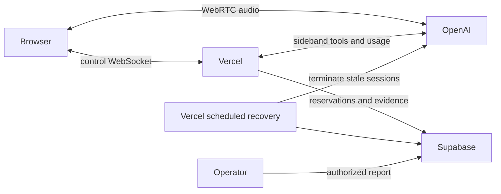

# Placy voice infrastructure and conversation costs - Plan

## Goal Capsule

**Objective:** Lene can validate the complete Nyhavna demo through a stable hosted link, and Andreas can inspect measured conversation costs and price customer service from repeatable evidence.

**Means:** Vercel Pro and Supabase (KTD1). Preserve GPT-Live-1, GPT-5.6-Terra and Willow.

**Authority:** User instructions, CLAUDE.md, this contract, implementation details. Scope is Sacred. Work in an isolated checkout; do not push without Andreas requesting it. The existing request authorizes deployment of the Nyhavna demo. The executor owns implementation, checks and the hosted handoff; do not send Lene a message.

**Stop conditions:** Provider or platform evidence contradicts the hosting decision; required deployment access is unavailable; irreversible customer-data changes are needed. A missing prerequisite blocks its dependent release step, not independent work. No declaration of production readiness from mocked tests.

## Product Contract

### Summary

Host the existing Nyhavna experience, record durable per-conversation usage and calculated provider costs, and deliver an operator report plus repeatable audio benchmark evidence.

### Problem Frame

The current demo is explicitly local-only. Conversation ownership, rate limits and map delivery depend on process memory; usage goes to local logs. These cannot establish customer-wide limits or survive Vercel restarts. One historical nine-minute test cannot establish pricing margins.

### Key Decisions

- **Consolidate on Vercel and Supabase** (session-settled: user-directed). Governs R1. Andreas upgraded Vercel; API confirmed Pro on 2026-09-16.
- **Preserve the chosen Anja models and voice.** Governs R2. This work changes hosting and measurement, not the product's reasoning/audio choices.

### Requirements

- **R1:** The full demo is available through a shareable HTTPS link using Vercel and Supabase as hosting/data platforms. OpenAI and map providers remain external APIs.
- **R2:** Existing speech, knowledge, map actions, context synchronization and interruption behavior remain available using the selected models and curated dataset.
- **R3:** Independent users can converse concurrently without mixing session controls, maps, context or usage. Shared admission limits survive cold starts and deployments.
- **R4:** Every attempted paid conversation has a durable record tied to a server-selected customer/project or explicit internal demo identity. Store provider IDs, timestamps, termination reason, environment, model/config/dataset version, usage components, rate version and test labels; do not store raw transcripts in the accounting ledger.
- **R5:** Cost reporting distinguishes provider-reported units, calculated USD cost, provisional/incomplete evidence and fixed platform costs. Duplicate events never double-charge; cumulative voice updates never sum. Unknown rates or missing usage remain visibly incomplete.
- **R6:** Andreas can list individual conversations and filter customer, environment and test run, inspect cost components and export results without exposing financial data to demo visitors.
- **R7:** A repeatable real-audio benchmark records successful and failed paid calls. Run repeated scenarios and durations, report sample count, median/p95/max and incomplete records separately, and distinguish synthetic tests from real customer averages.
- **R8:** Public access cannot create unlimited paid sessions. Session controls require ownership, metering fails closed at admission, and disconnects/deadlines/crashes have bounded cleanup and an observable recovery path.

### Acceptance Examples

- Two browsers start concurrently: each gets its own map actions and usage record; stopping one leaves the other active.
- The same backend response event arrives twice and voice seconds arrive 120, 60, 130: one backend charge and 130 voice seconds are recorded.
- The connection dies before final usage: the last checkpoint survives, the call is terminated or flagged for recovery, and its cost is not presented as complete.
- An unauthenticated visitor requests financial data or another user's control endpoint: access is denied without returning session details.

### Scope Boundaries

Customer-facing insight analytics, transcript retention and automated invoicing are separate product work. This ledger supports pricing decisions; it is not an invoice reconciliation claim. Existing curated content remains bundled JSON. No third hosting provider is introduced unless hosted evidence invalidates KTD1.

## Planning Contract

### Key Technical Decisions

**KTD1 — Vercel + Supabase** (session-settled: user-directed — chosen over a separate long-running host to consolidate operations; R1). Vercel's documented WebSocket support pins each connection to an instance. Its Pro extended duration is 1800 seconds, including setup and teardown. Pro status is verified; beta eligibility and deployed behavior remain execution gates. Give hosted sessions a visible safety margin below that hard platform deadline; do not claim uninterrupted thirty-minute voice time.

**KTD2 — One control connection owns a conversation.** Carry start/SDP negotiation, map directives/results, UI context and stop over one WebSocket. WebRTC audio stays direct between browser and OpenAI. Allocate supervisor and bridge per connection; no cross-request reliance on a singleton. Browser disconnect closes the session; restarting is explicit, not an automatic second paid call. Keep the local transport working until the hosted replacement is proven; remove superseded paths after parity.

**KTD3 — Supabase is the durable authority.** New service-only v2 tables hold session reservations, provider usage events and rate snapshots. Enable RLS, revoke anon/authenticated privileges, grant service_role explicitly. Follow the existing uncached server wrapper. Atomic reservation/lease operations enforce per-tenant concurrency and rate caps across instances. A scheduled authenticated reaper terminates stale known provider sessions; ambiguous create outcomes remain unresolved and block unsafe retries until recovered. Do not reuse v2.events or local budget JSONL.

**KTD4 — Event evidence precedes totals.** Unique provider response IDs deduplicate backend charges; voice duration is a monotonic maximum. Checkpoint during conversation, with final closure evidence separately tracked. Persist normalized numeric usage and allowlisted raw usage metadata, never response content. Version tariff snapshots; reuse audited arithmetic in lib/live/usage.ts, rejecting malformed usage and unknown model variants. Calculated totals remain estimates against published rates, not invoice amounts.

**KTD5 — Operator access starts server-side.** Provide an authenticated operator report or local credentialed CLI with CSV export; existing ADMIN_ENABLED is not identity protection. Do not enable public admin as a shortcut. Admission resolves tenant/demo server-side. Use a bounded demo access mechanism and same-origin validation; keep secrets out of URLs and logs.

**KTD6 — Benchmark real hearing.** Reuse the 14 WAV fixtures and window.placyVoice.play harness. Persist scenario/run IDs at session admission. Initial target: at least three repetitions of six scenarios (18 short sessions), plus 5-minute, 15-minute and near-limit calls, two concurrent calls, disconnect and forced-owner-loss cases. Paid execution has an explicit finite run count and spend ceiling, saved even on failure. Reports distinguish run types and incomplete evidence; no extrapolation presented as a measured customer distribution.

### High-Level Technical Design

Directional sketches; implementation may refine naming without changing ownership.

Protocol: authorize upgrade → reserve durable slot → create provider session → persist provider identity → attach sideband → return SDP → exchange map/context/usage → close provider → finalize ledger. Failures before durable identity are explicitly unresolved, never assumed free.

State lifecycle: reserved → creating → active → closing → closed; creation ambiguity → unresolved; stale active lease → recovering → closed or unresolved. Reaper claims a recovery lease atomically so concurrent reapers cannot race the owner. Terminal accounting can receive late final evidence without reopening the conversation.

Cost flow: upstream usage → validate and normalize → idempotent durable event → versioned calculation → aggregate report. Invalid/missing units propagate incompleteness instead of a zero charge.

Hosted logging uses an allowlist of operational identifiers, message types, numeric timing and usage. Exclude spoken excerpts, transcript fragments, tool arguments, raw control frames and free-form provider error messages; the existing local sideband timing logger must not carry these into Vercel logs.

Admission atomically checks a configurable durable daily spend budget alongside rate and concurrency limits. Reserve estimated in-flight liability before paid creation so simultaneous calls cannot each consume the same remaining budget; reconcile measured usage without treating missing usage as released liability. If a conservative bound cannot be established, deny new admission. The same durable mechanism enforces the finite benchmark budget.

### Risks and Dependencies

- The WebSocket and extended-duration features are beta: deploy a small transport proof before invasive transport changes; test beyond the ordinary 800-second ceiling.
- Provider close events may be absent after process loss: distinguish measured lower bound from unresolved final cost and keep recovery evidence.
- Supabase service-role bypasses RLS: server-side tenant/ownership checks are mandatory and tested.
- Existing admin routes are only environment-gated: do not expose them during demo rollout.
- Runtime voice is explicitly requested, overriding the project's general build-time LLM rule for this feature only.
- Key setup and preview access must be verified without printing credentials. A preview requiring Andreas's Vercel login is not a usable handoff to Lene.

## Implementation Units

### U1. Prove hosted control transport

**Goal / requirements:** Establish R1 feasibility under KTD1 before replacing transport.
**Files:** A minimal isolated transport probe, Vercel config and operational evidence.
**Approach:** Deploy an authenticated/bounded WebSocket probe using the current official Functions API, Node24 and extended duration. Remove probe after testing. Verify connection ownership and duration configuration.
**Test scenarios:** echo; two clients; disconnect; connection surviving beyond 800 seconds. Platform refusal is a blocker with exact evidence.
**Verification:** Actual deployed results and duration evidence, not just a successful build.

### U2. Durable accounting and shared admission

**Goal / requirements:** R3–R5, R8; KTD3–KTD4.
**Files:** Next migration after 092, lib/live/metering modules, Supabase database types, usage tests.
**Approach:** Add restricted ledger, idempotent ingest and atomic admission/recovery operations. Link demo identity explicitly without guessing existing customer IDs. Record tariff and configuration snapshots.
**Test scenarios:** duplicate response; decreasing seconds; unknown/malformed usage; missing final event; concurrent reservations; expired owner; cross-tenant denial; database outage.
**Verification:** Unit tests plus migrated database checks proving grants, uniqueness, admission atomicity and durable retrieval.

### U3. Hosted conversation ownership and browser integration

**Goal / requirements:** R1–R3, R8; KTD1–KTD2. Depends on U1/U2.
**Files:** lib/live/sideband.ts, supervisor/map bridge, use-live.ts, new hosted route, demo access guards.
**Approach:** Introduce per-connection ownership, thread validated control messages through the pinned connection, preserve domain tools and direct WebRTC. Start accounting before paid creation, checkpoint usage and gracefully finalize. Apply hosted deadline with cleanup margin.
**Test scenarios:** full speech/map/context flow; concurrent users; late ack; invalid payload; stop during creation; network loss; provider timeout; graceful deadline; sentinel conversation and provider-error content absent from hosted logs.
**Verification:** Existing local behavior and targeted tests pass; hosted two-browser flow works.

### U4. Recovery and release controls

**Goal / requirements:** R3/R8; KTD3/KTD5. Depends on U2/U3.
**Files:** scheduled recovery route, admission/access validation, vercel.json, runbook.
**Approach:** Lease heartbeat, authenticated cron recovery and bounded admission. Fail closed when durable reservation fails. Configure keys and demo access without enabling admin.
**Test scenarios:** killed owner; stale reservation without provider ID; duplicate cron; denied origin/access; concurrency cap; deployment during call; exhausted daily budget; concurrent reservations cannot overspend the remaining budget; incomplete usage retains unresolved liability.
**Verification:** Stale provider calls are stopped or visibly unresolved, limits remain enforced after restart.

### U5. Operator cost report

**Goal / requirements:** R4–R6; KTD4/KTD5. Depends on U2.
**Files:** scripts/voice-costs.ts and reporting library/tests; operator documentation.
**Approach:** Credentialed CLI first, per-session rows and component totals with customer/test/environment filters and CSV. Use database aggregation or complete pagination. Report known cost and incomplete rows separately; fixed platform costs remain separate.
**Test scenarios:** >1000 records; empty report; unknown price; mixed test/customer data; incomplete call; CSV escaping; unauthorized database role.
**Verification:** Report totals reconcile with durable test fixtures and a real conversation.

### U6. Repeated audio measurements and hosted handoff

**Goal / requirements:** R1/R2/R7. Depends on U3–U5.
**Files:** reproducible browser runner, benchmark scenarios/report, runbook, PROJECT-LOG.md.
**Approach:** Pin runner dependency, reuse WAV audio harness, execute KTD6 matrix in finite batches, capture usage and failures, derive transparent pricing inputs. Confirm mobile layout, access and provider-key restrictions. Commit locally; deploy intended demo without pushing unrelated work.
**Test scenarios:** quiet/tool-heavy/interrupted/corrected/long/concurrent conversations; fail-fast spend limit; mid-run failure retains results; browser access without operator login.
**Verification:** Mechanical checks, repeated hosted evidence, working shareable URL and honest cost distribution report. No claim that customer pricing is finalized solely by synthetic tests.

## Verification Contract

Run npm run lint, npm test, npx tsc --noEmit and npm run build after integrated code changes. Add focused tests for ledger correctness, ownership, admission and cleanup; mock tests cannot replace the hosted transport/duration and paid audio checks above. Save actual commands/results and blockers in execution notes, not mutable plan status. Check deployment from an unauthenticated browser with its intended demo access. Never send the link to Lene automatically.

## Definition of Done

All R1–R8 have evidence, U1–U6 acceptance scenarios are addressed, migrations are applied and verified, hosted deployment is usable, and per-conversation cost evidence survives disconnection and redeploy. Benchmark results include attempted/completed/incomplete counts and limitations. Abandoned probes and superseded code are removed. Technical work is logged; unresolved release blockers are explicit and preclude describing the demo as ready.

## Sources

- docs/strategy/LOG.md and 2026-09-16 Nyhavna materials: internal validation, mobile use, standard product and provisional pricing.
- PROJECT-LOG.md September 13: one historical nine-minute cost sample, not a customer average.
- lib/live/{sideband,supervisor,map-bridge,usage,use-live}.ts and lib/realtime/server-session.ts: current lifetime and accounting constraints.
- docs/solutions/performance-issues/google-api-runtime-cost-leakage-20260215.md: shared paid state cannot rely on process memory.
- docs/solutions/performance-issues/dry-run-koster-fullt-i-places-backfill.md: paid reads are billable and PostgREST pagination matters.
- https://vercel.com/docs/functions/websockets
- https://vercel.com/docs/functions/configuring-functions/duration
- https://vercel.com/docs/functions/functions-api-reference/vercel-functions-package
- https://developers.openai.com/api/docs/models/gpt-live-1
- https://developers.openai.com/api/docs/models/gpt-5.6-terra
