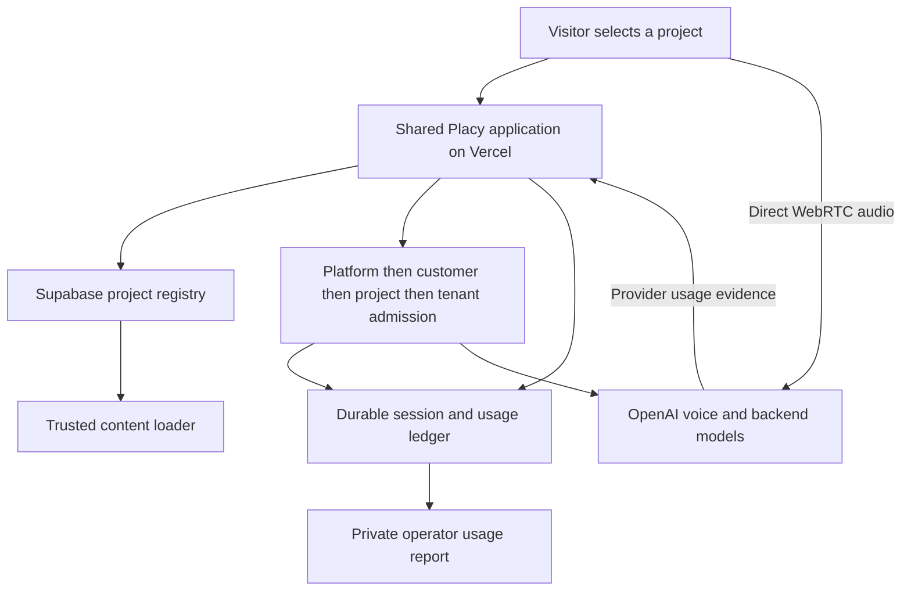

# Shared Placy Platform - Plan

**Completed 2026-09-17:** U1–U6 and R1–R10 verified. Shared runtime is live at `https://placy-platform.vercel.app/p/nyhavna`, deployment `dpl_8RtoKwB491jQzDtwTPFCsRRwH6nZ`. [Release evidence](../research/voice-infrastructure/shared-platform-validation.md) records the anonymous paid proof, old tenant disablement, unchanged main production, final map and explicit DNS/commercial boundaries. Work remains locally committed; no Git push.

## Goal Capsule

- Objective: Nyhavna runs on a reusable Placy platform, and Andreas can identify its customer, project, usage and operating limits without managing a separate customer application.
- Means: Generalize the existing hosted voice runtime, bind it to existing v2 customer/project records, and introduce shared admission policies (KTD1–KTD5).
- Authority: User requests common infrastructure and metering, preserves anonymous/noindex sharing, and explicitly stops cosmetic URL work. Existing Vercel + Supabase boundary remains. No Git push or messages to customers.
- Execution: Native implementation with independent units where ownership permits; parent owns verification and commits. Deployment and additive migrations are authorized by the migration request. Stop on destructive migration, unknown customer ownership, or an unrelated production change that cannot be isolated.
- Delivery: Verified shared runtime, Nyhavna cutover, operator usage report, system map and recovery/rollback instructions. Final customer pricing and automated invoicing are not part of this change.

---

## Product Contract

### Summary

Nyhavna becomes the first configured project using shared Placy services. Adding a project with a supported content source requires registry and policy provisioning, not another Vercel project. Operators can distinguish customer/project usage from internal validation and see aggregate limits.

### Problem Frame

The hosted Nyhavna proof has useful durable accounting but hardcodes its dataset and demo tenant. Copying this deployment for Koteng would duplicate operation and fragment accounting. The current main public deployment is older than the local branch, so replacing it wholesale would also publish unrelated changes.

### Requirements

**Project identity and content**

- R1. Reuse existing v2 customers and projects; the server resolves public project identifiers to canonical ownership, enabled state, supported content source and admission tenant.
- R2. The page, health response and paid start use one project resolver. Unknown, disabled, inconsistent or stale content fails before paid creation. Browser input cannot choose customer, tenant, rates, budget or instructions.
- R3. Keep Nyhavna's current curated content, voice and board behavior. A second distinct fixture project must demonstrate content, session and accounting isolation without creating a public fictional customer.

**Usage and operation**

- R4. New shared-platform sessions carry immutable customer/project identity and a separate purpose: public, internal or benchmark. Historical demo rows retain their original meaning.
- R5. Admission enforces mandatory project, customer and platform ceilings atomically, plus existing tenant controls. All provider usage counts toward operational safeguards; purpose distinguishes customer usage from internal work for reports, not automatic billing.
- R6. Retain ownership fencing, recovery, final usage draining, incomplete liabilities and fail-closed accounting. Old internal liabilities still count toward platform exposure.
- R7. Operators can filter by project/customer/purpose and see platform/customer/project totals, active calls, incomplete lower bounds, reservations, budget headroom and threshold warnings. Calculated supplier cost remains distinct from invoice/final customer price; unmeasured hosting/maps/database allocation is explicitly unknown.

**Migration and understanding**

- R8. Keep one shared runtime for new projects, without republishing unrelated changes to existing placy.no production. Anonymous/noindex access and the existing usable link remain during cutover.
- R9. Provisioning is repeatable, refuses ownership reassignment and does not reset existing budgets or overwrite project configuration. Old public admission must not bypass shared limits after migration.
- R10. Provide a checked interactive system map distinguishing current infrastructure from planned changes and identifying cost/data responsibilities. Update it after cutover.

### Scope Boundaries

Includes Nyhavna as the first real binding and independent second-project fixtures. Does not publish Koteng content, invent a contract, finalize prices, send alerts to external recipients, create payment collection, build a customer login, or migrate all editorial content into a new CMS. Shared supplier operating expenses are documented separately; precise allocation requires future billing evidence. Large load capacity is not claimed from the bounded migration test.

### Acceptance Examples

- AE1. Nyhavna public start resolves `nyhavna-utvikling` / `nyhavna-utvikling_nyhavna`; a changed client customer/tenant payload is rejected before provider creation.
- AE2. Project A using project B's snapshot cannot start; independent A/B sessions get only their own instructions/map output and ledger identity.
- AE3. A full project quota blocks that project while an unrelated project below its parent limits still starts. Two projects racing for the final customer/platform slot produce only one admission.
- AE4. An old closed incomplete benchmark charge remains visible and consumes platform liability; history is never rewritten to appear customer-billable.

---

## Planning Contract

### Key Technical Decisions

- KTD1. One shared hosted runtime with dynamic project routing; keep the internal Vercel project's legacy name temporarily. Shared service behavior and identity matter more than renaming. (session-settled: user-approved — chosen over per-customer deployments: shared operation and traceable usage.) Governs R1, R8.
- KTD2. Preserve same-origin pages, static assets, APIs, image optimization, Server Actions and WebSockets. Prefer a neutral shared platform alias and, if DNS access is available, `app.placy.no`. Retain the current short-link redirect until domain routing is deliberately migrated. Do not use a partial reverse proxy that mixes old main-app APIs with new page assets. Governs R8. Existing main production is `bef9ae2`, while this branch derives from `fc83a56` with many unrelated unpublished changes.
- KTD3. Add a service-only project registry keyed by public slug and linked to existing project/customer ownership; its content-source ID selects a trusted server loader. No file paths or arbitrary instructions come from client input. Nyhavna remains file-backed for this migration. Governs R1–R3.
- KTD4. Extend the existing ledger rather than replacing it. Add purpose independent of identity, new project-bound tenant(s), and admission policies in the same Supabase database. Lock platform → customer → project → tenant in fixed order; no external network request occurs while locked. Missing policies deny new platform starts. All legacy tenants also pass the global ceiling. Governs R4–R6.
- KTD5. Preserve old rows and existing unfinished liabilities. Seed new Nyhavna policies conservatively from current operational allowances, explicitly not the draft 300-conversation sales allowance. Migration uses additive schema and scoped inserts; no customer/project reparenting. Public/internal/benchmark all consume operating ceilings. Governs R5, R6, R9.
- KTD6. Extend local operator reporting first; no unauthenticated cost/admin endpoint. Show warning thresholds in the report, without external notifications or automated invoices. Governs R7.

### High-Level Technical Design

### Assumptions and Deferred Implementation Details

Actual customer/project identity is verified through read-only Supabase: `nyhavna-utvikling` owns `nyhavna-utvikling_nyhavna`. Leangenbukta currently belongs to `placy-demo`; do not reassign it. Exact neutral alias availability and first-party DNS access are execution checks. If DNS is unavailable, shared platform functionality still deploys under its neutral Vercel alias and the first-party DNS step remains explicitly outstanding. No infrastructure is moved out of Vercel/Supabase.

---

## Implementation Units

### U1. Bind shared projects and enforce aggregate admission

**Goal:** Persist authoritative project binding and reject excess usage across shared infrastructure.
**Requirements:** R1, R4–R6, R9; AE1, AE3, AE4.
**Dependencies:** None.
**Files:** `supabase/migrations/097_shared_voice_platform.sql`, `lib/live/metering/types.ts`, `lib/supabase/types.ts`, `lib/live/metering/shared-platform.test.ts`, `scripts/verify-voice-platform.ts`.
**Approach:** Add registry and platform/customer/project policy schema with service-only access. Extend tenant/session purpose and identity constraints while retaining history. Replace reservation function with fixed-order aggregate locking, server-derived identity and unchanged metering state behavior. Seed platform guardrails and Nyhavna binding idempotently, without enabling a client-side identity shortcut. Persist provisioning validation in executable SQL/tests.
**Patterns:** Migrations 093/094 and existing PGlite metering tests; uncached service-role client.
**Execution note:** Establish failing policy/identity tests before the new migration; use real independent PostgreSQL connections for final race evidence.
**Test scenarios:** Missing/disabled policies deny; mismatched owner denies; concurrent customer/platform admissions respect exact ceilings; project rejection does not block another eligible project; all-purpose liabilities count; old incomplete rows count globally; repeat seed retains edited budgets; anon/authenticated roles cannot read or invoke privileged objects.
**Verification:** SQL behavior and ownership/recovery regressions pass, then real database concurrency and role checks establish the cross-connection contract.

### U2. Resolve project content and hosted starts

**Goal:** Page/health/controller resolve configured project content and canonical admission identity.
**Requirements:** R1–R4, R9; AE1, AE2.
**Dependencies:** U1.
**Files:** `lib/live/projects.ts`, `lib/live/projects.test.ts`, `lib/live/demos.ts`, `lib/live/hosted-control.ts`, `lib/live/hosted-control.test.ts`, `app/api/prototype/live/route.ts`, `lib/live/route.test.ts`.
**Approach:** Introduce server project resolver with typed registry/dependency injection. Prefer explicit public project slug; compatibility dataset requests resolve through the same canonical registry. Benchmark role remains signed; no arbitrary client labels on public calls. Use resolved trusted loader and tenant for controller start. Missing registry never silently falls back to old demo quota.
**Patterns:** Existing dataset snapshot checks, strict Zod start payload and injected hosted dependencies.
**Test scenarios:** Two distinct projects load distinct facts/boards/tenant IDs; unknown/disabled project, snapshot mismatch, supplied accounting fields and unauthorized benchmark labels result in zero provider creation; same-connection duplicate start cannot create a second paid call; compatibility old link resolves to new identity.
**Verification:** Focused resolver/controller/route tests and the existing hosted lifecycle suite pass.

### U3. Serve projects through shared pages and browser protocol

**Goal:** A configured public project renders and starts voice on the same shared origin.
**Requirements:** R2, R3, R8.
**Dependencies:** U2.
**Files:** `app/p/[slug]/page.tsx`, `app/demo/nyhavna-lokal/page.tsx`, `app/demo/nyhavna-lokal/lokal-board-gate.tsx`, `components/variants/report/board/board-data.ts`, `components/variants/report/board/voice/board-voice.tsx`, `lib/live/use-live.ts`, `lib/live/use-live.test.tsx`, `next.config.mjs`, `app/robots.ts`.
**Approach:** Render projects from the registry with canonical customer/project IDs and public voice selector. Keep the legacy Nyhavna URL compatible. Carry project selection through health and WebSocket startup; preserve old local prototypes. Noindex headers/meta apply to all shared project pages and crawlers may fetch them. Keep local resources and API calls same-origin.
**Patterns:** Existing local board gate, shared ReportReelsPage and use-live tests.
**Test scenarios:** Explicit project reaches health/start; legacy local mode retains behavior; unknown/disabled public pages return 404; page identity matches voice identity; refresh, image loading, map, stop/restart and noindex verified on published shared origin.
**Verification:** Browser protocol regressions plus desktop/mobile smoke on candidate and shared alias.

### U4. Report usage and operational headroom

**Goal:** Andreas can see per-project/customer/platform costs and separate internal usage.
**Requirements:** R4, R6, R7; AE4.
**Dependencies:** U1.
**Files:** `lib/live/cost-report.ts`, `lib/live/cost-report.test.ts`, `scripts/voice-costs.ts`, `docs/research/voice-infrastructure/cost-report.md`.
**Approach:** Add project/purpose filters, explicit scope totals and policy headroom. Keep unknown accounting separate from complete estimates, and retain paginated reads. Add threshold status with clear rolling-window meaning; don't manufacture shared supplier allocations or invoice amounts. Preserve compatibility with historical rows.
**Patterns:** Existing cutoff/pagination, incomplete accounting and CSV hygiene tests.
**Test scenarios:** Two projects under one customer aggregate without duplication; purpose filtering excludes internal rows from selected customer-use view but not true platform exposure; reservations and old incomplete liabilities reduce headroom; >1,000 rows stay complete; unmatched filters stay empty rather than showing global cost as project cost.
**Verification:** Arithmetic, scope, incomplete and pagination tests; real private report matches selected ledger rows after cutover.

### U5. Verify, deploy and cut over Nyhavna

**Goal:** Nyhavna is actually running on shared platform identity without disrupting existing Placy production.
**Requirements:** R3–R9.
**Dependencies:** U2, U3, U4.
**Files:** `scripts/verify-voice-platform.ts`, `docs/research/voice-infrastructure/shared-platform-validation.md`, deployment configuration where needed.
**Approach:** Record old deployment/aliases and active sessions; apply additive migration; deploy candidate with full checks; verify shared pages before promotion. Add neutral shared alias, preserve old alias for existing links. Move new Nyhavna starts to project-bound tenant and disable old public tenant only after candidate proof; existing calls retain ledger ownership and recovery. Keep old app main deployment untouched. Attempt first-party subdomain only through available authorized DNS access. Roll back application deployment/configuration if verification fails, leaving additive ledger history intact.
**Test scenarios:** Bounded anonymous paid call produces correct non-null customer/project/purpose and closed complete usage; old link uses same binding; anonymous same-origin controls remain enforced; recovery/admin protections retained; two-project isolation/races pass; shared assets/map/images load on both viewport sizes; noindex remains in meta/header/robots. No broad synthetic spend or claimed high-load certification.
**Verification:** Full mechanical checks, independent code review, real database race/role tests, deployed browser and paid-session evidence. Report first-party DNS status honestly.

### U6. Document operation and keep the system map current

**Goal:** Andreas can understand systems, ownership, costs and safe onboarding/rollback.
**Requirements:** R7–R10.
**Dependencies:** U5; initial current-state map can be written before cutover.
**Files:** `docs/architecture/placy-systemkart.html`, `docs/architecture/shared-platform.md`, `docs/research/voice-infrastructure/operations.md`, `PROJECT-LOG.md`.
**Approach:** Keep current/target states explicit, name shared versus project-specific data, provide onboarding and disable/rollback instructions, record measured versus unknown costs and limited capacity evidence. Document the existing main frontend as a compatibility boundary until intentional convergence.
**Test scenarios:** Diagram node selection, tabs and usage sliders work at desktop/mobile widths; displayed current topology matches actual deployment/registry rather than the plan.
**Verification:** Browser interaction/visual inspection and documentation cross-check against live identities, policies and aliases.

---

## Verification Contract

| Gate | Evidence |
|---|---|
| Project/content isolation | Focused tests exercise two distinct server-resolved projects and reject client identity/snapshot tampering before paid creation. |
| Atomic admission | Real independent PostgreSQL connections race across projects/customers; counts exactly match configured allowances. |
| Permissions and accounting | Anon/auth denied; ownership/recovery and historical incomplete liability remain intact. |
| Mechanical checks | `npm run lint`, `npm test`, `npx tsc --noEmit`, `npm run build`; one full bounded worker run is sufficient after integration. |
| Independent review | Review actual diff, apply concrete correctness/security findings and repeat affected checks only. |
| Hosted evidence | Desktop/mobile maps/assets, anonymous noindex page, one bounded audio call and complete attributed ledger row. |
| Regression boundary | Original main Placy deployment unchanged; legacy Nyhavna entry continues working or is explicitly restored on failure. |
| Operator understanding | System map and report accurately distinguish measured usage, reservations, estimates and unknown shared costs. |

## Definition of Done

All six units meet their verification criteria; shared runtime resolves Nyhavna through the registry, real new usage has verified customer/project identity, independent project fixtures demonstrate reuse/isolation, and layered admission is proven under actual database concurrency. No historical ownership is rewritten and no public cost endpoint exists. The live link works anonymously with noindex. First-party DNS availability is reported separately from platform readiness. Work is committed locally, deployment state and any genuine residual limitations are documented, and no Git push or customer message occurs.

## Sources and Research

- `docs/research/voice-infrastructure/operations.md`, `hosted-validation-2026-09-17.md`, `cost-report.md`: existing verified hosted runtime and accounting limits.
- `supabase/migrations/095_voice_metering.sql`, `096_voice_close_lease.sql`: atomic per-tenant reservation and finalization.
- `CONCEPTS.md`: shared Poolen, project identity and composed board model.
- `docs/solutions/database-issues/jsonb-merge-vs-overwrite-seed-scripts-20260413.md`: preserve unrelated configuration and use idempotent narrow changes.
- `docs/solutions/integration-issues/vercel-data-cache-stale-across-deployments-20260215.md`: deployment is not proof of refreshed data; control reads must be uncached.
- `docs/solutions/performance-issues/dry-run-koster-fullt-i-places-backfill.md`: read-only/dry-run can incur supplier costs; paginate beyond REST row caps.
- [OpenAI usage API](https://platform.openai.com/docs/api-reference/usage): provider grouping is independent of internal customer/project attribution.
- [Vercel rewrites](https://vercel.com/docs/routing/rewrites): a rewrite preserves the public URL but does not by itself migrate all application resources; same-origin shared runtime avoids mixed-version routing.
