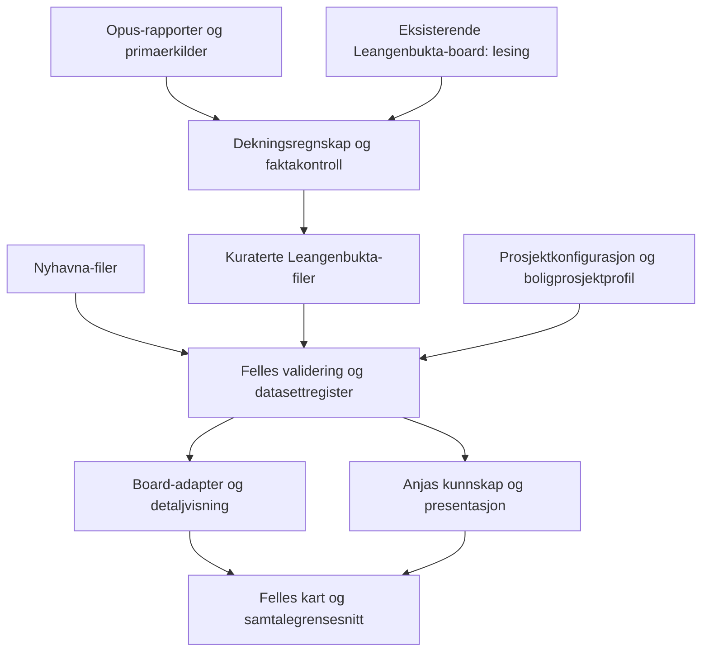

# Leangenbukta board og arbeidsprosess for boligprosjekter - Plan

## Goal Capsule

- **Objective:** En boligkjøper kan utforske Leangenbukta med Anja og kartet, forstå både prosjektet og nærområdet, og skille tilgjengelige tilbud fra forventninger ved innflytting.
- **Means:** Lokal demo med kontrollert kunnskapsgrunnlag, felles board-funksjoner og en eksplisitt boligprosjektprofil (R1–R3, KTD1–KTD3).
- **Authority:** Brukerens beslutninger og `CLAUDE.md`/`AGENTS.md` gjelder foran denne planen. Product Contract eier atferd; Planning Contract eier tekniske valg.
- **Execution:** Åtte avhengighetsordnede enheter. Teknisk grunnlag kan bygges mens Opus gjør research; faktainnhold tas inn først når kildene er kontrollert. Framdrift og åpne tråder føres utenfor planen.
- **Stop conditions:** Manglende research blokkerer bare berørt innhold og endelig demogodkjenning. Ikke fyll hull med gjetninger. Stans berørte endringer hvis de krever produksjonsutrulling, skriving til poolen eller endret produktscope.
- **Handoff and landing:** Claude gjennomfører i isolert worktree, verifiserer og committer lokalt. Andreas bestemmer push og publisering. Ingen PR eller push inngår automatisk.

---

## Product Contract

### Summary

Bygg en ren lokal Leangenbukta-demo som andre gjennomføring av Nyhavna-metoden: kildekontrollert innhold legges inn kategori for kategori og prøves i samtale med Anja. Gjenbruk board, kart og samtalemotor. Skill prosjektdata fra felles funksjonalitet, slik at samme grensesnitt kan brukes med ulike databehov for boligprosjekt, bruktbolig og næring.

### Problem Frame

Nyhavna startet som en tom demo for å utvikle Anjas kunnskap og samtaleatferd systematisk. Leangenbukta har allerede et provisjonert board og en lokal nettsidekopi, men trenger samme kontrollerte læringsløp. Et delvis ferdigbygd boligprosjekt krever at nåstatus, planlagt åpning, innflytting og bruksrett ikke blandes sammen. En ny kopi av Nyhavnas kode ville samtidig gjøre neste prosjekt dyrere å vedlikeholde.

### Key Decisions

- **Ren lokal demo med selektiv gjenbruk av eksisterende innhold.** (session-settled: user-approved — chosen over direkte videreutvikling av provisjonert Leangenbukta-board: kontrollert gjentakelse av Nyhavnas samtale- og innholdsprosess.) Governs R1, R4.
- **Felles grensesnitt med ulikt datagrunnlag per boardtype.** (session-settled: user-approved — chosen over egne applikasjoner per marked: kart, stedskort og samtale deles, mens kunnskapsbehovene varierer.) Governs R2, R3.
- **Boligprosjekt er den konkrete gjennomføringen nå.** Bruktbolig og næring definerer grensene for gjenbruk; egne ferdige demoer for disse inngår ikke i denne leveransen. Governs R3.

### Requirements

**Demo og gjenbruk**

- R1. Leangenbukta får egen lokal rute og eget datasett som kan starte uten steder, temaer eller FAQ-er, uten automatisk arv fra Nyhavna eller Supabase.
- R2. Begge lokale demoer bruker samme board- og samtalefunksjonalitet, samtidig som eksisterende Nyhavna-atferd og provisjonerte boards bevares.
- R3. Boardets domeneprofil skilles fra visningsmodus: boligprosjekt har prosjekt-/utbyggingskunnskap, bruktbolig har bolig-/nabolagskunnskap, og næring har bygg-/virksomhetskunnskap; bare boligprosjektprofilen aktiveres og fylles i denne leveransen.

**Kunnskap og research**

- R4. Hver levert researchkandidat får dokumentert vurdering før eventuell import, med kilde, kontrolldato, beslutning og begrunnelse; originalmaterialet bevares separat fra runtime-data.
- R5. Prosjektkunnskap skiller byggestatus, fasilitetens tilgjengelighet, forventet tidspunkt, konkret innflytting, bruksrett og motstridende opplysninger; ingen forventning blir en garanti gjennom tekst, kart eller tale.

**Opplevelse og ferdigstilling**

- R6. Kart, kategorier, FAQ, sted-/prosjektdetaljer og Anja bruker samme prosjekt og datasettversjon; tale og klikk har samme relevante handlinger, og avbrudd/fortsettelse bevarer samtalens plass.
- R7. Innhold utvikles gjennom en gjentakbar kategori-prosess med kildekontroll, import, skjermkontroll og reell samtaletest; tomme kategorier formidles som manglende demogrunnlag, ikke fravær av tilbud i virkeligheten.
- R8. Begge innganger i Leangenbukta-nettsidekopien åpner den nye demoen når den er klar, med Leangenbukta-identitet og fungerende desktop/mobilgrunnflyt; siden og lokal Live-tilgang beholder utviklingsbegrensningene.

### Key Flows

- F1. Nettsidekopi → «Utforsk nabolaget» → Leangenbukta-board → prosjektet eller nærområdet → valgt kategori/objekt → spørsmål til Anja. Covers R1, R6, R8.
- F2. Researchrapport → vurderte fakta → kategoriens kunnskap, FAQ og manus → validering → kartkontroll → lyttetest → korrigering ved behov. Covers R4, R5, R7.
- F3. Anja presenterer → brukeren avbryter med spørsmål om en fasilitet → svaret bevarer status og adgang → «fortsett» gjenopptar riktig del. Covers R5, R6.

### Acceptance Examples

- AE1. En tom Leangenbukta-demo viser bare prosjektets kontrollerte utgangspunkt og tomme kategorier; Anja finner ikke Nyhavna-fakta eller påstår å vise steder som mangler. Covers R1, R6, R7.
- AE2. En kilde sier at bygg A er ferdigstilt, mens treningsrommets åpning er ukjent. «Kan jeg trene der nå?» besvares uten å slutte at treningsrommet er åpent. Covers R5.
- AE3. En fasilitet har forventet åpning før en oppgitt innflyttingsdato, men ingen uttrykkelig bekreftelse på tilgjengelighet ved overtakelse. Anja forklarer forventningen og usikkerheten, uten å love tilgang. En uttrykkelig bekreftelse for bygg A brukes ikke for bygg B. Covers R5.
- AE4. Opplysningene spriker mellom prospekt og nettside. Begge registreres; uenigheten blir synlig ved relevante spørsmål og erstattes ikke med et vilkårlig valgt svar. Covers R4, R5.
- AE5. Klikk på kategori og valg med stemmen gir samme steder. «Vis flere» bruker samme utvalg, og Anja hevder først at stedene er vist etter bekreftet kartoppdatering. Covers R6.
- AE6. Leangenbukta-data endres etter sidelasting. Ny samtale fra gammel fane avvises ved versjonsavvik med beskjed om å laste på nytt. Aktiv samtale beholder sitt opprinnelige datasett. Covers R6.
- AE7. En kategori får en ny kildekontrollert FAQ og et sted gjennom dataløpet; de vises og brukes i ny samtale uten prosjektspesifikk endring i samtalekoden. Covers R2, R7.
- AE8. Brukeren avbryter presentasjonen, får et faktasvar og sier «fortsett». Riktig manusdel gjenopptas, mens stillhet alene ikke starter neste del. Covers R6.

### Scope Boundaries

Leveransen omfatter Leangenbuktas prosjektgrunnlag og kategoriene Hverdag, Oppvekst, Servering, Natur, Transport, Trening og Opplevelser. Kategoriutvalget følger Nyhavnas fungerende ramme; innhold og spørsmål skal handle om Leangenbukta. Antall steder eller FAQ-er kopieres ikke som en kvote.

### Deferred to Separate Tasks

- Produksjonsprovisjonering/CMS og eventuell senere overføring av lokalt innhold til ordinære boards. Denne demoen erstatter ikke `lib/pipeline/`.
- Ferdige bruktbolig- og næringsprofiler med egne datasett, research og samtaletester. Grensene dokumenteres i denne leveransen, men uimplementerte profiler presenteres ikke som tilgjengelige.
- Publisering, salgsintegrasjon og automatisk oppdatering av boligpriser, ledighet eller ferdigstillelsesdatoer.
- Nyhavnas separate mobilparitetsarbeid og stemmeinfrastrukturarbeid eies av sine eksisterende grener; nødvendige avklaringer om integrasjon inngår i U1.

---

## Planning Contract

### Key Technical Decisions

- KTD1. **Felles lokal demo-kjerne med eksplisitt register.** Flytt delte lastere, skjemaer, adaptere og presentasjonshjelpere fra `lib/demo/nyhavna-lokal/` til `lib/demo/local-board/`. Prosjektidentitet, kategori for prosjektet, hilsen, profil, merkevare og innhold kommer fra godkjent register/datasett. Behold prosjektdata i separate mapper. R1–R3 styrer skillet.
- KTD2. **Boligprosjektdata som et avgrenset tillegg.** Utvid tema-/faktamodellen for boligprosjekter med strukturert evidens per påstand, og bruk samme projeksjon i detaljvisning og kunnskapsverktøy. Behold de fem runtime-filene; `conversations.json` er kun testgrunnlag. Ikke etabler et generelt CMS eller en ny database.
- KTD3. **Domeneprofil og funksjonsstøtte er forskjellige begreper.** Domeneprofilen er `housing-development`; framtidige identifikatorer `resale` og `commercial` dokumenteres, men avvises som uimplementerte hvis noen forsøker å aktivere dem. Felles funksjoner som presentasjon, FAQ-fremdrift og utvidelse av steder styres av eksplisitt konfigurasjon, ikke prosjektets slug. Ikke overlast eksisterende `boardMode` eller `venueType`.
- KTD4. **Ett datasett gjennom hele Live-flyten.** Gjenbruk eksisterende `/api/prototype/live` og injisert kunnskap i samtalemotoren. Registeret avviser ukjente ID-er og gir aldri fallback til Nyhavna. Innholdshash må dekke alle felt som påvirker skjerm eller tale, også profil og prosjektkonfigurasjon. R6 gjelder også verktøybeskrivelser, avstandsordlyd og tomme svar.
- KTD5. **Research inn via filer, kontrollert av mennesker/agenter.** Opus-rapporten og eventuelt uttrekk fra eksisterende Leangenbukta-board er kandidatkilder. Runtime bruker kun det kuraterte datasettet. Selektiv import bevarer proveniens, men en databasekontroll teller ikke som ny kontroll av nettsiden. Ingen Supabase-skriving eller webresearch under samtalen.
- KTD6. **Preserver eksisterende lokal prototypegrense.** Anja bruker den eksisterende lokale Live-prototypen, som allerede er et avgrenset unntak dokumentert i `docs/plans/2026-09-12-nyhavna-conversation-prototype.md`. Ingen ny modell/provider eller generell runtime-generering innføres. Ukontrollert research og syntetiske testfakta må aldri bli runtime-kunnskap.
- KTD7. **Små, testede uttrekk før innholdsarbeid.** Først karakteriser eksisterende Nyhavna-atferd, så trekk ut delt kode og koble begge demoer til den. Flyttet implementasjon slettes fra gammel plass når importene er oppdatert; unngå to kopier av samme motor. Prosjektspesifikke Nyhavna-data og merkevare beholdes.

### Development Evidence Model

KTD2 krever at følgende betydninger bevares; eksakte feltnavn avgjøres under implementering i det eksisterende Zod-formatet.

| Begrep | Krav til representasjon |
|---|---|
| Objekt | Stabil prosjektintern ID og type: prosjekt, bygg, fasilitet eller uteområde. Kartreferanse er valgfri. |
| Påstand | Én konkret opplysning med kilde-ID, kontrolldato og verifikasjonsgrunnlag. |
| Byggestatus | Eksisterende, under bygging, planlagt, vedtatt plan, visjon eller uavklart. Ikke lik åpning/adgang. |
| Tilgjengelighet | Åpent, ikke åpnet, forventet eller ukjent, knyttet til den konkrete fasiliteten. |
| Tidspunkt | Oppgitt dato/intervall med opprinnelig presisjon og forventet/bekreftet kvalifikasjon. Ukjent dato forblir ukjent. |
| Innflyttingskobling | Bare eksplisitt kildebekreftelse kan si at fasilitet er tilgjengelig ved innflytting i navngitt bygg. |
| Adgang | Alle beboere, navngitte bygg/grupper, offentlig eller uavklart, med eventuelle dokumenterte vilkår. |
| Konflikt | Referanser til motstridende påstander; ingen automatisk rangering bare etter sidenes dato. |
| Kartplassering | Kontrollert koordinat eller eksplisitt omtrentlig områdeanker. Kunnskap uten plassering beholdes som tema. |

Datoer må ikke skifte status automatisk når kalenderen passerer dem. Sammendrag, FAQ og manus må kunne spores tilbake til de samme påstandene. UI-adapterens enkle `developmentStatus` er kun en kartklassifisering; den kan ikke erstatte det detaljerte kunnskapsgrunnlaget.

### High-Level Technical Design



```mermaid
sequenceDiagram
  participant UI as Board
  participant API as Lokal Live-rute
  participant D as Datasettregister
  participant A as Anja
  UI->>API: Datasett-ID og innholdshash
  API->>D: Last eksplisitt valgt datasett
  D-->>API: Validert innhold og hash
  alt Hash avviker eller ID er ugyldig
    API-->>UI: Forklar feil; ikke start feil samtale
  else Samsvar
    API->>A: Samme prosjektkunnskap som boardet
    A->>UI: Kart-/kategorihandling
    UI-->>A: Bekreftet visning
  end
```

Researchens livsløp er kandidat → vurdert → aktivt innhold → validert → prøvd i samtale. En kandidat kan i stedet bli utelatt eller stå uavklart med begrunnelse. Uavklart innhold kan bare aktiveres som eksplisitt usikkerhet, aldri som bekreftet fakta.

### Baseline and Integration Constraints

Ved planlegging er hovedrepo på `fc83a56`. `feat/nyhavna-mobil-paritet` og `feat/voice-infrastructure` finnes i separate worktrees. Dette er øyeblikksinformasjon, ikke tillatelse til å merge dem. U1 må kontrollere aktuell tilstand og dokumentere hvilken baseline implementasjonen bygger på.

Nettsidekopien, dens ressurser og bruksanvisning er ucommittet i hovedrepo ved planlegging. En ny worktree får dem derfor ikke automatisk. Overfør bare de nødvendige filene med bevart innhold/proveniens, eller bruk en allerede ferdigstilt commit hvis den finnes ved oppstart. Ikke inkluder andres logg- og strategiendringer i egne commits.

Eksisterende Leangenbukta-board er en valgfri innholdskilde, ikke en oppstartsavhengighet. Den faktiske Opus-leveransen er ennå ikke lokalisert. Ikke dikt opp en filsti eller rapporter den som gjennomgått. Ramme og skjema kan bygges først; U5–U6 krever at faktisk research er tilgjengelig eller utføres fra primærkilder innen samme scope.

### Sources and Patterns

- `app/demo/nyhavna-lokal/page.tsx`, `lokal-board-gate.tsx`, `layout.tsx`: lokal rute, felles board og kart-CSS. Gate inneholder en fiktiv Nyhavna-megler som ikke skal kopieres til Leangenbukta.
- `lib/demo/nyhavna-lokal/{schema,dataset,board,voice,presentation,radius,voice-instructions}.ts`: nåværende lokale dataløp; flere identitetskonstanter og tekster er prosjektspesifikke.
- `lib/live/demos.ts`, `lib/live/use-live.ts`, `app/api/prototype/live/route.ts`: datasettvalg, klienthandlinger og hashkontroll.
- `components/variants/report/board/voice/board-voice.tsx` og `components/variants/report/board/neighbourhood/use-viewport-category-list.ts`: eksakt Nyhavna-ID aktiverer i dag felles lokal funksjonalitet.
- `lib/realtime/nyhavna-conversation.ts`: eksisterende injisert kunnskap, men også prosjektspesifikke verktøytekster og standardsvar.
- `components/variants/report/reels/ReportReelsPage.tsx`: intro/splash må kontrolleres for slug-avhengighet.
- `docs/research/nyhavna-lokal-demo/README.md`: kategoriarbeid, samtaleflyt og skillet mellom mekanisk test og lyttetest.
- `docs/research/nyhavna-lokal-demo/2026-09-13-barn-oppvekst-faq-mapping.md`: full gjennomgang fra originalresearch til kildekontrollerte svar.
- `docs/research/nyhavna-leve-demo/site-coverage.md` og `curated-source-audit.md`: dekningsregnskap og håndtering av motstrid.
- `docs/demos/leangenbukta-nettside.md` og `docs/plans/2026-09-16-leangenbukta-demo-plan.md`: eksisterende nettsidekopi; sistnevnte gjelder nettsidearbeidet og erstattes ikke av denne planen.

---

## Implementation Units

### U1. Etabler baseline og regresjonsgrunnlag

**Goal:** Avklar arbeidsgrunnlaget og sikre observerbar Nyhavna-atferd før delt kode endres. **Requirements:** R2, R8. **Dependencies:** Ingen.

**Files:** Ny `docs/research/leangenbukta-lokal-demo/baseline.md`; eksisterende tester i `lib/demo/nyhavna-lokal/`, `lib/live/route.test.ts`, `lib/live/use-live.test.tsx` og boardets stemme-/kategoritester.

**Approach:** Følg KTD7. Kartlegg berørte imports, eksakte slug-sjekker, Live-grenser, merkevare og intro. Registrer baseline-commit, aktive grener og hvordan nettsidekopien blir tilgjengelig i arbeidsgrenen. Bruk eksisterende tester og legg bare til manglende karakterisering av atferd som skal bevares.

**Test scenarios:**

1. Nyhavna laster med egne kategorier, manus og hilsen.
2. FAQ, presentasjon og utvidelse av steder når klienten med eksisterende datasetthash.
3. Produksjonsbegrensning og feil ved hashavvik har dagens observerte virkemåte.

**Verification:** Baseline og testutfall er dokumentert; eventuelle eksisterende feil er skilt fra nye feil. Ingen ukjent parallell endring inngår skjult.

### U2. Trekk ut felles lokal board-kjerne

**Goal:** Et lokalt datasett kan velges eksplisitt uten Nyhavna-avhengig identitet eller fallback. **Requirements:** R1, R2, R6. **Dependencies:** U1.

**Files:** Ny `lib/demo/local-board/` med flyttede delte moduler og `registry.ts`; `lib/demo/nyhavna-lokal/`; `app/demo/nyhavna-lokal/page.tsx`; `lib/live/demos.ts`; nye `lib/demo/local-board/registry.test.ts`, `dataset.test.ts`, `board.test.ts`.

**Approach:** KTD1, KTD4, KTD7. Parameteriser feiltekster, datasett-ID, hash og opprinnelsesnavn. Registeret eier godkjente mapper; klienten får ikke velge filsti. Behold eksisterende Nyhavna-kontrakt og oppdater alle berørte imports. Ikke flytt prosjektdata inn i den delte kjernen.

**Test scenarios:**

1. Covers AE1: Tomt Leangenbukta-testdatasett laster uten Nyhavna-innhold eller databaseoppslag.
2. To datasett gir forskjellige identiteter og korrekt board-/stemmekunnskap.
3. Ukjent ID og ugyldige referanser avvises med presis feil; ingen standarddemo lastes i stedet.
4. `conversations.json` inngår aldri i runtime-kunnskap.
5. Nyhavnas eksisterende innhold og relevante atferdstester passerer etter uttrekket.

**Verification:** Én delt implementasjon brukes av lokal demo-flyten; register og hash har kryss-datasettdekning.

### U3. Innfor boligprosjektprofil og strukturert prosjektkunnskap

**Goal:** Prosjektets bygg, fasiliteter og tidsavhengige opplysninger kan representeres uten tap av mening. **Requirements:** R3, R5. **Dependencies:** U2.

**Files:** Nye `lib/demo/local-board/profiles.ts`, `development.ts`, `development.test.ts`; delte `schema.ts`, `dataset.ts`, `board.ts`, `voice.ts`; ny `docs/demos/board-profiler.md`; eksisterende board-detaljkomponent utvides ved behov etter kartlegging i U1.

**Approach:** KTD2–KTD3 og Development Evidence Model. Skill profil fra eksisterende UI-modus. Tilpass Nyhavna-data eksplisitt uten å finne på nye påstander. Gjenbruk detaljflaten for status, tidspunkt, adgang og kilde når feltene finnes; en manglende opplysning skal ikke vises som en falsk negativ. Temaer uten koordinater trenger ikke stedspost.

**Test scenarios:**

1. Covers AE2–AE4: Bygg ferdig/fasilitet ukjent, forventet dato uten innflyttingsløfte og motstrid bevares gjennom validering, UI-adapter og kunnskapsverktøy.
2. Bekreftet adgang for bygg A arves ikke av bygg B; kildekontroll-dato brukes ikke som åpningsdato.
3. En passert forventet dato gjør ikke et tilbud automatisk åpent.
4. Kunnskap uten koordinater er søkbar uten oppdiktet kartpunkt.
5. Uimplementert profil avvises tydelig; standard Nyhavna-kunnskap fungerer fortsatt.

**Verification:** Skjerm og kunnskapsverktøy gjengir samme betydning for hver status-/adgangskombinasjon i testgrunnlaget.

### U4. Koble Leangenbukta til kart og Anja

**Goal:** Leangenbukta får en fungerende tom demo med hele den eksisterende lokale samtaleflyten. **Requirements:** R1, R2, R6, R8. **Dependencies:** U2, U3.

**Files:** Nye `app/demo/leangenbukta-lokal/page.tsx`, `layout.tsx` og prosjektkonfigurasjon; nye `data/demo/leangenbukta-lokal/{board,sources,places,topics,faq,conversations}.json`; `lib/live/demos.ts`, `use-live.ts`; `lib/realtime/nyhavna-conversation.ts`; boardets `voice/board-voice.tsx`, `neighbourhood/use-viewport-category-list.ts`; `ReportReelsPage.tsx`; `lib/live/route.test.ts`, `use-live.test.tsx`, boardets eksisterende komponenttester.

**Approach:** KTD3–KTD4, KTD6. Erstatt eksakte Nyhavna-sjekker med godkjent konfigurasjon på hele kjeden, også verktøytekster, radiusetiketter, intro og avstandsordlyd. Leangenbukta har egen hilsen og merkevare, Mapbox-stilark og kontrollert utgangspunkt. Ingen fiktiv megler. Behold dagens eierskap og opprydding av Live-sesjoner; ny demo innebærer ikke flere samtidige stemmesesjoner.

**Test scenarios:**

1. Covers AE1, AE5, AE6, AE8: Tomtilstand, klikk/tale-paritet, versjonsavvik og avbrudd/fortsettelse.
2. Nyhavna og Leangenbukta kan vises i separate faner uten kryssede fakta eller kartkommandoer; eksisterende begrensning på aktiv stemmesesjon håndteres tydelig.
3. Ukjent datasettnavn og produksjonskall får eksisterende avvisningsatferd også for ny demo.
4. Mikrofontillatelse avvist, avbrutt forbindelse og ny samtale gir forståelig UI uten å bytte prosjekt.

**Verification:** Tom demo er teknisk kjørbar og ærlig om manglende kunnskap. Nyhavna har samme relevante funksjoner som ved baseline.

### U5. Ta inn prosjektgrunnlaget fra Opus

**Goal:** Bygg, fasiliteter og prosjektets tidslinje får kontrollert kunnskapsgrunnlag. **Requirements:** R4, R5, R7. **Dependencies:** U3, U4 og faktisk tilgjengelig prosjekt-research.

**Files:** Nye `docs/research/leangenbukta-lokal-demo/raw/`, `coverage.md`, `project-facts.md`; Leangenbuktas lokale JSON-filer; ny `lib/demo/local-board/leangenbukta-content.test.ts`.

**Approach:** KTD5. Registrer faktisk rapportsti og dato, bevar originalen og inventer samtlige påstander/kilder. Gjennomgå alt, vurder det som står igjen på nytt, og stikkprøvekontroller egne beslutninger. Rapportér X av Y vurdert, Z endret, W bekreftet og antall uavklarte/utelatte. «Halvveis ferdigbygd» er brukerens kontekst, ikke et verifisert prosenttall. Legg prosjektspørsmål i FAQ og kunnskap først; lag bare kartpunkter når plasseringen er forsvarlig.

**Test scenarios:**

1. Alle aktive prosjektfakta, manus og FAQ har gyldig kilde og kontrolldato.
2. Covers AE2–AE4: Reelle tids-/adgangsopplysninger følger samme regler som syntetiske testtilfeller.
3. En utelatt eller ukontrollert råpåstand finnes ikke som bekreftet runtime-fakta.
4. Samme objekt har stabil ID gjennom korreksjon; kart og FAQ peker fortsatt riktig.

**Verification:** Hele den leverte prosjekt-researchen er regnskapsført. Relevante uklarheter har konkrete spørsmål til utbygger og trygg formulering i demoen.

### U6. Bygg naeromradet kategori for kategori

**Goal:** Alle avtalte nabolagskategorier får vurdert innhold og prøvbare kjøperspørsmål. **Requirements:** R4, R6, R7. **Dependencies:** U4, U5; kategoriresearch kan innhentes tidligere.

**Files:** Leangenbuktas JSON-filer; nye `docs/research/leangenbukta-lokal-demo/categories/`, `import-manifest.json`, `conversation-evaluation.md`; `lib/demo/local-board/leangenbukta-content.test.ts`.

**Approach:** Gjenta F2 for hver kategori i Scope Boundaries. Kontroller alle kandidater fra mottatt research; velg et relevant startutvalg og eventuelt flere steder etter forespørsel. Eksisterende board/pool kan gi kandidater med proveniens, men ikke automatisk import. Reisetider må beregnes fra kontrollert Leangenbukta-utgangspunkt og riktig transportmåte, aldri kopieres fra Nyhavna. Skill rutetid, gangtid og luftlinjeradius. FAQ, tema og manus deler fakta; manus skal invitere til samtale.

**Test scenarios:**

1. Covers AE7: Nytt verifisert sted/spørsmål tas inn uten spesialkode i samtalemotoren.
2. Hver kategori prøves med et bredt spørsmål, et konkret stedsspørsmål, en oppfølging, et spørsmål uten dekning og avbrudd/fortsettelse.
3. Kjøpesenter/anker beholder medlemmer, kilder og egne avstander uten doble markører.
4. Ingen rute eller reisetid viser Nyhavna som utgangspunkt; omtrentlig kartanker gir ikke falsk inngangspresisjon.
5. Kategori med utilstrekkelige kilder gir dokumentert kunnskapshull og ærlig samtalesvar.

**Verification:** Alle syv kategorier har dekningsregnskap og testresultat. En tom eller uavklart kategori telles ikke som innholdsferdig bare fordi skjemaet er gyldig.

### U7. Koble nettsidekopien og gjennomfor demoprove

**Goal:** Hele kundeopplevelsen kan demonstreres fra nettside til samtale og kart. **Requirements:** R2, R5–R8. **Dependencies:** U4–U6.

**Files:** `app/demo/leangenbukta-nettside/placy-row.tsx`, `beliggenhet/page.tsx` ved behov; `docs/demos/leangenbukta-nettside.md`; nye `docs/research/leangenbukta-lokal-demo/validation.md` og skjermbilder/lyttetestnotater; relevante komponenttester fra U4.

**Approach:** Bytt den sentrale CTA-destinasjonen til `/demo/leangenbukta-lokal`. Kontroller at all synlig CTA-tekst stemmer med transportfunksjonene som faktisk er levert. Behold illustrert kart og øvrig nettside. Test desktop og mobil på implementert baseline uten å anta at den separate mobilplanen er landet.

**Test scenarios:**

1. Begge nettsideinnganger åpner riktig board med Leangenbukta-logo, utgangspunkt og intro.
2. Desktop 1440 × 900 og mobil 390 × 844: kategori, kartpunkt, detalj, FAQ og stemmekontroll er tilgjengelige uten skjult innhold eller blokkerende overlapp.
3. Reell lydprøve dekker AE2–AE5 og AE8; registrer input, observert svar/kart og eventuelle avvik.
4. Avvist mikrofon og nettverksbrudd kan håndteres uten feil prosjektkunnskap.
5. Nyhavna regresjonsprøves etter endringer i delte komponenter; gamle provisjonerte Leangenbukta-ruten fungerer fortsatt.

**Verification:** Nettleserbevis, mekaniske tester og faktisk lydprøve rapporteres hver for seg. Manglende lydtilgang er en åpen sluttgate, ikke en bestått prøve.

### U8. Dokumenter og bevis arbeidsprosessen for neste prosjekt

**Goal:** Neste boligprosjekt kan følge en konkret prosess med data og konfigurasjon framfor kodekopiering. **Requirements:** R2–R4, R7. **Dependencies:** U2–U7.

**Files:** Nye `docs/demos/boligprosjekt-arbeidsprosess.md`, `docs/research/leangenbukta-lokal-demo/README.md`; `docs/demos/board-profiler.md`; `PROJECT-LOG.md`; midlertidig test-fixture i eksisterende delt testoppsett.

**Approach:** Beskriv prosjektoppsett, researchbestilling, kandidatliste, kontroll, import, samtaletest, oppdatering og gjenopptakelse. Vis hvilke felt som er felles og hvilke som er boligprosjektspesifikke. Prøv å konfigurere et minimalt tredje, tydelig syntetisk prosjekt i testmiljøet; det skal ikke bli en publisert eller varig kunde-demo. Registrer gjenværende prosjektspesifikke koblinger som konkrete funn og rett dem innen R2.

**Test scenarios:**

1. Et testprosjekt bruker samme kjerne med egne ID-er/hilsen/sentrum uten nye slug-sjekker eller kopiert motor.
2. Endring av ett datasett påvirker ikke andre datasett eller deres innholdshash.
3. Syntetisk testinnhold er utilgjengelig i demo-registeret som runtime kan nå.

**Verification:** Arbeidsoppskriften stemmer med faktisk kode. Teknisk logg viser baseline, innholdsdekning, testbevis og åpne tråder; egne endringer er lokalt committet.

---

## Verification Contract

| Gate | Bevis | Gjelder |
|---|---|---|
| Datasett og isolasjon | Målrettede tester for register, validering, hash, profil og kunnskapsprojeksjon | U2–U5, U8 |
| Samtale og kart | Live-/komponenttester for samme datasett, klikk/tale-paritet og avbrudd | U4, U6–U7 |
| Innholdsdekning | Fullt regnskap over mottatte kandidater og kilder; nye fakta kildekontrolleres | U5–U6 |
| Nettleser | Desktop/mobil og begge nettsideinnganger, med skjermbilder | U7 |
| Lyd | Faktisk samtale med dokumenterte spørsmål og observasjoner | U6–U7 |
| Repo | `npm run lint`, `npm test`, `npx tsc --noEmit`; `npm run build` ved sluttkontroll og alltid før eventuell PR | Endelig kodeleveranse |
| Regresjon | Nyhavna og eksisterende Leangenbukta-board kontrollert mot valgt baseline | Alle endringer i delt kode |

Testresultater oppgis med faktisk dekning. Eksisterende feil skal dokumenteres og håndteres, ikke omdøpes til bestått. Ingen testkjøring er nødvendig for selve dette plandokumentet.

## Definition of Done

Alle R1–R8 og AE1–AE8 er dekket av implementasjon og etterprøvbart bevis. Leangenbukta-demoen kan åpnes fra nettsidekopien og brukes til kildeforankret samtale om prosjektet og nærområdet. Prosjekt-research og alle syv kategorier er gjennomgått med eksplisitt dekning og gjenstående faktaspørsmål.

Nyhavna fungerer på valgt baseline, og den lokale kjernen har ingen skjulte Leangenbukta-/Nyhavna-fallbacks. Ingen produksjonsdata er endret. Forlatte forsøk, doble implementasjoner og syntetiske runtime-data er fjernet. Arbeidsprosess, verifikasjon og åpne tråder er dokumentert, og egne endringer er committet lokalt uten push.

Teknisk ramme kan leveres som milepæl før research er ferdig, men hele planen er ikke fullført før innholdsgatene og reell samtaletest er gjennomført.
