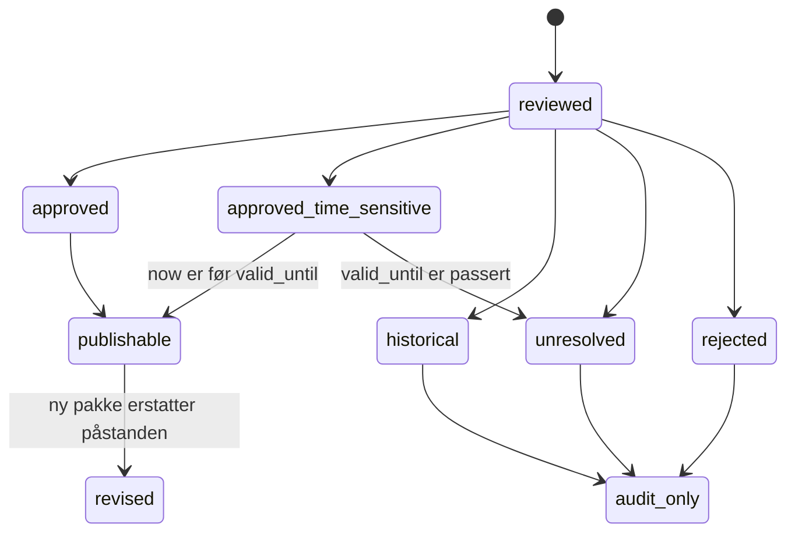
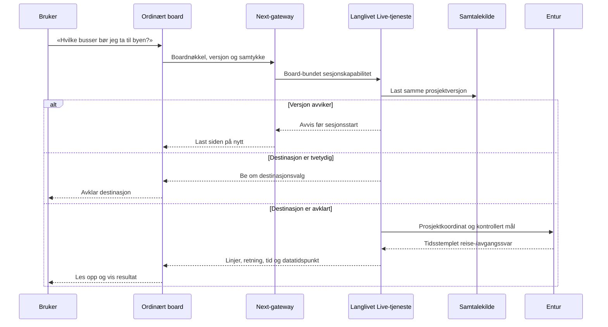

# Ordinært board med Anja og revidert lokalkunnskap - Plan

## Goal Capsule

- **Objective:** Kjøpere kan utforske det ordinære Placy-boardet og spørre Anja om prosjektet, nærområdet og kollektivtilbudet, med samme kartdata på skjermen og i samtalen.
- **Means:** Flytt den reviderte kunnskapsmodellen, samtaleharnessen og evalueringsregimet fra Nyhavna og Leangenbukta inn i den ordinære board- og pipelinearkitekturen. Behold den brede POI-poolen, men skill kartvisning, revidert innhold og Anjas søkeflate (KTD1–KTD7).
- **Authority:** Brukerens beslutninger og `CLAUDE.md`/`AGENTS.md` gjelder foran planen. Product Contract eier produktatferd; Planning Contract eier tekniske valg. Denne planen erstatter gjenstående retning i den tidligere Leangenbukta-planen, men beholder dens ferdige research- og testartefakter.
- **Execution:** Åtte enheter gjennomføres i avhengighetsrekkefølge. Leangenbukta er migreringscaset, Nyhavna regresjonscaset og Lillebytunet det første rene gjenbruksbeviset.
- **Stop conditions:** Stans berørt enhet hvis normal board-visning og Anja ikke kan bindes til samme innholdsversjon, hvis en datamigrering kan miste eksisterende innhold, eller hvis produksjonsaktivering mangler et eksplisitt tilgangs-, rate- eller kostnadsvern. Ikke løft uavklarte eller historiske researchpåstander til nåtidige fakta.
- **Handoff and landing:** Implementer og verifiser lokalt. Commit ved naturlige milepæler. Andreas bestemmer når noe pushes eller publiseres.

## Product Contract

### Summary

Det ordinære rapport-boardet blir eneste produksjonsflate. Nyhavna- og Leangenbukta-demoene beholdes midlertidig som interne fasiter mens kunnskapslaget, Anja og evalueringsharnessen flyttes over. Brukeren skal kunne se et rikt områdekart, få kuraterte svar der research finnes, og spørre om levende kollektivdata uten at kartet fylles med alle registrerte steder samtidig.

### Problem Frame

Nyhavna og Leangenbukta ble bygget fra tomme lokale boards for å få kontroll over kilder, samtaleatferd og kartrespons. Det ga gode research- og evalueringsmønstre, men opprettet en parallell runtime uten produksjonsboardets brede POI-grunnlag, cache, Entur-data og vanlige prosjektflyt. Leangenbukta viste også at et lite redaksjonelt startutvalg alene underkommuniserer hvor mye som finnes i området, mens en rå import av hundrevis av punkter gjør kartet og Anjas kontekst uoversiktlig.

### Key Decisions

- **Det ordinære boardet er produksjonsflaten.** (session-settled: user-directed — chosen over å videreføre separate lokale boards: produksjonsboardet har allerede bred POI-dekning og sanntidsintegrasjoner.) Governs R1, R2, R9.
- **POI-bredde og redaksjonell kunnskap er separate lag.** (session-settled: user-approved — chosen over enten 26 kuraterte eller 800 synlige punkter: kart, søk og samtale trenger ulike utvalg.) Governs R3, R4, R5.
- **Leangenbukta migreres først, Nyhavna verifiserer regresjon, Lillebytunet beviser gjenbruk.** (session-settled: user-approved — chosen over å starte direkte med Lillebytunet: eksisterende Leangenbukta-evidens avdekker migreringsfeil før en ren gjennomføring.) Governs R10, R11, R12.
- **Adresse leses bare opp når den trengs.** (session-settled: user-directed — chosen over å gi hele POI-posten til stemmen: gatenavn skaper støy og dårlig uttale.) Governs R6.
- **Kollektivsvar bruker levende Entur-data.** (session-settled: user-directed — chosen over statiske researchsvar: linjer og avganger endres og finnes allerede i produksjonsboardets datakjede.) Governs R7, R8.

### Requirements

**Felles produksjonsflate**

- R1. Ordinære rapport-boards bruker eksisterende `Project → getCachedReportProduct → transformToReportData → adaptBoardData → ReportReelsPage` som eneste produksjonsflyt; ingen prosjektspesifikk lokal JSON-rute blir en alternativ produksjonskilde.
- R2. Anja kan aktiveres eksplisitt per ordinært board gjennom en generell assistentkonfigurasjon med stabil board-identitet, innholdsversjon og tillatte egenskaper. Hver samtale krever en kortlivet, board-bundet serverkapabilitet og fordelte misbruks-/kostnadsgrenser; boards uten konfigurasjon endrer ikke atferd.
- R3. Hvert board har en kanonisk POI-pool som kan inneholde langt flere steder enn kartet viser ved en gitt zoom, radius og kategori.
- R4. Kartet velger synlige punkter fra poolen med eksisterende kategori-, kvalitets-, radius-, zoom-, ankermedlems- og kollisjonsregler; antallet synlige punkter skal ikke definere hva Anja kan finne. Et søketreff utenfor utsnittet vises som et midlertidig markert resultat uten å endre permanente filtre, og brukeren kan gå tilbake til forrige karttilstand.
- R5. Anja kan søke i hele boardets servervaliderte POI-pool, men prioriterer reviderte fakta. Registersteder uten revidert innhold omtales bare med sikre grunndata og merkes ikke som kvalitetsvurderte.

**Tale og sanntid**

- R6. Modelldata og standardsvar utelater gateadresse. Adresse beholdes i visuelle kort og kan hentes når brukeren uttrykkelig spør, trenger veibeskrivelse eller må skille steder med samme navn.
- R7. Anja kan hente timestampede, levende avganger for et serververifisert holdeplasspunkt og planlegge en reise fra boardets prosjektpunkt til en kontrollert destinasjon.
- R8. Ved utsagn som «jeg jobber i byen» avklarer Anja destinasjonen når uttrykket er tvetydig. Hun må ikke late som gamle linjeopplysninger, et stoppområdes tyngdepunkt eller manglende driftsdata er sanntid.

**Research og gjenbruk**

- R9. Researchharnessen kan ta en versjonert pakke med steder, prosjekt-/temapåstander, kilder, kontrolltidspunkt, status, tidsbetydning og koordinatbevis inn i v2-laget uten å kopiere rå rapporttekst til runtime.
- R10. Bare godkjente og godkjente tidsfølsomme påstander kan vises som kunnskap. Historiske, uavklarte og avviste påstander bevares i revisjonssporet, men brukes ikke som nåtidige svar eller kartpunkter.
- R11. Leangenbuktas godkjente research kobles til eksisterende kanoniske POI-er der identiteten er bekreftet. Prosjektfakta, planlagte fasiliteter og tema uten koordinat opprettes ikke som falske POI-er; de vises i prosjekt-/temaflaten med status, kilde og eventuell handling fra Anjas svar.
- R12. Nyhavnas eksisterende stemme-, kart- og instruksjonsatferd består som regresjonsfasit, og Lillebytunet kan gjennomføre samme research-, import-, board- og samtaleprosess uten prosjektspesifikk runtimekode.
- R13. Før første stemmesesjon får brukeren tydelig informasjon om mikrofon og OpenAI-behandling og gir eksplisitt samtykke. Samtaleinnhold lever bare mens sesjonen varer; logger inneholder redigerte drifts-/kostnadsmetadata, ikke lyd, transkript eller svarutdrag.

### Success Criteria

- Leangenbuktas ordinære board viser områdebredde gjennom den eksisterende POI-poolen, mens karttetthet og Anjas svar følger hver sine kontrollerte regler.
- De 35 eksisterende Leangenbukta-samtalescenarioene kan kjøres mot produksjonskontrakten; forventede svar skiller godkjent, registerbasert, planlagt, historisk og levende informasjon.
- En stemmesamtale besvarer «hvilke busser er best til sentrum?» med en avklart destinasjon og et tidsstemplet Entur-resultat, og fortsetter forrige kuraterte tema etter avbruddet.
- Ingen testet modelldata inneholder gateadresse uten at adresseintensjonen er eksplisitt.
- Nyhavnas golden fixtures passerer, og Lillebytunet går gjennom prosessen uten slug-sjekk, lokal datasetregistrering eller direkte import fra `data/demo/`.

### Key Flows

- F1. Revidert researchpakke → validering og revisjonsledger → eksplisitt kobling til prosjekt/POI → lesemodell → ordinært board og Anja. Covers R9–R12.
- F2. Ordinært board → assistentkonfigurasjon og innholdsversjon → serveren laster samme boardkilde → Anja svarer eller utfører en klientvalidert karthandling. Covers R1, R2, R5.
- F3. Kollektivspørsmål → destinasjonsavklaring → servervalidert prosjekt/stopp/destinasjon → Entur → tidsstemplet svar → eventuell kartvisning. Covers R7, R8.

### Acceptance Examples

- AE1. Et vanlig board uten assistentkonfigurasjon viser ingen Anja-kontroll og oppfører seg som før. Covers R2.
- AE2. Leangenbuktas kvalifiserte produksjons-POI-er innen konfigurert område finnes i poolen. Bare et passende utsnitt vises på kartet, men faste regresjonssteder som Burger King kan søkes opp selv om de ikke lå i startutvalget. Totalt antall rapporteres som observasjon, ikke som beståttgrense. Covers R3–R5.
- AE3. Brukeren spør «Hva kan du fortelle om Lade kirke?». Anja bruker reviderte fakta uten å lese Jarleveien 44. «Hva er adressen?» henter og leser den visuelle adressen. Covers R6.
- AE4. Brukeren spør «Jeg jobber i byen, hvilke busser bør jeg ta?». Anja avklarer hva «byen» betyr ved behov, planlegger fra prosjektet, oppgir relevante linjer/avganger og sier når dataene ble hentet. Covers R7, R8.
- AE5. Entur svarer sent eller ikke i det hele tatt. Anja sier at liveinformasjon ikke er tilgjengelig, beholder samtale- og karttilstand og faller ikke tilbake til en gammel rutetabell. Covers R7, R8.
- AE6. En regulert barnehagetomt mangler byggebeslutning. Boardet kan forklare planstatusen, men viser den ikke som åpen barnehage eller kanonisk drifts-POI. Covers R10, R11.
- AE7. En gammel fane starter Anja etter at boardets kunnskap er oppdatert. Serveren avviser versjonsavvik før en betalt samtale starter og ber om ny lasting. Covers R1, R2.
- AE8. Lillebytunet får en researchpakke med ett revidert sted, ett registersted, ett tema uten kartpunkt og ett tidsfølsomt faktum. Alt vises og omtales riktig uten Lillebytunet-spesifikk kode. Covers R9, R10, R12.
- AE9. Brukeren nekter mikrofontilgang eller samtykke, treffer rate-/kostnadsgrensen eller åpner en stale boardversjon. Samme assistentkontroll viser en kort forklaring og riktig ny lasting/prøv igjen-handling uten at en betalt sesjon startes. Covers R2, R13.

### Scope Boundaries

Planen omfatter produksjonskontrakten, kunnskapsimport, Leangenbukta-migrering, Anjas adresse- og kollektivatferd, Nyhavna-regresjon og én full Lillebytunet-gjennomføring. Den omfatter ikke et nytt kartdesign, en generell CMS-redesign, automatisk webresearch under samtalen eller global aktivering av Anja på alle boards. Rå POI-er skal ryddes gjennom eksisterende pipeline, ikke kopieres fra Leangenbuktas lokale registerfiler til produksjon.

## Planning Contract

### Current State

- Ordinære boards leser en cachet Supabase-`Project` og bygger `BoardData` i `components/variants/report/reels/ReportReelsPage.tsx`. `BoardData` inneholder kartgrunnlag, FAQ, transport-ID-er og hele POI-posten.
- `components/variants/report/board/voice/board-voice.tsx` aktiverer i dag Anja bare når `demoSnapshotId` finnes. Normal board-runtime mangler serveroppløselig samtaleidentitet og påstandsnivåets proveniens.
- `app/api/entur/route.ts` tilbyr allerede levende avganger og reiseplanlegging med timeout, rate limit og kort cache, men Anja har ingen Entur-verktøy.
- `v2.pois`, `v2.project_pois` og `v2.product_pois` skiller kanonisk sted, prosjektmedlemskap og produktvisning. `v2.place_knowledge` dekker gjenbrukbar stedskunnskap, men den reviderte prosjektpakken trenger en egen auditert importkontrakt.
- Leangenbukta-arbeidet har 565 vurderte prosjektpåstander, 145 vurderte nærmiljøkandidater, 56 reviderte steder og 503 registeroppføringer i lokal runtime. Disse filene er evidens og migreringsinput, ikke produksjonsdatabasen.

### Key Technical Decisions

- KTD1. **Utvid ordinær `BoardData` med en eksplisitt assistentkapabilitet.** (session-settled: user-approved — chosen over `demoSnapshotId` og prosjekt-slug: vanlig board skal eie produksjonsatferden.) Konfigurasjonen bærer en serveroppløselig nøkkel, innholdsversjon, visningsnavn og tillatte verktøy. R1 og R2 gjelder.
- KTD2. **En langlivet tjeneste eier produksjonssamtalen.** En dedikert Node-tjeneste eier OpenAI-sideband, samtaletilstand, kartbru, sesjonslås og opprydding gjennom hele samtalen. Next-rutene autentiserer og videresender oppstart, kontekst, kartkvittering og avslutning. Tjenesten bygger Anjas kunnskapskilde på nytt gjennom `loadBoardConversationSource`, bruker samme transformasjon som nettleseren og avviser versjonsavvik. R1, R2, R5 og R13 gjelder.
- KTD3. **Fire projeksjoner bygges fra samme lagrede grunnlag.** Kanonisk POI-pool, synlig kartutsnitt, én deduplisert `published_knowledge`-projeksjon og Anjas server-side søkeflate får egne regler. Initial samtalekontekst inneholder bare reviderte ankere og kompakte sammendrag; et begrenset top-k-verktøy søker hele poolen. Ingen projeksjon materialiseres som en kopi av en annen. R3–R5 gjelder.
- KTD4. **Research lagres som versjonerte pakker, entiteter og påstander.** Nye v2-tabeller beholder alle reviewstatuser og eksplisitt kobling til prosjekt og valgfri kanonisk POI. Hver pakke erklærer `full_snapshot` eller `delta` og scope. Tidsfølsomme påstander må ha eksplisitt `valid_until`; uten dette er de ikke publiserbare. Eksisterende `place_knowledge` forblir målet for uttrykkelig promoterte, gjenbrukbare stedfakta; promotering gjør den tilsvarende ledger-raden audit-only, og lesere bruker bare `published_knowledge`. R9–R11 gjelder.
- KTD5. **Import er idempotent og identitetsstyrt.** Pakkehash og stabil påstands-ID styrer upsert. Et `full_snapshot` supersederer fraværende aktive påstander i samme scope; et `delta` endrer bare medsendte påstander. Kobling til POI bruker autoritative eksterne ID-er eller kontrollert manuell mapping; navn alene oppretter aldri nytt sted. Importen kan oppdatere eksisterende prosjekter uten full reprovisjon og invaliderer produktcachen etter en vellykket transaksjon. R9–R11 gjelder.
- KTD6. **Tale får en egen dataprojektering.** Modelldata utelater adresse og andre visuelle felt som ikke trengs i tale. Et smalt adresseverktøy åpner bare den uttrykkelige unntaksflyten. R6 gjelder.
- KTD7. **Entur får én delt serverklient.** HTTP-ruten og Anjas verktøy bruker samme normalisering, timeout, cache og feilhåndtering. Verktøyene godtar bare serveroppløste board-POI-er og eksplisitt konfigurerte, navngitte destinasjoner som Trondheim sentrum; generell fri tekst-geokoding inngår ikke. Modellen sender ikke vilkårlige stopp-ID-er eller koordinater. R7 og R8 gjelder.
- KTD8. **Lokale demoer er migreringsorakler.** De beholdes til Leangenbukta, Nyhavna og Lillebytunet har bestått akseptansen. Deretter fjernes duplisert runtime og produksjonskomponentenes direkte demoimporter, mens research, receipts, golden fixtures og samtalescenarioer beholdes. R10–R12 gjelder.
- KTD9. **Produksjons-Anja krever et snevert policyunntak.** Før U4 aktiveres må `CLAUDE.md` uttrykkelig tillate runtime OpenAI Live/Responses bare gjennom den beskyttede assistentbanen med prosjektaktivering, board-bundet sesjonskapabilitet, servervalidert kunnskap, rate-/kostnadsgrense og innholdsfrie driftslogger. Øvrige LLM-integrasjoner forblir build-time. R2 og R13 gjelder.

### High-Level Technical Design

#### Komponent- og dataflyt

```mermaid
flowchart LR
  RP[Revidert researchpakke] --> IV[Validering og idempotent import]
  IV --> RL[v2 researchledger]
  IV --> KP[v2 kanonisk POI og stedskunnskap]
  RL --> PR[Autoritativ prosjektlesning]
  KP --> PR
  PR --> BD[Ordinær BoardData]
  BD --> MV[Kartets synlige utsnitt]
  BD --> UI[Stedskort og kategorier]
  PR --> CS[Serverens samtalekilde]
  CS --> SP[Spoken projection]
  SP --> LS[Langlivet samtaletjeneste]
  GW[Autentisert Next-gateway] --> LS
  LS --> AN[Anja]
  EN[Entur serverklient] --> AN
  EN --> EA[/api/entur og transport-UI]
  AN --> MA[Klientvalidert karthandling]
```

#### Researchens tilstandsløp



#### Anja og kollektivspørsmål



### System-Wide Impact

- **Data:** Research blir vedvarende prosjektdata med revisjonshistorikk. Migrasjonen må ha RLS, indekser, unikhetsregler og en reverserbar bakoverkompatibel read-path.
- **Cache:** Boardets innholdsversjon må endres når POI-medlemskap, revidert kunnskap eller assistentkonfigurasjon endres. `product:${customer}_${slug}` revalideres først etter commit.
- **Sikkerhet og kostnad:** Vanlige boards skal ikke arve demoens loopback-unntak. Anja krever eksplisitt prosjektaktivering, eksisterende bruker-/sesjonsvern, rategrenser og kostnadsvern før produksjon.
- **Sesjon og personvern:** En kortlivet board-bundet kapabilitet lagres i `HttpOnly`, `Secure`, `SameSite`-cookie og sendes aldri i URL. Alle kall validerer origin, prosjekt, versjon og aktivert assistent. Mikrofon-/OpenAI-samtykke, retention og slettesti må være dokumentert før produksjonsaktivering.
- **Sannhet:** Nåtid, planlagt, regulert, under bygging, historisk og uavklart må bestå gjennom import, read-modell, prompt, verktøy og UI.
- **Kart:** Et holdeplasspunkt representerer ikke nødvendigvis riktig plattform eller tilgjengelig inngang. Reiseverktøyet må bruke den identiteten Entur kan bekrefte og ikke love fysisk adkomst.
- **Kompatibilitet:** Normal transformasjon filtrerer i dag tomme kategorier, mens lokale demoer bevarer dem. Produksjonskontrakten må velge og teste ønsket oppførsel uten å endre eksisterende boards utilsiktet.

### Risks and Dependencies

- Nettleserens ISR-board og serverens samtalekilde kan drive fra hverandre hvis versjonshashen ikke dekker alle modell- og kartrelevante felt.
- Adresse kan lekke gjennom rå POI, FAQ, katalogverktøy eller generert narrasjon selv om hovedprompten utelater feltet.
- Entur kan gi delvise svar, bytte linjer eller være utilgjengelig. Svarene må være ferske, avgrensede og tydelig skilt fra kuratert research.
- Leangenbuktas lokale register inneholder nyttige funn, men skal ikke overskrive den eksisterende produksjonspoolen eller omgå pipeline-deduplisering.
- Den gamle Leangenbukta-planen og demoen kan se mer komplette ut enn produksjonsmigreringen underveis. CTA-er skal ikke flyttes før ordinærflyten har passert akseptansen.
- Dagens Live-sideband, kartbru og supervisor er prosess-/filsystemlokale. De kan brukes som prototypereferanse, men kan ikke flyttes direkte til en flerinstans serverless-runtime.

### Sources and Existing Patterns

- `app/eiendom/[customer]/[project]/rapport-board/page.tsx`, `lib/supabase/cached-board-reads.ts`: ordinær boardlesning og cache.
- `components/variants/report/reels/ReportReelsPage.tsx`, `components/variants/report/board/board-data.ts`: normal `BoardData`-projeksjon.
- `components/variants/report/board/voice/board-voice.tsx`, `lib/realtime/nyhavna-conversation.ts`, `lib/realtime/board-tools.ts`: dagens Anja- og kartgrense.
- `app/api/prototype/live/route.ts`, `lib/live/demos.ts`, `lib/live/use-live.ts`: datasettversjon, Live-sesjon og sideband.
- `app/api/entur/route.ts`, `lib/hooks/useTransportDashboard.ts`: levende kollektivdata i UI.
- `lib/supabase/v2-queries.ts`, `lib/pipeline/provision.ts`, `supabase/migrations/070_baseline.sql`: kanonisk POI-, prosjekt- og pipelinegrunnlag.
- `docs/research/leangenbukta-lokal-demo/audited/OVERLEVERING.md` og søskenmappen `_arbeidsdata/`: migreringsinput og receipts.
- `docs/research/nyhavna-lokal-demo/`: kategoriarbeid, evalueringsmønster og golden fasit.

## Implementation Units

### U1. Frys baselines og definer produksjonskontrakten

- **Goal:** Gjør normal board-atferd, innholdsversjon og migreringsgrenser målbare før delte komponenter endres.
- **Requirements:** R1–R5, R10–R12; KTD1–KTD3 og KTD8.
- **Dependencies:** Ingen.
- **Files:** `components/variants/report/board/board-data.ts`, `components/variants/report/board/board-data.test.ts`, `lib/live/demos.test.ts`, `lib/demo/local-board/`, `docs/research/leangenbukta-lokal-demo/`, nye kontrakt-/fixturefiler under eksisterende testområder.
- **Approach:** Karakteriser et ordinært board med en revidert POI, en register-POI, et tema uten kartpunkt, et omtrentlig punkt, et planlagt tilbud og en tom kategori. Bevar Leangenbukta- og Nyhavna-resultatene som deterministiske fixtures, og dokumenter hvilke lokale felter som skal inn i produksjonskontrakten. Ikke flytt runtimekode ennå.
- **Test scenarios:** Et board uten assistentfelt er byte-for-byte kompatibelt i relevant projeksjon; tom kategori følger uttrykkelig valgt regel; registersted mangler reviderte påstander; planlagt fasilitet blir ikke «åpen»; Nyhavna og Leangenbukta holder ulike identiteter og innholdsversjoner.
- **Verification:** Målrettede karakteriseringstester passerer og feiler ved bevisst identitets-, status- eller versjonsblanding.

### U2. Legg til versjonert researchledger og importkontrakt

- **Goal:** Lagre hele reviewresultatet uten at alt blir publiserbart kunnskap.
- **Requirements:** R9–R11; KTD4 og KTD5.
- **Dependencies:** U1.
- **Files:** ny migrasjon under `supabase/migrations/`, `lib/supabase/database.types.ts`, nye researchschema/importmoduler under `lib/pipeline/` eller et nærliggende v2-domene, fixtures fra `docs/research/leangenbukta-lokal-demo/audited/_arbeidsdata/`.
- **Approach:** Opprett tabeller for pakker, entiteter og atomiske påstander med prosjekt, pakkehash, pakkemodus/scope, stabil ID, reviewstatus, tidsbetydning, kontrolldato, `valid_until`, kilde/proveniens, godkjent tekst, valgfri `poi_id`, mappingstatus og renderbarhet. Legg til RLS, indekser og unikhet for idempotent upsert. Behold rårapportene på filsystemet; databasen lagrer strukturert resultat og kildehenvisning.
- **Test scenarios:** Samme pakke to ganger gir ingen duplikater; `full_snapshot` supersederer fraværende påstander i scope, mens `delta` lar dem stå; tidsfølsom påstand uten `valid_until` avvises som publiserbar; før/på/etter utløp gir riktig status; uavklart/avvist/historisk lagres men leses ikke som publiserbar; påstand uten koordinat kan knyttes til prosjekt/tema; ukjent POI-mapping avvises uten å opprette sted; transaksjonsfeil etterlater forrige versjon lesbar.
- **Verification:** Migrasjonstester og schema-/importtester beviser cardinalitet, statustolkning, idempotens og rollback.

### U3. Koble research til v2-pipeline og ordinær read-modell

- **Goal:** Gjør godkjent research tilgjengelig for eksisterende og nye ordinære boards uten full reprovisjon eller lokale datafiler.
- **Requirements:** R1, R3–R5, R9–R11; KTD3–KTD5.
- **Dependencies:** U2.
- **Files:** `lib/pipeline/provision.ts`, nye apply/reconcile-kommandoer i `lib/pipeline/`, `lib/supabase/v2-queries.ts`, `lib/supabase/cached-board-reads.ts`, `components/variants/report/board/board-data.ts`, relevante pipeline- og read-tester.
- **Approach:** Bygg en egen «apply research package»-flyt for eksisterende prosjekt. Match reviderte steder mot kanoniske POI-er med eksterne ID-er først og eksplisitt mapping ellers. Lag én deduplisert `published_knowledge`-projeksjon der promotert `place_knowledge` vinner over samme `source_claim_id`. Registerpool, prosjektpåstander og tema uten kartpunkt forblir ulike objekter; de siste vises i prosjekt-/temaflaten med status og kilde. Beregn én innholdsversjon over alle kart- og samtalerelevante felt og revalider produktcachen etter vellykket transaksjon.
- **Test scenarios:** Eksisterende prosjekt får ny kunnskap uten tap av POI-medlemskap; nytt prosjekt kan provisjoneres og deretter få samme pakkeformat; registersted er søkbart uten revidert tekst; prosjektfaktum uten pin vises i riktig temaflate; promotert stedfaktum forekommer én gang; navnlikhet alene kobler ikke POI; cache og versjon endres bare etter vellykket apply.
- **Verification:** Pipeline-/querytester og en lokal read-smoke viser samme POI- og påstands-ID-er i database, cachet prosjekt og `BoardData`.

### U4. Gjør Anja til en eksplisitt egenskap ved ordinære boards

- **Goal:** Starte Anja fra normal board-runtime med samme autoritative innholdsversjon som kartet.
- **Requirements:** R1, R2, R4, R5, R11–R13; KTD1–KTD3, KTD8 og KTD9.
- **Dependencies:** U1, U3.
- **Files:** `CLAUDE.md`, `components/variants/report/board/board-data.ts`, `components/variants/report/board/voice/board-voice.tsx`, `components/variants/report/reels/ReportReelsPage.tsx`, generell Live-gateway, ny langlivet samtaletjeneste under et egnet tjenesteeierskap, `lib/live/`, `lib/realtime/`, tilhørende tester.
- **Approach:** Dokumenter først KTD9s snevre runtime-unntak. Erstatt `demoSnapshotId` som aktiveringssignal med assistentkonfigurasjon. Next-gatewayen utsteder en kortlivet board-bundet `HttpOnly`/`Secure`/`SameSite`-kapabilitet, validerer origin/prosjekt/versjon og videresender til den langlivede samtaletjenesten; tokens skal ikke stå i URL-er eller logger. Tjenesten lager et begrenset samtalegrunnlag og et top-k `search_board_pois`-verktøy. Trekk generell kategori-, FAQ-, POI-søk-, fortsettelses- og kartlogikk ut av Nyhavna-samtalen. Et funnet skjult POI åpnes som midlertidig resultat med retur til forrige karttilstand. Prosjekt-/temafakta åpner prosjekt-/temaflaten. Assistentkontrollen har delte loading-, samtykke-, mikrofontillatelse-, stale-, rate-/kostnads-, feil- og klar-tilstander på desktop og mobil.
- **Test scenarios:** Normal board med konfigurasjon viser én stemmekontroll; board uten konfigurasjon viser ingen; eksplisitt samtykke kreves før oppstart; ugyldig/stale versjon, mikrofonnekt og rate-/kostnadsavslag gir riktig forklaring og trygg reload/retry uten sesjonsreservasjon; board-bundet cookie kan ikke brukes på et annet prosjekt og ingen bearer-token finnes i URL; separate HTTP-kall for oppstart, SSE, kartdirektiv, kartkvittering og avslutning treffer samme langlivede sesjon; top-k-søk disambiguerer jevnbyrdige treff; midlertidig treff bevarer filtre; server og klient har samme POI-/kategori-ID-er; Nyhavna-flagg lekker ikke.
- **Verification:** Unit-/rute-/komponenttester dekker aktivering, stale avvisning, kartkvittering og bakoverkompatibilitet.

### U5. Innfør en taleprojeksjon uten standardadresse

- **Goal:** La Anja snakke naturlig om steder uten å lese tekniske eller uttalemessig vanskelige adressefelt.
- **Requirements:** R5, R6; KTD6.
- **Dependencies:** U4.
- **Files:** nye spoken-projection-hjelpere i `lib/realtime/`, `lib/realtime/conversation-tools.ts`, generisk samtalemotor, prompt-/snapshot- og verktøytester. Lokale datasett brukes gjennom testadapteren, ikke endres som runtime.
- **Approach:** Bygg eksplisitte modelldata fra boardkilden i stedet for å sende rå POI. Utelat adresse fra instruksjoner, kataloger, søketreff og standardsvar. Legg til et smalt `get_place_address`-verktøy som bare kan hente adresse for et servervalidert POI ved eksplisitt adresse-, veibeskrivelses- eller disambigueringsbehov.
- **Test scenarios:** Vanlig spørsmål om et sted gir navn og relevant kontekst uten gate; normale modelldata og alle verktøyresultater unntatt gyldig `get_place_address` inneholder ingen adresse; eksplisitt adressespørsmål gir riktig adresse; like navn utløser disambiguering; registersted uten narrativ får ingen oppdiktet beskrivelse.
- **Verification:** Negative payloadtester søker etter fixtureadresser i alle modellflater; positive tester beviser den smale unntaksflyten og eksisterende visuelle kort beholder adressen.

### U6. Del Entur-klienten og gi Anja levende kollektivverktøy

- **Goal:** Besvare avgangs- og reisespørsmål med samme livekilde som produksjonsboardets transportflate.
- **Requirements:** R7, R8; KTD7.
- **Dependencies:** U4, U5.
- **Files:** `app/api/entur/route.ts`, ny serverklient under `lib/entur/` eller eksisterende transportdomene, `lib/hooks/useTransportDashboard.ts`, generisk samtale-/verktøyregister i `lib/realtime/`, rute- og samtaletester.
- **Approach:** Trekk HTTP, normalisering, timeout, cache og feilklassifisering ut av API-ruten. Legg til serververktøy for avganger fra kjent `poi_id` og reise fra boardets hjem til kjent POI eller eksplisitt konfigurert navngitt mål. Returner datatidspunkt og avgrensede reisemønstre. Bevar kuratert samtaletilstand når liveverktøyet avbryter et tema.
- **Test scenarios:** Kjent holdeplass gir linje, retning, planlagt/forventet tid og timestamp; POI uten Entur-ID avvises; vilkårlig stopp-ID/koordinat fra modellen avvises; «byen» avklares; timeout/partial gir ærlig fallback uten gammel research; «fortsett» gjenopptar temaet etter kollektivsvaret.
- **Verification:** Den eksisterende Entur-rutens kontrakttester og nye samtaleverktøytester bruker samme serverklient; ingen nettverkskall utføres i unit-tester.

### U7. Migrer Leangenbukta og kjør Nyhavna-regresjon

- **Goal:** Bevise produksjonskontrakten med det mest komplette researchgrunnlaget og sikre at eksisterende Nyhavna-atferd består.
- **Requirements:** R3–R12; KTD3–KTD8.
- **Dependencies:** U3–U6.
- **Files:** Leangenbukta importmanifest/fixtures, v2 apply-konfigurasjon, eventuell prosjektkonfigurasjon for ordinært board, Nyhavna golden fixtures og samtaletester, CTA/route-konfigurasjon først etter bestått akseptanse.
- **Approach:** Importer hele det reviderte resultatet til researchledgeren, inkludert historisk, uavklart og avvist; bare `approved` og ikke-utløpt `approved_time_sensitive` inngår i `published_knowledge`. Koble de 56 reviderte stedene til produksjonspoolen der identiteten holder, behold prosjekt-/temapåstander uten falske pinner og la eksisterende pipeline eie de brede POI-ene. Juster radius/zoom/kategori/punktprioritet med målt visuell kontroll, ikke en hard kvote. Kjør 35 samtalescenarioer og Nyhavnas golden suite før ordinær Leangenbukta-rute blir mål for demo-CTA-en.
- **Test scenarios:** Fyr, French Pleasures og Burger King finnes når produksjonspoolen og radius tilsier det; startkartet er lesbart; 124 godkjente prosjektpåstander kan spores; 397 uavklarte, 33 avviste og 11 historiske påstander blir ikke nåtidsfakta; planlagt barnehage og beboerlounge får korrekt status/adgang; Nyhavnas hilsen, verktøyidentitet, kartatferd og fortsettelse er uendret.
- **Verification:** Importkvittering, board-snapshot, kartkontroll på desktop/mobil og 2D/satellitt/3D, 35 scenarioevalueringer, Nyhavna-regresjon og reell lyttetest er bestått før CTA endres.

### U8. Kjør Lillebytunet som ren harness-test og fjern duplisert runtime

- **Goal:** Vise at neste prosjekt kan bygges med prosessen alene, og avslutte den parallelle lokale runtimebanen.
- **Requirements:** R1–R13; KTD4, KTD5, KTD8 og KTD9.
- **Dependencies:** U7.
- **Files:** Lillebytunet research-/importartefakter, generiske harnesskommandoer og dokumentasjon, lokale demoinnganger og demoimporter som nå er overflødige, `PROJECT-LOG.md`.
- **Approach:** Kjør hele harnessen for Lillebytunet fra researchpakke til ordinært board og Anja uten slug-spesialtilfeller. Bruk minst én representativ forekomst av registersted, revidert sted, tema uten pin, tidsfølsom påstand og Entur-stopp. Når Lillebytunet og Leangenbukta passerer, fjern duplisert lokal runtime og direkte demoimporter fra produksjonskomponenter. Behold dev-fixtures, raw research, receipts og samtalescenarioer som revisjons- og regresjonsgrunnlag.
- **Test scenarios:** En ny prosjektkonfigurasjon kan bruke hele flyten uten kodeendring i samtalemotor eller boardadapter; researchoppdatering endrer board- og stemmeversjon sammen; produksjonsbygget refererer ikke til lokal JSON-runtime; lokale golden fixtures kan fortsatt kjøres; slettede innganger har ingen døde imports eller CTA-er.
- **Verification:** Lillebytunet passerer samme mekaniske, visuelle og samtalebaserte porter som Leangenbukta; repo-søk og bundle/build bekrefter at produksjonsruntime ikke importerer lokale datasett.

## Verification Contract

### Per-enhet

- Kjør målrettede schema-, query-, pipeline-, board-, Live-, Entur- og samtaletester etter enheten som endrer dem.
- Verifiser migrasjoner lokalt mot en representativ database før noen produksjonskjøring. Produksjonsmigrasjon eller backfill krever separat, konkret autorisasjon.
- Bruk faste HTTP-/Entur-fixtures i automatiske tester; reserver ekte nettverkskall til eksplisitte smoke-tester.
- Verifiser den langlivede samtaletjenesten med separate oppstarts-, strøm-, kartkvitterings- og avslutningskall; en ren Next/serverless-prosesstest er ikke tilstrekkelig.
- Kontroller at cookies og originbinding avviser kryssprosjektbruk, at ingen sesjonstoken finnes i URL/logger, og at driftslogger ikke inneholder lyd, transkript eller svarutdrag.

### Samlet mekanisk port

```bash
npm run lint
npm test
npx tsc --noEmit
npm run build
```

### Produktport

- Kjør browserkontroll på Leangenbukta, Nyhavna og Lillebytunet i desktop og mobil. For kartendringer kontrolleres 2D, satellitt og 3D der boardet støtter dem.
- Kjør de 35 Leangenbukta-scenarioene, Nyhavnas golden fixtures og Lillebytunets representative harnesssett.
- Gjennomfør en reell stemme-/lyttetest for adresseundertrykking, eksplisitt adresse, avbrudd/fortsettelse, live avgang, reise til avklart sentrumsdestinasjon og Entur-feil.
- Kontroller loading-, samtykke-, mikrofonnekt-, stale-, rate-/kostnads- og feiltilstand på desktop og mobil, inkludert trygg reload/retry og karttilstand.
- Sammenlign nettleserens board-versjon med serverens samtaleversjon før og etter en researchoppdatering.
- Dokumenter antall importerte, publiserbare, historiske, uavklarte, avviste, POI-koblede og tema-only påstander i hver apply-kvittering.

## Definition of Done

- U1–U8 er gjennomført i avhengighetsrekkefølge, og hver enhets testsituasjoner er bestått.
- Ordinært board er eneste produksjonsruntime for Leangenbukta og Lillebytunet; Nyhavna har bestått regresjon mot samme felleskomponenter.
- Anja er eksplisitt aktivert per prosjekt, bruker samme innholdsversjon som kartet og har produksjonsmessig samtykke-, tilgangs-, rate-, kostnads- og personvernvern. Den langlivede tjenesten eier hele sesjonen, og det snevre runtime-unntaket er dokumentert i `CLAUDE.md`.
- POI-pool, kartutsnitt, revidert kunnskap og Anjas søkeflate er separate projeksjoner over samme autoritative data.
- Gateadresser finnes ikke i normal modelldata eller tale, men kan hentes i den eksplisitte adresseflyten og vises fortsatt i UI.
- Entur-svar er levende, tidsstemplet, servervalidert og feiler uten å dikte eller bruke utdatert research som reserve.
- Leangenbuktas godkjente data er sporbare til pakke og kilder; øvrige reviewstatuser kan auditeres, men publiseres ikke som fakta.
- Lillebytunet har bevist at harnessen fungerer uten prosjektspesifikk runtimekode.
- Duplisert lokal produksjonsruntime og forlatt forsøkskode er fjernet. Research, receipts, fixtures og evalueringsscenarioer er bevart.
- Samlet mekanisk port, browserkontroll, scenarioevaluering og lyttetest er bestått og logget i `PROJECT-LOG.md`.
- Ingen push eller produksjonsendring er gjort uten Andreas sin uttrykkelige beskjed.
