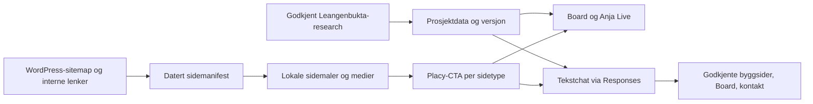
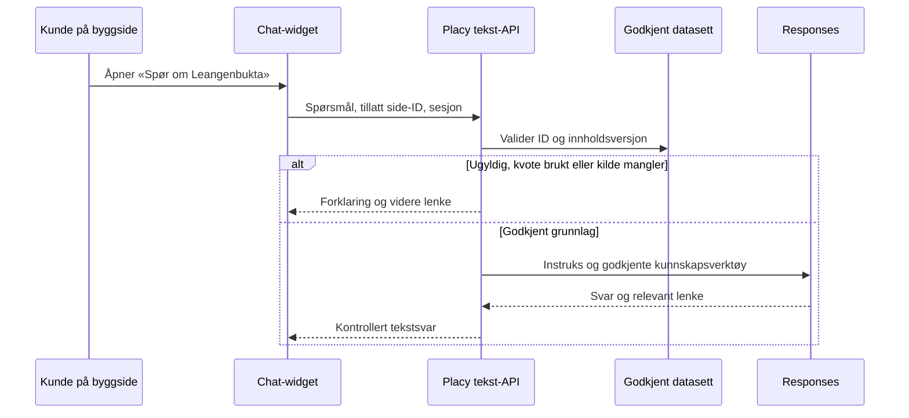

# Komplett Leangenbukta-kopi med Placy og tekstchat

## Goal Capsule

- **Objective:** Koteng Jenssen kan åpne én sammenhengende, selvbetjent demo av sin egen nettside og oppleve hvordan Placy hjelper en boliginteressent fra første side, via et konkret bygg, til nabolagsutforskning og spørsmål.
- **Means:** Utvid den lokale Leangenbukta-kopien til alle offentlige sider, vis kontekstuelle Placy-innganger høyt på byggsidene, fullfør det prosjektspesifikke Boardet og bygg en fungerende tekstchat på samme kunnskapsgrunnlag (KTD1–KTD5).
- **Authority:** Andreas' bestilling og `CLAUDE.md`/`AGENTS.md` går foran planen. Den eksisterende [Board-planen](2026-09-18-1124-feat-leangenbukta-board-master-plan.md) eier Boardets datamodell, kildekontroll og samtaleatferd; denne planen eier nettsidekopi, distribusjon, tekstchat og samlet kundedemo.
- **Execution:** Claude implementerer i avgrensede enheter og committer lokalt. Codex leder integrasjon, kontrollerer samlet diff, prøver hele brukerreisen og tar sluttbeslutninger. En tidlig testbar skive omfatter forside, ett bygg, Beliggenhet, Board og chat; hele kopien fullføres deretter. Ingen push, kundeutsendelse eller publisering på leangenbukta.no er autorisert av denne planen.
- **Stop conditions:** Ingen ukontrollerte prosjektfakta, boligpriser, ledighet eller byggspesifikke avstander fremstilles som bekreftet. Ingen kundeportal, boligvelger eller kontaktinnsending kopieres som fungerende transaksjon uten eget underlag. Tilgang til en delbar demo avklares særskilt før ekstern publisering; lokal implementering og QA kan fullføres først.

---

## Product Contract

### Summary

Demoen skal føles som Leangenbuktas nettsted, ikke som en separat Placy-pitch. Placy får tydelige, relevante innganger på forsiden, Beliggenhet og hver offentlig bygg-/objektside. En fast, tydelig merket chatknapp nederst til høyre åpner en reell tekstsamtale. Boardet og Anja er tilgjengelige fra hver plassering, og Koteng kan teste hele flyten selv før de tar stilling til tilbudet.

### Problem Frame

Den lokale kopien dekker i dag bare forsiden og Beliggenhet, og Placy-raden sender videre til et eldre provisjonert Board. Offentlig sitemap hadde 23.09.2026 33 sider, 18 innlegg og 3 porteføljeoppføringer, hvor forsiden er duplisert: 53 unike oppføringer før internlenke-revisjon. Flere bygg og salgstrinn har egne undersider. Leangenbukta-researchen har 145 vurderte kandidater og 25 valgte startsteder, men er ikke importert eller prøvd mot Leangenbukta-spesifikk Anja-runtime. Dagens GPT-Live-rute har ingen tekstmodus. En isolert knapp eller en chat med generelle svar ville derfor ikke vise den foreslåtte leveransen.

### Key Decisions

- **Komplett offentlig kopi:** Alle tilgjengelige, første-parts sider som er i sitemap eller nås fra nettstedets egne interne lenker inngår i dekningsregnskapet. Redirect, 404 og reelle duplikater registreres, ikke stilltiende utelates. Eksterne boligvelgere, dokumentportaler og kundesystemer fortsetter som eksterne lenker. Governs R1–R3.
- **Kontekstuell synlighet:** Inngangene beskriver hva en boligkjøper kan gjøre, med Leangenbukta som hovedavsender. På byggsider kommer den første Placy-inngangen høyt på siden, etter byggidentiteten og før lange salgsdetaljer. «Drevet av Placy» kan stå diskret ved selve opplevelsen. Governs R4–R6.
- **Én kilde, to samtaleformer:** Board/Anja og tekstchat skal bruke samme godkjente Leangenbukta-fakta, statusregler og innholdsversjon. Sidekontekst velges fra en tillatt bygg-/side-ID, aldri fra vilkårlig nettlesertekst. Governs R7–R10.
- **Prøvbar før salg:** Demoen er et produktbevis som Koteng kan utforske selv. Pris kan presenteres etter eller sammen med testlenken, uten at selve løsningen forutsetter et kjøp. Governs R11–R12.
- **Demo og betalt leveranse:** Demoen viser virkningen; betalt leveranse omfatter kundegodkjent innhold, egne punkter, innbygging på deres faktiske nettside, godkjenningsrunder, drift og overvåking. Om Placy-felt på alle byggsider og chat på hele domenet inngår i dagens 60 000 + 40 000 kr, må tilbudsteksten gjøres samsvarende før utsendelse. Governs R4–R6, R11–R12.

### Requirements

**Nettsted og navigasjon**

- R1. Alle offentlige første-parts URL-er i sitemap og interne lenker får en registrert beslutning: lokal side, omdirigering, opprinnelig ekstern destinasjon eller dokumentert utilgjengelig kilde.
- R2. Lokale sider bevarer originalens identitet, innhold, bilder, navigasjon, mobiloppsett og relevante interaksjoner slik at en besøkende kan gå sammenhengende fra forside til bygg og Beliggenhet. Originalens eksterne salgssystemer og kundeportaler forblir lenker til originalen; ingen lokal demoknapp later som den sender et skjema.
- R3. Demoen kan deles separat fra leangenbukta.no med tydelig konseptstatus, `noindex` og kontrollert tilgang. Lenker som forlater kopien er gjenkjennelige, og kontaktknapper går til en faktisk kontaktvei.

**Placy i kjøpsreisen**

- R4. Forsiden viser en synlig Board-inngang i eksisterende nabolags-/kartseksjon og en tidlig, kort inngang som knytter beliggenhet til kjøpsspørsmål.
- R5. Hver offentlig bygg-/objekt-/salgstrinnside viser et høyt plassert, sidekontekstuelt Placy-felt med en primær CTA til Board eller relevant områdelag og en sekundær CTA som åpner chat med forslag til spørsmål om dette bygget og hverdagen rundt det. Ingen bygningstilpasset reisetid eller fasilitetstilgang påstås uten kontrollert datagrunnlag.
- R6. Beliggenhet og relevante artikler får nøkterne innganger til kart/lesbart nabolagsinnhold. CTA-tekst og destinasjon er konsistente på mobil og desktop; Placy gjentas ikke så tett at originalens salgsinnhold fortrenges.

**Board, Anja og tekstchat**

- R7. Boardet bruker kuratert Leangenbukta-datasett og samme prosjektidentitet som kopien. De åpne U1–U7-delene i [Board-planen](2026-09-18-1124-feat-leangenbukta-board-master-plan.md) ferdigstilles og testes før kundedeling.
- R8. En tekstmerket knapp nederst til høyre åpner samme fungerende chatinstans fra alle første-parts demossider. Den står over nettstedets «til toppen»-knapp, kan lukkes, svarer på norsk og fungerer på mobil, med tastatur og skjermleser etter relevant [WAI-dialogmønster](https://www.w3.org/WAI/ARIA/apg/patterns/dialog-modal/).
- R9. Tekstchatten kan svare på kontrollerte spørsmål om prosjektet og nærområdet, lenke til riktig lokal byggside, Board eller kontakt, og si tydelig fra når kilden mangler eller er motstridende. Den lover ikke boligstatus, pris, framtidig åpning eller adgang uten kilde.
- R10. Tekstserveren holder modellnøkkel, sesjon, forbruksgrenser og logger utenfor nettleseren. Den avviser ukjente prosjekter/sider, avgrenser misbruk og viser en brukbar vei videre ved feil eller oppbrukt demokvote. Ingen stemmeminutter belastes for tekst.

**Kundetest**

- R11. Koteng kan fra én demo-URL prøve forside, minst ett eksempel fra hvert aktivt bygg/salgstrinn, Board med Anja, chat og relevant kontaktvei uten utviklerhjelp.
- R12. Demoen ledsages av en kort prøveguide med forslag til spørsmål, hva som er konsept versus ferdig funksjon, og en enkel kanal for konkrete tilbakemeldinger. Ingen testresultater eller salgsbeslutninger fremstilles som om de allerede foreligger.

### Key Flows

- F1. Forside → tidlig beliggenhets-CTA → Board → kategori/sted → Anja → lenke tilbake til relevant prosjektinnhold. Covers R4, R7, R11.
- F2. Forside → byggkort → byggside → høyt plassert Placy-felt → Board eller chat med byggkontekst → svar med kilde/videre lenke. Covers R2, R5, R8, R9.
- F3. Vilkårlig kopiside → «Spør om Leangenbukta» → forslag til spørsmål → svar eller ærlig kunnskapshull → kontakt/Board. Covers R6, R8–R10.
- F4. Kunde åpner delbar demo på mobil og desktop, går gjennom egne sider og gir tilbakemeldinger uten at lokale skjemaer sender data. Covers R2, R3, R11, R12.

### Acceptance Examples

- AE1. Alle 53 unike sitemap-oppføringer og nye første-parts lenker funnet i demokopien har en registrert destinasjon. En aktiv byggside åpnes lokalt fra forside, meny og chatlenke; portallenke går til sitt opprinnelige domene.
- AE2. På siden for Knutepunktet møter besøkende en Placy-inngang før den lange salgsinformasjonen, kan åpne chat med «Hva finnes rundt Knutepunktet?» og får ikke feilaktig løfte om at treningsrommet er åpent for alle nå.
- AE3. På Parktunet 1 kan chatten skille estimert ferdigstillelse fra bekreftet innflytting og vise lenke til relevant side; samme svar bygger på innholdet Anja får på Boardet.
- AE4. Mobil: chatknappen dekker ikke originalens meny, kontaktknapp eller «til toppen»-knapp. Åpning flytter fokus til chatten, Escape lukker, og fokus går tilbake til knappen.
- AE5. Ved ukjent bygg-ID, prompt injection, rate limit eller API-feil gis ingen svar fra et annet prosjektdatasett; brukeren får i stedet en forklaring og lenke til Board/kontakt.
- AE6. Demoen er avvist for indeksering og krever valgt tilgangsmekanisme før den deles. En kunde kan likevel åpne den uten lokal dev-server eller verktøy.
- AE7. Lenkekontroll, skjermkontroll og reell spørre-/lydprøve viser at alle Placys flater stemmer overens om prosjektstatus og destinasjoner. Kopiert kundetekst bevares som datert snapshot; kjente avvik mellom den og godkjent Placy-kunnskap synliggjøres i prøveguide og svar, ikke skjules ved stille omskriving.

### Scope Boundaries

Komplett kopi betyr alle offentlige første-parts innholdssider og navigasjon slik de kan leses ved kildesnapshotet. Bygg og objekter som er lenket fra forsiden, sitemap eller andre første-parts sider skal med, også eldre salgstrinn; en eventuell 404 eller omdirigering dokumenteres. Skjemaer, boligvelger, innloggede kundeportaler, kjøpsprosesser, sanntidsledighet og ekstern dokumentvisning forblir hos original tjeneste og får fungerende viderelenker. Kopien skal aldri forveksles med Kotengs offisielle nettsted. Ny 3D, nye kartbilder, CRM, live bemanning og publisering på kundens faktiske domene inngår ikke.

### Sources

- [Offentlig forside](https://leangenbukta.no/) og [WordPress-sitemap](https://leangenbukta.no/wp-sitemap.xml), kontrollert 23.09.2026.
- `docs/demos/leangenbukta-nettside.md`, `docs/plans/2026-09-18-1124-feat-leangenbukta-board-master-plan.md`, `docs/research/leangenbukta-lokal-demo/validation-report.md`.
- `docs/strategy/2026-09-22-koteng-jenssen-mote-og-nyhavna-oppfolging.md`, `docs/strategy/2026-09-23-nyhavna-lene-mote-og-oppstart.md`.

---

## Planning Contract

### Key Technical Decisions

- KTD1. **Frosset sideinventar, ikke runtime-proxy.** Ta et datert snapshot av sitemaps og interne lenker, lag et maskinlesbart manifest med kilde-URL, lokal rute, type, status og aktiv plassering. Hent tekst/bilder/stiler som kilde til statiske lokale sider; kjør ikke WordPress-skript eller tredjeparts sporere i kopien. Dette gir reproduserbar QA og forhindrer at kildens senere endringer bryter demoen.
- KTD2. **Delt nettsideskall og sidemønstre.** Behold eksisterende `SiteChrome` og stilisolering. Bygg felles maler for bygg-/objektsider, redaksjonelle sider og dokument-/gallerisider der strukturen faktisk er lik; behold sidevise unntak eksplisitt. En tillatt rute- og lenkemapping hindrer at interne lenker utilsiktet går til originalen.
- KTD3. **Kontekst som plassering, ikke nytt faktagrunnlag.** En side har en stabil, tillatt `pageId`/`buildingId`; CTA-er og chatstartere får denne konteksten. Alle fakta kommer fortsatt fra Board-planens godkjente prosjektgrunnlag. Byggkontekst kan prioritere et svar, aldri overstyre kilde eller skape byggspesifikk distanse uten data.
- KTD4. **Egen tekstflyt over godkjent Anja-kunnskap.** Dagens `/api/prototype/live` støtter bare GPT-Live tale. En ny serverstyrt Responses-flyt gjenbruker godkjente kunnskapsverktøy, statusregler og datasettversjon; kartstyrende verktøy brukes bare når Boardet er åpent. Faktasvar må ha verktøybevis og datasettversjon. Et fast spørsmålssett krever samme fakta-ID-er og statusfelt i tale og tekst, ikke identisk ordlyd. Midlertidig datakontrakt kan brukes i tester, mens delt demo kun leser U4s versjonerte datasett. `CLAUDE.md` sin runtime-LLM-regel får et dokumentert, navngitt unntak for denne demoen, i tråd med Andreas' uttrykkelige bestilling om fungerende tekstchat.
- KTD5. **Delbar demo som eget miljø.** Bruk en separat Vercel-preview med appstyrt adgangskode som setter en tidsavgrenset, signert httpOnly-sesjonscookie. Samme kontroll beskytter nettsidekopi, Board, GPT-Live og tekst-API. Fjern produksjonslåsen bare i samme endring som aktiv tilgangskontroll som feiler lukket uten konfigurasjon; `noindex` kommer i tillegg. Ingen API-nøkkel eller passord i klientkode eller URL-querystring. Utrulling og faktisk kundedeling krever Andreas' beslutning.
- KTD6. **Sikker og målbar demobruk.** Bruk en frittstående, gjenbrukbar chat-widget som kopien laster gjennom samme innbyggingskode som en WordPress-side ville brukt. Serveren validerer tillatt origin og returnerer bare godkjente lenke-ID-er som slås opp i sidemanifestet; svar vises som ren tekst. Innfør varige, sentrale tellere for stemme og tekst samt eget OpenAI-prosjekt med hardt månedlig spendtak som bakstopper; håndhev rate limit før modellkall. Prosjektgrensen kan overskrides noe før håndhevingen slår inn, så lokal kvote er fortsatt nødvendig. Kall Responses med `store: false`; logg forbruksmetadata, ikke meldingsinnhold. Begrens inndata/utdata, la sesjoner utløpe og gi kontakt/Board ved feil. [OpenAI spend limits](https://developers.openai.com/api/docs/guides/spend-limits).

### High-Level Technical Design

### Sequencing and System-Wide Impact

Claude starter med inventar og originalens sidemønstre før masseproduksjon av sider. Board-planens dataarbeid og nettsidekopiens sidebygging kan gjennomføres parallelt med eksklusivt fileierskap: denne planens U3 eier `placy-row.tsx` og `beliggenhet/page.tsx`, også nettside-CTA-delen av Board-planens U7; Board-planen eier kart- og lydprøven. Chatten venter på felles datakontrakt, og samlet kundetest venter på begge. Endringer i `lib/demo/local-board/`, `lib/live/` og `lib/realtime/` kan berøre Nyhavna; regresjon der er obligatorisk. Ruter for offentlig Placy-nettsted og øvrige kundedemoer skal ikke endres av den nye kopien.

### Assumptions and Decisions to Verify During Execution

- Sitemap-tallet 53 er en startmengde. Internlenker og faktiske HTTP-responser kan øke eller redusere antall lokale sider; leveransen rapporterer full dekning mot endelig inventar, ikke et på forhånd låst sidetall.
- «Komplett kopi» omfatter hele den offentlige første-parts lesereisen, ikke autentiserte kundeportaler eller tredjeparts kjøpssystemer. Dette er en implementeringsgrense, ikke en tillatelse til å hoppe over lenker eller byggsider.
- Felles godkjent Leangenbukta-datasett kan gjenbrukes til tekst. Hvis Board-planens datakontrakt ikke er ferdig når chatten bygges, brukes en midlertidig kontrakt bare i tester. Kjøreklar demo krever kompatibilitet med U4s versjonerte datasett, uten Nyhavna-fallback.
- KTD5 bestemmer host og tilgangsmekanisme. Lokal utvikling kan starte før previewen er opprettet; slutt-QA på faktisk delbart miljø krever Andreas' publiseringsbeslutning.
- Den kopierte kundeteksten er et datert nettstedssnapshot, ikke Placy-godkjente fakta. Chatten skal kunne identifisere når den ser nyere godkjente opplysninger enn kopien, og prøveguide viser kjente avvik og snapshotdato.

---

## Implementation Units

### U1. Inventar, snapshot og dekningsregnskap

**Goal:** Fastslå nøyaktig hva «komplett kopi» omfatter, og gjøre alle kildesider sporbare.
**Requirements:** R1; AE1.
**Dependencies:** Ingen.
**Files:** `docs/research/leangenbukta-nettside/`, `scripts/demo/`, `app/demo/leangenbukta-nettside/`.
**Approach:** Hent sitemapene, følg interne første-parts lenker, kontroller status/redirect/kanonisk URL, klassifiser side- og interaksjonstype og lag manifest med eksplisitt lokal eller ekstern destinasjon. Registrer mediefiler og kilde-/kontrolldato. Bevar eksisterende forside- og Beliggenhet-arbeid.
**Test scenarios:** Sitemap-duplikat teller én gang; aktiv URL med redirect peker til kanonisk side; intern bygglenke utenfor sitemap blir registrert; ekstern portal forblir ekstern; utilgjengelig kilde har en dokumentert disposisjon.
**Verification:** Antall oppdagede URL-er = antall disponerte URL-er; ingen lenke eller byggside mangler status.

### U2. Full sidekopi og navigasjon

**Goal:** En bruker kan gå gjennom alle offentlige Leangenbukta-sider i en sammenhengende lokal kopi.
**Requirements:** R2–R3; F2, F4; AE1.
**Dependencies:** U1.
**Files:** `app/demo/leangenbukta-nettside/`, `public/demo/leangenbukta-nettside/`, `docs/demos/leangenbukta-nettside.md`, relevante side-/rute-tester under `app/demo/leangenbukta-nettside/`.
**Approach:** Utvid felles skall og sidemaler, speil tekst/medier/stil per manifest, og skriv om interne lenker til lokale ruter. Bevar originale eksterne destinasjoner for boligvelger, portaler og dokumenter. Kontaktflater skal ha fungerende vei til originalt skjema eller kontakt, uten falsk lokal innsending.
**Test scenarios:** Hver manifestført aktiv side svarer lokalt; meny, byggkort, brødsmuler og tilbakevei holder brukeren i kopien; eksterne lenker er tydelige; ukjent rute gir 404; skjema i demoen sender ingen data.
**Verification:** Maskinell rute-/lenkerapport og skjermkontroll av hver sidetype samt alle byggsider på desktop og mobil.

### U3. Placy-plasseringer og CTA-system

**Goal:** Placy er synlig ved relevante valg i hele kjøpsreisen, særlig høyt på hver byggside.
**Requirements:** R4–R6, R11; F1, F2; AE2, AE3.
**Dependencies:** U1, U2s sidemønstre.
**Files:** `app/demo/leangenbukta-nettside/placy-row.tsx`, `app/demo/leangenbukta-nettside/`, `app/demo/leangenbukta-nettside/demo.css`, relevante komponenttester.
**Approach:** Definer en liten CTA-matrise per sidetype: tidlig forsideinngang, eksisterende kartseksjon, høyt byggfelt, Beliggenhet-felt og bare kontekstuell plassering i artikler. Bruk ett visuelt Placy-mønster med Leangenbuktas typografi/farger. Knytt primær og sekundær CTA til tillatt side-ID; ikke gjenta samme påstand overalt. Denne enheten eier CTA-filene som også er nevnt i Board-planens U7.
**Test scenarios:** Hver aktiv byggside har synlig Placy-felt før lang salgsinformasjon; CTA-er peker til riktig Board/kontekst; mobilfeltet skyver ikke ut primært salgsinnhold; 404/arkivsider arver ikke feil byggkontekst.
**Verification:** Side-for-side CTA-matrise med skjermbilder for alle bygg/objektsider og minst én representant for øvrige sidetyper.

### U4. Ferdigstill Leangenbukta-Board og Anja

**Goal:** Placy-inngangene åpner et reelt, prosjektspesifikt Board som kan prøves av Koteng.
**Requirements:** R7, R9, R11; F1, F2; AE2, AE3, AE7.
**Dependencies:** [Board-planens](2026-09-18-1124-feat-leangenbukta-board-master-plan.md) åpne U1–U7 og godkjent prosjektfakta. `lib/demo/local-board/` finnes ikke ennå; den opprettes av Board-planens U2.
**Files:** `lib/demo/local-board/`, `lib/live/demos.ts`, `lib/realtime/`, `app/demo/leangenbukta-lokal/`, Leangenbukta-datasett og tilhørende tester/dokumentasjon i Board-planen.
**Approach:** Gjennomfør det som fortsatt gjenstår i Board-planen: felles lokal kjerne, kildekontrollert Leangenbukta-import, riktig Leangenbukta-utgangspunkt, dataversjon, prosjektspesifikk Anja, kart- og lydprøve. Pek alle CTA-ene til `/demo/leangenbukta-lokal`; ikke la eldre generisk rapport-board stå som endelig mål.
**Test scenarios:** Leangenbukta-spørsmål henter ikke Nyhavna-fakta; byggestatus og tilgang holdes atskilt; ukontrollert sted vises ikke som bekreftet; gammel innholdsversjon avvises; Nyhavna-demoen fungerer fortsatt.
**Verification:** Board-planens egne akseptansekriterier og en manuell, faktisk tale-/kartprøve er bestått.

### U5. Gjenbrukbar tekstchat og sidekontekst

**Goal:** En besøker kan stille skriftlige spørsmål hvor som helst i kopien og få kontrollerte Leangenbukta-svar.
**Requirements:** R8–R10; F2, F3; AE2–AE5.
**Dependencies:** U4s datakontrakt, U3s side-ID-er.
**Files:** Ny chatmodul under `components/` eller `app/demo/leangenbukta-nettside/`, ny serverrute under `app/api/`, delt kunnskapsadapter under `lib/`, og tilhørende tester.
**Approach:** Bygg en frittstående widget med egen innbyggingskode som kopien laster, i stedet for å koble chatten direkte til Next-sideskallet. Knappen har tekstetikett og adaptivt panel: sidepanel på desktop, stort bottom sheet på mobil. Bruk et serverendepunkt for Responses og bare tillatte prosjekt-/side-ID-er. Del kunnskaps- og statusregler med Anja, men ikke GPT-Live-sesjonen eller Boardets kartdirektiver når kartet ikke er åpent. Serveren krever kildebevis med datasettversjon før faktasvar og lar bare godkjente lenke-ID-er slippe gjennom; manglende eller motstridende bevis gir fast kunnskapshull-svar. Vis spørsmålseksempler, usikkerhet og kontaktvei.
**Test scenarios:** Relevant byggspørsmål får byggkontekst; spørsmål uten bevis eller med motstridende kilder får ærlig avslag; to besøkende deler ikke historikk; modellforsøk på vilkårlig URL eller script vises ikke som lenke eller kjørbar kode; uventet modell-/verktøysvar lekker ikke nøkkel eller feil prosjekt; fokus/ESC/mobil følger AE4. Fast tekst-/tale-fixture krever samme fakta-ID og status uten krav om lik ordlyd.
**Verification:** Samme faktaspørsmål prøves som tekst og tale; avvik føres og rettes. Reell tekstsamtale fungerer fra forside og byggside.

### U6. Demotilgang, forbruksvern og feilsituasjoner

**Goal:** Kundedemoen kan deles kontrollert og prøves uten utilsiktet eksponering eller løpende kostnad uten grense.
**Requirements:** R3, R10–R12; AE5, AE6.
**Dependencies:** U2, U5.
**Files:** `app/demo/leangenbukta-nettside/layout.tsx`, `app/demo/leangenbukta-lokal/`, `app/api/prototype/live/route.ts`, ny tilgangs-/rate-limit-logikk under `lib/` og `app/api/`, eventuell serverstyrt tellerlagring under `supabase/migrations/`, relevante tester, `docs/demos/leangenbukta-nettside.md`.
**Approach:** Følg KTD5: beskytt alle sider, Board, tekst- og stemme-API med samme sesjon, og fjern gammel localhost-gate først når den nye er aktiv og feiler lukket. Bruk varige sentrale tellere per besøkende og samlet, eget OpenAI-prosjekt med spendtak, og fallback ved brukt kvote. Nøkkel ligger i servermiljøet og kan roteres; ingen meldingstekst lagres i logger. Besøkssesjon utstedes av serveren i httpOnly-cookie. Lokalt kan produksjonslik adgang og kvoter testes uten preview-utrulling.
**Test scenarios:** Uautorisert side/API-kall avvises; forfalsket Host-header gir ikke tilgang; autorisert kunde kan navigere uten gjentatt innlogging; utløpt tilgang, oppbrukt tekst-/stemmekvote og API-feil får tydelig melding; kopien/Board kan fortsatt leses når samtale stanses.
**Verification:** Sluttprøve på valgt delbart miljø av adgang, robots/noindex, API-nøkkel, varige bruksgrenser og fallback. Ingen delingslenke sendes før Andreas har godkjent publisering.

### U7. Helhetlig QA av alle sider og produkter

**Goal:** Hvert offentlige sidevalg og hvert Placy-løfte i demoen er prøvd mot faktisk oppførsel.
**Requirements:** R1–R12; AE1–AE7.
**Dependencies:** U2–U6.
**Files:** `docs/research/leangenbukta-nettside/`, `docs/demos/leangenbukta-nettside.md`, relevante tester og skjermbilder under eksisterende demomønster.
**Approach:** Kjør full dekningskontroll, lenkesjekk, automatisk nettlesergang og visuell kontroll på desktop/mobil. Gå gjennom hver byggside, alle CTA-er og chatstartere. Prøv fakta om dagens tilbud, framtidsplaner, usikkerhet og «2008»-feilen; sammenlign tekstchat med Anja og Board via fakta-ID/status. Kjør Nyhavna-regresjon og en navngitt røyktest for offentlige Placy-ruter og alle kundedemoer som berøres av delte filer, i tillegg til mekaniske prosjektporter.
**Test scenarios:** Manglende lokal side, død CTA, feil bilde, mobiloverlapp, feil bygg i chatsvar, gammel prosjektpåstand, uriktig skjema-innsending, kryssprosjektdata og tjenestefeil blir oppdaget av relevante kontroller.
**Verification:** Rapporter X av Y sider, X av Y byggsider, X av Y lenker og X av Y spørrescenarioer kontrollert; null åpne feil som hindrer kundens egen prøving.

### U8. Kundens prøveguide og leveringspakke

**Goal:** Andreas får en gjennomgått demo og et enkelt opplegg for å la Koteng prøve den før kommersiell avgjørelse.
**Requirements:** R11, R12; F4; AE6, AE7.
**Dependencies:** U7.
**Files:** `docs/demos/leangenbukta-nettside.md`, `docs/reports/2026-09-23-koteng-jenssen-leangenbukta-tilbudsramme.html`, ny kort prøveguide under `docs/reports/`, `docs/strategy/LOG.md` og pipelinekort ved faktisk loggføring.
**Approach:** Lever én startlenke, 5–8 konkrete prøveoppgaver, tydelig liste over konsept/aktiv funksjon, kontaktvei for feil/innspill og forslag til oppfølging. Guiden viser snapshotdato, kjente forskjeller mellom kopiert kundetekst og Placys godkjente fakta, og hvordan ferdige/planlagte bygg vises i dagens kart; nye kartbilder/3D krever eget underlag. Tilbudsrammen oppdateres slik at plasseringene på byggsider og chat på hele domenet enten inngår uttrykkelig i de foreslåtte 60 000 + 40 000 kr eller merkes som separat mulighet. Prisforslaget kan sendes uavhengig av full demobygging dersom salgsdialogen krever det; ønsket rekkefølge er kundens egen test først. Oppfølgingen spør hvem som eier budsjett/innhold, tidspunkt for nettsidefornyelse og ønsket første leveranse. Ingen prisaksept eller kundedeling registreres før det faktisk skjer.
**Test scenarios:** En person uten utviklerkunnskap kan følge guiden fra forside til bygg, Board og chat; teksten påstår ingen funksjon som demoen ikke har; interne og eksterne lenker kan skilles.
**Verification:** Codex gjennomfører guiden fra ren nettleserprofil og gir Andreas testlenke/guide etter egen sluttkontroll og nødvendig publiseringsbeslutning.

---

## Verification Contract

| Kontroll | Gjelder | Bestått når |
|---|---|---|
| `npm run lint` og `npx tsc --noEmit` | All kode | Ingen nye feil. |
| `npm test` | Delte data-, rute-, chat- og komponentendringer | Alle relevante eksisterende og nye tester passerer. |
| `npm run build` | Før delbar demo/PR | Produksjonsbygget lykkes uten uønsket offentlig demotilgang. |
| Inventar-/lenke-/rutekontroll | Alle manifestførte sider og interne lenker | Full dekning; hvert avvik har rettet eller dokumentert disposisjon. |
| Nettleser desktop 1440 × 900 og mobil 390 × 844 | Forside, alle byggsider, hver øvrig sidetype, chat og Board | Ingen ødelagt navigasjon, overlapp eller falsk kontaktflyt. |
| Reell samtale- og lydprøve | Tekstchat og Anja | Samme prosjektfakta og ærlige usikkerheter; ingen kryssprosjekt-svar. |
| Tilgangs-/kostnadsprøve | Delbart miljø | Uautorisert tilgang avvist, kvoter håndhevet, nøkkel serverstyrt, noindex verifisert. |
| Navngitt regresjonsrøyk | Offentlige Placy-ruter og berørte kundedemoer | Hver rute gir forventet innhold og sentrale CTA-er fungerer etter endringer i delte filer. |

Ved endret kode krever `AGENTS.md` de mekaniske sjekkene over. Før en PR er `npm run build` obligatorisk. Ingen push eller ekstern publisering skjer automatisk.

---

## Definition of Done

- Hver offentlig første-parts URL i endelig inventar er vurdert, hver aktiv lokal side er bygd, og alle interne lenker er kontrollert. Rapporten oppgir totalt antall, lokale sider, redirect/duplikat/404 og eksterne destinasjoner.
- Alle aktive bygg-/objektsider har høyt plassert, kontekstuell Placy-inngang; forside og Beliggenhet har sine planlagte innganger. Chatten fungerer på tvers av sidene og kan brukes på mobil, med tastatur og ved API-feil.
- Leangenbukta-Board, Anja og chat bruker kontrollert felles prosjektgrunnlag. Faktatester, faktisk lydprøve, full sidekontroll og Nyhavna-regresjon er dokumentert.
- Delbar demo og prøveguide er verifisert i ren nettleserprofil. Ekstern publisering og utsendelse avventer Andreas' beslutning; lokal leveranse kan ferdigstilles og committes uten push.
- Claude leverer samlet diff, testresultater, dekningsregnskap og åpne tråder til Codex. Codex leser og kontrollerer helheten, fjerner død forsøkskode og melder klart fra om det som eventuelt gjenstår.

## Appendix

Den offentlige sitemap-indeksen 23.09.2026 pekte på `wp-sitemap-posts-page-1.xml` (33), `wp-sitemap-posts-post-1.xml` (18) og `wp-sitemap-posts-portfolio-1.xml` (3). Forsiden forekom to ganger, derfor 53 unike URL-er før lenkegjennomgang. Objektsider som må identifiseres og prøves særskilt inkluderer Parktunet 1, Saltakshus C/H/I/J/K, Knutepunktet, Byvillaer, rekkehus, byggetrinn 1 og nyere/eldre salgstrinn. Endelig klassifisering kommer fra U1; denne listen er ingen tillatelse til å utelate andre sider.

Den lokale kopien ligger i `app/demo/leangenbukta-nettside/` og `public/demo/leangenbukta-nettside/`. Nåværende `layout.tsx` viser 404 i produksjon. Leangenbukta-researchens `docs/research/leangenbukta-lokal-demo/validation-report.md` sier uttrykkelig at datasettet ennå ikke er runtime-importert eller live-testet. `app/api/prototype/live/route.ts` sier uttrykkelig at Live ikke har tekstmodus. Disse tre forholdene er reelle avhengigheter i U4–U6, ikke antakelser om at kunden må avklare teknisk innbygging før pris kan gis.
