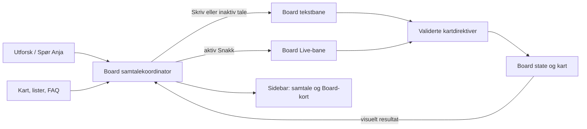
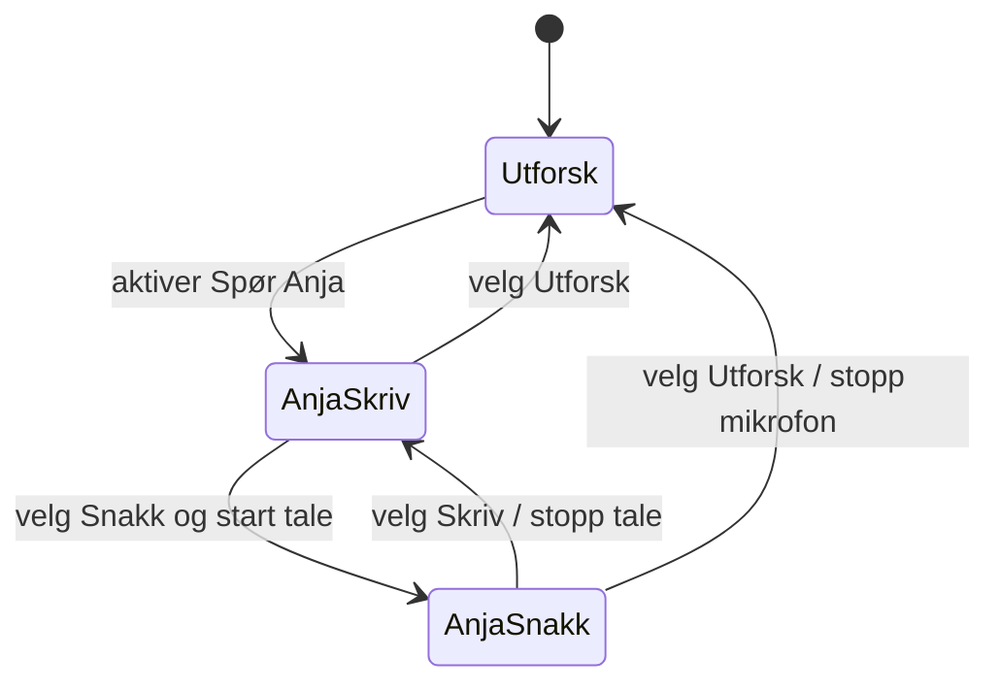
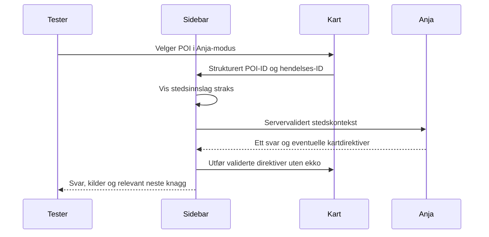

# Nyhavna Board med utforsk- og agentmodus – testklar prototype

## Goal Capsule

- **Objective:** En tester kan utforske Nyhavna i Board som før, slå på en samtale med Anja og oppleve at kart, steder og spørsmål blir en naturlig del av samme tekst- og talesamtale. Testeren kan slå samtalen av og gå tilbake til utforskingen uten å miste konteksten.
- **Means:** Bygg en Board-tilpasset samtaleflate i venstre sidebar, med en tydelig «Utforsk / Spør Anja»-veksler og Skriv/Snakk inne i agentmodus (KTD1–KTD5).
- **Authority:** Andreas' beskrevne UX-flyt og denne planens Product Contract styrer prototypen. `CLAUDE.md` og `AGENTS.md` styrer arbeidsformen. Den bredere produksjonsplanen i `docs/plans/2026-09-19-0736-feat-board-anja-research-convergence-plan.md` erstattes ikke.
- **Execution:** Opus er tech lead. Arbeidet skjer i en ny isolert worktree fra `feat/nyhavna-chat-live` på commit `0a70650a` eller dens verifiserte nyere etterfølger. Implementer og verifiser lokalt; commit lokalt ved en naturlig milepæl. Andreas avgjør push og publisering.
- **Stop conditions:** Ikke kall tekstmodus testklar dersom den krever mikrofontillatelse, kartkommandoer bare er visuelle fakter uten kartendring, ett kartklikk gir to svar, eller normal utforsking ikke kan gjenopptas. Ikke aktiver prototypen på ordinære kundeboards.

---

## Product Contract

### Summary

Nyhavna Board får to tydelig navngitte moduser i samme sidebar. «Utforsk» viser dagens kategorier, fortelling, «Verdt å merke seg», FAQ og stedsvisning. «Spør Anja» viser én løpende samtale med tekst og tale. Kartet forblir klikkbart. Et bevisst valg av et sted i kartet eller en Board-liste vises som et stedsinnslag i samtalen og gir Anja anledning til å svare om det stedet. Eksisterende innhold blir samtalekort og relevante forslag som kan dukke opp igjen senere i samtalen.

### Problem Frame

Anja ligger i dag som en kompakt talekontroll over Board-innholdet, mens den nye nettsidechatten har en egen Skriv/Snakk-flyt. Ved kartklikk åpner Board et stedsinformasjonspanel med tilbakeknapp. Disse delene fungerer hver for seg, men gir ikke den sømløse kart-til-samtale-flyten Andreas vil teste. Prototypen skal avklare om en aktiv agentflate i sidebaren er mer naturlig, samtidig som dagens manuelle navigasjon fortsatt er lett å forstå.

### Key Decisions

- **To eksplisitte moduser i sidebaren.** (session-settled: user-directed — valgt for at besøkende skal forstå forskjellen mellom manuell utforsking og en aktiv AI-opplevelse.) Governs R1, R2, R8.
- **Kart- og stedsklikk inngår i samtalen når Anja-modus er aktiv.** (session-settled: user-approved — valgt for å unngå et separat detaljpanel med tilbakeknapp i denne modusen.) Governs R3, R4, R6.
- **Eksisterende redaksjonelt innhold lever videre som samtaleknagger.** (session-settled: user-directed — «Verdt å merke seg» og FAQ må være synlige og kunne gjenoppdages.) Governs R5.
- **Tekst og tale deler samtaleflate.** (session-settled: user-directed — Board skal gjenbruke opplevelsen fra nettsidechatten, tilpasset kart og sidebar.) Governs R2, R7.

### Requirements

- R1. En synlig og tastaturbrukbar «Utforsk / Spør Anja»-veksler finnes på både desktop og mobil. Første visning er Utforsk. Bytte til Spør Anja åpner samtaleflaten uten å starte mikrofon eller betalt modellsesjon.
- R2. Utforsk beholder dagens Board-flyt og stedspanel. Spør Anja har én synlig historikk med Skriv/Snakk, tydelig status, svar, kilde-/handlingskort og kontroll for å avslutte tale. Bytte mellom Skriv og Snakk skal bevare samtalens kontekst.
- R3. I Spør Anja blir klikk på kartpinne, stedsliste eller «Verdt å merke seg» ett strukturert brukerinitiativ i samtalen: stedskort, synlig valgt sted i kartet og ett relevant svar fra Anja. Ingen separat `StoryPoiPanel` eller tilbakeknapp åpnes.
- R4. Anjas egne kartkommandoer virker også etter skrevne spørsmål: fremhev steder, vis ett sted, vis kategori og endre reisemåte innenfor eksisterende, validerte Board-verktøy. Anjas kartendring må ikke sendes tilbake som et nytt brukerklikk.
- R5. Kategorier, «Verdt å merke seg» og FAQ er tilgjengelige som konkrete forslag/kort i Anja-modus. Velger brukeren et FAQ-spørsmål, vises spørsmålet i samtalen og svar gis med samme godkjente Board-kunnskap. Anja kan senere foreslå en relevant, ubrukt knagg; avviste eller nylig brukte forslag gjentas ikke automatisk.
- R6. Når testeren går til Utforsk, avsluttes aktiv mikrofon/tale, mens samtalen beholdes lokalt for den åpne Board-økten. Utforsk gjenopptar kategori, valgt sted, scrollposisjon, reisemåte og kartutsnitt fra før agentmodus. Retur til Spør Anja viser den samme historikken uten automatisk oppstart.
- R7. Et kartklikk i pågående tale gir ett synlig stedsinnslag og relevant muntlig oppfølging; i Skriv eller uten aktiv tale gir det et tekstsvar uten å be om mikrofontilgang. Feil, avbrudd, kvote og manglende rettigheter vises i sidebaren uten å ødelegge kart eller historikk.
- R8. På mobil er modusveksler, samtale og kart tilgjengelige gjennom Boardets eksisterende sheet-flyt; ingen to samtidige paneler skjuler hverandre. Fokus, skjermlesertekst og tilstand ved tilbake-/Escape-handlinger er forståelige.

### Key Flows

1. Åpne lokal Nyhavna-demo → Utforsk → velg kategori/sted → Spør Anja → skriv et spørsmål → Snakk → tilbake til Skriv → Utforsk. Kategori, kart og historikk oppfører seg som R1, R2 og R6 beskriver.
2. Spør Anja → klikk «Dora 1 Bowling» i kartet → stedsinnslag vises straks → Anja kommenterer stedet → spør oppfølgende om noe i nærheten → kartet følger validerte kommandoer uten ny stedsvisning. Covers R3, R4, R7.
3. Spør Anja → velg FAQ om servering → se spørsmålet og svaret i samtalen → få senere et relevant forslag til et annet sted eller spørsmål uten mekanisk repetisjon. Covers R5.

### Acceptance Examples

- AE1. Etter kategori «Servering» og valgt sted i Utforsk slår testeren på Spør Anja og av igjen. Ingen mikrofonprompt ved første bytte; Utforsk viser samme sted og kartutsnitt, og en senere retur til Anja viser samtalen. Covers R1, R6.
- AE2. Et klikk på «Dora 1 Bowling» i Spør Anja gir nøyaktig ett stedsinnslag og ett svar. Kartet fokuserer stedet; `StoryPoiPanel` åpnes ikke. Det samme klikket i Utforsk åpner dagens stedsvisning. Covers R3, R6.
- AE3. «Vis kaféer i nærheten» skrevet i Anja-modus kan gi et tekstsvar og en faktisk validert kartfremheving. Ukjent POI-ID avvises uten kartendring. Covers R4.
- AE4. Velg FAQ «Hvilke restauranter finnes i nærheten?» mens tale er avslått. Spørsmålet og svaret vises, og mikrofonen forblir avslått. Covers R5, R7.
- AE5. Skift fra Snakk til Skriv midt i en samtale. Mikrofonen stopper; tekstspørsmålet har tilgang til relevant forrige samtalekontekst. Ved svarfeil forblir eksisterende kort og kart synlige. Covers R2, R7.
- AE6. Gjenta samme kartklikk raskt eller klikk et nytt sted før forrige svar er ferdig. Feed og kart viser siste bevisste valg uten duplikat eller foreldet svar som peker på feil sted. Covers R3, R7.
- AE7. I mobilvisning kan testeren veksle modus, velge kartpunkt, lese svaret og gå tilbake til kartet uten at composer eller sheet stenger kartkontrollen inne. Covers R8.

### Scope Boundaries

Dette er en lokal, delbar **prototype av samspillet**, avgrenset til Nyhavna-demoens kontrollerte data. Bruk eksisterende autentisering, kvoter og modellgrenser for demoen; ikke innfør ny produksjonsaktivering eller abonnement-/faktureringslogikk i denne oppgaven. Behold det ordinære Boardets utforskmodus og eksisterende stedsvisning. Visuelle detaljer kan tilpasses Nyhavna; finn ut om flyten fungerer før bred designpolering.

### Deferred to Separate Tasks

Produksjonsmigrering til ordinære boards følger `docs/plans/2026-09-19-0736-feat-board-anja-research-convergence-plan.md`. Pris, måling på tvers av produkter og publisering av prototypen behandles separat etter brukertest.

---

## Planning Contract

### Current State and Sources

- `app/demo/nyhavna-lokal/page.tsx` er den lokale Board-ruten. Den bruker `ReportReelsPage` med `layout="framed"` og `placePanel` og matcher det aktuelle sidebar-/kartoppsettet.
- `components/variants/report/reels/DesktopStorySidebar.tsx` eier desktopkolonnen; `components/variants/report/board/neighbourhood/NeighbourhoodSurface.tsx` og mobilgrenen i `ReportReelsPage.tsx` eier andre mobilflyter. `components/variants/report/board/story/StoryPoiPanel.tsx` er dagens desktop-stedsvisning.
- `components/variants/report/board/voice/board-voice.tsx` eier én Board-talekontekst. `lib/live/use-live.ts` har meldinger og `sendText`, men **oppstart krever mikrofon**; det er derfor ikke en selvstendig tekstchatbane. Eksisterende effekt sender kart-/stedvalg som stille kontekst og demper ekko fra Anjas egne handlinger.
- `app/api/demo/nyhavna-chat/route.ts` og `lib/demo/site-chat/` gir den nylig ferdigstilte nettsidechatten en tekstbane med signert historikk, kvoter, kilder og overgang til tale. `lib/demo/site-chat/text-tools.ts` filtrerer i dag bort kartverktøy og backend kaster kartdirektiver fordi nettsiden ikke har et kart.
- `lib/realtime/board-tools.ts` validerer og utfører kartkommandoer. `public/embed/placy-chat.js` viser den etablerte Skriv/Snakk-flyten, men er en Shadow DOM-widget for eksterne sider og skal ikke monteres uendret i Board.
- Visuell inspirasjon: FINNs [kart med chatpanel](https://images.ctfassets.net/54af2h29l1lq/PmtkLJR2wP3qH1so9uI3m/e8d93b529a019a19ac51544e2d194968/1768996235688-vthstpsv2w.png?w=1700) fra [«Si hei til en ny måte å finne drømmeboligen på»](https://www.finn.no/realestate/artikler/aktuelt/en-ny-mate-a-finne-drommeboligen) (27.05.2026). Bruk det som referanse for samtidig kart, innhold og samtale; Nyhavna har sidebar til venstre og egne Board-mønstre.

### Key Technical Decisions

- KTD1. **Isoler arbeidet fra den nyeste felles demo-grenen.** (session-settled: user-directed — valgt fordi prototypen skal kunne testes uten å forstyrre andre Placy-sesjoner.) Opprett en ny worktree fra `feat/nyhavna-chat-live`, verifiser ren base og kjør `scripts/setup-worktree.sh`; bruk en egen lokal port. Opus eier samlet integrasjon og verifikasjon.
- KTD2. **Én eksplisitt Board-presentasjonsmodus, uavhengig av Boardets eksisterende `phase`.** Modusveksleren styrer hvilken sidebarflate og POI-presentasjon som gjelder; selve utforskingstilstanden fryses ved inngang til agentmodus og gjenopprettes ved utgang. Samtalehistorikk lever i en øktbundet samtalekoordinator, ikke i global kartnavigasjon. R1, R3 og R6 gjelder.
- KTD3. **Board-tilpasset tekstbane med kartdirektiver.** Gjenbruk nettsidechattens signerte historikk, kilde-/svarvakter, kvoter og kunnskapskilde. Lag en avgrenset Board-variant med egen Board-sideidentitet: den validerer strukturert steds-/FAQ-intensjon mot demoens data og returnerer et allowlistet utvalg av verktøyenes kartdirektiver. Klienten validerer og anvender direktivene gjennom `executeBoardTool`; serveren stoler aldri på frie koordinater eller POI-fakta fra klienten. Nettsidechatten beholder sin kartløse atferd. R3–R5 gjelder.
- KTD4. **Tale bruker eksisterende Board Live-bane; tekst starter ikke Live.** Gjenbruk `BoardVoiceProvider` for muntlig respons og kartverktøy, og gjenbruk nettsidechattens signerte tekst↔tale-overlevering for én forståelig historikk. Når tale er aktiv, sendes et valgt sted som strukturert kontekst; ellers går valget gjennom tekstbanen. Slå av mikrofon ved bytte til Skriv eller Utforsk. R2 og R7 gjelder.
- KTD5. **En presentasjonspolicy for valg fra menneske og agent.** Kartklikk, lister og FAQ blir samtalehendelser bare i Anja-modus; Anjas egne verktøykall blir kort/kartoppdateringer uten et nytt brukerinitiativ. Dedup på hendelses-ID og siste valgte sted hindrer ekko, dobbel fakturering og foreldede svar. R3–R5 gjelder.

### High-Level Technical Design

Retningsskisse, ikke kodekontrakt:

### Assumptions and Risks

- Basen `feat/nyhavna-chat-live` antas å ha både nyeste lokale Nyhavna Board og nettstedets Skriv/Snakk-chat. Sjekk dette før worktree opprettes; hvis grenen er videreført, bruk den verifiserte etterfølgeren.
- Dagens Live-`sendText` alene oppfyller ikke R7 fordi `start()` ber om mikrofon. Tekst må fungere via den eksisterende HTTP-banen uten talestart.
- Et klikk som både åpner `StoryPoiPanel` og lager chatinnslag er en feil. Agentmodus må eie presentasjonen før kart-/listeseleksjon dispatches.
- Signert teksthistorikk og Live-handoff må forbli knyttet til samme demo- og besøkskontrakt. Ikke logg rå samtaletekst, lyd eller tokens i nye telemetrihendelser.
- Desktop og mobil har forskjellige sidebar-/sheet-implementasjoner; begge må testes, ikke antas like.

---

## Implementation Units

### U1. Isolert prototypemiljø og baseline

- **Goal:** En ny worktree kan kjøre den lokale Nyhavna-ruten med kjent Board- og chatbaseline.
- **Requirements:** R1–R8 som arbeidsgrunnlag.
- **Files:** `app/demo/nyhavna-lokal/page.tsx`, `app/demo/nyhavna-nettside/page.tsx`, `scripts/setup-worktree.sh`, denne planen.
- **Approach:** Verifiser gren/commit, lag worktree og kjør demoene på en ledig lokal port. Dokumenter hvilke eksisterende flyter som er fasit. Kopier denne planen inn i worktreet dersom den ikke finnes i grenens git-historikk.
- **Test scenarios:** Begge demoer laster; Utforsk og dagens `StoryPoiPanel` virker før endring; nettstedets Skriv og Snakk starter med forventet status.
- **Verification:** Lokal nettlesergjennomgang på desktop og mobil; noter baseline før U2.

### U2. Modusveksler og separat presentasjonsstatus

- **Goal:** Utforsk og Spør Anja kan veksles uten å miste Board-kontekst.
- **Requirements:** R1, R2, R6, R8.
- **Files:** `components/variants/report/reels/DesktopStorySidebar.tsx`, `components/variants/report/board/board-state.tsx`, `components/variants/report/board/neighbourhood/NeighbourhoodSurface.tsx`, tilhørende moduskomponenter/tester.
- **Approach:** Plasser en tydelig modusveksler ved dagens Anja-inngang. La en øktbundet kontroller eie modusen og utforskingssnapshot, mens dagens komponenter fortsatt rendres i Utforsk. Unngå å legge samtaletranskript i Boardets kartreducer.
- **Test scenarios:** Bytte begge veier med valgt kategori, POI, scroll og kartutsnitt; ingen mikrofon eller API-kall ved ren aktivering; Escape og tastaturfokus havner i riktig flate.
- **Verification:** Komponent-/reducertester og manuell tilstandstest i nettleser.

### U3. Board-native samtalesidebar

- **Goal:** Samme forståelige Skriv/Snakk-opplevelse som nettstedet, med plass til Board-kort.
- **Requirements:** R2, R5, R8.
- **Files:** Ny Board-samtalekomponent ved `components/variants/report/board/voice/`, `components/variants/report/reels/DesktopStorySidebar.tsx`, mobilens Board-flate; referanse `public/embed/placy-chat.js`.
- **Approach:** Bygg React-flaten med fast header/veksler, scrollende logg og fast composer. Bruk nettsidechatens visuelle regler og mikrofonstatus som referanse; render sted, FAQ, kilder og handlingslenker som egne strukturerte innslag. Vis forslag basert på Board-data, ikke hardkodede chattekster.
- **Test scenarios:** Lang historikk, tom samtale, tastatursending, redusert bevegelse, skjermleserstatus, smal mobil, kilde-/handlingskort og stedsinnslag uten horisontal overflow.
- **Verification:** Komponenttester og skjermbilder på desktop og mobil.

### U4. Tekstagent og sammenheng med tale

- **Goal:** Skrevne spørsmål får ekte, kildekontrollerte svar og kartdirektiver uten mikrofontillatelse; tale kan fortsette samtalen.
- **Requirements:** R2, R4, R7.
- **Files:** `app/api/demo/nyhavna-chat/route.ts` eller en separat Board-demo-rute, `lib/demo/nyhavna-chat/profile.ts`, `lib/demo/site-chat/route-handlers.ts`, `lib/demo/site-chat/backend.ts`, `lib/demo/site-chat/text-tools.ts`, `lib/demo/site-chat/transcript.ts`, `components/variants/report/board/voice/board-voice.tsx`, `lib/live/use-live.ts`.
- **Approach:** Utvid demoens tekstkontrakt bare for Board med signert historikk, strukturerte brukerintensjoner og begrensede kartdirektiver. Bevar opprinnelig nettstedskontrakt. Koble tekst↔tale med eksisterende signert overlevering; vis én deduplisert logg selv om transporten skifter. Start Live først når brukeren velger tale og godtar mikrofon.
- **Test scenarios:** Tekstsvar uten mikrofonprompt; ugyldig POI/kartdirektiv; kilde- og kvotevakter; tekst→tale→tekst med referanse til tidligere spørsmål; nettverksfeil/timeout uten tapt historikk.
- **Verification:** API-/kontrakttester og minst én ekte lokal samtale med tekst og tale.

### U5. Kart-, steds- og FAQ-hendelser

- **Goal:** Board-handlinger blir naturlige samtaleinnslag i agentmodus, mens Utforsk fungerer som før.
- **Requirements:** R3–R5, R7.
- **Files:** `components/variants/report/board/BoardMap.tsx`, `components/variants/report/board/board-state.tsx`, `components/variants/report/board/story/StoryPoiPanel.tsx`, `components/variants/report/board/voice/board-voice.tsx`, `lib/realtime/board-tools.ts`, Boardets FAQ-/stedslistekomponenter.
- **Approach:** Innfør én seleksjonsvei med strukturert POI-/FAQ-ID og presentasjonspolicy. Vis kortet optimistisk, send én servervalidert konteksthandling, kjør eventuelle validerte kartdirektiver og demp agentens egne navigasjonseffekter. Bruk eksisterende Board-innhold til kontekstuelle knagger og en enkel per-økt brukt/avvist-status.
- **Test scenarios:** Kartpinne, stedsrad, «Verdt å merke seg» og FAQ i begge moduser; samme klikk to ganger; nytt klikk under svar; ugyldig ID; kartverktøy som åpner ett sted; kategori- og reisemodusendring; ingen dobbelt svar.
- **Verification:** Integrasjonstester for kart↔sidebar, eksisterende Utforsk-regresjon og manuell klikketest med ekte kart.

### U6. Mobil, tale og sluttverifisering

- **Goal:** Hele prototypen kan brukertestes på telefon og desktop med tydelige feiltilstander.
- **Requirements:** R1–R8.
- **Files:** Mobilgrenen i `components/variants/report/reels/ReportReelsPage.tsx`, `components/variants/report/board/neighbourhood/NeighbourhoodSurface.tsx`, Board-samtalekomponentene og relevante testfiler.
- **Approach:** Tilpass eksisterende sheet i stedet for å kopiere desktopkolonnen. Verifiser at modusbytte stopper aktiv mikrofon, at kartet fortsatt kan velges, og at feed/composer får nok plass. Rydd eksperimentkode og dokumenter lokal startadresse og testscenarier i prototypens korte README/notat.
- **Test scenarios:** AE1–AE7 kjøres på desktop og mobil; taleavbrudd; avslått mikrofontillatelse; kvote-/modellfeil; lang tekst; skift orientering; fokus etter modusbytte og stedsvalg.
- **Verification:** `npm run lint`, `npm test`, `npx tsc --noEmit`, `npm run build`, nettlesersjekk med skjermbilder og faktisk mikrofonsesjon. Les samlet diff før lokal commit.

---

## Verification Contract

- Bruk lokal Nyhavna-rute i isolert worktree, typisk `http://localhost:3001/demo/nyhavna-lokal`; bekreft faktisk port ved oppstart. Ingen produksjonsdeploy inngår.
- Før implementering: ta baseline av Utforsk, dagens stedsvisning, nettsidechattens Skriv/Snakk og mobile sheet.
- Etter implementering: gjennomfør AE1–AE7 med ekte kart. Test tekst uten mikrofontillatelse, tale med mikrofon, overlevering begge veier og at modellen faktisk kan styre kartet fra tekst.
- Mål minst disse invariantene i automatiserte tester: én brukerhendelse → høyst ett samtaleinitiativ; agentens kartkommando → ingen brukerhendelse; ugyldig POI → ingen kartendring; utgang fra agentmodus → mikrofon stoppet og Utforsk gjenopprettet.
- Kjør `npm run lint`, `npm test`, `npx tsc --noEmit` og `npm run build` før resultatet kalles testklart. Rapporter eksplisitt eventuelle eksisterende feil som ligger utenfor den nye diffen.
- Gjennomfør en kort brukertest med minst én person som ikke har bygd løsningen: Finn vedkommende modusen, forstår hen at kartklikk inngår i samtalen, og finner hen tilbake til Utforsk uten hjelp? Registrer konkrete observasjoner og skjermbilder for neste iterasjon.

## Definition of Done

- Alle R1–R8 og AE1–AE7 kan demonstreres lokalt, med ekte tekstsvar, ekte kartdirektiver og fungerende tale. En ren visuell mock er ikke ferdig.
- Normal Utforsk-flyt og dagens POI-panel består. Agentmodus viser valgte steder i samtalen uten tilbakeknapp eller dobbel navigasjon.
- Desktop og mobil er testet; tilgjengelighet, mikrofonstopp, feil- og kvotetilstander er kontrollert.
- Mekaniske sjekker er grønne eller avvik er sporet til en dokumentert baseline. Abandonert prototypekode er fjernet, samlet diff er lest, og en kort lokal testoppskrift med kjente begrensninger ligger ved.
- Resultatet er committet lokalt i prototype-worktreet. Ingen push eller publisering uten Andreas' beskjed.
