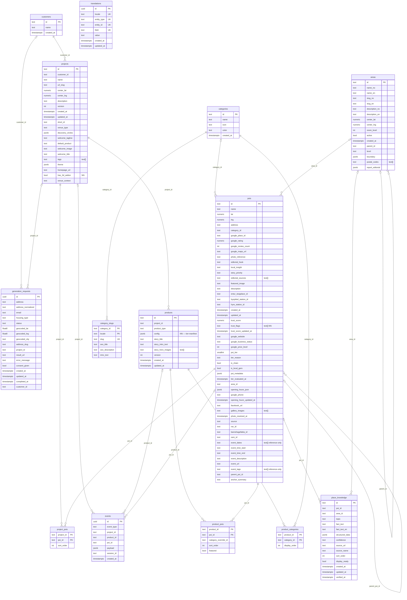

# Placy v2 baseline — ERD

Kanonisk entitetsrelasjons-diagram for `v2`-skjemaet (PRD 1, `supabase/migrations/070_baseline.sql`).
Dekker de **13 keeper-tabellene** + **`events`** (greenfield, opprettes av Unit 2 / bead `r01.2`).

> **FK-løst skjema.** Snapshot-konvensjonen bruker FK-løse `text`-koblinger (f.eks. `pois.area_id`
> uten erklært `FOREIGN KEY`). `v2` speiler dette — **relasjonene under er LOGISKE, ikke databasе-
> håndhevede** (PRD 1 Åpent spm #2 + Beslutning). De viser hvilke kolonner som kobler tabellene,
> ikke erklærte constraints. `PK`-markørene og `UNIQUE`-nøklene er derimot reelle (se DDL-en).
>
> Typetokens er forenklet for mermaid (`float8` = double precision, `timestamptz` = timestamp with
> time zone; array-kolonner er `text[]`, markert i kommentar). Autoritativ kilde for kolonne-typer
> og NOT NULL er `070_baseline.sql`.

> `translations` er en **polymorf i18n-tabell** (keyed på `(locale, entity_type, entity_id, field)`,
> UNIQUE) — den kobler logisk til alle oversatte entiteter via `entity_type`/`entity_id`, ikke via
> én enkelt FK, og vises derfor uten relasjonslinjer.
>
> `events` (r01.2) er greenfield instrumentering: `id` default `gen_random_uuid()`, `created_at`
> default `now()`, `event_type` får CHECK-constraint i Unit 2. `payload` (jsonb) holdes som en ÅPEN
> konvolutt for Moat-2-kontekst (PRD 13).
