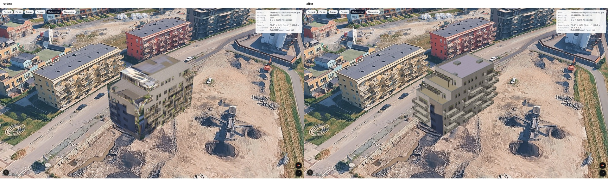

# Hus B — kvalitetsrunde 2026-09-09

`husB-v2.glb` har to inntrukne takterrasser, 15 balkonger med faktisk dybde og
rene materialflater der prototypen strakk bilder over flere høyder. Modellen er
åpnet i Google Maps 3D og kontrollert i alle 11 faste kameraer samt kontinuerlig rotasjon.
Den er fortsatt en forenklet rekonstruksjon: skjulte vindusfelt gjentas fra synlige
kildeutsnitt, møbler og beplantning er utelatt, og enkelte innbakte skygger består.

[Åpne nærvisningen](http://localhost:3002/demo/lillebytunet-3d?model=/models/lillebytunet/husB-v2.glb&heading=115&cam=near).
Demo uten `model=` bruker nå v2; standard heading er fortsatt 110°. Kontrollene bruker
eksplisitt 115°, som Andreas' tidligere URL. Original `husB.glb` er uendret.



## Dekning og kildegrunnlag

Alle **96 av 96 Hus B-bilder og 96 av 96 oversiktsbilder** er visuelt gjennomgått.
Ingen bilder ble lastet ned på nytt; alle seks eksisterende serier har 96 filer hver.
De andre fire seriene er ikke modellert i denne runden. Kildekontaktark med utsnitt av
bygget ligger lokalt i `quality-v2/source-review/` (seks ark per relevant serie).

Oversikt og Hus B hadde separate COLMAP-koordinater. `register_sources.py` matcher
SIFT-trekk med triangulerte observasjoner og løser en robust 3D-likhetstransform.
**96 av 327 foreslåtte punktpar** ble inliers, med medianrest 0,097 m ved den eksisterende
oversiktsskalaen. Fire utelatte kamerapar fikk median 0,17–0,26 px og p95 0,41–0,76 px.
To øvrige par hadde for få inliers til separat kontroll. Dette validerer registreringen
på de samsvarende trekkene; det er ikke en oppmåling av alle bygningsdetaljer.
Hele transformen og målingene finnes i [registration.json](quality-v2/registration.json).

Kameraretningene har ulike nullpunkter i de to seriene. For Hus B bruker Google-riggen
`222 − 3,75 × direction`. Tidligere påstand om «0 = sør» for begge serier er rettet.

## Geometri og manuelle valg

Parametrene er samlet i `scripts/lillebytunet/model/hus_b_quality.json`. Metrisk skala
12,4 m/COLMAP-enhet, modellorigo og geografisk plassering er beholdt fra prototypen.
Alle mål under er estimater fra bildene og punktskyen, ikke BIM-/tegningstoleranser.

| Del | Utført | Grunnlag og begrensning |
|---|---|---|
| Hovedvolum | Trinn ved 4, 5 og 6 etasjer, to terrasser | Alle kildevinkler; prototypens ene inntrekk var feil |
| Tak | Egen membran, parapetens innside/tykkelse, beslag, tre lave oppbygg | Oversikt 090 i registrerte koordinater; oppbyggenes mål estimert |
| Terrasser | Separate dekker og to pergolaer | Hus B 064–095 og oversikt 072–095; møbler/planter utelatt |
| Balkonglangside | 12 forskjøvede balkonger, bakvegg bak dekkene | Kildekonturene, særlig Hus B 005 og tilstøtende vinkler |
| Terrasseende | Tre balkonger | Hus B 078 og sidevinklene |
| Balkongdetaljer | Lukkede 20 cm dekker, underside, stolper, skjermer, rekkverk | Rekkverk ca. 1,05 m og staver med ca. 12 cm avstand; estetisk anslag |
| Vinduer på ny kledning | Plasserte enkelt-/dobbeltutsnitt fra Hus B 005 | Synlig rytme sporet; skjulte nedre felt og glassdetaljer gjentatt/anslått |
| Bakside og flat ende | Projiserte kildeteksturer på oppdelte veggflater | Hus B 054 og 030; eksisterende lys og refleksjoner bevart |

Alle rekkverk er geometri med ugjennomsiktige materialer. Modellen trenger ingen
alpha-sortering. Dekker, innvendige parapetflater og bygningsbunn lukker de synlige
volumene. Glass er fortsatt bildebasert, uten modellert interiør.

## Teksturer og materialvalg

Alle **19 av 19 materialer/teksturer** er kontrollert i [materialarket](quality-v2/materials-19.jpg)
og gjennom visningene rundt hele bygget. [surface-sources.json](quality-v2/surface-sources.json)
oppgir kamera, flatehjørner, oppløsning og eksplisitte gjentakelser for projiserte flater.
Enfargede konstruksjonsmaterialer er manuelle fargeanslag, lagret som små JPEG-er.

Direkte projeksjon på tilbaketrukket balkongvegg ga doble rekkverk. Forsøk på å fylle
de skjulte områdene med nabopiksler ga loddrette smørefelt. Disse forsøkene ble forkastet.
Sluttleveransen bruker ren kledning og to faktiske vindusutsnitt fra kildebildet.
Dette fjerner balkongbildene bak geometrien, men gir mer repetisjon og mindre variasjon
enn originalrenderen. Det er særlig synlig i nærbildet.

Takets materiale er et rent utsnitt fra oversikt 090. Den brede innbakte lysgradienten
er fjernet før gjentakelse. Ventilasjonsoppbygg og parapeter er egne volum, slik at
vertikale detaljer ikke trekkes utover takflaten. Terrassegulv, dekk og beslag er
enkle materialer. Den nedre stripen på terrasseendens projiserte halvdel repeterer
en renere høyde for å fjerne naboens pergola; masken ligger i lokal modellmappe.

Tre eksportvarianter ble åpnet i Google med identiske nær- og ende-kameraer:

| Variant | Base/emissive-faktor | Observasjon |
|---|---|---|
| Emissive | 0 / 1 | Lesbar, men oppbygg/dekker virker flatere |
| PBR | 1 / 0 | Mørkere konstruksjonsflater gir tydelig dybde; fasadeteksturene ser svært like ut |
| Hybrid, valgt | 0,62 / 0,38 | Lesbare flater og synlig dybde; forskjellen fra PBR er liten i disse kameraene |

Se [faktisk materialsammenligning](quality-v2/material-comparison.jpg) og originale opptak
i `quality-v2/material-emissive/`, `material-pbr/` og `after/`. Underveis ble materialer
uten tekstur uventet mørke; små fargeteksturer ga mer lesbare flater. Dette er en
observasjon fra denne modellen, ikke bevis for prototypens forklaring om «null ambient».
Vi trekker ingen generell konklusjon om Googles lysmodell fra disse to vinklene.

Eksporten bruker glTF-kjernens PBR-felter og har ingen deklarerte eller innebygde
utvidelser. Dette følger [Googles dokumenterte modellstøtte](https://developers.google.com/maps/documentation/javascript/3d/models).
Geometrien er skrevet med Z opp for den eksisterende Google-integrasjonen, som i den
tidligere empiriske aksetesten. En vanlig glTF-viser forventer Y opp; Blender-importen
kompenserer eksplisitt. «Core glTF» her beskriver filformat/materialer, ikke universell aksekonvensjon.

## Google-kontroll per visning

Før/etter bruker identisk viewport, geografisk plassering, skala, modell-heading og
faktisk avlest kamera. **11 av 11 kamerapar er eksakt like** i JSON; dette sjekkes av
`compare_quality.py`. De fem originalrenderne har bredere synsfelt enn Google-kameraet,
så original/Google er en tilnærmet retningssammenligning. Se [kameratabellen](quality-v2/cameras.md).

| Visning | Silhuett, dybde, strekk og sømmer | Hull, omgivelser og lys |
|---|---|---|
| n | Begge taktrinn og rent hovedtak; bakfasaden sammenhengende | Ingen synlige hull; bakfasadens mørke kildelys består |
| e | Takoppbygg og gesims lesbare, flat ende uten vesentlig regresjon | Ingen synlige hull; lysforskjell i hjørnet består |
| s | Balkonger skiller seg fra veggen, takets smøring borte | Ingen synlig vegetasjon på ny balkongvegg; forenklet fasade |
| w | To terrasseplan og pergolaer med separat dybde | Ingen synlige hull; innbakt naboskygge på enden består |
| mid | Dekktykkelse, undersider og sprang tydelig forbedret | Ingen synlige hull; kledningen lysere og jevnere enn bakfasaden |
| near | Alle balkongrader lesbare, ingen doble fotograferte rekkverk | Gjentatte vinduer og enklere materialer tydelige; smale staver flimrer litt i pikselgitteret |
| render-0 | Forskjøvet balkongrytme og to takterrasser | Ingen synlige hull; skjulte vinduer er estimert, møbler mangler |
| render-24 | Flat kortside fortsatt lesbar, ny balkongdybde i kanten | Ingen vesentlig regresjon; enkelte plantepiksler langs kildeteksturens sokkel består |
| render-36 | Hjørne mellom ende og bakside lukket; taket ryddigere | Ingen synlige hull; innbakt lysforskjell består |
| render-48 | Bakfasadens vindusrytme bevart; takets store uskarpe felt borte | Ingen synlige hull; små kilderester ved bakken består |
| render-72 | To terrasser erstatter sammenstrukket takbilde; tre endebalkonger | Naboskyggen er fortsatt markant, og tekstursøm mot ny kledning er synlig |

Alle 11 visninger hadde synlig modell, HTTP 200 og samme v2-SHA-256; ingen registrerte
JavaScript-/console.error-feil. Hele 18-sekunders rotasjonen ble kjørt. Sluttkontrollen i
`after-orbit/` har 12 av 12 ulike retninger, ca. 15°–345°. Alle 12 er visuelt kontrollert:
ingen forsvinnende fasader eller store geometrihull. Klikk på allerede valgt nærkamera
tilbakestilte til heading 25, tilt 60, range 65 og siktehøyde 28,2 m o.h.

Denne testen avdekket og rettet en separat kamerafeil: kontrollerte `Map3D`-props slo
rotasjonen tilbake til valgt vinkel. Kartet bruker nå startverdier, og preset-valg setter
kameraet én gang. Valgt preset vises som «kameravalg»; det utgis ikke for løpende kamerastilling.

Google-opptakene er bevart med attribusjon. [Før/etter nær](quality-v2/compare/before-after-near.jpg),
[original/før/etter balkongside](quality-v2/compare/source-before-after-000.jpg) og
[original/før/etter terrasseende](quality-v2/compare/source-before-after-072.jpg) viser de største endringene.
Alle syv sammenligningsark er kontrollert. Video ligger lokalt under
`quality-v2/google-after-video/` og `google-after-orbit-video/`; alle faste bilder,
orbit-bilder og måle-JSON ligger i git. Det første omløpet hadde tre sluttbilder fra
samme vinkel fordi skjermbildetiden forskjøv prøvene. Review fant dette, skriptet fikk
absolutte tidsfrister, og den nye kjøringen bekreftet jevnt fordelt dekning og preset-reset.

Mobilkontroll ved 390 × 844 viste synlig modell, tilgjengelige kameraknapper og ingen
horisontal dokument-overflyt eller JavaScript-feil. «Nærvisning» tilbakestilte kameraet
korrekt. Det trange utsnittet viser detaljer og beskjærer bygget; helhetskameraene kan
velges fra samme panel. Se [mobilbildet](quality-v2/mobile.jpg) og `mobile.json`.

## Filkontroll og reproduksjon

| Måling | Før | V2 hybrid |
|---|---:|---:|
| Byte | 1 145 312 | 1 886 792 |
| Trekanter | 22 | 20 352 |
| Materialer / teksturer | 11 / 11 | 19 / 19 |
| Deklarerte utvidelser | 0 | 0 |
| Størrelse med utstikk | ca. 16,1 × 27,7 × 18,6 m | 15,83 × 29,31 × 19,31 m |

V2s største tekstur er 986 × 542 px; øvrige kildeflater varierer ned til små gjenbrukte
utsnitt, og seks konstruksjonsfarger er 8 × 8 px. GLB-sjekken leser faktiske buffere,
indekser, normaler, flateretning og bounds. Minimum Z er 0.
Se [glb-validation.json](quality-v2/glb-validation.json).

Tre lokale HTTP-overføringer tok 19,83 / 2,67 / 3,63 ms, med korrekt hash i alle tre
([råmåling](quality-v2/local-transfer.json)). Google-kjøringen målte 132–611 ms fra
navigasjon til modellelementet var lagt til, og ventet deretter 5 sekunder før bilde.
Ingen av disse tallene måler ferdig GPU-opplasting eller rendring; brukbarheten ble
kontrollert visuelt i stillbilder og bevegelse. Dette er ikke en produksjonsbenchmark.

Hybrid SHA-256: `96137b9474e4fa52479aaa3564c992b3c20c12229d157bde69aa4b3e1f0c9544`.
Alle tre GLB-varianter ble gjenbygd i en ny tom `quality-v2/reproduction/` og var
byte-identiske med `quality-v2/final/`. Registreringsfilen var eksisterende input til
denne gjenbyggingen. Deretter ble også registrering og modellbygging kjørt fra bunnen
av i `quality-v2/full-chain/`: både registrerings-JSON og alle tre GLB-er ble igjen
byte-identiske. Se [reproduksjonsbevis](quality-v2/reproduction.json).
Originalbilder og begge COLMAP-løsninger ble ikke endret.

Kjør fra hvilken som helst arbeidsmappe; alle filstier er eksplisitte:

```bash
MODEL_REPO=/Users/andreasharstad/Documents/placy-lillebytunet
MODEL_DATA=/Users/andreasharstad/klienter/placy/lillebytunet
MODEL_SCRIPTS="$MODEL_REPO/scripts/lillebytunet/model"
MODEL_OUT="$MODEL_DATA/quality-v2/reproduction-new"
MODEL_PY="$MODEL_DATA/.venv/bin/python"

# Eksisterende venv ble brukt. Ved nytt miljø:
python3 -m venv "$MODEL_DATA/.venv"
"$MODEL_PY" -m pip install -r "$MODEL_SCRIPTS/requirements.txt"

# Forutsetter colmap-{b,ov}/sparse/0/{cameras,images,points3D}.txt,
# colmap-b/{frame,rect}.npy og colmap-{b,ov}/images/ som peker til
# henholdsvis renders/bygg-b/ og renders/oversikt/ (eksisterende symlinker).
"$MODEL_PY" "$MODEL_SCRIPTS/register_sources.py" \
  --data "$MODEL_DATA" --output "$MODEL_DATA/quality-v2/registration-new.json"
"$MODEL_PY" "$MODEL_SCRIPTS/build_quality.py" \
  --data "$MODEL_DATA" --registration "$MODEL_DATA/quality-v2/registration-new.json" \
  --config "$MODEL_SCRIPTS/hus_b_quality.json" --output "$MODEL_OUT"
"$MODEL_PY" "$MODEL_SCRIPTS/check_glb.py" "$MODEL_OUT/husB-hybrid.glb"
/Applications/Blender.app/Contents/MacOS/Blender -b \
  --python "$MODEL_SCRIPTS/blender_quality.py" -- \
  --input "$MODEL_OUT/husB-hybrid.glb" --output-dir "$MODEL_OUT"

# Valgfritt --render på Blender-kommandoen gir fire kontrollrender.
# Publisering er en eksplisitt lokal kopiering; build_quality har også --publish.
cp -f "$MODEL_OUT/husB-hybrid.glb" "$MODEL_REPO/public/models/lillebytunet/husB-v2.glb"

# Dev-server må kjøre på 3002. Playwright-pakken og Chrome må finnes.
MODEL_PLAYWRIGHT=/Users/andreasharstad/.npm/_npx/fd3bca3c548369c0/node_modules/playwright/index.mjs
node "$MODEL_REPO/scripts/lillebytunet/capture-quality.mjs" \
  --base-url http://localhost:3002 --model /models/lillebytunet/husB-v2.glb \
  --output "$MODEL_OUT/google" --playwright "$MODEL_PLAYWRIGHT" --orbit

# Sammenlign de lagrede før/etter-seriene i repoet:
"$MODEL_PY" "$MODEL_SCRIPTS/compare_quality.py" --data "$MODEL_DATA" \
  --evidence "$MODEL_REPO/docs/research/lillebytunet-3d/quality-v2"
```

Verktøy ved levering: eksisterende COLMAP 4.1.1, Blender 5.2.1 LTS, Chrome
152.0.7977.84; Python-pakker er pinnet i `requirements.txt`. Python lager GLB direkte;
Blender lager redigerbar kilde fra samme geometri og kompenserer for aksekonvensjonen.
Den leverte `.blend` ligger i `~/klienter/placy/lillebytunet/quality-v2/final/husB-v2.blend`.
Teksturer, parametere, registrering og de tre eksportene ligger i samme mappe.
Førmodell, gamle skript og original modellkilde er arkivert i `quality-v2/baseline-94ccf12/`.

## Sjekker og resterende begrensning

`npm run lint` besto med 0 feil og 54 advarsler i uendrede filer;
`npx tsc --noEmit` og `npm run build` besto. Hele `npm test` besto:
**3924 av 3924 tester, 235 av 235 filer**. Første kjøring hadde én 5-sekunders timeout i
en eksisterende provision-test under samtidig modellarbeid. Den besto separat
(19/19) og ved full ny kjøring; ingen testkode ble endret for å få grønt.
Den nye oppførselen er kontrollert med faktisk nettleserkjøring (kamerabevaring/reset),
binær GLB-validering og gjenbygging, framfor enhetstester som speiler modellparametrene.

`ce-code-review` fullført: 18 kilde-/konfigurasjons-/slettestier og levert GLB vurdert,
med uavhengig Claude-gjennomgang. Åtte kandidater validert: to rettet, fire forkastet,
to beholdt som ikke-blokkerende kontrollbegrensninger. Ingen åpne kodefunn.
Skriptet sammenligner ikke valgt preset-ID direkte med forespurt ID, og metadata for
det midlertidige `--roof-only`-steget registrerer ikke modusen. Leveransens faktiske
kameraverdier og komplette modell er kontrollert separat. [Review-kvittering](quality-v2/review-summary.json).

R1/R2 er levert med kontrollert geometri, R4 med faktisk Google-kjøring, R5 med identiske
kamerapar og R6 med dokumentert, byte-identisk gjenbygging. R3 er forbedret og kontrollert
på alle flater, med synlige restavvik beskrevet over. Kildene viser ikke rene bilder av
alle veggflater bak balkonger og møbler. Vi har derfor levert eksplisitt anslåtte flater,
ikke kalt dem eksakt fotorekonstruksjon. For en mer troverdig nærmodell trengs rene
fasadebilder uten okklusjon, materialkart eller arkitektens 3D-/BIM-kilde; høyere oppløsning
av samme tildekkede bilde alene gir ikke de manglende detaljene.

Geografisk plassering har fortsatt den tidligere anslåtte usikkerheten rundt ±1,5 m.
Arbeidet med andre bygg, FKB-kontroll og den tidligere påviste variant-cache-feilen i
innhentingsskriptet er ikke utført i denne modellrunden. Ingen ny variant ble hentet.
