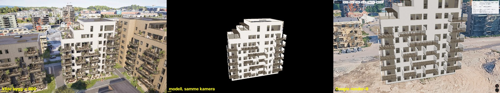

# Hus C — pilot for metodeoverføring 2026-09-09

`husC-v1.glb` er Lillebytunets Hus C rekonstruert fra boligvelgerens egne
arkitekturrenders og åpnet i Google Maps 3D: åtte etasjer, to inntrukne takterrasser
med pergola, 18 balkonger med faktisk dybde og pussfasader med innfelte vinduer.
Modellen er kontrollert i 11 faste Google-kameraer, gjennom hele rotasjonen, og mot
kilden i det eksakte kildekameraet for 13 retninger.

Dette var piloten for [arbeidsmåten fra Hus B](../../solutions/workflow-issues/render-til-byggmodell-krever-visuelle-akseptansekriterier.md).
Den delte koden er gjort byggagnostisk i samme runde, og Hus B er gjenbygd fra sin
uendrede konfigurasjon etter hver endring: alle tre GLB-varianter kom ut byte-identiske.
Hus C hadde ingen tidligere modell, så dette første volumet er selv baselinen.

[Åpne nærvisningen](http://localhost:3002/demo/lillebytunet-3d?model=/models/lillebytunet/husC-v1.glb&lat=63.441259&lng=10.440853&heading=112.4&cam=near).
Demoens standardverdier er fortsatt Hus B; Hus C krever eksplisitte parametere.



Hus B og Hus C i samme Google-økt, samme fotofliser og lys, gir den direkte
sammenligningen mot utgangspunktet: [husB-vs-husC-google.jpg](hus-c/compare/husB-vs-husC-google.jpg).
Hus C leser tydeligere dybde i balkongsonen, fordi pussskivene på sidene erstatter Hus Bs
tynne skjermer, og taket er mørkt der Hus Bs er for lyst. Hus B har rikere fasademateriale,
fordi trekledningens flis har synlig struktur mens Hus Cs puss er nesten hvit og flat.

## Valg av pilotbygg

Læringen sier at bygget skal velges etter en kildevurdering, ikke etter neste bokstav.
Alle 96 bilder i hver av de fire leilighetsseriene ble målt på bildedekning, og
kontaktark for A, C, D og rekkehus ble gjennomgått før valget.

| Serie | Enheter med polygon | Bygget som andel av bildet (median) | Form |
|---|---:|---:|---|
| bygg-a | 27 | 16,6 % | Balkonger skåret **inn** i volumet, dobbelthøy losji, sidefløy |
| bygg-b | 24 | 14,7 % | Modellert i forrige runde |
| bygg-c | 25 | 16,4 % | Ett kompakt volum, pussfasader, balkonger på én langside |
| bygg-d | 41 | 19,5 % | Balkonger rundt flere fasader, fasettert hjørne |
| rekkehus | 7 | 5,6 % | Mange små volum; for få polygoner til å isolere punktskyen |

Hus C ble valgt fordi det tester **én ny akse** — åtte etasjer og inntrekk i et hjørne —
uten samtidig å teste innskårne balkonger (Hus A) eller balkonger rundt flere fasader
(Hus D). Rekkehuset ble forkastet fordi polygon-isoleringen, som er hele grunnlaget for
å skille byggets punkter fra nabolagets, bare har 7 enheter å arbeide med.

## Dekning og kildegrunnlag

Alle **96 av 96 bygg-c-bilder** er visuelt gjennomgått i seks kontaktark med utsnitt av
bygget ([source-review/](hus-c/source-review/)). Ingen bilder ble lastet ned på nytt.
Oversiktsserien ble brukt til stedfesting, ikke til teksturer.

Hus C fikk sin egen COLMAP-løsning i `colmap-c`: **96 av 96 bilder registrert**,
59 944 punkter, reprojeksjonsfeil median 0,299 px. Kameraet er identisk med Hus B-seriens
(PINHOLE, f ≈ 1213/1220 px), banen er en sirkel med radius 3,744 enheter, pitch 19,89°
med standardavvik 0,003°, og vinkelsteget er 3,7511°. Det er samme turntable-oppsett,
men **ikke samme nullpunkt**: retningsforskyvningen mot oversiktsserien er +2 steg for
Hus C mot −10 for Hus B, målt ved SIFT-treff mot alle 96 oversiktsbilder.

Registreringen mot oversikten ga **222 av 763 punktpar** som inliers med medianrest
0,096 m, og sju utelatte kamerapar fikk median 0,14–0,73 px og p95 0,51–1,21 px
([registration.json](hus-c/registration.json)). Registreringen brukes ikke til å hente
en eneste tekstur på Hus C — alle projiserte flater kommer fra bygg-c selv. Den setter
skalaen: 0,36355 oversiktsenheter per byggenhet × 35,114 m per oversiktsenhet
= **12,766 m per COLMAP-enhet**.

## Geometri og manuelle valg

Parametrene ligger i `scripts/lillebytunet/model/hus_c_quality.json`. Ingen mål er arvet
fra Hus B. Alle er estimater fra bildene og punktskyen, ikke BIM-toleranser.

Etasjehøyden ble målt før noe plan ble antatt: punktene på balkongfrontene
(a > 0,52) danner skarpe topper i høydehistogrammet ved z = −2,41, −2,17, −1,93, −1,69,
−1,45 og −1,21, altså **0,240 enheter = 3,06 m per etasje**. Deretter ble hvert veggplan
funnet ved å rektifisere fasaden fra flere kandidat-avstander og velge den der
vindusrytmen i bildet blir nøyaktig 0,240 — en måling, ikke et øyemål.

| Del | Utført | Grunnlag og begrensning |
|---|---|---|
| Hovedvolum | 8 etasjer, 16,08 × 24,89 × 25,75 m | Fotavtrykk fra `frame_fit.py`, veggplan fra rytmetilpasning |
| Trinn | To inntrekk i b_start-enden, ved b = −0,500 og −0,190 | Snitt per høydeskive i punktskyen, bekreftet i bygg-c 048–095 og i den rektifiserte bakfasaden |
| Tak og parapet | Egen membran, parapetens innside og beslag | Takplan −0,490 og gesims −0,398 projisert tilbake på bygg-c 016 og lander på kildens takflate og parapetkant |
| Terrasser | To dekker med pergola | bygg-c 056–095; møbler, planter og parasoll utelatt |
| Balkonger | 18 dekker i tre felt, forskjøvet rytme per etasje | Klynger av frontpunkter per etasje, kryssjekket mot rektifisert a = 0,630-plan fra bygg-c 004 |
| Balkongsider | Pussskiver i full dybde på begge sider | Kilden viser skiver, ikke rekkverk, på sidene; de bærer mesteparten av dybdelesingen |
| Hjørnebalkonger | Stikker 0,05 enheter forbi begge gavlvegger | Volumene ligger innenfor Hus C-enhetenes egne polygoner i alle sju testede retninger (75–100 %) |
| Vinduer, balkongside | 66 åpninger i ti kolonner | Sporet på etasje 7–8 der veggen er fri, og gjentatt nedover |
| Topplanets front | Projisert kildetekstur, ikke ren puss | Ingen balkong dekker den; a = 0,460 fra bygg-c 004 er rein |

## Teksturer og materialer

**12 projiserte flater og 8 materialer** er kontrollert. `surface-sources.json` oppgir
kamera, flatehjørner, oppløsning og eksplisitt gjentakelse per flate.

Balkongdekkets forkant er målt til (0,49, 0,45, 0,38) som medianen av et 20 cm bånd på
a = 0,630-planet, som kamera 004 ser nesten rett på. Rekkverket er gjennomskinnelig, så
medianen der leser møblene bak; stavene er de mørkeste 15 prosentene av rekkverksbåndet,
(0,30, 0,26, 0,22). Terrassedekke, takoppbygg og balkongunderside er oppgitte
fargeanslag, fordi begge seriene skraper de flatene og en prøve der leser veggen bak.

**Taket kan ikke samples, og det er et funn, ikke en forglemmelse.** Begge seriene ser
taket i 7,5° og en parapet på 1,17 m skjuler 9 m av takflaten fra hvert kamera, så alle
56 målte kandidatutsnitt er en smøring av parapet, oppbygg og himmel. Første forsøk
valgte det jevneste utsnittet og fikk et **lyst** tak — kilden viser en mørk membran.
Taket er derfor en målt flatfarge, (0,30, 0,31, 0,35): medianen av den mørke klyngen
innenfor det projiserte takpolygonet, samstemt innen 0,07 over fem retninger. To
oppbygg og ett lavt flatt volum er plassert etter det oppmålte takrutenettet i
[bygg-c 016](hus-c/model-check/roof-grid-016.jpg); posisjonene er innenfor omtrent 1 m
og størrelsene er anslag.

To okkluderte striper på terrasse-endens vegg gjentar rein puss i stedet for kilden:
de fremste 2,2 m der hjørnebalkongene krysser kameraet, og de nederste 1,8 m der et
nabotak gjør det. Til sammen **27,9 % av den flaten**, registrert i
`repeated_fraction`. Første forsøk gjentok et bånd som inneholdt en vinduskant og ga en
rekke smale vindusflis; båndet ble flyttet til rein puss.

## Google-kontroll per visning

Alle 11 visninger hadde synlig modell, HTTP 200, samme SHA-256 og
`Model3DElement lagt til`; **ingen registrerte JavaScript- eller console.error-feil**.
Render-riggens nullpunkt er nå per serie: Hus C måler 218,4° mot Hus Bs 222°, utledet av
kameraets asimut i byggets eget rammeverk lagt på fasadens målte bearing — en utledning
som gjenskaper Hus Bs 222° innen 3°.

| Visning | Silhuett, dybde og sømmer | Hull, omgivelser og lys |
|---|---|---|
| n | Begge taktrinn, mørkt tak og oppbygg lesbare | Ingen synlige hull |
| e | Gavlveggens innfelte vinduer og hjørnebalkongene lesbare | Balkongskivene leses som hvite blokker sett fra enden |
| s | Balkongfeltenes forskjøvne rytme tydelig | Ingen synlige hull; ingen planter eller møbler |
| w | To terrasseplan med pergola, riktig trinnprofil | Ingen synlige hull |
| mid | Dekktykkelse, undersider og sprang tydelige | Sokkelen henger noen cm over terrenget der bakken faller |
| near | Alle balkongrader og vindusrytmen lesbare | Gjentatt vindusrytme i de nedre etasjene synlig ved nærkontroll |
| render-0 | Balkongfasaden matcher kildens rytme | Riggens avstand er Hus Bs, så Hus C fyller mer enn utsnittet |
| render-24 | Flat gavl og hjørnebalkong lesbare | Samme utsnitt-beskjæring |
| render-36 | Hjørnet mellom gavl og bakside lukket | Ingen synlige hull |
| render-48 | Bakfasadens vindusrytme bevart | Innbakt varmt interiørlys fra kilden består |
| render-72 | Terrasse-enden med pergola og trinn | Den gjentatte pussstripen er synlig som en jevnere tone |

Hele 18-sekunders rotasjonen ble kjørt. Alle **12 av 12 orbit-bilder** dekker jevnt
15°–345° og er visuelt kontrollert: ingen forsvinnende fasader, ingen geometrihull, taket
holder seg mørkt hele veien ([orbit-12.jpg](hus-c/google/orbit-12.jpg)). Klikk på
nærvisningen etter rotasjonen tilbakestilte kameraet til heading 25, tilt 60, range 65 og
siktehøyde 28,2 m o.h.

Fire Blender-render med reelt lys ([blender-check.jpg](hus-c/model-check/blender-check.jpg))
viser lukkede volum fra alle fire sider.

## Stedfesting

`georef_building.py` er den byggagnostiske formen av prototypens georef-kjede: samme
likhetstransform forankret i OpenStreetMap-fotavtrykkene til Ståltaugen 1 og 2, men
anvendt på et valgt byggs egen punktklynge. **Metoden gjenskaper Hus B**: 63,441360 /
10,440213 mot leverte 63,441359 / 10,440215, heading 109,4° mot 110°, 16,4 × 27,6 m mot
16,3 × 27,7 m, høyde 19,5 m — altså 0,2 m og 0,6° fra det publiserte svaret.

**Hus C: 63,441259, 10,440853, modellens +Y mot 112,4°**, balkongsiden mot 202°.
Restfeilen på det andre kvartalets senter er 1,17 m. Usikkerheten er den samme som for
Hus B, omtrent ±1,5 m i posisjon og ±2° i retning; Kartverket har ennå ikke fotavtrykk
for byggene, så det finnes ingen uavhengig kontroll av selve plasseringen.

To uavhengige kontroller er likevel samstemte. Oversiktsserien måler Hus C til 25,7 m
høyt; modellen, bygget fra bygg-c-serien alene, måler 25,75 m. Og rekkefølgen A → B → C
→ D langs raden, med bearing 89,6°, 109,4° og 129,7° mellom naboene, stemmer med
byggenes egne polygoner i oversiktsrenderen — der Hus C også bekreftes å være **det
hvitpussede bygget**, altså det som er modellert her.

| Bygg | lat | lng | Høyde | Mål (oversikt) |
|---|---|---|---:|---|
| A | 63,441358 | 10,439563 | 24,0 m | 15,7 × 32,0 m |
| B | 63,441360 | 10,440213 | 19,5 m | 16,4 × 27,6 m |
| C | 63,441259 | 10,440853 | 25,7 m | 15,9 × 22,4 m |
| D | 63,441088 | 10,441313 | 25,3 m | 18,6 × 30,4 m |
| Rekkehus | 63,441014 | 10,440277 | 14,6 m | 12,9 × 55,6 m |

## Filkontroll og reproduksjon

| Måling | Hus C | Hus B (v2, til sammenligning) |
|---|---:|---:|
| Byte | 1 239 388 | 1 886 792 |
| Trekanter | 11 550 | 20 352 |
| Materialer / teksturer | 20 / 20 | 19 / 19 |
| Deklarerte utvidelser | 0 | 0 |
| Størrelse med utstikk | 16,08 × 24,89 × 25,75 m | 15,83 × 29,31 × 19,31 m |
| Største tekstur | 821 × 827 px | 986 × 542 px |

GLB-sjekken leser faktiske buffere, indekser, normaler, flateretning og bounds; minimum
Z er 0,0000 ([glb-validation.json](hus-c/glb-validation.json)). Målgrensene i `check_glb.py`
er nå CLI-argumenter, siden Hus B-grensene avviste Hus Cs 25,75 m.

Hele kjeden ble kjørt på nytt i en tom `hus-c-v1/reproduction/`: registreringen ble
byte-identisk, og alle tre GLB-variantene ble byte-identiske
([reproduction.json](hus-c/reproduction.json)). Etter en ren tekstendring i
`evidence` ble de tre GLB-ene igjen byte-identiske. Originalbilder, `colmap-b`,
`colmap-ov`, `quality-v2/final/` og begge Hus B-modellene er urørt.

```bash
MODEL_REPO=/Users/andreasharstad/Documents/placy-lillebytunet
MODEL_DATA=/Users/andreasharstad/klienter/placy/lillebytunet
MODEL_SCRIPTS="$MODEL_REPO/scripts/lillebytunet/model"
MODEL_OUT="$MODEL_DATA/hus-c-v1/reproduction-new"
MODEL_PY="$MODEL_DATA/.venv/bin/python"

# 1. Egen COLMAP-løsning for serien (~2 min uten GPU)
cd "$MODEL_DATA" && mkdir -p colmap-c && ln -sfn ../renders/bygg-c colmap-c/images && cd colmap-c
colmap feature_extractor --database_path db.db --image_path images \
  --ImageReader.camera_model PINHOLE --ImageReader.single_camera 1 --FeatureExtraction.use_gpu 0
colmap sequential_matcher --database_path db.db --FeatureMatching.use_gpu 0 --SequentialMatching.overlap 12
mkdir -p sparse && colmap mapper --database_path db.db --image_path images --output_path sparse
colmap model_converter --input_path sparse/0 --output_path sparse/0 --output_type TXT

# 2. Eget rammeverk, fotavtrykk og massemålinger
"$MODEL_PY" "$MODEL_SCRIPTS/frame_fit.py" --data "$MODEL_DATA" --colmap colmap-c \
  --scenes bygg-c --report "$MODEL_OUT/frame-fit.json" --checks "$MODEL_OUT/checks" --write
"$MODEL_PY" "$MODEL_SCRIPTS/massing.py" --data "$MODEL_DATA" --colmap colmap-c \
  --scale 12.766 --output "$MODEL_OUT/massing"

# 3. Registrering mot oversikten (setter skalaen)
"$MODEL_PY" "$MODEL_SCRIPTS/register_sources.py" --data "$MODEL_DATA" --colmap colmap-c \
  --pairs 0:2,12:14,24:26,36:38,48:50,60:62,72:74,84:86 --output "$MODEL_OUT/registration.json"

# 4. Geometri, teksturer og tre GLB-varianter
"$MODEL_PY" "$MODEL_SCRIPTS/build_quality.py" --data "$MODEL_DATA" \
  --registration "$MODEL_OUT/registration.json" \
  --config "$MODEL_SCRIPTS/hus_c_quality.json" --output "$MODEL_OUT/model"
"$MODEL_PY" "$MODEL_SCRIPTS/check_glb.py" "$MODEL_OUT/model/husC-hybrid.glb" \
  --height 22,28 --width 12,20 --depth 20,30

# 5. Stedfesting og redigerbar modellkilde
"$MODEL_PY" "$MODEL_SCRIPTS/georef_building.py" --data "$MODEL_DATA" --building C \
  --output "$MODEL_OUT/georef-C.json"
/Applications/Blender.app/Contents/MacOS/Blender -b --python "$MODEL_SCRIPTS/blender_quality.py" -- \
  --input "$MODEL_OUT/model/husC-hybrid.glb" --output-dir "$MODEL_OUT/final" \
  --name husC-v1 --radius 62 --camera-height 44 --aim-height 13 --render

# 6. Kilde mot modell i det eksakte kildekameraet
"$MODEL_PY" "$MODEL_SCRIPTS/model_overlay.py" --data "$MODEL_DATA" \
  --config "$MODEL_SCRIPTS/hus_c_quality.json" --glb "$MODEL_OUT/model/husC-hybrid.glb" \
  --output "$MODEL_OUT/overlay" --directions 0,4,16,24,29,36,41,48,53,64,72,77,90 --scale 1.0

# 7. Faktisk Google-kjøring. Dev-server må kjøre på 3002.
cp -f "$MODEL_OUT/model/husC-hybrid.glb" "$MODEL_REPO/public/models/lillebytunet/husC-v1.glb"
MODEL_PLAYWRIGHT=/Users/andreasharstad/.npm/_npx/fd3bca3c548369c0/node_modules/playwright/index.mjs
node "$MODEL_REPO/scripts/lillebytunet/capture-quality.mjs" \
  --base-url http://localhost:3002 --model /models/lillebytunet/husC-v1.glb \
  --output "$MODEL_OUT/google" --playwright "$MODEL_PLAYWRIGHT" \
  --lat 63.441259 --lng 10.440853 --heading 112.4 --dir0bearing 218.4 \
  --orbit-altitude 29.1 --near-altitude 28.2 --orbit
```

Verktøy ved levering: COLMAP 4.1.1, Blender 5.2.1 LTS, Chrome 152.0.7977.84,
Python-pakker pinnet i `requirements.txt`. Leverte filer ligger i
`~/klienter/placy/lillebytunet/hus-c-v1/final/` med `husC-v1.blend` som redigerbar kilde.

## Nytt kontrollverktøy

`model_overlay.py` rendrer den **eksporterte GLB-en** gjennom det eksakte
kildekameraet — samme COLMAP-kamera som renderen ble tatt med — og legger silhuetten
oppå kildebildet. Det fjerner Hus B-rundens forbehold om at «original mot Google er en
tilnærmet retningssammenligning», fordi det ikke er noe synsfeltavvik å ta forbehold om.

Verktøyet fanget også sin egen feil: første versjon speilet teksturene vertikalt, fordi
glTF-ens UV-origo er øverst til venstre og ikke nederst. Den feilen fikk `lower_end` til å
vise et mørkt nabotak øverst på veggen. Feilen lå i kontrollen, ikke i modellen, og ble
oppdaget ved å sammenligne den genererte teksturfilen med hvordan den kom ut i renderen —
et konkret eksempel på at også kontrollverktøyet må kontrolleres.

## Funn i Hus B som piloten avdekket

Den samme målingen på Hus B viser at **Hus Bs leverte takmembran er for lys**. Medianen av
den mørke klyngen innenfor Hus Bs projiserte takpolygon er (0,34, 0,34, 0,38), samstemt
innen 0,05 over åtte retninger; medianen i den leverte `roof_membrane.jpg` er
(0,55, 0,53, 0,58). Det er samme feilmekanisme som på Hus C: utsnittet fra oversikt 090
er en smøring, og et jevnt utsnitt ser reint ut nettopp fordi det ikke traff taket.

Feilen er **ikke rettet her**, med hensikt. Hus B er regresjonsgrunnlaget som beviser at
denne rundens refaktorering ikke endret noe, og en endring i den leverte modellen bør
være et eget, bevisst valg. Rettelsen er ett felt: bytt `roof_sample` i
`hus_b_quality.json` til `{"color": [0.34, 0.34, 0.38]}`, bygg om, og kontroller i Google.

## Hva metodeoverføringen viste

Hus B-kjeden holdt, men **fire ledd var Hus B-spesifikke i koden, ikke i konfigurasjonen**,
og måtte flyttes ut: takoppbyggenes plassering, pergolaens innfestinger,
kledningens flisstørrelse og gavlveggenes vindusåpninger. I tillegg var
`glb_mesh`-nodenavnet, `check_glb`-målgrensene, `blender_quality`-utdatanavnet,
`capture-quality`-plasseringen og render-riggens nullpunkt bundet til Hus B.
Alt dette er nå argumenter med Hus Bs verdier som standard, verifisert ved at Hus B
kommer ut byte-identisk.

Tre ledd måtte skrives nye, fordi prototypens versjoner var
skript med relative stier og innebygde Hus B-navn: `frame_fit.py` (rammeverk og
fotavtrykk), `massing.py` (etasjer, trinn og veggplan) og `georef_building.py`
(stedfesting). `facade_grid.py` og `model_overlay.py` er nye kontrollverktøy.

To ting kostet mest tid, og begge er verdt å ta med til Hus A og D:
**veggplanene kan ikke leses av histogrammet alene** — for Hus C lå gavlveggen 0,05
enheter fra histogrammets sterkeste topp, og rytmetilpasningen avgjorde det — og
**taket er utenfor rekkevidde i dette kildematerialet**, så et lyst takutsnitt som «ser
reint ut» er sannsynligvis en vegg.

## Sjekker og resterende begrensning

`npm run lint` besto med 0 feil og 54 advarsler i uendrede filer; `npx tsc --noEmit` og
`npm run build` besto. Hele `npm test` besto: **3924 av 3924 tester, 235 av 235 filer**.
En første kjøring hadde én 5-sekunders timeout i `lib/pipeline/provision.test.ts` mens
Blender rendret samtidig; filen besto separat (19/19) og ved full ny kjøring uten
samtidig last. Ingen testkode er endret.

Restavvik, ærlig oppgitt:

- **Terrassefrontene** er et firedelt glassbånd mellom pussfelt; kilden har en nesten
  sammenhengende glassvegg med slanke poster og ett tett felt. Feltdelingen kommer av at
  det samplede vindusutsnittet inneholder et tett felt, som gjentas.
- **Terrassenes parapet** har beslag, men ikke eget håndløper som kilden viser.
- **Pussfargen** er nesten hvit og flat. Modellen leses derfor lysere enn kilden i
  Googles lys, særlig der balkongskivene sees fra enden.
- **De nedre seks etasjenes vindusrytme** er gjentatt fra etasje 7–8, ikke sporet per
  etasje, fordi balkonger, møbler og planter dekker veggen der.
- **Takoppbyggenes plassering** er innenfor omtrent 1 m, og størrelsene er anslag.
- **Bakkeplanets terrasser**, planter, møbler og inngangsparti er utelatt.
- **Sokkelen henger noen centimeter over terrenget** i noen visninger. Det er
  `CLAMP_TO_GROUND` på skrånende terreng, samme oppførsel som Hus B, ikke et modellavvik.
- **Stedfestingen mangler uavhengig kontroll**, som for Hus B: Kartverket har ikke
  fotavtrykk for byggene ennå.
- **Hus Bs takmembran er fortsatt for lys**, se avsnittet over. Åpent, med kjent rettelse.

For en mer troverdig nærmodell trengs det samme som for Hus B: reine fasadebilder uten
okklusjon, materialkart, eller arkitektens 3D-/BIM-kilde. Høyere oppløsning av samme
tildekkede bilde gir ikke de manglende detaljene, og for taket gir ingen oppløsning noe,
fordi problemet er vinkelen og parapeten.

Hus A og Hus D er ikke modellert. Hus A har innskårne balkonger og en sidefløy; Hus D har
balkonger rundt flere fasader. Begge trenger egne COLMAP-løsninger, egne veggplan og
sannsynligvis nye geometri-primitiver — konfigurasjonen alene rekker ikke.

## Relatert

- [Arbeidsmåte for neste bygg og agent](../../solutions/workflow-issues/render-til-byggmodell-krever-visuelle-akseptansekriterier.md)
- [Hus B: kildevalg, kommandokjede, før/etter og begrensninger](04-kvalitetsrunde.md)
- [Datagrunnlaget: 576 bilder, API-struktur og negative funn](01-datainnhenting.md)
- [Kartintegrasjon: Googles akser og terrenghøyde](02-kartintegrasjon.md)
